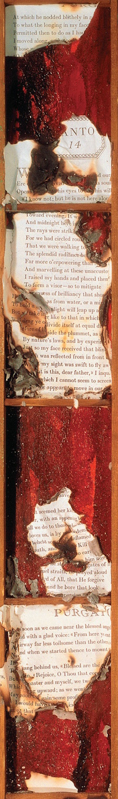

> [marginThumb] 

## A Note about Page and Issue Numbers

The page numbers given in the original annotations refer to the page numbers printed in the original issues. This causes us a few problems:

- They don't necessarily tie up with the page numbering in collected issues. Sometimes additional pages are added, or double page spreads are changed to fit around the layout of the book.
- The later collected issues removed the page numbers entirely.
- Also the collected issues rarely display their issue numbers, so if you're in the middle of reading a page, it can be tricky to figure out where in the annotations you should be.
- Sometimes collected issues don't even contain the cover pages, (or rather put them at the end,) so it may not be obvious to the reader which issue they are reading.

So for this 35th anniversary version, I'm trying something a little different - I'm experimenting with displaying page thumbnails in the margin, which should make it easier to spot where you're up to when comparing the page with the annotations. I've left the page numbers in, but will tweak them to match the collected versions where there are obvious discrepancies.

The issues in the sidebar are ordered by their position in the Deluxe books, with dividers separating the main plot lines, and include a few additional short stories that weren't included in the original run or trades, and didn't previously have annotations.

You can also browse the issues organized into their collections on the [Covers](Covers.md) page
