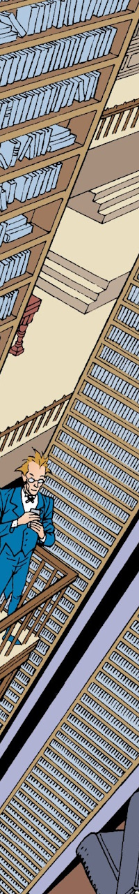

> [marginThumb] 

# The (Community) Sandman Annotations

35th Anniversary Edition!

Originally written, compiled and edited by Greg Morrow and David Goldfarb. Updated and revised edition by Richard Munn.

This is the 'refreshed' Sandman Annotations (not to be confused with the hardback Annotated Sandman books published by DC themselves.)   These annotations date back to the 80s-90s and were published usenet, Compuserve, Genie, and other services that have long been forgotten by the 21st centaury.

This is now licensed under a [Creative Commons Attribution-NonCommercial-ShareAlike 4.0 International License](http://creativecommons.org/licenses/by-nc-sa/4.0/), which differs from the original licensing, but I hope follows the original spirit.

## Contributions

This is a living community document, and is open to edits and suggestions - these can be done by:
- Make a comment on [reddit](https://www.reddit.com/r/Sandman/), and tag me ([/u/benjymous](https://www.reddit.com/user/benjymous)) in to the discussion.
- Raise an issue on the [github issues tracker](https://github.com/benjymous/annotations/issues).
- Make the [edits yourself](https://github.com/benjymous/annotations/) and raise a pull request.

## What needs doing?

- These annotations were largely written at the time the original issues were published, and so will explain references that might be obscure to an early 90s reader.   Obviously time has passed since then, and there are likely _lots_ of references that may be baffling to someone in the 2020s.  If you spot any of those, please see if you can add a comment.

- The annotations are a bit unevenly edited in places - editing things to have a more passive voice might be a good idea.

- Check the editing/reformatting - the most recent version of the original text versions still live on the [MIT servers](http://theory.csail.mit.edu/ftp-data/pub/ftp/ftp/people/wald/sandman/) so it'd be good for a second set of eyes to check the translation from .txt to markdown hasn't mangled or lost anything important.

- Ideally someone should be able to read these annotations alongside their first ever read of the comic - we shouldn't assume people are coming to this after reading the whole thing.   They might not have read anything yet, and want clarification on something in the Netflix show or Audible adaptation.   This means we aught to be careful with spoilers, and try and edit out any that are already here.

 - Originally these were just text files (they pre-date the world wide web, and html), so enriching the pages with photo references helps.  If a real world person, place or thing is mentioned or depicted, it'd be nice to add some reference images.   Likewise linking in wikipedia articles (or other reference material) would be helpful.

 - Neil Gaiman has blogged, tweeted, given many interviews, and much more in the last ~30+ years.  Adding any additional information from him would be really helpful.

 - The annotations for the last 25-ish issues are much less detailed than the earlier ones.   This seems to be when Greg Morrow (the original editor) stepped away.

 - They currently stop at Issue #75, and don't cover _Endless Nights_, _The Dream Hunters_ or _Overture_.

## Disclaimer

Sandman and all related characters are copyrights and trademarks of DC Comics Inc. Sandman and these annotations are intended for mature audiences only.
