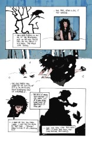
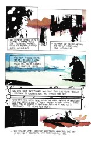
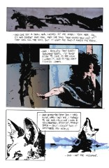

## Death: A Winter's Tale

##### Neil Gaiman, Jeff Jones

**Note**: This stand-alone story originally appeared in the Vertigo: Winters Edge #2 anthology

### Page 3

> [!THUMBNAIL] 

- #### Panel 5-6

  Admission that Death too, walked away from her role at some point.

### Page 4

> [!THUMBNAIL] 

- #### Panel 1
  If Death refuses to _take_ the dead, then nobody dies. This seems more like her actively _not_ taking lives, rather than just walking away and leaving things to happen without her. We've seen in Hob Gadling what happens to those who avoid Death.

### Page 5

> [!THUMBNAIL] 

- #### Panel 2

  Here Death made her decision to live one day as a mortal every 100 years. We see one of these days in the Death Miniseries _The High Cost of Living_, and another day is alluded to in Destiny's book during [Brief Lives](sandman.47.md#page-14).

## Credits

- Greg "elmo" Morrow created the Sandman Annotations.
- Originally collated and edited by Richard Munn.
