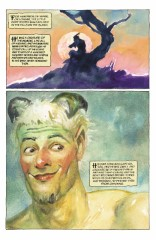
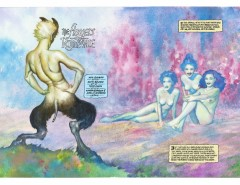
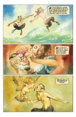
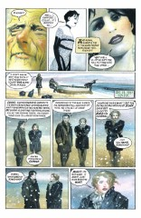

# The Flowers of Romance

##### Neil Gaiman, John Bolton

**Note**: This stand-alone story originally appeared in the Vertigo: Winters Edge #1 anthology.

### Page 1

> [marginThumb] 

- #### Panel 1

  Our _little goat footed man_ is a Satyr. The last Satyr we met was Aristaeus in [The Song of Orpheus](sandman-special1.md#page-2).

### Page 2-3

> [marginThumb] 

- The Blue ladies on the right hand side are presumably the Naiads - water nymphs, mentioned in the lower caption.

### Page 4

> [marginThumb] 

- #### Panel 1

  Here he's cavorting with a female satyr.

- #### Panel 3

  And this lady is a [Harpy](https://en.wikipedia.org/wiki/Harpy).

### Page 7

> [marginThumb] 

- #### Panel 2

  As with [How They Met Themselves](sandman-how-met.md) it's interesting to see Desire referred to as _her_ rather than the usual _it_.

- #### Panel 5

  It's hard to know if this island is entirely fictional, or if Gaiman had a real island in mind. One possible contender is the [isle of Eynhallow](https://www.bbc.com/travel/article/20170721-why-you-ceynhallow-which-you-can-visit-one-day-a-year) in the Orkneys, north of Scotland.

## Credits

- Greg "elmo" Morrow created the Sandman Annotations.
- Originally collated and edited by Richard Munn.
