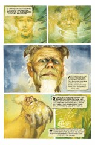
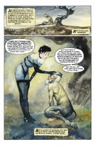
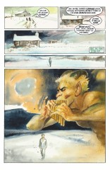
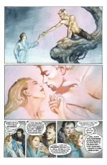
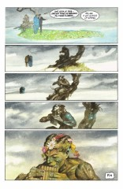

# The Annotated Sandman

## The Flowers of Romance

##### Neil Gaiman, John Bolton

**Note**: This stand-alone story originally appeared in the Vertigo: Winters Edge #1 anthology.

### Page 1
> [!THUMBNAIL] 

This is a splash page

### Page 2-3

> [!THUMBNAIL] 

### Page 4

> [!THUMBNAIL] 

### Page 5

> [!THUMBNAIL] 

### Page 6

> [!THUMBNAIL] 

### Page 7

> [!THUMBNAIL] 

### Page 8

> [!THUMBNAIL] 

### Page 9

> [!THUMBNAIL] 

### Page 10

> [!THUMBNAIL] 

## Credits

- Greg "elmo" Morrow created the Sandman Annotations.
- Originally collated and edited by Richard Munn.