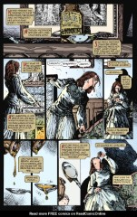
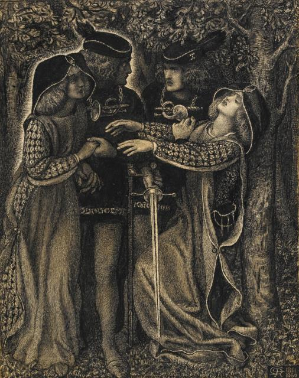
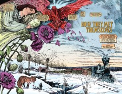
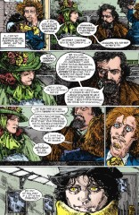
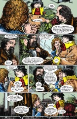
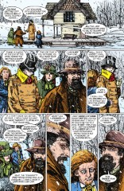
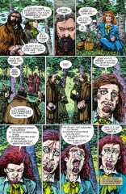
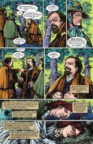
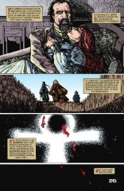

# How They Met Themselves

##### Neil Gaiman, Michael Zulli

- Standalone story, originally printed in Vertigo: Winters Edge #3
- Audible Act III Chapter 13

### Page 1

> [marginThumb] 

> [floatright width-30pc] 

- #### Panel 1

  The drawing is "How They Met Themselves" by [Dante Gabriel Rossetti](https://en.wikipedia.org/wiki/Dante_Gabriel_Rossetti) after which this short story is named.

- #### Panel 2

  [Annie Miller](https://en.wikipedia.org/wiki/Annie_Miller) modelled for many Pre-Raphaelite artists.

### Page 2-3

> [marginThumb] 

- A Double page Splash.

  **Laudanum**: A medicinal syrup containing about 10% opium by weight. Commonly used in Victorian times as a pain killer and a sleeping aid.

  Lizzie here, is [Lizzie Siddal](https://en.wikipedia.org/wiki/Elizabeth_Siddal), an accomplished artist, model and poet in her own right.

### Page 4

> [marginThumb] 

- #### Panel 1

  The man looking out of the window is [Algernon Charles Swinburne](https://en.wikipedia.org/wiki/Algernon_Charles_Swinburne) an English Poet and Playwright.

- #### Panel 2

  Sat next to Lizzie is Dante Gabriel Rossetti, Lizzie's husband, and renowned poet and illustrator, among many other talents.

- #### Panel 3

  Lizzie had been sick for a long time - possibly tuberculosis, and also likely addiction to the Laudanum.

- #### Panel 6
  And here we meet desire, which is made clear by the distinctive lettering, and the amber eyes.

### Page 5

> [marginThumb] 

- #### Panel 1
  Even Rossetti finds Desire's eyes remarkable.

### Page 6

> [marginThumb] 

- #### Panel 1

  "All the land hereabouts belongs to me"... - I believe this is the first we've heard of Desire owning land, unless this is no longer England they're in...

- #### Panel 3

  Swinburne picks the name "Dolores" for Desire

- #### Panel 4

  Rossetti certainly sees Desire as female too, but from our viewpoint (that of Lizzie remembering), Desire is clearly _male_.

- #### Panel 6
  Swinburne was a known sadomasochist, which had a major influence on his work.

### Page 7

> [marginThumb] 

- #### Panel 1

  The group have got separated. It's definitely clear they're not in a normal place any more.

- #### Panel 2

  Time doesn't seem to work normally here, either.

- #### Panel 3, 6-10

  Swinburne meets Desire again.

- #### Panels 4, 5

  Lizzie and Rossetti seem to have met themselves.

- #### Panel 10
  Back to the sadomasochism. Also interesting to note that Desire is referred to here as _he_ rather than the usual _it_.

### Page 8

> [marginThumb] 

- Rossetti's true love was really himself.

### Page 9

> [marginThumb] 

- #### Panel 1

  Rossetti found Lizzie overdosed, after returning from a talk, as described here.

- #### Panel 2
  This is also true.

## Credits

- Greg "elmo" Morrow created the Sandman Annotations.
- Originally collated and edited by Richard Munn.
