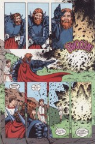

> [marginThumb] 

## Sandman Special #1: "The Song of Orpheus"

##### Neil Gaiman, Bryan Talbot, and Mark Buckingham

Not part of any anthology or storyline
Not reprinted in any other form

**Note**: This issue was published between [_Sandman_ #31](sandman.31.md) and [32](sandman.32.md); it is unassociated with either the _Distant Mirrors_ anthology or the _A Game of You_ storyline.

This issue was published with a glow-in-the-dark cover. The non-glowing portion of the cover was done by Dave McKean, the usual cover artist, and is repeated, left-right reversed, in grey, on the first page of the issue. The glow-in-the-dark overlay shows the outline of a face, presumably Dream's, and the words "in dreams i walk with u". The lettering is undoubtedly McKean's, making it probable that the face is his work as well, although it is in some ways reminiscent of Talbot's work.

**Sources**: The legend of Orpheus is taken directly from classical Greek mythology, and may be found in forms closer to the original in any number of reference works. Recommended ones include the _Larousse Encyclopedia of Mythology_ and Robert Graves' translations of _The Greek Myths_, two volumes. Gaiman's version differs from the originals where he has the Endless interact with Orpheus, and conforms in most other instances. I shan't waste space explicating the details of the myth insofar as they are given.

### Page 1

> [marginThumb] 

- #### Panel 5

  Orpheus is traditionally the son of either Apollo or the Thracian king Oeagrus, and a muse, usually Calliope, sometimes Polyhymnia. As previously established in _Sandman_, Orpheus is the son of Dream and Calliope (Muse of epic poetry).

  **Hedge wizard**: A "hedge priest/parson" is a vagabond or illiterate clergyman. _Brewer's Phrase and Fable_ identifies hedge wizards as "persons of low origin, vagabonds who ply their trade in the open, under--or between--the hedges, etc." A hedge wizard is therefore a poor wizard.

### Page 2

> [marginThumb] 

- #### Panel 2

  Aristaeus is not traditionally a satyr (half-man, half-goat; note that those are horns, not a peculiar receding hairline), but is usually represented as a young man dressed like a shepherd, sometimes carrying a sheep. He was worshipped in ancient Greece, but his myths are now obscure. His name derives from "aristos" [transliterated], meaning "best". He is generally accepted as the son of the nymph Cyrene, who was carried off to Libya by Apollo. Aristaeus was indeed married to Autonoe, who is probably the daughter of Cadmus; their son was Actaeon, a mighty hunter, who accidentally saw Artemis bathing one day. She changed him into a stag and his own dogs hunted him down and slew him.

  [From the Encyclopedia Britannica, although mine only goes back to 1944, not to the 19th century like Gaiman's :-]

### Page 4

> [marginThumb] 

- #### Panel 1

  Eurydice's hair looks too much like a negative of Abby Holland's for my taste; Abby is a character in _Swamp Thing_ with blond hair with black streaks. Her hair may be a family characteristic, though, and Eurydice might be a distant relative. Oneiros is the Greek name for Dream, and is a literal translation of "dream".

- #### Panel 4

  The letter column extends thanks to "Talamah Gamah and Ieiesh, who designed Death's posh frock". It is unclear whether the frock is this one or the one on page 22ff.

- #### Panel 5

  This is the first appearance of the Prodigal, the missing Endless, whose name is mentioned on the next page. He is on the far right, dressed in period Greek armor.

### Page 5

> [marginThumb] 

- #### Panels 2-6; page 6 panel 1

  Neil Gaiman has said that the names of the Endless in Greek are nouns that describe them, rather than names borrowed from myth. Teleute means "last", or "termination", but is also used in euphemisms for death like English's "come to an end"; Mania means "madness", and Olethros "destruction". Aponoia means "desperation", Epithumia "desire" or "passion", and Potmos, "Destiny, Fate"; Homerically, Potmos was always evil and usually meant death.

- #### Panel 4

  It is perhaps jarring to see Delirium, and not Delight.

  Evidently the transformation occurred prior to Greece's Heroic Age. The only evidence we have to the contrary is Destiny's portrait of Delight as a young girl wearing relatively modern clothes; that, perhaps, might be an automatically updating portrait. Delirium has said the "Delight was a long time ago", and that may be quite ancient on the time scale of the Endless.

- #### Panel 5

  Desire's expression here may be less than sincere, and he/she may have been involved in Orpheus' fate. Desire has shown interest in all of Dream's love affairs. And Passion is known for having ignited the Trojan War.

### Page 6

> [marginThumb] 

- #### Panel 1

  Destiny bears a striking resemblance to Jorge Luis Borges!

- #### Panel 4-5

  **Hymenaeus**: originally the refrain of a marriage song, but eventually personified into a hero whose marriage was legendarily happy. The marriage songs eventually became invocations to him. The actual words of the ceremony sound perhaps too much like modern Christian ceremony; no refs for actual Greek ceremonies.

- #### Panel 4

  The statue's head, with that circle and the cross-like shapes, is reminiscent of byzantine representations of angels, with the halo surrounding the head.

### Page 7

> [marginThumb] 

- #### Panel 4

  Satyrs, along with centaurs, went mad when they got drunk.

### Page 9

> [marginThumb] 

- #### Panel 1

  Why does Dream not dance? Because he is a stick-in-the-mud, too concerned with appearance and dignity to relax.

### Page 13

> [marginThumb] 

- #### Panel 2-3

  Orpheus's legendary talent was his ability to make music that could enchant any audience.

### Page 14

> [marginThumb] 

- #### Panel 1

  Note the three columns on the right with carved images of women. Such carvings are known as "caryatids", and the three may be a reference to the Triple Goddess. The female warrior statue on the left appears to have an owl's face on her shield, and is probably Athena; above the Triple Goddess are two who may be Apollo and Artemis. There are a number of other, more generic figures; the fat figure on the round roof may be from any number of pantheons, for example.

  The middle one looks like the statuette of the Goddess with the Snakes, only this is a weight lifter parody...

- #### Panel 3

  North American sources seem to be united in the definition of "hippogriff" as a creature with the head, front legs, and wings of an eagle, and the rear of a horse; Gaiman has a reference which supports _his_ contention that a winged horse may be called a hippogriff.

### Page 16

> [marginThumb] 

- #### Panel 2

  **Kore**: means "maiden"; used as an alternate name for Persephone. In fact, in the Homeric hymn to Demeter, there is some evidence that Kore is the name used. The evidence is questionable, as the Greeks did not use any written method of distinguishing proper nouns from ordinary nouns, so "kore" might simply mean maiden. Kore is much shorter than Persephone, and the scribe may simply have gotten tired of writing the full name.

### Page 17

> [marginThumb] 

- #### Panel 2

  Below is presumably Eurydice's funeral pyre.

- #### Panel 5

  Note that Destruction's armor has changed.

- #### Panel 6

  The river Lethe is one of the rivers of the underworld; its waters bring oblivion, or forgetfulness.

### Page 19

> [marginThumb] 

- #### Panel 6

  I think Destruction is picking an anemone. Anemones grew from Aphrodite's (Venus) tears when Adonis died, and so they're of the flowers associated with Hades.

### Page 20

> [marginThumb] 

- #### Panel 2

  There should probably be knuckle-cracking-type sound effects in this panel.

### Page 21

> [marginThumb] 

- #### Panel 1

  Note the family portrait, with Delight, and the issue of "Cosmopolitan" magazine.

- #### Panel 3

  It has been alleged that the goldfish are named Slim and Wandsworth, although I'd like confirmation from a more authoritarian source. There is also the larger question of why Death has only human artifacts in her flat. The Endless are extremely anthropomorphic, and anthrocentric (even Eurocentric, if you get right down to it). The described nature of the Endless, however, suggests a very much larger scope to their activities; we expect that Death is present for alien deaths as well as for human ones, and therefore should evince alien characteristics, at least on occasion.

### Page 22

> [marginThumb] 

- #### Panel 1

  Death's new outfit seems to have enhanced her bustline.

### Page 23

> [marginThumb] 

- #### Panel 1-2

  This is not supported by the original myths; in the heroic tradition of Greece (and later, Rome), the hero almost always made a journey to the land of the Dead, and didn't have to die to come back. Further, Herakles proved (at least in the original) that he had visited the underworld by bringing back the great dog Cerberus...and then he took him _back_. To be true to the Greek originals, Cerberus should have been rendered "Kerberos".

- #### Panel 4

  What Death says has nothing to do with the actual myth (but it's splendid!) as far as I know.

### Page 24

> [marginThumb] 

- #### Panel 4

  Tainaro ("Taenarum"! Good heavens!) is indeed the southern point of Europe, islands excluded

### Page 25

> [marginThumb] 

- #### Panel 2

  **Thessaly**: This is an antecedent for a character who appears in an upcoming storyline. But Thessaly (Thessalia) is also a region of Greece. In general, panel 2 has a correct geographical description of mainland Greece from north to south, and Orpheus actually lived in Thrace.

  **Delphi**: There was an oracle at Delphi devoted to Apollo; the Pythia ran the place. The gift will become apparent shortly. The "darkness" in Corinth is unknown.

### Page 28

> [marginThumb] 

- #### Panel 1

  Charon was the boatman who transported the souls of the dead across the River Styx, the fare for which was a penny. The banks of the Styx are normally crowded by those dead who were not buried with a penny.

- #### Panel 4

  **The bough of gold**: _The Golden Bough_ is the name of an encyclopediac 12-volume work by Frazer cataloguing mythology and superstition.

### Page 30

> [marginThumb] 

- #### Panel 3-6

  The gates of the underworld were guarded by the great three-headed dog Cerberus; Orpheus charmed him with his music.

- #### Panel 4

  The resonator of his lyre was made of a tortoise's shell.

### Page 32

> [marginThumb] 

- #### Panel 1

  Hades and Persephone were the rulers of the underworld.

### Page 33

> [marginThumb] 

- The song is unknown, possibly original, but I wouldn't bet on it :-)

### Page 34

> [marginThumb] 

- This scene is almost straight out of _Bulfinch's Mythology_.

  Although Bulfinch's is a bowdlerized retelling for another age, it retains some sense of authority even today; additionally, it might be rendering the originals accurately in this particular instance.

- #### Panel 1

  In fact Hades had abducted Persephone, and in variations of the myth she somehow manages to return on earth during spring and summer; thus, "tales of rape" might be an innuendo.

- #### Panel 2

  **Ixion**: Murdered his wife's father, was pardoned by Zeus and admitted to Olympus, where he tried to seduce Hera and was tricked into seducing a cloud, by which was born the race of centaurs. He was bound onto a flaming wheel in the underworld for his punishment.

- #### Panel 3

  **Tityus**: His punishment is the same as Prometheus', the Titan who gave man fire. _Brewer's Phrase and Fable_: "A gigantic son of Zeus and Ge [Gaea]...whose body covered nine acres of land. He tried to defile Latona [aka Leda, Leto, Apollo and Artemis' mother], but Apollo cast him into Tartarus, where a vulture fed on his liver, which grew again as fast as it was devoured. He was the father of Europa." From Graves: "Tityus was a giant who was a son of Zeus. He tried to rape Leto, Apollo & Artemis' mother, at Delphi. Apollo & Artemis killed him with arrows before he could. In Tartarus, Tityus was was stretch out, his arms & legs pegged to the ground, and had his liver continually devoured by two vultures."

- #### Panel 4

  **Tantalus**: Fed his son to the gods; his punishment was to stand in a river, which would drain away if he tried to drink, and to have boughs of fruit overhead, which would blow out of range if he reached for them. From his plight comes the verb "to tantalize". The pennies were placed there by the dead's relatives, as the fare to Charon.

### Page 35

> [marginThumb] 

- #### Panel 3-5

  The Furies, also known as the Kindly Ones, are an aspect of the Three-in-One Goddess. The Furies extract terrible punishments from the guilty.

### Page 37

> [marginThumb] 

- #### Panel 7-10

  Note that this is different than the "standard" explanation. People usually attribute Orpheus' behavior to impatience, lust, or curiosity. Lord, what fools these mortals be!

### Page 39

> [marginThumb] 

- #### Panel 4

  Among the animals pictured here are wolves, rabbits, bears, deer, sheep, goats, a leopard, one of the Carrion Kind, a badger, a fox, rats, a peacock, and a unicorn. A squirrel is noticeable on the next page. The leopard is unlikely but plausible, inasmuch as the European lion survived until the Middle Ages; unicorns are entirely fictitious.

### Page 42

> [marginThumb] 

- #### Panel 3

  **The Bacchante**: worshippers of Bacchus (alias Dionysius), the god of wine and madness; these were women who got drunk and went wilding. At least one source suggests that ivy was used an intoxicant, and that the Bacchae (also known as Maenads) used hallucinogenic toadstools.

### Page 43

> [marginThumb] 

- The ancient Greeks believed that songs made up entirely or mostly of vowels had a remarkable power.

- #### Panel 2

  "Euoi! Euan!" was a cheerful shout while drinking, a toast.

### Page 45

> [marginThumb] 

- #### Panel 7

  Note the eating of the heart. The Greeks believed that the liver was the seat of emotion, not the heart; thus the punishments of Prometheus and Tityus.

### Page 46

> [marginThumb] 

- Traditionally, Orpheus died after being torn apart by the Bacchante. His head floated down the river Hebrus to the island Lesbos. His lyre was made (by Apollo) the constellation of Lyra.

### Page 47

> [marginThumb] 

- #### Panel 3

  Parallelism with the snake that slew Eurydice?

  This issue also contains a family album of sorts, with full page illustrations of the Endless and several denizens of the Dreaming.

## Credits

- Originally collated and edited by Greg Morrow.
- Dave "Ed (the Anti-Dave)" Stobbe <dave.stobbe@canrem.com> forwarded a message from Neil about the names of the Endless in Greek.
- glenn alan carnagey jr <lf7z@midway.uchicago.edu> helps identify "hedge wizard", translates the names of the Endless, and IDs Kore.
- Robert Carlin <carlinra@vuse.vanderbilt.edu> helped identify "hedge wizard" and recalled the legend of the coins for Charon.
- Jonathon Coxhead <jcoxhead@acorn.co.uk> took me to task for mentioned
- Bullfinch, and recommends Graves or Larousse instead.
- Bill "And his boy" Sherman <sherman@math.ucla.edu> identifies Gaiman's inspiration for Orpheus' song in Hades, and wonders at Delirium's appearance.
- Jim W Lai <jwtlai@jeeves.waterloo.edu> expanded the description of the Bacchante.
- Andrea "Ankh" Hosth <hoahosth@halls1.cc.monash.edu.au> definitively IDed hedge wizards and Tityus.
- Michael Bowman <bvmi@odin.cc.pdx.edu> also identified Tityus.
- Tom Galloway <tyg@hq.ileaf.com> went to a modern fantasy to explain Kore.
- Mike Chary <charyma@wkuvx1.bitnet> also explained Kore, but by recourse to Homeric hymns, and speculated on the furnishings of Death's apartment.
- Jim W Lai <jwtlai@jeeves.uwaterloo.ca> wondered about Desire's involvement in Orpheus' tragedy, helped support _my_ position on the hippogriff controversy, identified the triple caryatid, spotted details of Death's flat, watched Death's chest, identified the golden bough, reported Graves' Bacchae hypothesis, talked about Greek tunes, the way to a man's liver, and complained about the alleged alternation of Greek and Roman names.
- Carl Fink (carlf@panix.com) speculated about Eurydice's hair.
- Ralf Hildebrandt added more details.
