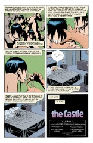
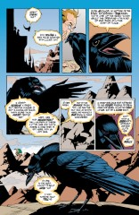

# Vertigo Jam: "The Castle"

##### Neil Gaiman, Kevin Nowlan

**Note**: Included as a prologue to The Kindly Ones.

**Note**: One of the few times The Sandman isn't lettered by Todd Klein.

### Page 1

> [marginThumb] 

- #### Panels 1-3

  Anyone fancy taking a stab at analyzing this dream?  Attacked by giant faceless (brainless?) women ridden by wolves?

### Page 2

> [marginThumb] 

- #### Panel 5

  Everyone has a book inside them.  And so everyone has a book in Lucien's Library.

- #### Panel 6

  A lovely view showing the enormity (infinity?) of Lucien's Library.

### Page 3

> [marginThumb] 

- #### Panels 1-3

  Since this was originally included in an anthology publication, these recap is presumably aimed at those readers who hadn't read The Sandman before.

- #### Panel 6

  Merv's head really is just a hollowed out pumpkin.

### Page 4

> [marginThumb] 

- Nuala, of course we already know. Her homesickness (and lovesickness) will be addressed in future issues...

### Page 5

> [marginThumb] 

- #### Panel 6

  Matthew has begun to wonder about the fate of Dream's previous Ravens - another plotline that will get addressed...

- #### Panel 7

  Presumably, the huge figure in the distant mountains is the aforementioned _Tiny_.

## Credits

- Greg "elmo" Morrow created the Sandman Annotations.
- Originally collated and edited by Richard Munn.
