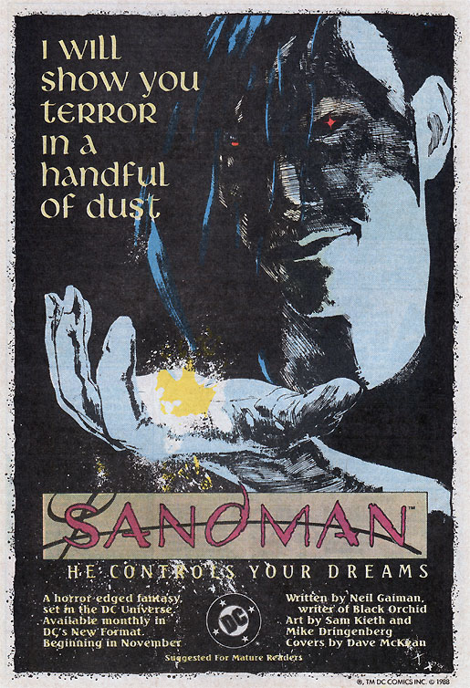

# The Annotated Sandman

## Issue 1: "Sleep of the Just"

##### Neil Gaiman, Sam Kieth, and Mike Dringenberg

First part of first storyline, _More than Rubies_
First story reprinted in _Preludes and Nocturnes_

Another _possible_ Elvis Costello influence is the title to Sandman #1 - there IS an Elvis Costello song entitled "Sleep of the just", though nothing in the lyrics correlates with the story.

### Page 1

- #### Panel 2
  First known appearance of Dr. John Hathaway, who we will shortly find out is senior curator of the Royal Museum.

### Page 2

- #### Panel 1

  First known appearance of Roderick Burgess, who we will shortly find out is "Lord Magus" (Magus being a Latinized singular of mage, equivalent to wizard or magician) of the "Order of Ancient Mysteries".

- #### Panel 6

  Only known appearance of the _Magdalene Grimoire_. This is not a DC equivalent to Marvel's _Darkhold_. A grimoire is a fancy word for a (magical) book. According to Neil Gaiman, Magdalene is "marginally more likely to be the university than to refer to [the biblical] Mary Magdalene."

  Magdalene is a college in Cambridge, Magdalen a college in Oxford. Both are pronounced "mauldin" in British usage.

### Page 3

- #### Panels 1-4

  First known appearances of Ellie Marsten, Daniel Bustamonte, Stefan Wasserman, and Unity Kincaid. Unity will appear later, the rest appear only throughout this issue.

  In one of McFarlane's comic Spawn's early stories, the main character is a certain Billy Kincaid, serial killer of little children. McFarlane himself wrote the Billy Kincaid story. Alan Moore wrote Spawn#8, which featured Kincaid's experiences in Hell. Neil Gaiman wrote Sandman#9 and the Angela Mini-series.

### Page 4

- #### Panel 1
  First known appearance of Alex Burgess, Roderick's son.
- #### Panel 4
  "Aleister" is Aleister Crowley, the most widely known demonologist and occultist of that era (and probably still today). Roderick Burgess is essentially only Aleister Crowley renamed.

### Page 5-7:

- Let's look at the materials in the summoning ritual. On page five, the materials are fairly mundane, except in panel 7: A feather pulled from an angel's wing. This would appear to be fairly difficult, and worth a story in its own.

  The coin, stick, song, and knife may correspond to the Disk, Wand, Cup, and Sword suits of the Tarot cards. Disks are analogous to modern diamonds, and represent earth and business. Wands became clubs, and represent fire and energy. Cups became hearts, and represent water and emotions, and are a feminine suit. Swords became spades, and represent air and intellect, and are a masculine suit.

### Page 6

- #### Panel 4

  Burgess gives the name of "old lords": Namtar, Allatu, Morax, Naberius, Klesh, Vepar, Maymon. Morax is certainly the name of a bull-headed demon appearing in _The Demon_. Maymon may be a reference to Mammon, a Greek word for riches. Mammon is also the name of a devil in the Key of Solomon, based on the line "one cannot serve God and Mammon" in the scripture.

- #### Panel 5
  **More names**: Ashema-Deva, Maborym, Horvendile. Ashema-Deva is Persian, a god or devil in the Zoroastrian pantheon. He is more familiar to Westerners under the name Asmodeus. Horvendile is a name that appears in both Lord Dunsany and James Branch Cabell. In Dunsany (an early fantasist and playwright, active in the early decades of this century, best known work perhaps _The King of Elfland's Daughter_), Horvendile is a god. In Cabell's "Poictesme" cycle, he is referred to as a demiurge, a being who, though walking through the story, is above it, and possibly pulling the strings. He also keeps swine that feed on human flesh.

### Page 7

- #### Panel 6
  First known appearance of Morpheus, the Sandman. Morpheus has many different names, since every culture has known of him in some form. Morpheus is fairly rarely referred to directly as the Sandman, with the major exception being issue #3. In this shot, he is wearing a helmet; that is not his head.

### Page 8-9:

- We clearly see here the removal of the helmet, ruby, and pouch of sand, whose recovery will occupy most of _More than Rubies_.

### Page 10

- #### Panel 1
  Ellie is holding a copy of _Through the Looking Glass_, and her appearance bears some resemblance to Alice, the heroine of that book.

### Page 11

- #### Panel 2
  The word "morphine" is derived from the name "Morpheus". There's one other very significant allusion on page 11 which the annotations don't list. The bottom three panels describe Unity Kinkaid: as the narrative proceeds, the images zoom in on her sleeping face, then her nose and mouth, then her closed lips. The last panel ends with "Unity sleeps", in extreme close-up. Her lips fill the frame, and they are very pink. This panel looks almost exactly like Desire's sigil.

### Page 14

- #### Panel 2
  First known appearance of Ethel Cripps; she will appear in later issues. First identification as such of Ruthven Sykes, second in command of the Order. This issue is his first known appearance. We have seen him in several earlier shots; we see here indications of why he did what he does on the next pages.
- #### Panel 3-4
  "Sleepy sickness" appears to have been a real phenomenon in the early part of this century. It can also be seen in the Williams-De Niro movie _Awakenings_ and various texts.

### Page 15

- #### Panel 4
  Who or what are the Endless? They include Death, Destiny, Desire, and Dream. We will find out more in later issues.
- #### Panel 5

  First known appearance of the _Paginarum Fulvarum_.

  According to Neil Gaiman, fulvous is reddish yellow, dull yellowish brown, golden, or tawny. The _Paginarum Fulvarum_ is thus a pun on the "Yellow Pages". The "Yellow Pages" is a business directory in England, a business phone directory arranged by category of service in America, Australia and Germany. (The Yellow Pages may be the same in England. My English source gave no additional explanation.). First identification of Morpheus as the Kinge of Dremes [sic].

- #### Panel 4-6
  First known appearance of a demon we will see again. The amulet will also appear again.

### Page 18

- #### Panel 3
  Unity's child will become important later.
- #### Panel 4-6
  Wesley Dodds was the Golden Age Sandman. The dreams are a retcon. The costume is correct; it is Dodds' first costume. Later he will don a purple and gold outfit and acquire a sidekick, Sandy. Dodds will be referred to again.

### Page 21

- #### Panel 2
  First known appearance of Paul McGuire, new second in command of the Order. He will not appear in later issues.

### Page 23

- #### Panel 6

  "Do what thou wilt", on the t-shirt, is the first half of a statement made famous by Aleister Crowley: "Do what thou wilt, and that shall be the whole of the Law." It is traceable back to Rabelais, and was the motto of the Hellfire Club. Crowley also used, with this motto, another Rabelais statement, "Love is the Law, Love under Will." Some modern groups use a slightly different version: "An' ye harm none, do what ye will."

  **Also**: It's just barely possible that the t-shirt is a joke on the Illuminatus! trilogy, where one of the far-fetched conspiracy ideas is that "Oh, you wascally wabbit!" is a satanic invocation (and thus that Bugs Bunny is the Goat who Bears a Thousand Young). A duck who says "buster!" has to be a stand-in for Daffy Duck, Bugs Bunny's chief rival in the Looney Tunes pantheon: and "Do what thou wilt [shall be the whole of the Law]" is a signature phrase of:

  1. Aleister Crowley, who's often mistaken for a satanist and

  2. Anton La Vey, who famously was one and made it the centerpiece of his
     Satanist Bible.

### Page 24

- #### Panel 7

  Here the text is named the _Liber Fulvarum Paginarum_. "Liber" translates as "book", and word order is quite flexible in Latin, so this is clearly the same as the text on page 15.

  It is first mentioned in Terry Pratchett's Discworld books -- The translation: book of yellow pages, so they're the Yellow pages :) It also makes an appearance in the novel Neil Gaiman and Terry Pratchett did together called "Good Omens".

  It's other name is the Necrotelicomnicon: A book, written by Achmed the mad, which lists all of the old, dark gods of the Disc. The first edition is kept in the Library of Unseen University, between iron plates, behind a balanced stone door, with its name hacked onto the lintel over the door. The page header 'About the Author' combusted shortly after his death. Legend says that any mortal man who reads more than a few lines of the original copy will die insane; it is also said that it contains illustrations that could make a strong man's brain dribble out of his ears.

  Usually, people only read tenth or twelfth had copies. There was once a wizard who started to read it and let his mind wander. Next morning they found all his clothes on the chair and his hat on top of them and the book had ... a lot more pages.

### Page 27

- #### Panels 6-7
  Morpheus reaches into his guard's dream (daydream?) and   grabs a handful of sand. This is a power he will manifest many times.

### Page 29

- #### Panel 7
  Morpheus uses the sand to put his captors to sleep. This is a traditional power of the children's-tale Sandman.

### Page 31

- #### Panel 4

  We are seeing Mort Notkin's dream, in which he is dressed as a clown at a party which is not a costume party after all (a common dream).

  The people pictured are, left to right, Marilyn Monroe, an American film actress; Jimmy Durante, an American film actor; Mort himself (note dismayed expression); Elvis Presley, an American rock musician; (small face) unknown (Humphrey Bogart?); John Wayne, American film actor; unknown (Jane Fonda?).

- #### Panel 5
  Colonel Harlan Sanders, American fast food entrepreneur. The bucket he is holding contains his famous fried chicken.
- #### Panel 6
  On the left, Marilyn again; on the right, we can see Mort's left rear.

### Page 31

- #### Panel 6; page 32 panel 3
  Morpheus uses two different methods to acquire food and clothing. It is unclear why, except that perhaps Gaiman is showing us the extent of his powers.

### Page 32

- #### Panel 6
  We will see that Morpheus craves revenge in the short term, but repents of it in the long term, as a general facet of his personality.

### Page 35

- #### Panel 1
  Note the hole in the wall, which vaguely resembles a skull, or possibly, Dream's Helmet (minus the proboscis).

### Page 36

- #### Panel 7
  "Lord, what fools these mortals be" is from Shakespeare's _A Midsummer-Night's Dream_. This play is evidently a favorite of Gaiman's, as he often uses it as a source, and bases an entire later issue around the play.

### Page 40

- #### Panel 5
  Morpheus' thoughts - hard to see, because (in my copy, at least) the coloration is rather odd - but the thought reads, "And I have showed him fear..." This may be only speculation, but to me this seems reminiscent of a T.S. Eliot quote, from his poem "The Wasteland". The quote reads, "..I will show you fear in a handful of dust." I was reminded of this on first reading, and then, on further investigation of Morpheus' actions directly preceding this, on page 37, was rewarded with the final panel - and those grains falling from his hand, if I am not entirely mistaken, are sand. (And I have showed him fear in a handful of sand.) In fact, I think it should be 'shown' in that form, the pluperfect (I show, I was showing, I showed, I have shown?). Let us consult the might of the OED and see if Gaiman is, indeed, guilty of the carnal sin of bad grammar... no; all is absolved; our deity is returned to infallibility; Showed or Shown are both acceptable.

  This was confirmed in the Sandman Companion to be based on the T.S. Eliot quote.  The original marketing adverts for _Sandman_ positioned it as a horror comic, with the tagline "I will show you terror in a handful of dust".  Goodness knows what the DC marketing department made of the rest of the run...

  

## Credits

- Originally collated and edited by Greg Morrow.
- <jasona@sco.COM> ( Convincing simulation )
- Andrew David Weiland <aw1s+@andrew.cmu.edu>
- Connie Hirsch <fuzzy@athena.mit.edu>
- Dani Zweig <dani@netcom.COM>
- Col. Sicherman <gls@windmill.ATT.COM>
- Jim W Lai <jwtlai@watcgl.waterloo.edu>
- Thomas White <twhite@mozart.amd.com>
- Dan Holzman <holzman@fnal.fnal.gov>
- Neil Gaiman, via Tanaqui C. Weaver <tweaver@isis.cs.du.edu>
- Andrew Sigel <sigel@vsscad.enet.dec.com>
- Ralf Hildebrandt added a note about the title, the connection between Unity and Desire, more info about the Yellow Pages and lots more details and edits
- Richard Munn confirmed the T.S. Eliot quote
