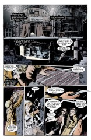

## Issue 3: "Dream a Little Dream of Me"

> [!THUMBNAIL] 

##### Neil Gaiman, Sam Kieth, and Mike Dringenberg

Third part of first storyline, _More than Rubies_

Third story reprinted in _Preludes and Nocturnes_

**Title**: "Dream a Little Dream of Me" is a 1931 song. Words by Gus Kahn, music by Wilbur Schwandt & Fabian Andre. It has been recorded many times by many artists, but most familiar to the audience is probably the version by the Mamas and the Papas, sung by Mama Cass Elliot.

### Page 1

> [!THUMBNAIL] 

- This woman will be identified later. This is her first known appearance.

### Page 2

> [!THUMBNAIL] 

- #### Panel 3

  The lyrics are the opening lines of the title song. There are variations in the lyrics; at least one live source has the opening phrase as "Say 'nighty-night.' "

- #### Panel 4

  This is John Constantine, whose background was described in the annotation of the second issue. Constantine is pronounced with the tine of a fork, not the teen of an adolescent.

### Page 3

> [!THUMBNAIL] 

- #### Panel 1

  When things happen, John Constantine is in the middle of them. That is his nature.

- #### Panel 3

  Constantine has historically suffered from nightmares, mostly due to the fact that a lot of his friends get killed as a direct or indirect result of Constantine's actions.

- #### Panel 5

  The lyrics are from a song called "Mister Sandman" by the Chordettes, a girl group from 1954.

### Page 4

> [!THUMBNAIL] 

- #### Panel 2

  John Constantine used to sing with a (fictional) punk group called Mucous Membrance back in the 70s.

- #### Panel 3-4

  The lyrics are from a Patsy Cline song, "Sweet Dreams," also covered by Elvis Costello on the album "Almost Blue." The lyrics may have also appeared in the comic _Badlands_ #4. The song is considered a classic "proof" of a singer's a capella ("without accompaniment") abilities.

- #### Panel 4

  Mad Hettie is a London bag lady whom Constantine has encountered somewhere in the Rick Veitch run of _Swamp Thing_. She is insane, a prophet, and immortal.

### Page 5

> [!THUMBNAIL] 

- #### Panel 1

  Note that the punk on the far left bears some resemblance to the demon Choronzon, which is probably coincidental.

- #### Panel 2

  Oneiromancer is another title for Morpheus. It literally means "one who predicts the future by the interpretation of dreams" but the -mancer morpheme has acquired in science fiction/fantasy/comics the more generic meaning of "magician" so that "oneiromancer" here probably means "wizard with power over dreams".

### Page 6

> [!THUMBNAIL] 

- #### Panel 2

  I am not familiar with the practice of "creeping"; it may be exclusively British, or more simply a short-lived phenomenon.

### Page 7

> [!THUMBNAIL] 

- #### Panel 3

  In a world where Superman really exists, it is not surprising that people would dream they were he. (Nor in this world, either!) "Last son of a dead planet" is a reference to Superman's meta-title, "Last Son of Krypton." This is also the title of a quite good novel by Elliot S. Maggin.

### Page 8

> [!THUMBNAIL] 

- #### Panel 1

  The lyrics are from "Sweet Dreams" by the Eurythmics.

- #### Panel 2

  The lyrics are from "Dream Lover" by Bobby Darin. It was a #2 hit in 1959.

- #### Panel 3

  The lyrics are from "Power of Love" by Frankie Goes To Hollywood. They were used in public service messages about AIDS in Britain.

  The Ley-lines (pronounced like the name Lee) are a particular reference to a case of Constantine's, the Fear Machine, which ran for something like nine issues in the teens of _Hellblazer_. Leptons are a class of fundamental particles in physics. A plasma is an aggregate of charged particles; "Plasma fields" is incorrect jargon and sounds like New Age crap.

- #### Panel 6, page 9 panel 1

  A reference to the legendary Stanley-Livingstone meeting in Africa.

### Page 9

> [!THUMBNAIL] 

- #### Panel 5

  Chas is a friend of Constantine from Hellblazer.

- #### Panel 7

  I think the faces in Morpheus' cloak are simply random.

- #### Panel 8

  The "big green bloke" is Swamp Thing, who has been involved in several of Constantine's cases.

### Page 10

> [!THUMBNAIL] 

- #### Panel 3

  The volumes (diaries?) labeled _Brujeria_, _Plant Elemental_, _Crisis_, and _American Gothic_ all refer to Constantine's first appearance, a case with Swamp Thing that was directly related to the _Crisis on Infinite Earths_ crossover series. _Liverpool_ and _Tibet_ are references I do not recognize.

### Page 11

> [!THUMBNAIL] 

- #### Panel 1

  This is the Chas of page 9. "Venus of the Hardsell" refers to a song that Constantine used to sing as a member of Mucous Membrane. The lyrics and a "textual video" piece are included as the second story in _Hellblazer_ Annual #1.

- #### Panel 2

  I do not know of any way that Morpheus "rewarded" Chas.

- #### Panel 3

  Rachel is the girl from Page 1. "The Lupus Affair" is an unknown case of Constantine's. "Lupus" is Latin for wolf; it is also a disease of the connective tissues. In _Batman_ 255, "Moon of the Wolf," Professor Milo (comics' only mad pharmacist) gives Anthony Lupus a drug which accelerates his natural pilosity into full-fledged lycanthropy. The story ends with Lupus hunting wolves in Alaska, searching for a cure. Lupus returned in _Detective_ #505. The "Lupus Affair" may therefore refer to an untold encounter Constantine had with Lupus. Constantine may have referred to Lupus or the Lupus Affair elsewhere.

- #### Panel 4

  In the late 60s, Stan Lee and Jack Kirby did a overblown philosophical comic called _The Silver Surfer_. Drugged-out hippies loved it; it became extremely popular for a short while. Issues of that run are worth quite a bit of money. Besides undergrounds, they are the only sorts of comics likely to be found in head shops.

- #### Panel 5

  The lyrics are from a song by Roy Orbison, "In Dreams".

  The song is featured prominently in the soundtrack of David Lynch's movie _Blue Velvet_.

### Page 13

> [!THUMBNAIL] 

- #### Panel 1

  I interpret this to mean that Constantine recognized the danger of fooling with something he didn't understand and thus did not try to open the pouch. This seems to conflict with page 9 panel 3, which I interpret to say that Constantine tried and failed to open the pouch.

- #### Panel 4

  Another new power of Morpheus. By this time we should mostly be aware that he can affect reality in any way he chooses, subject only to the writer's whims; he can be thwarted only by other beings with similar levels of power.

### Page 14

> [!THUMBNAIL] 

- #### Panel 6

  Morpheus can see in the dark.

### Page 16

> [!THUMBNAIL] 

- #### Panel 3

  Morpheus enters Constantine's waking dream to pull him out.

### Page 20

> [!THUMBNAIL] 

- #### Panel 4

  We are never told how Rachel managed to open the pouch; this is important because we are specifically told earlier than Constantine could not on page 9.

### Page 21

> [!THUMBNAIL] 

- #### Panel 1

  Rachel's line about the setting sun is from a Kate Bush song, "The Dreaming," taken from the album of the same name.

### Page 23

> [!THUMBNAIL] 

- #### Panel 6

  Constantine believes that he is going to Hell because he believes he has caused the deaths of so many friends and acquaintances.

### Page 24

> [!THUMBNAIL] 

- #### Panel 5

  "Newcastle" was Constantine's first case, in which an exorcism went badly wrong and Constantine went nuts for a while.

- #### Panel 8-9

  Constantine is singing the song from page 3.

## Credits

- Originally collated and edited by Greg Morrow.
- Connie Hirsch <fuzzy@athena.mit.edu> (Pinkdex - TNG) identified the title song. William Sherman <sherman@oak.math.ucla.edu> identified the different lyrics to it. Connie and William, along with Steve Simmons
- <scs@lokkur.dexter.mi.us>, <watts@Csa1.LBL.Gov>, and my parents, Denis and Carolyn Morrow, argued about who sang "Mister Sandman." Connie and James Drew \* <jrd@frame.com> identified Patsy Cline's "Sweet Dreams." Connie, Rob Ingram <rji@nyquist.cs.nott.ac.uk>, and <watts@Csa1.LBL.Gov> identified the songs on page 8. Connie identified the song on page 11. Connie, William, and Andrew David Weiland <aw1s+@andrew.cmu.edu> identified that there was a quote on page 21, and where it was from. Terry Dawson <terry@edsi.plexus.COM> definitively identified the source for "Dream a Little Dream of Me" and "Mister Sandman" using _The Big Song Thesaurus_, 2d. ed.
- Jeffrey Porten <porten@eniac.seas.upenn.edu> and Connie had things to say about the burglar's dream.
- Chris Jarocha-Ernst <cje@heart.rutgers.edu> speculated on "The Lupus Affair."
- Steve Murray <SXM101@psuvm.psu.edu> speculated on Constantine's not opening the pouch.
- David Henry <UD137927@VM1.NoDak.EDU> corrected Mad Hettie's appearance.
