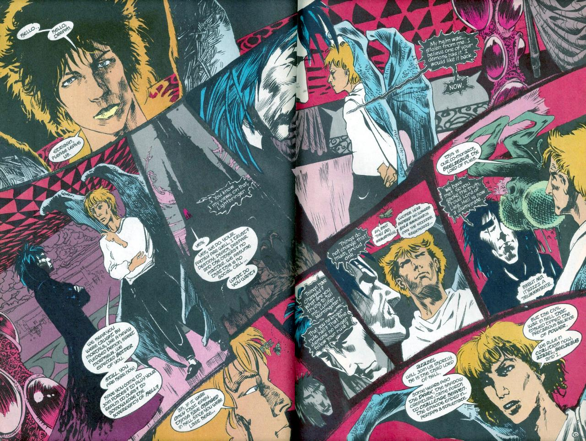

> [marginThumb] 

# Issue 4: "A Hope in Hell"

##### Neil Gaiman, Sam Kieth, and Mike Dringenberg

- Fourth part of first storyline, _More than Rubies_
- Fourth story reprinted in _Preludes and Nocturnes_
- Audible Act I Chapter 4
- Netflix Episode 4

### Page 1

> [marginThumb] 

- #### Panel 7

  The Morningstar is Lucifer Morningstar, the ruler of Hell

  Isaiah 14:12 reads "How art thou fallen from heaven, O Lucifer, son of the morning! How art thou cut down to the ground, which didst weaken the nations!" (King James translation) or "How you are fallen from heaven, O Day Star, son of Dawn!" (Revised Standard). The pocket edition of the OED includes in its definition of Lucifer, "The morning star; the planet Venus when it appears in the sky before sunrise. Now only poetic."

  Milton may have also used the appellation "Morningstar" for Lucifer, probably in _Paradise Lost_. In addition, a character in Roger Zelazny's book _Jack of Shadows_ is called Morningstar, and occupies a role analogous to Lucifer.

### Page 4

> [marginThumb] 

- #### Panel 1-4

  This is not the same gatekeeper as seen elsewhere; first known appearance of Squatterbloat. Squatterbloat speaks in triolets; the rhyme scheme is ABAAABAB, and the first, fourth, and seventh lines are the same, as are the second and eighth. The B lines are a syllable or two longer than the A lines. Note that DC has established that demons who rhyme when they speak are higher in Hell's hierarchy than those who do not.

- #### Panel 5

  A new title for Morpheus: "King of the Nightmare Realms".

### Page 5

> [marginThumb] 

- #### Panel 5

  > [floatright width-40pc] 

  Etrigan first appeared in [The Demon](https://dc.fandom.com/wiki/The_Demon_Vol_1_1) - a Kirby book of the 70s. He is a demon, the son of Belial and the half-brother of Merlin. He shares a body on Earth with Jason Blood, and has since the time of Camelot. Etrigan has had three series, all called _The Demon_, with one currently being published. The Demon (Etrigan)'s speech originally did not rhyme, but Alan Moore did not invent the rhyming pattern of Etrigan's speech. This was invented by Len Wein (who later wrote one of the Dreaming mini-series) in DC COMICS PRESENTS#66. Etrigan is, to judge by the meter of his speech in several instances, pronounced "eh-tri-GAN", with a short i sound. (I'd reproduce it phonetically except that 1. most of the audience wouldn't get it and 2. this keyboard doesn't have the right characters--all three vowels are non-Roman: epsilon, small-caps-I, aesch.)

### Page 6

> [marginThumb] 

- #### Panel 5

  The Wood of Suicides is from Dante's [Inferno](http://www.amazon.de/exec/obidos/ASIN/1853267872). It's in the Second Round of the Seventh Circle. According to John Ciardi's translation, since they destroyed their bodies, the suicides are therefore denied a human form in Hell. Furthermore, since the supreme expression of their life was their destruction, they can only express themselves (i.e: speak) when they are being destroyed. So long as they bleed, the suicides may talk; they find expression through their own blood. You will notice that Morpheus snaps a twig off a passing tree whilst in the Wood. Only then does the suicide begin to relate his story. The Wood has also appeared in Larry Niven and Jerry Pournelle's book _Inferno_, which is a modern retelling of Dante. The Wood may also have appeared in other DC characters' visits to Hell; I am not sure.

### Page 7

> [marginThumb] 

- #### Panel 3

  Kai'ckul is another name for Morpheus; the prisoner is a woman named Nada -- nada means "nothing" in Spanish. Nada will be important at least twice more, in a single issue and a major storyline.

- #### Panel 4, 6

  Notice that Dream appears differently to Nada.

### Page 8

> [marginThumb] 

- #### Panel 1

  Dis (according to my dictionary) is identical with the god Pluto, or with the underworld of Hades. However, Virgil's _Aeneid_ mentions Dis as a city in the underworld, while Dante's _Inferno_ identifies it as the city occupying the sixth to ninth circles of the Christian Hell. Dis Pater (literally, "death father") was a Latin god of the underworld, probably once an ancestral spirit. By classical times, it had become identified with Pluto. The name is morphologically similar to Jupiter ("sky father").

- #### Panel 4

  Lucifer's wings are problematic. His angelic wings traditionally were torn off as part of his punishment, or were burned off in the descent to Hell. These are, however, bat-like, and may be replacements Lucifer caused to grow.

### Page 9

> [marginThumb] 

- **Note** This is Lucifer's first appearance. In the original monthly publication these two pages were a double page spread. After adverts were removed for the collections, they no longer fell over two pages, so were redrawn.

  

  ([image source](https://twitter.com/thejither/status/1552683693738758144?t=8jZXY4PmKVDuByuE6_TKsw&s=19))

- #### Panel 2

  "Lucifer" is Latin for "Lightbringer", more or less. Note the reference to Dream's family, including the first mention of Despair.

### Page 10

> [marginThumb] 

- #### Panel 5

  According to my dictionary, "diumvirate" should be spelled "duumvirate". The fact that Hell was ruled by a triumvirate was established in some other DC comic, perhaps early issues of Hellblazer. As a result of the followup (in _Swamp Thing_ #50) to _Crisis on Infinite Earths_, Lucifer was forced to accept Beelzebub and Azazel as co-rulers. The names of these archdevils can also be found in Milton, among other sources. A different light will be shed upon this in a later storyline. Also, the first storyline in the new run of _The Demon_ was tumult and shouting about the ruling of Hell. The triumvirate has also appeared in the secret origin of "Stanley and His Monster" (by Phil Foglio, and very funny, of course, in the later issues of _Secret Origins_).

### Page 11

> [marginThumb] 

- #### Panel 3

  In the lower left corner there is an old clock on Lucifer's table. Exactly the same clock can be found in [Sandman #6](sandman.06.md#page-16) ("24 hours") on pages [16](sandman.06.md#page-16) and [22](sandman.06.md#page-22).

### Page 14

> [marginThumb] 

- #### Panel 2

  The story of the _Dead God_ that Dream refers to will get told later in the story. (See [#49:11](sandman.49.md#page-11) if you wish to jump ahead.)

- #### Panel 6-7

  This is the demon from [Sandman #1](sandman.01.md), here identified for the first time as Choronzon, who appears in the writings of Aleister Crowley. He is credited in legend as having seriously injured Aleister Crowley during a summoning which Crowley did "deep in the Sahara desert." According to the story, Crowley was less-than-attentive to the construction of the protective circle, and suffered dire consequences.

  Added by <legion@cistron.nl> :

  > However, it is fairly certain that Crowley took the name from the writings of the 15th century astrologist, alchemist and magician John Dee. According to his stories, he was taught the angelic scripture (Enochian) by an angel. In these scriptures Coronzon (also Coronzom, or Choronzon) was the name of a mighty demon (perhaps Lucifer) who rebelled against God.

### Page 15

> [marginThumb] 

- #### Panel 7

  The game of reality is not one I have seen before. Gaiman has a gift for inventing totally new things that sound completely right, such as the ritual that invoked Morpheus in [Sandman #1](sandman.01.md) and the tale in [Sandman #9](sandman.09.md). A somewhat similar game, except that the participants actually transform themselves rather than merely discussing it, is played in T.H. White's _The Sword in the Stone_. The game of reality is quite similar thematically to the Riddle Game of old, which is exemplified in J.R.R. Tolkien's _The Hobbit_.

  Choronzon could have easily responded to "hope" such as Doubt, or Despair, both killers of hope. Maybe that's why Lucifer was so angry at him for losing...

### Page 18

> [marginThumb] 

- #### Panel 1

  I am aware of no predilection in snakes for spider-devouring.

- #### Panel 5

  Masters of chess and go/wei chi (and other similar games), are said to be able to fathom an opponent's way of thinking after only a few moves. Apparently, this also applies to the Game of Reality.

### Page 19

> [marginThumb] 

- #### Panel 8

  "I am hope." Hope was supposed to be the only thing that remained in Pandora's Box after she opened it. No wonder Choronzon couldn't think of anything to counter it.

  (The story goes, the Gods of Olympus wanted to punish mankind, and so created Pandora, the first woman, and gave her a gift of an exquisitely decorated, sealed box. They didn't tell her what was in the box, however, and forbade her to open it.

  Eventually Pandora's curiosity got the better of her, and she opened the box. Something brushed against her face, and she heard a sound like thousands of hornets. Pandora had unleashed Hate, Avarice, Jealousy, Lust and all the other evils into the world. Only one Hope remained inside, and only Hope can counter-act the wickedness of Mankind today.)

### Page 20

> [marginThumb] 

- #### Panel 4

  Agony and Ecstasy have popped up once or twice before, first in _Hellblazer_ 12. They are Lucifer's enforcers.

### Page 24

> [marginThumb] 

- This is John Dee, Dr. Destiny, who has been mentioned before. The amulet is the same amulet for which Ruthven Sykes traded the helmet to Choronzon; it allegedly protects the wearer from "anything", and it is known to work against magical sendings.

## Credits

- Originally collated and edited by Greg Morrow.
- Sol <colomon@zip.eecs.umich.edu>, Ian Lance Taylor <ian@airs.com>, David Goldfarb <goldfarb@ocf.berkeley.edu>, and William Sherman <sherman@oak.math.ucla.edu> found citations for "Lucifer Morningstar."
- Ian and David, and Sasha <sasha.bbs@shark.cse.fau.edu> and Andrew David Weiland <aw1s+@andrew.cmu.edu> found citations for the Wood of Suicides. Ian also found Agony and Ecstasy's first appearance, and referenced _The Sword in the Stone_.
- Viktor Haag <vehaag@crocus.waterloo.edu> and Chris Jarocha-Ernst <cje@heart.rutgers.edu> commented on the infernal trinity. Chris also pointed out that Tim Maroney had identified Choronzon some time ago.
- Andrew Weiland and David Perry <perry@schaefer.math.wisc.edu> traced the lineage of "Dis".
- Tanaqui C. Weaver <tweaver@isis.cs.du.edu> spotted Squatterbloat's poetry and relayed Neil Gaiman's correction on the first mention of Despair.
- David Henry <UD137927@VM1.NoDak.EDU> recalled the Riddle Game.
- Ralf Hildebrandt added more details.
- Richard Munn added image references, added the link to the story of the dead god, and filled in the details about the first appearance of Lucifer being redrawn.
