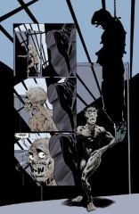
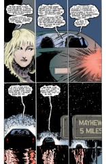

> [marginThumb] 

# Issue 5: "Passengers"

##### Neil Gaiman, Sam Kieth, and Malcolm Jones III

Fifth part of first storyline, _More than Rubies_

Fifth story reprinted in _Preludes and Nocturnes_

### Page 1

> [marginThumb] 

- This is Arkham Asylum, which was referenced earlier. "Funeral March for a Marionette" is the theme song to the show "Alfred Hitchcock Presents." Hitchcock is a famous director, particularly of suspenseful movies; the television shows were also suspense or mystery, introduced by Hitch himself with droll black humor. Hitchcock is known for making cameos in all his film work. "Alfred Hitchcock Presents" is currently being shown on USA Network on cable on Friday nights.

You may find the song on the compact disc "Chiller," Telarc CD-80189, in the classical section. The song was written by Charles Gounod, as a musical caricature of a music critic, Henfry [sic; perhaps "Henry"] F. Chorley.

Chorley died in 1872 before the piece could be formally dedicated to him, but it became an instant hit with amateur pianists.

### Page 2

> [marginThumb] 

- It is unclear how John Dee (Dr. Destiny) has escaped from his cell, unless it be by the amulet he obtained last issue. The Scarecrow is hanging just outside the dining hall as a part of an April Fool's joke (the date established on page 1).

- #### Panel 4

  The hanging figure is Jonathan Crane, the Scarecrow, a crazy Batman villain who is obsessed with fear in all its forms. He is known to be a long term resident of Arkham.

### Page 3

> [marginThumb] 

- As far as I know, the Scarecrow is correct with his terms for various phobias. It is unclear how he is hanging. Panel 5 clearly shows that the noose is not tight, but then he could not be hanging from the rope (as he clearly is on the previous page and in panel 1) with the rope as in panel 5. The shadows in panel 5 might show the rope attached to a fairly large hook on the back of Crane's straightjacket.

He might have the rope going down his shirt and tied around his waist. They did this in the movie "Heathers."

- #### Panel 7

  The materioptikon was described in an earlier annotation.

- #### Panel 9

  The Joker, a Batman villain, is Arkham's most famous inmate.

### Page 4

> [marginThumb] 

- #### Panel 5

  First known appearance of the woman, who is named later this issue.

#### Page 5-7

> [marginThumb] 

- This is a dream of Mister Miracle. Mister Miracle, who goes by the name "Scott Free", which is a pun, is a New God, and a member of the Justice League. He is the son of the "good" New God Izaya, but was raised in a hellish orphanage run by a wicked woman named Granny Goodness on the planet of the "bad" New Gods, which is named Apokolips. Needless to say, all of this mythology was created by Jack Kirby, specifically for his "Fourth World" titles at DC in the 70s. Mister Miracle is a master escape artist. A number of minor characters are named in this sequence; I assume they are either consistent with his known origin or are new here.

### Page 11

> [marginThumb] 

- #### Panel 1

  I'm not going to go into the long and tortuous (yes, it's torture to recall the Detroit years) history of the various incarnations of the Justice League.

- #### Panel 2

  The Justice League used to have their headquarters in a satellite (which was in geosynchronous orbit except that none of the writers except Gardner Fox who originally described it knew what a geosync orbit was). Most if not all of the encounters with Dr. Destiny occurred before the destruction of this satellite in _Crisis on Infinite Earths_.

- #### Panel 4

  One of the other JL HQs was in Detroit, the other outside a town in Rhode Island called Happy Harbor, which was called the "Secret Sanctuary".

### Page 12

> [marginThumb] 

- #### Panel 1

  OK, so we know her name is Rosemary. Later we find out that her last name is Kelly. It's not going to matter very long....

### Page 13

> [marginThumb] 

- #### Panel 4

  Dee is describing some of his encounters with the JLA, accurately.

### Page 14

> [marginThumb] 

- #### Panel 2

  The big green guy is J'onn J'onzz, the Martian Manhunter, and a long term member of the JLA.

- #### Panel 5

  Morpheus takes a different form and is recognized under a different name, L'Zoril, by the Manhunter, who is really from Mars. This is really the first, and possibly the strongest, proof we have to date that Dream has been known to all cultures and all times. Note that Mister Miracle does not react badly to the appearance of a giant flaming skull in the hallway beside him; this is a good clue that Morpheus has little or no real physical presence, but is instead perceived according to the preconceptions of the viewer. Thus, the Manhunter perceives him as his historical god of dreams, while most Westerners, who have little mythological preparation for him, perceive him as a thin, pale human (someone who stays inside all day, perhaps writing or doing something else creative). Note that Grant Morrison's visage in _Animal Man_ resembled Morpheus quite closely.

### Page 15

> [marginThumb] 

- #### Panel 3

  "Upstate Gotham" is a misnomer, since Gotham is not a state. However, it is necessary within context, since Arkham is near Gotham and Dee must get from Gotham to Mayhew. Perhaps it should be read as "Upstate from Gotham." First known appearance of Mayhew, by the way. DC Comics has never established exactly whether Gotham City and Metropolis are, although the role-playing game reference "The Atlas of the DC Universe" places Metropolis in Delaware and Gotham in New Jersey. In general, most comic book writers (who have, historically, tended to live in NYC) have used Metropolis and Gotham as metaphors for New York City. Frank Miller is on record as having said "Metropolis is New York in the daytime; Gotham City is New York at night." It is conceivable, however, that both exist in fictional Gotham and Metropolis States, much as Duckburg is located in Calisota.

  Perhaps his intention was to imply that Batman worked in NYC without actually saying so. I don't know if this is reflected in DC continuity, although occasional references do show up. (In the movie _Batman Forever_, there's a familiar-looking statue in Gotham Harbour, for example.) Whatever, if we assume that "Gotham" in the DC universe is the result of a global-search-and-replace for "New York", then "upstate Gotham" makes perfect sense.

  <Kull29@aol.com> says:

  > Actually, Gotham was not where the first Batman stories were set. In Detective Comics#31, a caption reads "Through the dark of a New York night". (This shows the influence of the Shadow stories by Walter Gibson on the Batman; the Shadow stories were set in New York.) By 1941 at least (Batman#4), though, the words "Gotham City" were in use. (Actually, Overstreet list Wow Comics#1, from Fawcett, as the first comic book mention of the word "Gotham".)
  > Gotham, as noted, is in real life a nickname for New York. As a guess, I'd say that the switch from New York to a fictional Gotham City was a case of mistaken evolution. I think what might have happened was that Bill Finger, who wrote the early Batman stories, was something of an intellectual by all accounts. He probably used the word Gotham in his captions as a poetic synonym for New York a couple of times. Less educated writers, referencing Finger's work, probably picked up on these captions, but probably did not know what the word Gotham meant. They thus only used the word Gotham as the name of the setting of the Batman stories. Finally, all association with New York had been forgotten.
  > A similar story may account for how Superman, whose first stories were set in Cleveland (!), ended up living in Metropolis. [Metropolis is a synonym for city, but later writers probably did not know that.] Actually, these changes of artists and writers probably account for many Golden Age comic book continuity mistakes. As an example, Lex Luthor was originally not bald; he had red hair. It wasn't until about Superman#10 that he was depicted as bald. What happened was that in Superman#4, there was a story where Luthor is seen talking to a bald henchman. It is now certain that an artist, looking for a reference to draw from, was confused and thought that the henchman was supposed to be Luthor, and so drew his version of Luthor that way!

- #### Panel 4

  The City of Focative Mirrors is evidently a throwaway Martian cultural reference. From context, it might be assumed to be roughly equivalent to Heaven (or Gaiman's "Silver City," from later issues). Morpheus' offer is somewhat oddly phrased.

  We can look at the word "Focative". There are three morphemes here, foc-, -ate, and -ive. -ate turns a noun into a verb, and -ive turns a verb into an adjective. Foc- would appear to be from the Latin for "hearth", which became "focus" in English. Strictly morphologically, we may then interpret "focative" to mean "focusing", as in a lens, or perhaps "fiery" or "heat-giving".

  However, if we turn to Shakespeare, _The Merry Wives of Windsor_, Act IV, Scene 1, lines 42-46 we see a comic routine on, among other things, the "focative" case, with wordplay involving carets (referring to the phallic shape of a carrot) and roots. In other words, Shakespeare is punning on "fuck" (whose etymology makes interesting, if inelegant, dinner conversation). In this context, it appears that Dream is giving J'onn permission to have an erotic dream--especially frustrating for the last survivor of an entire species! Giving Gaiman's known Shakespearean leanings, this may very well be the interpretation he meant.

- #### Panel 5

  The new and allegedly funny Justice League series have established that J'onn enjoys Oreo™ cookies.

### Page 16

> [marginThumb] 

- #### Panel 2

  This may be oblique foreshadowing; the letter D is important to background mythology surrounding Morpheus that will be developed more in later issues.

### Page 17

> [marginThumb] 

- #### Panel 2

  It is a retcon to say that all the materioptikons were powered by the ruby. It does explain why no one else could build a materioptikon, though.

### Page 18

> [marginThumb] 

- Morpheus while on Earth travels either as a human would (the taxi ride with Constantine and Chas in [#3](sandman.03.md)) or through dreams of people along the way. The latter is consistent with how he obtained food in [#1](sandman.01.md), although there it was stated that Morpheus was too weak to create food from the fabric of dreams directly.

### Page 19

> [marginThumb] 

- #### Panel 3

  Only a handful of items are identifiable: the giant keyholes are related to the villain The Key; the giant joker card is related to the villains The Royal Flush Gang, the humanoid in the case is the robot Amazo. I do not recognize the frozen cow, the giant head, or any of the other badly drawn items. The tentacle might be a piece of Starro, but it's incorrect to put it here. Is this the same junk depository the Riddle worked at in _Secret Origins_ Special #1?

## Credits

- Originally collated and edited by Greg Morrow.
- Rich Salz <rsalz@bbn.com>, Tom Galloway <tyg@dip.eecs.umich.edu>, and Curtis Hoffmann <currmann@pnet51.orb.mn.org> identified "Funeral March for a Marionette."
- David Goldfarb <goldfarb@ocf.berkeley.edu> spotted the hook on page 3 and also commented on Morpheus' means of travel.
- Brian D. Rogerson <bdrogers@athena.mit.edu> commented on J'onn and Morpheus' encounter.
- Philip J. (Da Pope!) Birmingham <birmingh@fnal.fnal.gov> and I talked a great deal about the "City of Focative Mirrors." David Henry <UD137927@VM1.NoDak.EDU> found the Shakespearean sexual pun on "focative".
- R I K <SMB147@PSUVM.PSU.EDU> joked about the warehouse and recalled Grant Morrison's appearance in _Animal Man_.
- Jacob Levy <ST802099@BROWNVM> objected to my dismissal of the possible existence of Gotham, the State.
- Ralf Hildebrandt added more details.
- <Kull29@aol.com> added more details about the origin of Gotham.
