## Issue 6: "24 Hours"

> [!THUMBNAIL] 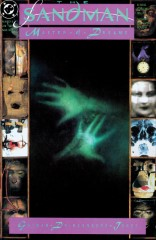

##### Neil Gaiman, Mike Dringenberg, and Malcolm Jones III

Sixth part of first storyline, _More than Rubies_

Sixth story reprinted in _Preludes and Nocturnes_

### Page 1

> [!THUMBNAIL] 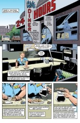

- #### Panel 2

  First known appearance of Bette Munroe. She does not appear in other than this issue.

- #### Panel 4-5

  Bette's hands may be shaking, or those may be motion lines.

### Page 2

> [!THUMBNAIL] 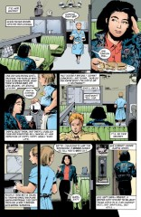

- #### Panel 2

  The woman is Judy, we will find out shortly. She is wearing a number of pins and buttons, only two of which are visible here. One reads "Rude Girl," and the other consists of an "A" inscribed in a circle, which is a symbol of anarchy. This is Judy's first known appearance. "Rude Boys" and "Rude Girls" were members of the late 70's, early 80's punk and/or gay scene in Britain. In particular, fans of two-tone or ska music, originally from Jamaica, were referred to as "Rudies."

  The term "Rudies," "Rude Boys" or "Rude Girls" has been in use in Jamaica since the early sixties, more than ten years before you sited them in the annotations. The term came to popularity with the Jamaican film "Rude Boy," in the mid '70's, but has been around since the times of Desmond Dekker and Frederick "Toots" Hibbert (the guy who invented the term reggae, or "reggay"), back in '62 or so.

- #### Panel 3

  Dear Abby is a syndicated advice columnist. Earl Wilson was a gossip columnist who focused on the entertainment field. He had been dead for a while when this story was published, although his column might have been continued under his name. Jackie Collins writes trashy highly unrecommended novels.

- #### Panel 4

  Johnny Carson is a late-night talk show host. Panel 6-7: Judy is a lesbian and Donna is her lover; they've had a fight. Joy Division is a techno-punk/New Wave/gothic band from the late 70's- early 80's.

  The term "Joy Division" is taken from the slang, referring to the prostitution sections of Nazi/Axis concentration camps. The lead singer of Joy Division -- Ian Curtis -- committed suicide. The rest of the band formed New Order, which further engendered Electronic, Revenge, and The Other Two! [sic].

  eddietomb@yahoo.com comments:

  > Joy Division had a song on their second album "Closer" called "Twenty Four Hours". It is likely that the band's name appearing on Judy's jacket was added as an in-joke of sorts, to compliment the title, and not vice versa.

  The symbol is actually two traditional female symbols interlocked. The male symbol is a circle with an arrow pointing about 30 degrees clockwise of vertical, like the second female symbol on the jacket. This is clearly a lesbian symbol. Bette's expressed attitude (disapproval but tolerance) toward lesbianism is one shared by a great many Americans (generalization: typically small town Christians). Donna will appear later in the series.

### Page 3

> [!THUMBNAIL] 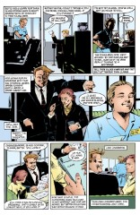

- #### Panel 2

  First known appearance of this young man, named Mark.

- #### Panel 4

  First known appearance of Kate and Garry Fletcher (named explicitly shortly).

### Page 4

> [!THUMBNAIL] 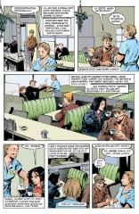

- #### Panel 2

  First known appearance of Marsh.

- #### Panel 3

  The cast is complete, with one small exception.

- #### Panel 5

  The man in the corner is John Dee, also known as Dr. Destiny, as explained in previous annotations. He possesses Morpheus's ruby, which has great power over dreams, and over reality.

- #### Panel 6

  Bette and Marsh are lovers.

### Page 5

> [!THUMBNAIL] 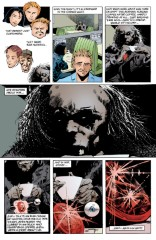

- #### Panel 6

  The object to the right of the ruby is the amulet of protection originally obtained from the demon Choronzon in [#1](sandman.01.md).
  Note that it never gets used that we are made aware of, and we do not learn what becomes of it later. It is possible that Morpheus' recovery of his helmet has nullified the trade, and so rendered the amulet powerless. Dee might be holding onto it for sentimental reasons.

### Page 7

> [!THUMBNAIL] 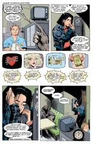

- #### Panel 2

  Rose will appear later.

- #### Panel 3-6

  "Secret Hearts" is a fictional soap opera, a genre of American daytime television primarily concerned with overblown romantic activity. Soap operas are serial in nature. "Secret Hearts" actually has antecedents in the DC universe. It was the title of an old DC romance comic. Later, Supergirl acted on the soap opera "Secret Hearts" while her strip was running in _Superman Family_. This was pre-Crisis, of course. The balloons in panels 4-6 are parodies of soap opera dialog. If one siamese twin becomes HIV positive, the other one by necessity is as well. The illustration in panel 6 is an example of how sex is used to advertise everything, even canned peas.

- #### Panel 7

  Mrs. Cavanagh has not yet appeared again. Cavanagh is more typically spelled -naugh.

### Page 8

> [!THUMBNAIL] 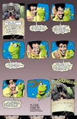

- Another fictional example of an American television genre, the children's variety show, typically featuring humans interacting with puppets, interspersed with cartoons. There is also a cultural fascination with dinosaurs that unfortunately does not extend to fascination with accuracy.

- #### Panel 7

  The instructions on how to cut one's wrists are traditional; it is allegedly easier for the paramedics to stop the bleeding if the wrists are cut straight across. Cutting down the wrist opens up the veins and arteries along a greater portion of their length.

### Page 9

> [!THUMBNAIL] 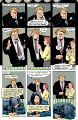

- #### Panel 7

  Donna and Judy fought at least partly because Judy struck Donna.

### Page 10

> [!THUMBNAIL] 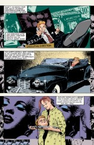

- #### Panel 1

  Mark is the young man who was waiting for the interview.

- #### Panel 2

  Garry is the male half of the Fletchers.

- #### Panel 3

  Kate is the female half.

### Page 11

> [!THUMBNAIL] 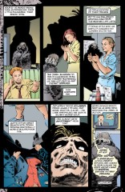

- #### Panel 3

  Stephen King is an American best-selling writer who popularized the horror genre in the last two decades.

- #### Panel 4

  One of the buttons on Judy's jacket appears to read "Sex Pletch." This is likely to mean "Sex Pistols," one of the early British punk bands.

### Page 12-13

> [!THUMBNAIL] 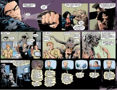

- #### Panel 1

  This is a double page spread. Dyke is slang for lesbian.

- #### Panel 3

  Marsh's attitude is also the same as a great many Americans.

- #### Panel 5

  Mark is cutting off his left index finger. The word "GOD" has appeared on Dee's chest.

- #### Panel 6

  This is a right hand passing the severed finger to Dee so it might be Mark's hand. Notice, however, the placement of the fingernail on the hand's index finger, an anatomical impossibility.

  A comment on this by eddietomb@yahoo.com:

  > This is actually not the right hand's index finger. It is meant to be a continuation of the severed finger, which bends 45 degrees at the point where the thumb is holding it. The fact that it seems to be drawn as the right hand's index finger is probably a mistake of the inker.

- #### Panel 9

  Fundamentalism is a sect of Christianity which believes in the literal word of the Bible. Armageddon is the prophesied end of the world.

- #### Panel 10

  First known appearance of "The Amazing Herschel and Betty".

- #### Panel 12

  "Rays" [from outer space] are a popular component of many
  crackpot conspiracy theories.

- #### Panel 13

  It is generally perceived that local television news broadcasts are light and fluffy, with no concentration on hard news, where a transition from an end of the world story to a tap-dancing duck story is neither ironic nor unnatural.

### Page 14

> [!THUMBNAIL] 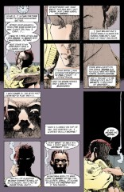

- This is Kate speaking. Sex with dead people is called necrophilia. It is not clear to me whether a male corpse could have an erection that could achieve penetration, or if in fact penetration even occurred. In panel 8, it is to be assumed that Kate tasted or drank the corpse's blood.

### Page 15

> [!THUMBNAIL] 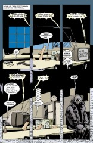

- The theme music is indeed correct for the 60s television show "The Addams Family"

- #### Panel 1

  The hammer and nails will become important shortly.

- #### Panel 4

  The balloon referring to a "bastard" is the only one I'm willing to try to identify as belonging to Judy. The rest are mostly miscellaneous love-making grunts, and unidentifiable.

- #### Panel 4-6

  The text in the background is mostly unreadable except for occasional short words like "BIG". At the bottom, the text reads, more or less "...sheep come walking [scratched out misspellings of "knocking"] knocking toking on my clocking electric dreams of t.v. screens fiends of chiefs and cheese and late-nit[e]/commercials that don't make sense walking in electric dreams and robots dreams of comic book canibal [sic] sheep/wolves emty [sic]/ ...coats...tether [?] and wandering floors with water and silks"

### Page 16

> [!THUMBNAIL] 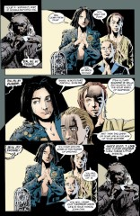

- In this sequence, the three women take the roles of the Hecateae, reintroduced in [issue 3](sandman.03.md). Dee repeatedly demands a prophecy until he hears what he wants to hear. Notice that Judy has lost her shirt, which is consistent with Judy being involved in the sex scene on the previous page. Also note that the women are arranged in a maiden/mother/crone order.

- #### Panel 3

  Kate seems to be referring to Arkham Asylum here, where John Dee just came from. Bette is in the role of Atropos, who cuts the thread of each person's life as it ends, in Greek mythology.

  While the clock image has appeared previously, I direct you to [Sandman Issue #10](sandman.10.md#page-19) "the Doll's House", page 19 panel 1. The ceiling is a giant watch /clock, implying a connection between time and the Hecatae. Since the three women in [issue #6, page 16](sandman.06.md#page-16) are playing the role of the Hecatae, they are giving a watch/clock as well.

### Page 17

> [!THUMBNAIL] 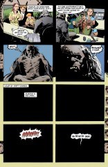

- #### Panel 5,7

  No one dies here. We clearly see all six people in the diner alive on page 19.

### Page 18

> [!THUMBNAIL] 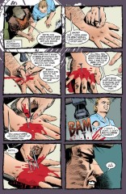

- Notice that Bette is holding the nails while Marsh does the hammering, with his left hand.

- #### Panel 3

  Marsh confesses to providing an alcoholic with an almost unlimited supply of alcohol. He is correct in saying that this is tantamount to murder.

- #### Panel 8

  Marsh confesses to having purchased Bette's son while in jail for purposes of sodomy.

### Page 19

> [!THUMBNAIL] 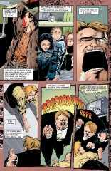

- This page more or less describes typical mammalian pack behavior.

- #### Panel 6

  The television quote is the radio tag for "The Wolfman."

### Page 20

> [!THUMBNAIL] 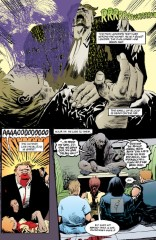

- #### Panel 2

  It appears that Mark is really dead.

- #### Panel 3

  Dee is recounting the fairy tale of Snow White. He has regressed the audience to childhood.

### Page 21

> [!THUMBNAIL] 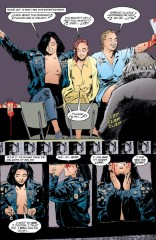

- #### Panel 1

  The song is named something like "Spread a Little Happiness;" it is an old British popular song from the interwar era. It's played on BBC radio 4 and used in a commercial for butter. The rock star Sting later recorded a version that appears on the soundtrack to the movie _Brimstone and Treacle_.

- #### Panel 2
  Judy stabs herself in the eyes with cooking skewers.

### Page 22

> [!THUMBNAIL] 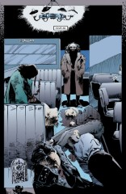

- The sign in the upper left reads "Please and Thank You are the magic words."

### Page 22

- #### Panel 1

  In the lower left corner there is an old clock. Exactly the same clock can be found in [Sandman #4](sandman.04.md) ("A Hope In Hell") on page 11, panel 3, also in the lower left corner.

### Page 24

> [!THUMBNAIL] 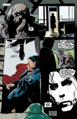

- #### Panel 2

  The skewers are no longer in Judy's eyes.

- #### Panel 4

  Morpheus has recovered from his trauma in the previous issue and has made his way to where his ruby is.

- #### Panel 6

  "Waiting for the End of the World," which did not actually wind up as the title of [Sandman #7](sandman.07.md) ("24 Hours"), is a song by Elvis Costello on his first album, "My Aim Is True." This is the same songwriter Neil will quote in the title of Sandman # 37, ". . . I woke up and one of us was crying." Neil's Elvis Costello titles perhaps follow Rick Veitch's Swamp Thing title " ... we could be diving for pearls".

## Credits

- Originally collated and edited by Greg Morrow.
- Tom Galloway <tyg@dip.eecs.umich.edu> identified Earl Wilson and previous DC incarnations of "Secret Hearts."
- Viktor Haag <vehaag@crocus.waterloo.edu> identified "Sex Pletch" and the cooking skewers.
- Theresa Martin <thmartin@berry.rutgers.edu> pointed out the young/mature/aged roles of the three women on page 16.
- Col. Sicherman <gls@windmill.ATT.COM> identified the "Wolfman" quote.
- Michael Seymour Collins <mcollins@isis.cs.du.edu> and Ted <faber@loon.cs.wisc.edu> conspired to identify "Spread a Little Happiness."
  Michael even claims to be able to sing it, so be sure to nag him about it next time you see him. Hey, can we get him a gig with "Seduction of the Innocent"?
- Rob Bakie <slinkie@milton.u.washington.edu>, Viktor, Michael, Eddy Current <ecurrent@zooid.guild.org>, and Lima Bone <limabone@zooid.guild.org> combined to educate us all on the nature of "Rude Girls", the British punk scene and ska music.
- Theresa Martin <thmartin@berry.rutgers.edu> transcribed the words in the vertical gutters of page 15, but I discarded them as being devoid of import.
- Tanaqui C. Weaver <tweaver@isis.cs.du.edu> speculated about the uselessness of the amulet.
- Kai'Ckul <oshinsky@webspan.net> for the bits about Rudies and Joy Division.
- Ralf Hildebrandt added lots more details
- eddietomb@yahoo.com gave more detail on Joy Division, and the severed finger
