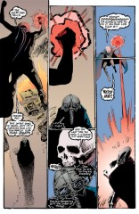

> [marginThumb] 

# Issue 7: "Sound and Fury"

##### Neil Gaiman, Mike Dringenberg, and Malcolm Jones III

- Seventh part of first storyline, _More than Rubies_
- Seventh story reprinted in _Preludes and Nocturnes_
- Audible Act I Chapter 7
- Netflix Episode 5 (second half)

**Title**: "Sound and Fury" is probably a reference to a line from Macbeth.
Since I have it online, here's a more complete excerpt:

> She should have died hereafter, there would have been time for such a word. Tomorrow and tomorrow and tomorrow creeps in this petty pace from day to day to the syllable of recorded time; and all our yesterdays are lighted fools....the way to dusty death. Out, out brief candle. Life is but a walking shadow...a poor player who struts and frets his hour upon the stage and is heard no more. It is a tale told by an idiot, full of sound and fury.....signifying --- nothing.
> -- Macbeth Act 5, Scene 5

This story had been teased in the previous issue as having the title "WAITING FOR THE END OF THE WORLD..." which is the name of a song Elvis Costello wrote for his debut album, "My Aim is True". The first verse, here liberally typeset to convey Elvis' rather brutal intonation, shares much of the story's tone, especially perhaps the "murder in the dark" sequence.

> The man from the television crawled into the train: I wonder who he's gonna stick it in this time - now, everyone was looking for a little entertainment, so they probably put his hands up when they found out his name, and then they SHUT DOWN THE POWER ALL ALONG THE LINE, and we got Stuck in the tunnel where NO LIGHT SHINES, they got to TOUCHING ALL THE GIRLS who were TOO SCARED to call out, Nobody Was Saying Any Thing At All and we were WAITING FOR THE END OF THE WORLD, WAITING FOR THE END OF THE WORLD, WAITING FOR THE END OF THE WORLD, DEAR LORD! - I SINCERELY hope you're coming 'cause ya . . . really started something!

### Page 1

> [marginThumb] 

- These people are walk-ons.

### Page 2

> [marginThumb] 

- #### Panel 3

  First known appearance of Nan Fowler. She will make a one-panel appearance later in this issue.

### Page 3

> [marginThumb] 

- The two people are Morpheus (standing) and John Dee. See previous annotations for what's going on.

### Page 4

> [marginThumb] 

- #### Panel 5

  _Death Takes A Holiday_ was a play during the 1920s and a black-and-white movie from the 1930s with Fredric March in the title role.
  Death appears for one night, during which nothing dies, as the "Prince Sirki."

- #### Panel 7

  > [audible] The narration again gives deeper knowledge here, namely that the ruby was created back when the Earth was cooling from a molten state.

### Page 8

> [marginThumb] 

- #### Panel 5

  The button "Norman Lives" is probably a reference to Norman Bates, a main character in the movie [Psycho](http://uk.imdb.com/Title?0054215) and its sequels. [Psycho](http://www.amazon.com/exec/obidos/ASIN/0812519329) was first a book written by Robert Bloch, who wrote sequels ([Psycho II](http://www.amazon.com/exec/obidos/ASIN/0812500334) and [Psycho-Paths](http://www.amazon.com/exec/obidos/ASIN/0812503406)) to it rather later, the first shortly before the release of [Psycho II](http://uk.imdb.com/Title?0086154). The last book seems to have been [Psycho House](http://www.amazon.com/exec/obidos/ASIN/0812509196); Bloch died 23 September 1994. A recent [remake of Psycho](http://uk.imdb.com/Title?0155975) was released 1998.

### Page 9

> [marginThumb] 

- #### Panel 2-3

  Dee enters the Dreamtime dressed as Julius Caesar; the three ladies are probably not the Hecateae, but are simply denizens of the dreamtime. Shakespeare's play _Julius Caesar_ does not include a dream such as Dee's.

### Page 10

> [marginThumb] 

- #### Panel 1

  A larger bit of the title quote.

- #### Panel 2

  There is a picture in the background, probably of Ethel Dee, John Dee's mother. The photo is the same which appears in the [Sandman #1](sandman.01.md), p.15, panel 3 and 4, in hands of Ruthven Sykes, and then in the [Kindly Ones #6](sandman.62.md), p.22, panel 5, and p.23 panel 6, in Alec's Burgesses' bedroom on his bed table, which could suggest that she was Alec's mother, and John Dee and Alec would be half-brothers. The inscription on it is "To Roddy (Roderick Burgess) your slave in love Ethel 1927".

- #### Panel 4

  "Beware the Ides of March" is the admonition given to Caesar at the beginning of Shakespeare's play _Julius Caesar_. The Ides of March are the fifteenth day of that month, the day on which Caesar was killed by the conspirators. The women are now wearing Dream's helmet. Normally when classical studies refer to Shakespeare's plays they use to compare Macbeth with Oedipos Tyrranos by Sophocles. Please note: we have here quotations from Macbeth and "edipian" dream of raping the mother. And John Dee is a Ceasar, like Oedipos was king, as a John Dee forgets that he is a creature of dreams and claims himself the king. Note also that his name Destiny is linked with central issues of Macbeth (there we have Ethel as three witches), exactly as the in the case of Oedipos the King. And finally the quote which you brought out of Macbeth is commonly compared with the quote from Oedipos the King, the intervention of choir in the piece. Unfortunately I don't have it in English, but maybe you can find it. It is the last speech of the choir, which takes place after Oedipos discovered all the truth about him and left in the direction of the palace.

- #### Panel 4; page 11 panel 1

  Dee is undergoing the free association often experienced in dreams as the phrase mutates from "Ides of March" to "March of Ideas" to "Brides of Frankenstein". The women now resemble the Bride from the movie "Bride of Frankenstein".

### Page 14

> [marginThumb] 

- #### Panel 1

  "Stinkard lord of piss and mire" sounds like it should be a quote, but no references can be found.

### Page 15

> [marginThumb] 

- #### Panel 1

  It would appear that Eve is in fact the Raven Woman of [issue #2](sandman.02.md). Note the raven. Eve has previously appeared in the DC humor mag _Plop!_ in the 1970s, along with Cain and Abel.

- #### Panel 2

  "Rag-shag Lord of Nowhere-at-all" sounds like a quote

- #### Panel 3

  These three characters are, left to right, Abel, Cain, and Gregory, for whose descriptions see the annotation to [issue #2](sandman.02.md).

- #### Panel 4

  "Spittle-arsed poxy-pale wanker" is a peculiarly British thing for Dee to be saying. An arse is an ass; poxy is probably related to the diseases of smallpox and chicken pox, or possibly to any of a variety of venereal diseases. A wanker is a self-important idiot; "wanking off" is masturbation, so a wanker is one who prefers masturbation to sex. A North American would probably use "asshole."

- #### Panel 5

  Destiny was the host of one of DC's mystery titles in the late 70s or early 80s. The first appearance of Destiny was specifically Weird Mystery Tales #1. He has also appeared in _Elvira's House of Mystery_. Marv Wolfman used him for appearances in _Superman_ (Superman#352) and _The New Teen Titans_.

  In these, it was established that he was more powerful than Superman and not obligated to obey Zeus or Kronos. The character may have had his genesis in the 1960s edition of _The Spectre_. In issues #8-10, the Spectre made some grievous error and was chained by the mysterious voice that resurrected him to a "book of destiny". He was forced to follow mortals around and try to get them to change their destiny, which was written in the book. In effect, the Spectre was demoted to "pseudo-horror anthology host." It has been theorized that Destiny was created from inventory stories for this incarnation of the Spectre; all it would require was slight redrawing, some relettering, and a new color scheme. Destiny was mentioned in [Sandman #1](sandman.01.md) as one of the "Endless", of whom we will see more later.

### Page 16

> [marginThumb] 

- #### Panel 1

  In the early part of this century, the sham magician Aleister Crowley revived the earlier alternate spelling "magick" to lend an air of mystery to his flummery. Crowley is roughly equivalent to Roderick Burgess, of [issue #1](sandman.01.md).

### Page 23

> [marginThumb] 

- #### Panel 2

  This is the Scarecrow, Jonathan Crane, who was explained in [#5](sandman.05.md). They are in an asylum for the criminally insane, Arkham Asylum, which also was explained earlier in this series.

- #### Panel 7

  "There's no place like home", is a quote from "The Wizard of Oz", which also had a scarecrow in it.

### Page 24

> [marginThumb] 

- #### Panel 3

  "Mister Dent" is Harvey Dent, the Batman villain Two-Face, a long-term resident of Arkham. Dent is a sort of multiple personality, and might easily decide to try to kill himself.

### Page 25

> [marginThumb] 

- #### Panel 1

  This is Nan Fowler again, whom we saw on page 2.

## Credits

- Originally collated and edited by Greg Morrow.
- Jeremy Louis Billones <billoj@rpi.edu>, Viktor Haag <vehaag@crocus.waterloo.edu>, and Chris Jarocha-Ernst <cje@heart.rutgers.edu> identified _Death Takes a Holiday_.
- Viktor thinks that Dee's appearance as Caesar refers to Shakespeare's play. And he defined "wanker." David Henry <UD137927@VM1.NoDak.EDU> recalled the Bard's Caesar, and thinks that Dee's appearance has little to do with that play..
- Abhijit Khale <akhale@cayuga.Stanford.EDU> and Chris delved into Destiny's background.
- Andrew David Weiland <aw1s+@andrew.cmu.edu> thinks "the pox" is VD.
- Ian Lance Taylor <ian@airs.com> clarified "magick" a bit.
- Ralf Hildebrandt added many more details
- Richard Munn added another note from the Audible narration, and failed to find any obvious reference to the "Stinkard Lord" line.
