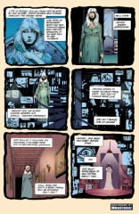

> [marginThumb] 

# Issue 12: "Playing House"

##### Neil Gaiman, Chris Bachalo, and Malcolm Jones III

- Third part of long storyline _The Doll's House_
- Fourth story reprinted in trade paperback _The Doll's House_
- Audible Act I Chapter 13
- Netflix Episode 8

### Page 1

> [marginThumb] 

- #### Panel 1

  Lyta Hall. See previous annotations.

- #### Panel 3

  The images here are much clearer in the original comic than in the trade paperback reprint. Images on the tv screens include the smiley face button from "Watchmen"; the Beatles, from the cover of their second album, titled "Meet the Beatles" in the US, and "With the Beatles" in the UK; a Jack-o'Lantern, which is a carved pumpkin, associated in the United States with Halloween and a version of the supernatural; the hand (with a 28 on the palm) and arm of the character Takashi from the Japanese comic "Akira;" above Takashi, a fetus, possibly from some famous picture; a skull; above the skull, someone possibly eating a Twinkie, or performing fellatio (it's hard to tell); to the right of the skull, a miniature of this very panel; Mount Rushmore; an unidentified face, possibly one of the artists; an unidentified figure with a knife or sword, possibly on the moon (note craters?); an atomic explosion; Batman, with a giant "Ha Ha" behind, possibly from the tv series.

- #### Panel 4

  The buttocks and upper thighs of a woman wearing lingerie; a stegosaurus; Albert Einstein; Groo the Wanderer (from the comic book); an op-art piece; the Statue of Liberty; Friedrich Nietzche; Sigmund Freud; Neil Gaiman (no, it's not Ric Ocasek); an unidentified hand and arm; an unidentified woman; Judge Dredd (from the English comic book); another unidentified person; a possibly Satanic figure.
  Hand and arm remind vaguely of detail in Picasso's _Guernica_.

- #### Panel 6

  An unidentified eye; an unidentified person; Despair (upside down); Tom Baker as Dr. Who (from the English television series); an unidentified face (below Baker); a Joker playing card (particularly resembling the Batman villain). To Joker's right, zoom-out of someone performing fellatio as seen in panel 3.

### Page 2

> [marginThumb] 

- #### Panel 1

  Hector (Sandman) Hall and Brute and Glob. See previous annotations.

### Page 3

> [marginThumb] 

- #### Panel 6

  This is indeed what the 1970s Sandman's HQ looked like.

### Page 4

> [marginThumb] 

- #### Panel 4

  Hector has regressed to childhood. This is why he and Lyta no longer make love (page 1 panel 3). This may metaphorically represent the difference between comics as they were (Hall) and comics as they are now (Lyta).

### Page 6

> [marginThumb] 

- #### Panel 1

  The last few issues of the 1970's _Sandman_ (not writted by Jack Kirby) had Jed's grandfather dying, and the boy moving in with an abusive aunt and uncle, and their even lower children. So the first appearance of Barnaby and Clarice would be in that _Sandman_, #5 or #6.

### Page 7

> [marginThumb] 

- #### Panel 3

  Dream cannot kill a dreamer, except in one circumstance which is explicated later. From [issue 9](sandman.09.md), we learned that an Endless cannot love a mortal without severe consequences. We will learn several other constraints on the Endless in this storyline.

### Page 9

> [marginThumb] 

- #### Panel 3

  The other, more typical, meaning of "come out of the closet" is, of course, to declare one's homosexuality.

- #### Panel 4

  Gaiman may be obliquely referring to the fact the Fury's mother was original the Golden Age Wonder Woman, who was retconned out of existence by Crisis. Or he may be referring to the patch Roy Thomas did by creating the Golden Age Fury in The Young All-Stars. GA Fury mothered Lyta and then vanished, although this was never made particularly clear.

### Page 10

> [marginThumb] 

- #### Panel 4

  It's not immediately clear what Brute and Glob's end plan actually was - to take over The Dreaming itself?

### Page 11

> [marginThumb] 

- #### Panel 3

  "Cereal" ain't exactly the right spelling for _these_ conventioneers.

- #### Panel 8

  **The guest list reads**: The Bone [squiggle], Brother Chip, the California Widow, The Candyman, Christian, Cincinnati Oyster (Oyster may be a synonym for testicle here), The Corinthian, the Devil (Kentucky), the Devil (Oregon), Dog Soup, The Dutch Uncle, The Faggoteer, The Family Man (about whom more in a later issue), and the Fl\*sher (almost any vowel, "a" and "e" most probable, followed by "u"). Later, we will meet Dog Soup in person. A Dutch Uncle is someone who speaks frankly, usually offering unwanted advice in a brutally truthful manner, implying naivete on the part of the recipient. "Rocky Mountain Oysters," also "Kansas City Oysters," refer to testicles, usually obtained as a result of castration to improve an animal as a meat source. The Cincinnati Oyster may very well remove or eat the testicles of his victims.

### Page 12

> [marginThumb] 

- #### Panels 4-5

  If you squint really hard, the wall reads "Who Watches the Watchmen?", which was the tagline for Alan Moore's and Dave Gibbons's _Watchmen_ series, an extremely important series about superhumans and the Cold War. This phrase was originally coined by Platon.

### Page 13

> [marginThumb] 

- #### Panel 3

  The Corinthian has hungry eyes. What's going on here will become more clear later.

### Page 16

> [marginThumb] 

- #### Panel 4

  I believe that the ultra-sonic whistle was in fact a weapon of the original 1970s Sandman. Hey, it was Kirby. You want sense, read a newspaper. You want thunder and fury, read Kirby.

### Page 18

> [marginThumb] 

- #### Panel 2

  The Sandman Companion points out, this is the _only_ time we hear Dream really laugh.

### Page 19

> [marginThumb] 

- #### Panel 2

  Is it the door reversely put, compared to previous panels or is it my idea?!

- #### Panel 3

  It's not really clear here, but this is the tragic and lamentable death of Barnaby and Clarice.

### Page 20

> [marginThumb] 

- #### Panel 4

  [Garrett Sanford](<https://dc.fandom.com/wiki/Garrett_Sanford_(New_Earth)>) was the second DC Comics Sandman created, created by Simon & Kirby in the 70s. He was replaced in the 80s by Hector Hall.

- #### Panel 9

  Note that Jed is younger, like he is in his dreams (see [Issue #11](sandman.11.md)).

### Page 21

> [marginThumb] 

- #### Panel 4

  **Hippolyta**: When Fury was the daughter of the original Wonder Woman, being named for the queen of the Amazons made sense. Post-Crisis, of course, nothing made sense.

### Page 22

> [marginThumb] 

- #### Panel 6

  > [audible] In an addition here, in the Audible version Dream sees Jed hiding at the top of the stairs and tells him he's free to go. He knows that Rose is looking for him, but makes no attempt to get involved. Again we see he wasn't overly concerned about the welfare of mortals (such as the safety of this small boy who's lost everything) - he was only really concerned about stopping the machinations of Brute and Glob.

### Page 23

> [marginThumb] 

- #### Panel 6

  Note that Dream says he has a **prior engagement**.

### Page 24

> [marginThumb] 

- Oopsy. Jed's fled, and soon he'll be dead, 'cause that's the Corinthian who picked him up. Big coincidence? Not really; there's a vortex wandering around totally screwing up causality, and both Jed and the Corinthian are directly linked to her.

> [oops] The text under the bottom panel was missing in the original editions (Gaiman said someone in Editorial must've removed the text, thinking it a mistake), later changed to "Next: Men of Good Fortune", and was finally corrected back to what Gaiman put in the script in the first place: "Next: The Prior Engagement." Referring to what Dream said on the previous page, and the events that will come in [Issue 13](sandman.13.md).

## Credits

- Originally collated and edited by Greg Morrow.
- William Sherman (sherman@oak.math.ucla.edu) reminded me to look at the screens on page 1 and identified most of them. Shannon D. Appel (appel@soda.Berkeley.EDU) also helped. William also saw the graffiti on page 12.
- CHARLES JORDAN (jordan@castor.cs.uga.edu) suggested the interpretation of Lyta and Hector no longer making love.
- Steve Simmons (scs@lokkur.dexter.mi.us) explicated the euphemistic use of "oysters."
- Tom White (twhite@mozart.amd.com) and David Goldfarb (goldfarb@ocf.berkeley.edu) confirmed Barnaby and Clarice's earlier existence.
- David cited _Amazing Heroes_ magazine as his source.
- Volker Sorge, via <Peter.Bruells@arbi.informatik.uni-oldenburg.de> identified Nietzsche.

- Joel Tscherne (ac985@cleveland.Freenet.edu) corrected the Beatles' album chronology, fully explicated here:

  > Meet The Beatles/With The Beatles was not their first album. The first British album was called "Please, Please Me" and was released in the U.S. as "Introducing The Beatles" on Vee-Jay records. Meet The Beatles was the first Beatles record in the U.S. on Capitol Records. With The Beatles was their second British album. The two albums share the same covers, but the tracks do not match exactly.

- Ed (The Anti-Dave) (Dave Stobbe <dave.stobbe@canrem.com>) explained the metaphorical significance of a Dutch Uncle.
- Ralf Hildebrandt added more details.
- Richard Munn questioned Brute and Glob's motivations, noted Dream's laugh, the second Sandman, Dreams lack of consideration over Jed, and the Prior Engagement.
