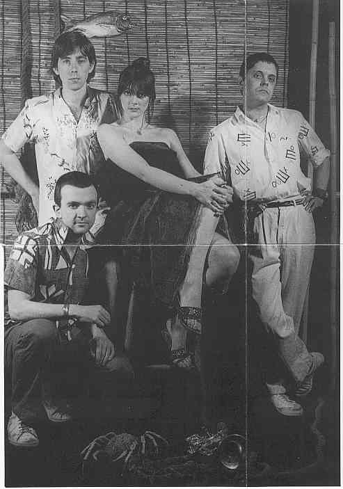
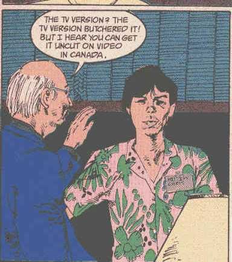

# The Annotated Sandman

## Issue 14: "Collectors"

##### Neil Gaiman, Mike Dringenberg, and Malcolm Jones III

Fifth part of long storyline _The Doll's House_
Seventh story reprinted in trade paperback _The Doll's House_

### Page 1

We are back to the real storyline after last issue's side trip, in Dodge County, Georgia. The motel where the conference is held has a sign outside which says: "Cereal Convention", the pun being obvious.

- #### Panel 4

The song is "Lydia the Tattooed Lady" as sung by Groucho Marx in one of the Marx Brothers movies.

### Page 2

- #### Panel 1

**and others**: Notice how the bits of con-goer talk always includes some slangy reference to death: "Journey was a real killer." "Wouldn't be seen dead here." And so on.

- #### Panel 2

The song is "These Boots Were Made for Walking", sung by Nancy Sinatra.

### Page 3

- #### Panel 1

More about the Family Man on page 9.

- #### Panel 3

The "I am John's coathanger" routine probably refers to a series of articles Reader's Digest once did, in the 50's, with titles like "I Am John's Kidneys", "I Am John's Liver" and so on. They were narrated from the point of view of the parts of a human body, and gave an informal introduction to what these organs were about, what was harmful to them, and so on. The coathanger very likely refers to the titular method of back alley abortionists. Scarlett O'Hara was the heroine of the novel/movie _Gone with the Wind_ and the reprehensible sequel _Scarlett_.

- #### Panel 4 On the right is Chris Carter from the proto-Industrial group Throbbing Gristle (not Cc creator of the X-Files)

 

### Page 4

- #### Panel 2

This is the manager, who is unimportant. The nebbishy guy that's been running around with the clipboard is "Nimrod", named after a great Biblical hunter. Notice that the manager displays and is reading bondage pornography in contrast with his "I run a clean place" speech.

### Page 6

- #### Panel 3

G.K. Chesterton, after whom Gilbert is modeled, was fond of paradoxes.

- #### Panel 4

Confirmation that Barnaby and Clarice were killed in _Sandman_ #12.

### Page 7

- #### Panel 1

Gilbert's claim about Perrault is in fact inaccurate, in a most strange way.
As near as I can figure, Gaiman had done his research, but confused things a little. The original oral tale, one with variations to be found as far away as China, most probably ended with strong sexual connotations, but with the girl surviving and killing the wolf. Perrault, the first to write a variation of the story down, quite likely was the first to _change_ the ending to the down note of the wolf eating the girl (however, he added a witty poem at the end which explained and illuminated the preceding unhappy tale; Perrault also added the red cap). The Grimm brothers combined a variation of Perrault's with the ending of another tale in which the the prey escapes _from_ the belly of the predator. However, many other folk tales _were_ prettified by writers.

Funland does and says some of the same stuff as the story when he attacks her on page 29 (calling her a slut, telling her she won't need her dress any more, etc.)

### Page 8

- #### Panel 6

How could get it worse? Cannibalism, pedophilia, being eaten by wild animals? No, I don't want to know.

### Page 9

- #### Panel 1

The Corinthian. We'll find out what happened to Jed later.

- #### Panel 3

First known appearance of Fun Land, whose story we get later this issue.

- #### Panel 7

The Family Man can't make it because he is busy with John Constantine in _Hellblazer_ about this time. We may note that he did not even get an invitation, due to John's interference with his contact.

### Page 10

- #### Panel 4

By now, it should be very clear that this is a convention of serial killers. With the exception of the Corinthian, none of these killers have appeared before or since. The convention itself is a parody, of sorts, of genre conventions, such as comic or sf cons.

### Page 11

I cannot identify any of these pictures. I suspect that they include famous serial killers of the past.

### Page 12

- #### Panel 1

**Definitely not women**: Most serial killers are white males, most of whom kill women, because of sexual hangups. The inference is that Nimrod "collects" women.

- #### Panel 2

And evidently he keeps their bodies. Yuck.

### Page 14

- #### Panel 2

**The list reads**: Don't Look Now, The Collector, Manhunter, From the Life of the Marionettes, In Cold Blood, Compulsion, Straight on till Morning, ? on Scream[ing?], Night of the (?). _Don't Look Now_ -- made in 1973, is related to a short story by Daphne du Maurier, which has a grisly end -- a good and scary. Here's the [factsheet from E! Online](http://www.eonline.com/Facts/Movies/0,60,4977,00.html) and the [IMDb](http://uk.imdb.com/Title?0069995). _Manhunter_ is a movie based on the Thomas Harris novel _Red Dragon_, featuring a serial killer. Harris wrote another, better book, which was made into another, better movie about a serial killer, _Silence of the Lambs_. _In Cold Blood_ is probably the film version of Truman Capote's book about the killers Perry Smith and Richard Hickock. They killed a family named Clutter in Holcomb, Kansas, in 1959 and were later executed. The first incomplete title may be _Carry on Screaming_, while the second is _Night of the Hunter_, a movie starring Robert Mitchum and directed by Charles Laughton. Presumably, all of the movies have something to do with serial killers.

- #### Panel 3

_The Collector_ is a book by John Fowles, made into a movie directed by William Wyler. It is the story of a butterfly collector who abducts a young woman and imprisons her in his basement.

- #### Panel 5-7

The Bogeyman appeared, and was killed, in _Swamp Thing_ #44. His shtick was as described here.

### Page 15

- #### Panel 1

The inference is that he makes the neckties out of human skin, which would tend to make them the same pale color (assuming he restricts himself to his own race, as serial killers are wont to do).

- #### Panel 5-6

The name broken across two panels is "Hello Little Girl", the inference being that his obsession is young girls.

### Page 16

- #### Panel 4

The Corinthian is correct regarding the Bogeyman's fate.

- #### Panel 6

Gilbert recognizes the Corinthian. Hmm.

### Page 17

- #### Panel 4

The inference is that Gilbert has written the name of Dream.

### Page 18

- #### Panel 1

Many serial killers claim to be motivated by God.

### Page 19

- #### Panel 7

"Needs must, when the devil drives" is a quote. Rabelais may have it in this particular form. It appears slightly altered in Shakespeare, _All's Well That Ends Well_, Act I, Scene 3, Lines 27-30:

> COUNTESS Tell me thy reason why thou wilt marry. LAVATCH My poor body, madam, requires it. I am driven on by the flesh, and he must needs go that the devil drives.

It has often appeared in comics, notably in one of _Swamp Thing_ ##25-27, when Etrigan appeared.

- #### Panel 8

This is the Corinthian's car, and there's something in the trunk.

### Page 21

- #### Panel 1

Fun Land's remark: many serial killers have unusual or parasitic relationships with single mothers. Neil Gaiman says the song is Timbuk 3's "Standard White Jesus" from the _Edge of Allegiance_ album.

- #### Panel 2-5

The inference is that this is Disney World, or some similar theme park. Conspiracy nuts love the idea that Disney hushes up murder at its parks.

### Page 22

- #### Panel 1-3

The song is "Venus in Furs", by the Velvet Underground.

- #### Panel 4

Notice how Fun Land's hat makes him look like a wolf? And his t-shirt has a wolf as well. This is in reference to the "Red Riding Hood" story. His hat is also a parody of the famous Disney mouse ears.

- #### Panel 5

"Moon River" probably refers to the song of that title, made famous by Andy Williams.

- #### Panel 6

The inference here is that Fun Land wants to hunt.

### Page 23

- #### Panel 6-7

The inference is that the preoperative transsexuals are male-to-female only. Preoperative transsexuals of this sort take female hormones so that their breasts enlarge and their bodies become more female in appearance, but they retain their male genitals. Many such, in fact, finance their last operations by appearing in specialty, so-called "she-male", pornography. In panel 7, the victim's "left-lean" penis appears in silhouette.

### Page 24

- #### Panel 3

The song is "Wild Thing", by the Troggs.

### Page 26

- #### Panel 2

A "grass widow" is a divorced woman or a woman who is separated or often separated from her husband.

- #### Panel 3

"There is no sanity clause" is a pun. Santa Claus is an American mythic figure associated with Christmas, and American and British common law make special provisions for insane criminals.

**Will Hooper notes**:

> Serial killers do not meet the criteria for a NGI (Not Guilty by reason of Insanity) plea, that criteria being that, due to mental illness, the accused was incapable of discerning the difference between right/wrong or legal/illegal. Serial Killers, or Serial Sexual Psychopaths (Sociopaths,) are quite able to see that their actions are illegal; they simply don't care. As examples, look to Ted Bundy (jailed, then executed), John Wayne Gacy (jailed, then executed), and Jeffrey Dahmer (jailed, murdered in prison.) The reason I am familiar with this stuff is that my father is a forensic psychiatrist, and he works at a secure hospital for the criminally insane. One of the major components of his job is evaluating and testifying about the mental state of accused violent offenders, and treating NGI patients in the hospital.

The Candy Man's statement is, of course, ironic in the extreme, since he's ignoring the _slight_ abnormality of _killing_.

Fans of "there is no sanity clause" are advised to look at the Marx Brothers film _A Night at the Opera_, as well as in Walt Kelly's comic strip _Pogo_. We may note that Neil Gaiman is alleged to have a Groucho bust in his office, and likes to work with late night movies on, so it's a good bet that he was inspired by _Opera_.

- #### Panel 4

It is probably not a coincidence that the disturbed young man refers to cats as "pussies", that also being a slang term for the vagina.

### Page 27

- ####middle top.

Of course women are naked under their clothes.

### Page 28

- #### Panel 1

In the original comic edition, some speech balloons fell off the original art. They were restored in the trade paperback reprint. The young man with Fun Land is talking, and the missing balloons read:

> I dunno. I thought maybe if I came here, I'd meet some other people with the same problem. People I could _talk_ to, who'd understand. Who'd _help_ me. But no one else has really been _interested_.

Thus revealing great irony in Fun Land's subsequent absconding.

### Page 29

- #### Panel 1

Fun Land decided to go hunting after all.

- #### Panel 2

"It's a Small World" is a very annoying song played over and over again at Disneyland and Disney World.

### Page 31

- #### Panel 4

Funland's dream has points in common with Oscar Wilde's story "The Selfish Giant".

### Page 32

- #### Panel 4-5

These incidents and variations of them have actually taken place in the US and possibly elsewhere.

### Page 34

- #### Panel 1

We may recall that the Corinthian's mouth-eyes were seen in _Sandman_ #10 when Lucien is giving Dream the census results.

### Page 36

- #### Panel 6

Gilbert has found Jed, who is what was hidden in the Corinthian's trunk. Boot is British for trunk.

## Credits

- Originally collated and edited by Greg Morrow.
- Tom White <twhite@mozart.AMD.COM> found the issue of _Swamp Thing_ with the Bogeyman and checked _Hellblazer_ for the Family Man. He also identified _In Cold Blood_. And noted a part of the origin of Fun Land's hat. Stop this man before he annotes again!
- Paul N Watts <watts@csa2.lbl.gov> identified the partial movie titles and the song on page 22.
- Dennis C Hwang <hwa5@midway.uchicago.edu> identified _Don't Look Now_.
- Col. G.L. Sicherman <gls@windmill.att.com> and Theresa Martin <thmartin@remus.rutgers.edu> identified "Lydia".
- Subrata Sircar <sksircar@phoenix.Princeton.EDU> explained the significance of the manager's hobby and also found the _All's Well That Ends Well_ quote.
- Steve Simmons <scs@lokkur.dexter.mi.us>, Marcus Brazil <matmnb@lure.latrobe.edu.au>, and Hannu Pajunen <hannu@polaris.utu.fi> identified _The Collector_.
- The Colonel, Alex (Chaffee?) <chaffee@reed.edu> and Paul Lee <claris!qm!Paul_Lee@ames.arc.nasa.gov> found various incarnations of the motoring devil quote. The Colonel and Tom Galloway <tyg@caen.engin.umich.edu> found citations for the sanity clause. Tom also recalled the incidents the Corinthian remarks on.
- Jim W Lai <jwtlai@watcgl.waterloo.edu> scrutinized page 23 to find those hidden genitals. Where is that Waldo, anyway? He also checked "grass widow" out.
- Theresa Martin <thmartin@remus.rutgers.edu> recalled the census results of issue #10.
- Neil Gaiman himself, as relayed by Tanaqui C. Weaver <cen@vax.oxford.ac.uk> identified the Timbuk 3 song, and pointed out the literary antecedents of Fun Land's dream.
- William Sherman <sherman@math.ucla.edu> chimed in with a late identification of "Lydia"; identified the coathanger routine; corrected the Capote reference; and sang "Moon River" for us.
- Beth Winter <renfri@astercity.net> for the Don't look now reference.
- bignickl@swbell.net noted Chris Carter's cameo.
- Ralf Hildebrandt added more details.
