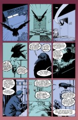
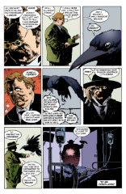

> [marginThumb] 

# Issue 15: "Into the Night"

##### Neil Gaiman, Mike Dringenberg, Sam Kieth, and Malcolm Jones III

- Sixth part of long storyline _The Doll's House_
- Seventh story reprinted in trade paperback _The Doll's House_
- Audible Act I Chapter 15
- Netflix Episode 8

### Page 1

> [marginThumb] 

- #### Panel 2

  This is Hal talking.

- #### Panel 3

  They're talking about Jed. He's probably concussed from where the Corinthian would have hit him to knock him out, and dehydrated from being locked in a car trunk for an indeterminate period of time. A "drip" is an IV (from "intravenous"), a fluid-filled bag leading to a needle which is inserted into a vein in the forearm or back of the hand. It's used to supply fluid (typically a saline solution to roughly match the blood plasma), medicines, and nutrition (as the simple sugar glucose).

### Page 2

> [marginThumb] 

- #### Panel 1

  Ken and Barbie are deliberately this cute, ending each other's thoughts and wearing the same clothes.

- #### Panel 4

  I'm familiar with the moral tale, but it is quite long and I'll merely say that the point is that God does not abandon you during difficult times, those times are when he supports you the most.

### Page 4-5

> [marginThumb] 

- #### Left page

  This is Ken's dream, one of money. The top line reads _"[typewriter symbols] Talking talking money boy ar[e you] listening 2 [to] me?"_ Below two small pictures, of a building and a man (possibly Ken's self image, or a father or boss figure), and also beside Ken's head, it reads _"Mebbe [Maybe] 100 thou[sand dollars]"_. Then _"Mebbe talk talking money boy got 2 handit 2 u boy"_ next to the man superimposed over a table of mutual funds values. Mutual funds are a type of investment. Then a picture of the man superimposed over a stock market listing, next to _"Mebbee 100 thou/Mebbe more...."_ A stock market listing has the prices for stocks, which are pieces of paper representing partial ownership of a company. The buying and selling of stocks is important to Western-style economies. Then above a final picture of the man, we have _"talking money boy ar u listening 2 me??"_

- #### Right page

  This is Barbie's dream. Barbie's dream is the subject of an entire subsequent long storyline, so pay attention. Barbie's dream is a fairy tale.

  The first panel of the dream pictures Barbie's self-image; the Porpentine, a magic amulet, described below as "a confection of spun silver and rose quartz"; and Martin Tenbones, first known appearance, will appear later. "Porpentine" is used in Shakespeare's _Hamlet_, Act I Scene 5, to mean "porcupine". I suppose the amulet pictured here could be considered to resemble a porcupine.

  Later panels also mention "The Cuckoo" and "The Disciples of the Cuckoo", villains; and the Hierogram ("Holy" + "Writing"), which is closely connected to the Porpentine.

### Page 6-7

> [marginThumb] 

- Chantal's dream occupies the top half of the double-page spread, Zelda's the bottom. The illustration of the two sleeping implies that they are lovers. Their relationship was uncertain to the other residents of the house. Note that the original comic, a caption from Zelda's dream appears in the central panel, but is virtually obscured by a lace overlay on the art.

- #### Zelda's first caption reads

  > _Mommy and Daddy told me to go away so here I am in the old bone orchard nobody understands me nobody cares nobody else userstands it the beauty of the lost necropolis is the Charnel charm,_

- #### The second caption

  > _oh but chantal comes along and shows me she's my soul sister me and her true gothic heroines secret brides of the faceless slaves of the forbidden house of the nameless night of the castle of dread desire_

- #### Chantal panel 1

  Chantal's self-image is flat, all solid colors and lines, a sophisticated-looking lady. The style resembles artist Patrick Nagel.

  The caption reads:

  > _"Chantal is having a relationship with a sentence. Just one of those things. A chance meeting that grew into something important for both of them."_

- #### Panel 2

  > _"They like the same things. She took it to a party. They were a big hit. The perfect couple."_

- #### Panel 3

  > _"Everybody knows about her and the sentence."_

- #### Panel 4

  > _"The sentence spent most of last year in Czechoslovakian for political reasons. But it was recently translated back into English. In order to stop the sentence being deported, Chantal has arranged to have it read into the Library of Congress. However--"_

  There were two languages in Czechoslovakia, Czech and Slovak. There is no Czechoslovakian. But this is a dream.

- #### Panel 5

  _"...when the time comes she discovers that she can no longer read. She has no idea what the sentence is about. Despondent and joyless, Chantal begins to cry."_ The entire sequence reads like a bizarre parody of a real relationship.

  It's worth noting that no one can read anything in a dream. That portion of the brain doesn't appear to function during REM sleep.

- #### Zelda panel 1

  Zelda's self-image is childlike, reminiscent of Alice of Lewis Carroll's "Alice's Adventure's in Wonderland." In the caption, "bone orchard" signifies the pictured graveyard. "Necropolis" is equivalent to "Death" + "City". "Gothic heroines:" "Gothic" is a genre of fiction that uses remote and unusual settings to establish a mood of mystery and horror. _Sandman_ is Gothic fiction. The "forbidden house...of dread desire" is probably a reference to lesbianism.

- #### Panel 2

  Chantal as mother figure?

- #### Panel 3

  What does the skull in the cupped hands mean? Above this panel, in the panel of Zelda and Chantal together, there are meant to be two captions. The two captions do not appear in the original comic publication, but were replaced in the trade paperback reprint.

- #### The first reads:

  > _With Melmoth we walk the corridors of Otranto_

- #### The second reads

  > _And Chantal says I'm going to take off my veil Zelda and Oh God I know it's going to be my mom saying Oh God Zee you're sick listen Robert do you know wht I found in her room your daughter's disGUSTing_

- #### Panel 4

  I presume that the "Hey, li'l moron" speech is something Zelda's mother abused her with. Zelda doesn't speak; perhaps she stutters?

  **"Godzilla"**: Godzilla is the star of a series of giant monster movies made cheaply in Japan. Probably here, Zelda's mom is teasing her: "Do you believe in God...zilla?" or Zelda's mind is forming unconscious connections: "Do you believe in God?" becomes "Do you believe in Godzilla?" It is also possible that "Godzilla" is a cruel twist on the name "Zelda," teasing other children might use.

- #### Panel 5

  Under the veil appears to be a spider's face. Zelda and Chantal collect spiders.

### Page 8

> [marginThumb] 

- This is Hal's dream.

- #### Panel 2

  Pictured and referred to are Bette Davis, Judy Garland, and Marilyn Monroe. I suspect Hal dreams their secret is that they are all men, too.

  These three figures are major inspirations for drag queens such as Hal, as well as other aspects of gay culture. Judy Garland, and especially her role in _The Wizard of Oz_, has provided the gay community with the symbol of the rainbow, and San Francisco (a Mecca for gay men) is often referred to as "Oz". Being a "friend of Dorothy" is gay slang for being gay.

  The other two have a somewhat less strong connection. Bette's physical gestures and her classic "bitch" nature are copied by drag queens. Marilyn has a low singing voice which is easy to mimic. Her apotheosis with respect to straight America is probably not particularly relevant.

  The flamboyant public nature of the stars, combined with their more private off-screen lives, reflects the dichotomy of their gay fans' lives.

- #### Panel 5

  Judy Garland as Dorothy in the movie _The Wizard of Oz_.

- #### Panel 6

  Judy pulls off her face to reveal the face of the Wicked Witch of the West from the same movie. Margaret Hamilton played the Witch, and later went on to do many coffee commercials for Maxwell House brand.

- #### Panel 7

  The final face revealed is actually the Wizard of the movie, though it's hard to see. Frank Morgan was the actor who played the Wizard. The simple symbology in this sequence is that Hal wears a mask, either when he's being a transvestite, or when he's not, and he wants to stop.

### Page 9

> [marginThumb] 

- #### Panel 5

  The "Big-Bad-Wolf-Man" is Fun Land, a serial killer who tried to kill Rose. "The pale stranger" is Dream.

### Page 10

> [marginThumb] 

- #### Panel 4

  Brevard County is a county in Florida, where Rose is staying.

### Page 11

> [marginThumb] 

- #### Panel 4

  Dream's responsibilities include protecting the Dreaming.

  His responsibilities are part of what he represents as one of the Endless.

  They are probably not imposed by some external figure.

  Matthew's dislike of hospitals stems from the abuse his body underwent in his former life. See issues of _Swamp Thing_.

### Page 12

> [marginThumb] 

- #### Panel 1-3

  Ken's dream is now one of sex.

- #### Panel 4-6: Barbie's dream

  A place, the Brightly Shining Sea, and more characters, possibly villains, Colonel Knowledge and the Heiromancer (equals "one who knows the future through holiness" or "prophet", or possibly "holy wizard"). Colonel Knowledge may be a paranomasiac reference to carnal knowledge. In panel 6, Ken's dream begins to leak into Barbie's.

### Page 13

> [marginThumb] 

- Zelda's and Chantal's dreams begin to intersect. Chantal's dream is a recursive story. The captions read _"Not quite in nightmare, but far from comfortable, Chantal is held like a crashed computer in an infinitely regressive loop of story. It was a dark and stormy night. And the skipper said to the mate, 'Mate, tell me a story....' And this was the story he told:" The story from "it was a dark..."_ then repeats, then fragments. "It was a dark and stormy night" was referenced in an earlier issue. The recursive story comes from the book _Arm in Arm: A Collection of Stories, Riddles, and Echolalia_ by Remy Charlip.

- #### Panel 3

  Zelda's story. This is the beginning of M.R. James' short story "Lost Hearts", although it is slightly misquoted; it should read '1811' instead of '1911'. James is one of the most famous British writers of ghost stories. Another is titled "The Haunted Doll's House". It had been suggested earlier that Zelda's story was _Vanity Fair_ by William Makepeace Thackeray. This is now believed incorrect.

- #### Panel 4

  Zelda's dream image has changed dramatically. Note the lace overlay on the artwork.

### Page 14

> [marginThumb] 

- #### Panel 1-3

  Hal is recalling a former lover, Robert. Hal is obviously homosexual and not just a transvestite. The song If I Were a Bell is from the Broadway musical ["Guys and Dolls"](http://uk.imdb.com/M/title-substring?title=Guys+and+Dolls&tv=both) and it occurs when the romantic leads, Sky Masterson and Sarah Brown, are on a romantic getaway together. She sings it to express how happy she is. A common stereotype is that gay people enjoy showtunes.

### Page 15

> [marginThumb] 

- The commentary on Barbara is important in the context of the later storyline. Hal is pictured walking on the Yellow Brick Road toward the paradise-symbol Emerald City, of the movie _The Wizard of Oz_.

### Page 16-17

> [marginThumb] 

- #### Panel 1

  Two page spread. Another place in Barbara's dreamworld, "The Place of Lost Carnadine". The "carn-" in similar words comes from Latin "caro", meaning flesh. It has also acquired the meaning of "dark red" from the color of flesh. The morpheme "-ine", if it is used here, means "having the nature of".

### Page 21

> [marginThumb] 

- #### Panel 2-3

  Again, we see _a_ Doll's House.

### Page 22

> [marginThumb] 

- #### Panel 2

  Sigmund Freud was an early 20th Century doctor who invented the practice of psychoanalysis. In his theories, much of human behavior is a direct result of the instinct for sex. When the subconscious mind is thinking of sex, the conscious mind tends to transform these thoughts into ones that are more acceptable in some sense. Thus a dream of flying is really a dream of sex. In dreams, almost any object that is longer than it is wide is considered a metaphor for the phallus. Freud recognized the inherent fallacy of this sort of overanalysis with the statement, "Sometimes a cigar is just a cigar." The major flaw in Freud's work is his inability to deconstruct his own sexual hangups.

### Page 23

> [marginThumb] 

- #### Panel 8-9

  See issues of _Swamp Thing_ for what Matt Cable, who became the raven, did. Gilbert's quote is from Christopher Marlowe, _The Jew of Malta_ (c. 1589) IV.i.40:

  > **Friar Barnadine:** Thou hast committed -

  > **Barabus:** Fornication? But that was in another country: and besides, the wench is dead.

  Note that we saw Kit Marlowe in [Sandman #13](sandman.13.md), in 1589, although there did not appear to be a reference to this work.

### Page 24

> [marginThumb] 

- #### Panel 7

  Another reference to rules that govern Dream's behavior. I suspect that the best explanation is that the mere existence of the Endless engenders rules, that rules _are_ because They _are_.

## Credits

- Originally collated and edited by Greg Morrow.
- Michael Kelly <mkelly@wimpy.helios.nd.edu> spotted the resemblance between "Godzilla" and "Zelda."
- James Drew <jrd@frame.com> gave insight into Hal's dream.
- Tom Galloway <tyg@caen.engin.umich.edu> and Joel Tscherne <ac985@cleveland.freenet.edu> brought up the Wicked Witch's background, while
- Neil Gaiman (via Tanaqui C. Weaver <cen@vax.oxford.ac.uk>) explained that the third picture in that sequence was supposed to be the Wizard's face. Joel also pointed out an additional rule governing Dream.
- Tom pointed out Matthew's dislike of hospitals.
- Andrew D. M. U. Weiland <aw1s@andrew.cmu.edu> identified Zelda's plagiarism.
- Subrata Kumar Sircar <sksircar@phoenix.Princeton.EDU>, Tom, and Andrew identified Gilbert's quote.
- William Sherman <sherman@math.ucla.edu> identified "porpentine", identified Frank Morgan, totally lost track of page numbers, amd spotted the Emerald City.
- Tanaqui C. "33 1/3% Delirium" Weaver noted the lace overlays, and suggests a meaning for Colonel Knowledge.
- Peter Bruells <Peter.Bruells@arbi.informatik.uni-oldenburg.de> identified Zelda's story.
- Michael Bowman <mbowman@andromeda.rutgers.edu> originally supplied the missing caption from page 6.
- carlf@panix.com (Carl Fink) noted the near impossibility of reading in a dream.
- Compuserve's Ben Sano 72401,2736 identified Chantal's recursive story, as relayed by Dave "Ed, the Anti-Dave" Stobbe <dave.stobbe@canrem.com>.
- Ralf Hildebrandt added more details.
