> [marginThumb] 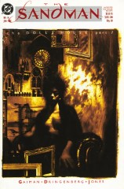

# Issue 16: "Lost Hearts"

##### Neil Gaiman, Mike Dringenberg, and Malcolm Jones III

- Seventh part of long storyline _The Doll's House_
- Eighth story reprinted in trade paperback _The Doll's House_
- Audible Act I Chapter 16

### Page 4

> [marginThumb] 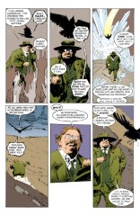

- #### Panel 6

  An unusual case of anthropomorphism, for a _place_ to become a _person_.

### Page 5

> [marginThumb] 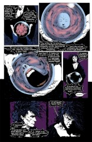

- #### Panel 1

  Dream's assertion that vortices are mortals directly contradicts Lucien's assumption, issue ten page 14, that the vortex was an "it", a thing.

- #### Panel 5

  I suppose I should start keeping a "Canonical list of Sandman danglers". This would obviously be one. It was eventually resolved with Overture.

### Page 9

> [marginThumb] 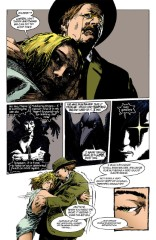

- #### Panel 5

  We need not worry that Fiddler's Green was the historical Gilbert Keith Chesterton (born 29 May 1874 in Kensington), as here he says he was not even a "very good _copy_ of a human" [emphasis his].

### Page 11

> [marginThumb] 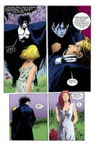

- #### Panel 4

  > [audible] The Audible narration says this young woman looks familiar to Rose, she could almost be Rose's reflection _in a looking glass_.

### Page 12

> [marginThumb] 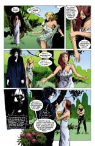

- #### Panel 4

  > [audible] The Audible version changes Dream's line here to "I _do not_ know who you are..." This makes his bafflement on the next page possibly make more sense.

### Page 13

> [marginThumb] 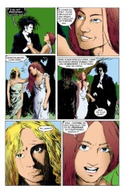

- #### Panel 2

  Dream is not very bright, indeed. He has great knowledge, born of age and, perhaps, his status, but he is not even as capable of insight as a human.

### Page 17

> [marginThumb] 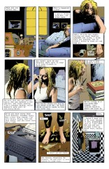

- #### Panel 3

  That's an Iggy Pop CD on the bottom of the panel, _The Idiot_. Neil mentions that Lou Reed's _Berlin_ didn't make it into the panel.

  > [audible] Audible also names The Cowboy Junkies' _The Trinity Session_

- #### Panel 4-5

  Barbie's life will be more fully explored in a later storyline.

- #### Panel 6

  **Two books have readable titles**: [Empire of the Senseless](http://www.amazon.de/exec/obidos/ASIN/0802131794) and [Sleeping in Flame](http://www.amazon.de/exec/obidos/ASIN/0679727779).

  - _Sleeping in Flame_ is by Jonathon Carroll, an American writer often writing from Vienna who writes surreal, fantastic, and often horrific fiction. This particular book is a modern retelling of the Rumpleskiltskin fairy tale. Carroll has a reputation for using dreams or fictions becoming reality, and it is rumored that Neil Gaiman had to rework the plot of _The Doll's House_ after reading a Carroll book that used his original idea.

  - _Empire of the Senseless_ was written by Kathy Acker in 1988. Perhaps coincidentally, she dedicates the book to her tattooist. It is described as a postmodern novel, and "not a pretty story."

  Neil indicates that Shirley Jackson's _We Have Always Lived in the Castle_ and M.R. James' _Ghost Stories of an Antiquary_ were in the script but didn't make it into the panel. He notes that this should help people identify Zelda's short story extract from [Sandman #15](sandman.15.md) and the title of this issue.

  > [audible] The Audible narration adds the above missing books, plus _A Distant Mirror_ to the stack.

### Page 18

> [marginThumb] 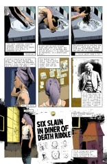

> [floatright width-40pc] 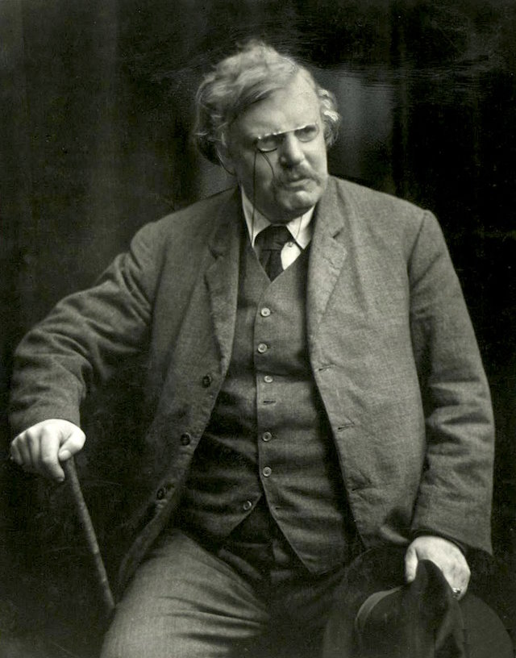

- #### Panel 2-3

  We saw Judy, and the massacre, in [Sandman #6](sandman.06.md). We will see Donna in a later storyline.

- #### Panel 6

  A genuine photo of G.K. Chesterton, who was the inspiration for "Gilbert". Note the signature at lower left.

  > [audible] The Audible narration adds a caption - "G.K Chesterton. 1874-1936"

### Page 19

> [marginThumb] 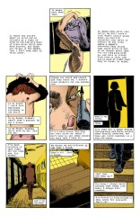

- #### Panel 1

  (right caption): Talking about dolls probably relates to the title of this storyline.

- #### Panel 2

  Note Rose's namesake tattoo.

- #### Panel 7

  "And then she woke up" is the conclusion to, among other things, _Alice's Adventure's in Wonderland_ and the movie [blech!] version of _The Wizard of Oz_.

### Page 20

> [marginThumb] 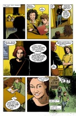

- #### Panel 6

  > [oops] Earlier editions say "..a fox's _set_ in the wood" - A fox's "set" is hunter's jargon for a den. It is therefore unusual for Jed to use it, and later edits agree, changing it to "..a fox's _den_..."

### Page 21

> [marginThumb] 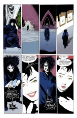

- #### Panel 5

  Note that Desire's sigil is different from issue ten, and that the order of sigils is peculiar (Desire to the left of Death).

### Page 22

> [marginThumb] 

- #### Panel 1

  Desire's costume is in many ways reminiscent of Catwoman's, a villain of Batman's. However, felinity often seems to have an erotic effect, and that may be its purpose here.

  It is also a reference to events that will happen (/have already happened) in Overture

- #### Panel 7

  Another of the unspoken rules that govern the Endless, apparently. Disaster of some sort would strike were Dream to slay kin of the Endless. We saw a possible hint to this in [Sandman #10](sandman.10.md), where Rose is warned of the "Kindly Ones", and a later issue also uses the Eumenides as a threat.

### Page 23

> [marginThumb] 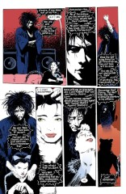

- #### Panel 4

  Delirium is the name of the Endless whose sigil is the swirly one to the right of Despair's on [issue 10, page 4](sandman.10.md#page-4).

### Page 24

> [marginThumb] 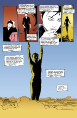

- #### Panel 5

This arc ends back where it started, overlooking [The Threshold](sandman.10.md)

## Credits

- Originally collated and edited by Greg Morrow.
- Col. G. L. Sicherman <gls@cbnewsh.cb.att.com> defined "set."
- David Goldfarb <goldfarb@ocf.berkeley.edu>, Viktor Haag <vehaag@crocus.waterloo.edu>, and Jim W Lai <jwtlai@watcgl.waterloo.edu> combined to identify Rose's reading material.
- Neil Gaiman, via Tanaqui C. Weaver <cen@vax.oxford.ac.uk> expanded on material in Rose's room.
- David Goldfarb <goldfarb@ocf.berkeley.edu> speculated on the nature of an Endless disaster.
- Ralf Hildebrandt added more details.
- Richard Munn included a better quality copy of the G.K. Chesterton photo, added the Overture references, and noted how the arc begins and ends.
