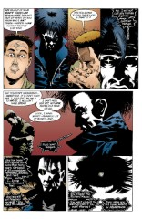

# The Annotated Sandman

## Issue 17: "Calliope"

> [!THUMBNAIL] 

##### Neil Gaiman, Kelley Jones, and Malcolm Jones III

First story in anthology _Dream Country_

First story reprinted in trade paperback _Dream Country_

**Note**: The script for this issue, complete with Neil's and Kelley's notes, is printed in the back of _Dream Country_.

### Page 1

> [!THUMBNAIL] 

- #### Panel 1

  This is the main character, Richard Madoc, who will appear again briefly in The Wake, [issue #70](sandman.70.md), page 15, panels 6 & 7, and [issue #72](sandman.72.md), page 25, panels 3 & 4. R.A.C.'s contact with Gaiman says that he's tried to write another story with Madoc, only to have the muse desert him.

- #### Panel 2

  A bezoar is a stony mass found in the gut of certain animals, particularly ruminants. It was formerly believed to be a potent antidote to poison, much like a unicorn's horn. The word itself is from Persian, via Arabic and Latin, and means, literally, counterpoison. A bezoar is also a Near Eastern wild goat, probably the ancestor of the domesticated goat. The goat's name is probably the earliest use of the word; the stony masses obtained from these goats probably took their name from the goat's name.

- #### Panel 3

  Trichino- is the stem for "hair" from Greek. Its meaning has also been extended to signify worms, particularly hairlike nematodes.

  In the script, Gaiman describes the trichinobezoar as a "fossilized tribble covered in slime" and notes that a photo he had seen quite resembled what Jones had drawn. Jones notes later that he found a description in "Paracelsus Book". Paracelsus was a sixteenth century Swiss physician.

  

### Page 2

> [!THUMBNAIL] 

- #### Panel 1

  This is a nod to the 1919 German film [The Cabinet of Dr. Caligari](http://uk.imdb.com/M/title-substring?title=The+Cabinet+of+Dr.+Caligari&tv=off), one of the most famous silent films ever made, a masterpiece of the expressionistic style.

### Page 3

> [!THUMBNAIL] 

- #### Panel 4

  According to the script, this was drawn from reference photos taken by Gaiman of the Chelsea/Thames area of London.

- #### Panel 6

  Erasmus Fry has not been seen before or since, although a later issue of Sandman ([#20](sandman.20.md),[#66](sandman.66.md)) will include one of his works.

### Page 4

> [!THUMBNAIL] 

- #### Panel 3-4

  Fry's explanation of bezoars is accurate, as shown above.

  John Dee has had some background provided in an earlier annotation.

### Page 5

> [!THUMBNAIL] 

- #### Panel 3

  It seems that Madoc is by far getting the best of the bargain, but perhaps Fry can get no benefit from her any more, and so she is worthless to him.

- #### Panel 4

  Mount Helicon was regarded in Greek mythology as the home of Apollo and the Muses. Mount Parnassus was also sacred to Apollo and the Muses. In the Odyssey, Hermes gave moly to Odysseus to counteract Circe's magic.

- #### Panel 5

  Erasmus raped his captive. Fry (and later on, Madoc), is too lazy to woo the Muses in return for inspiration. Instead of a supplicant and gracious attitude, Fry (and Madoc) are in effect saying, "Give me a story, or else!" Since authors are traditionally said to be inspired by a Muse, perhaps Gaiman is saying that inspiration is metaphorically rape.

### Page 6

> [!THUMBNAIL] 

According to the script, Kelley Jones drew Calliope emaciated, which editor Karen Berger thought was too extreme. Malcolm Jones inked her a little less skinny.

There were nine Muses in Greek mythology of whom Calliope was the Muse of epic poetry. The others were Clio (history), Erato (lyric poetry), Euterpe (music), Melpomene (tragedy), Polyhymnia (religious music), Terpsichore (dance), Thalia (comedy) and Urania (astronomy). They were the daughters of Zeus and Mnemosyne (the titan of memory).

### Page 7

> [!THUMBNAIL] 

- #### Panel 4

  From the Book of Common Prayer of the Church of England (146:2) "O put not your trust in princes, nor in any child of man: for there is no help in them." It may also appear in the Book of Psalms.

### Page 8

> [!THUMBNAIL] 

- #### Panel 2

  The original draft of the script had "bare wooden floor" for "musty old camp-bed", which Gaiman changed after seeing the artwork.

- #### Panel 3

  Jones' reference work for Madoc's workspace was a photo of Gaiman's own! Gaiman says it was reproduced "embarrassingly accurately", except for lacking the statue of Groucho Marx.

### Page 9

> [!THUMBNAIL] 

- #### Panel 1

  "Camenae" are the Roman equivalent to the Muses. Calliope is indicating that the Muses are the daughters of the three-in-one goddess, which contradicts most classical sources.

  However, in the script, Gaiman comments that an earlier version of the Muses had only three women. So, to some extent, the nine Muses _are_ 'daughters' of the triple goddess.

  Gaiman here notes that pages 9 and 10 were intended to face each other, but misplaced ads in the original comic prevented this, and it was not corrected for the collection.

  He also notes that Calliope, while more comfortable with her nakedness, is not entirely comfortable, as the Muses were always depicted in light shifts. (Parenthetically, he adds that the Graces were not.) Jones' notes indicate that the angles he uses in this sequence were intended to contrast Calliope and the emptiness of the attic.

- #### Panel 4

  "Beautiful Voice" is the translation of "Calliope".

  Gaiman indicates that Melete is the crone, Mneme the mother, and Aiode the maiden. He notes that these three were a form of the Muses that predate the nine children of Zeus and Mnemosyne, and unilaterally decided that the Nine were the daughters of the Three. Jones notes that he used his neighbor as a model for Melete.

  From Poe's "How to Write a Blackwood Article":

  > PIQUANT FACTS FOR SIMILES. There were originally but three Muses--Melete, Mneme, Aoede--meditation, memory, and singing.

- #### Panel 6

  Melete recounts an old English proverb here.

### Page 10

> [!THUMBNAIL] 

- #### Panel 1

  Melete is telling the story of Orpheus, who was classically the son of Calliope by Apollo, not Oneiros. Orpheus was a master musician who descended to Hades in search of his dead wife Eurydice. His music was so charming that he was allowed to lead his wife out, provided he did not look back until they were out of the underworld. He looked back, and lost her forever. Thrace is a indeterminate region in what is now Bulgaria, Greece, and Turkey. The sisters of the fury were worshippers of the god Bacchus who worked themselves into a frenzy, in which state Orpheus encountered them and was killed. Oneiros is the Greek name of Dream.

- #### Panel 2

  Some aspects of Dream's and Calliope's disagreement are covered in _Sandman_ Special #1.

### Page 11

> [!THUMBNAIL] 

- #### Panel 3

  The method of capture conforms to fairy tale archetypes.

- #### Panel 5

  Gaiman says Madoc's title is from a riddle that appears in _The Books of Magic_ #4 From page 33:

  > **The Fool**: A riddle. I sat with my love, and I drank with my love, and my love she gave me light. I'll give any man a pint o'wine, that'll read my riddle right. 
  > Only I don't _have_ a pint of wine. Do you give up?  > **Tim Hunter**: I don't understand the question.  > **The Fool**: How about your friend?  > **Mister E**: It is an evil rhyme, and it has an evil answer.  > **The Fool**: Oh _so?_ But can you riddle it?  > **Mister E**: I sat in a chair made of my love's bones, drank from her skull, and saw by the light of a candle made from her fat. 
  > There. Are you satisfied, fool? Let us leave this place, Timothy Hunter.

  It may be that the "true" answer to this riddle is "wine". The teller sits with a bottle of wine and drinks from it; a candle is stuck in a wine bottle and lit. This is why the Fool doesn't have a pint of wine, he drank it.

  Mister E, as a consequence of his character, may simply be taking the most evil interpretation that he can.

- #### Panel 6

  While cruelly ironic, Madoc's remark is actually a reference to a quote from British punk rock icon Johnny Rotten (ne' Lydon). When asked about what he thought about sex, Johnny responded "What is sex, but two and a half minutes of squelching noises?"

### Page 12

> [!THUMBNAIL] 

- #### Panel 1

  Gaiman describes the two men discussing the Booker Prize as "psuedy types"; this is misspelled. The Booker Prize may be considered a British counterpart to the American Pulitzer Prize, although it is much more literary in nature and is restricted to fiction by UK and Commonwealth authors. Some who have won include Anita Brookner, Kazuo Ishiguro, and Iris Murdoch.

  The woman speaking of the "beautiful book" is wearing a t-shirt with the face of Pinhead, a character from auteur Clive Barker's _Hellraiser_ movies. Madoc is modeled on Barker's amazing success, to some extent.

  Rick's characterization of himself as a feminist writer is again cruelly ironic. The woman he's talking to is described in the script as having "long black hair". Her final question is one authors, reputedly, get all the time, and really, really hate.

- #### Panel 3

  **TLS**: Times Literary Supplement, a literati must-read. It is a weekly supplement to the great metropolitan newspaper, the Times of London.

  The collection title is, in Gaiman's words, "an oblique James Branch Cabell reference...a chapter he never got around to writing in _Figures of Earth_"."

- #### Panel 4

  Note the statue of Athena.

### Page 13

> [!THUMBNAIL] 

- #### Panel 4

  The script notes that "Eagle Stones" are stones with magical properties, found in eagle nests, without which eagle eggs could not break.

- #### Panel 5

  The movie title is from a Victorian book, _Extraordinary Popular Delusions and the Madness of Crowds_, by Charles Mackay.

- #### Panel 6

  Jones notes that the poster is on a fence. This is a common practice in the business district of major cities, although movie posters are generally only seen in theaters and specialty shops in outlying areas.

### Page 14

> [!THUMBNAIL] 

- #### Panel 2

  The lettering makes it clear that Calliope is speaking with Dream (whom Gaiman refers to in scripts exclusively as "The Sandman", though "that's not his name").

- #### Panel 4

  Gaiman notes that the interviewer bears a strong resemblance to his friend and collaborator, Kim Newman, a British SF writer and expert on old films. Their collaboration is unknown.

> [!FLEX_2]  

- #### Panel 5

  Note Madoc's earring, an ankh, the symbol of Dream's sister Death. Madoc can be seen wearing the earring in a number of other panels.

### Page 15

> [!THUMBNAIL] 

- #### Panel 2

  Note that Fry died of poison, despite having a bezoar which was supposedly proof against poison.

- #### Panel 3

  Gaiman notes that "Here Comes a Candle" was the title of his friend Pete Atkins' first published short story, although he did not know that at the time he wrote this. The phrase itself comes from a nursery rhyme:

  > "Here comes a candle to light you to bed
  > And here comes a chopper to chop off your head."

### Page 17

> [!THUMBNAIL] 

- #### Panel 6

  Of course, Dream was imprisoned most of this century himself.

### Page 18

> [!THUMBNAIL] 

- #### Panel 6

  Gaiman notes that a possible etymology for "Morpheus" (Dream's Roman name) is "he who shapes".

- #### Panel 7

  The second draft of the script had "I am alive in my own right." for "I am real." The original was left in in the lettered version.

### Page 19

> [!THUMBNAIL] 

- #### Panel 3

  Ironic that Madoc should mention an attempt to destroy an author... "Critical mass" is the term used by nuclear physicists to refer to an amount of Uranium that is about to undergo nuclear fission (i.e. atomic explosion). Here, however, "mass" is more likely referring to the Roman Catholic religious ritual, in which Holy Communion is taken. And, of course, every author has his critics...

- #### Panel 4

  Gaiman wrote his note over the first two lines: "A city in which the streets are paved with time," and "A train full of silent women, plunging forever through the twilight". Maybe he was referring to the "A Tale of Two Cities" in World's End, which has a train that is largely deserted. (Or maybe not.)

- #### Panel 5

  The library in Alexandria was burned, and many classical works were lost forever.

### Page 20

> [!THUMBNAIL] 

- #### Panel 1

  The Parthenon was the temple of Athena in Athens, and a classic of ancient architecture.

- #### Panel 2

  This is the same character as from the opening of the story.

  "An old man... who owned the universe and kept it in a jam jar..." Odin gives Dream a "notional universe", contained in what appears to be a glass sphere, in the Season of Mists arc. [Insert exact reference here] Note the writing on the wall, apparently done in blood. The words "a PAN" can be made out in panel 2, and "WEASELS" appears in panel 3. Since one of Madoc's mutterings is about a "weasel on holiday" (page 19, panel 5), perhaps Madoc is making the writing.

- #### Panel 3

  A sestina is a poem of six six-line stanzas and a three line concluding envoy (short stanza). Each stanza has a key word as the final word in a line, each stanza having the words in a different order. The envoy has one key word in the middle and at the end of each line. Two readers wrote sestinas of the given form, which were published in the letter column in [Sandman #21](sandman.21.md). One of those readers is Elizabeth Holden, a R.A.C. mainstay.

- #### Panel 4

  **F.R.C.S.**: Fellow of the Royal College of Surgeons.

### Page 21

> [!THUMBNAIL] 

- #### Panel 6

  Cargo cults were discovered among the peoples of the Pacific islands during and after World War II, based on the unbelievable amounts of goods ("cargo") brought to these islands by the various armed forces.

  Raymond Lulli was a 13th century Spanish theologian and philosopher.

  He was the creator of a numerologic system which involved wheel-shaped diagrams with letters at the perimeter. Lullism is discussed in Martin Gardner's _Science, Good, Bad, and Bogus_. Paracelsus, mentioned above, apparently used the Latinized name Philippus Aurelus Paracelsus, and the birth name Theophrastus Bombastus von Hohenheim. The two could not have been contemporaries. Incidentally, Theophrastus was a fourth century BC Greek natural philosopher. Both Lulli & Paracelsus are treated in Frances Yates' book _The Art of Memory_ ; they both had systems.

  There was a great chemist(?) named Celsus. Paracelsus/von Hohenheim created his alias to show that he was even greater than Celsus ("para - Celsus"). [More info to be included on Celsus at a later date.]

### Page 22

> [!THUMBNAIL] 

- #### Panel 4

  Note the book blurb.

### Page 23

> [!THUMBNAIL] 

- #### Panel 1

  Calliope is wearing classic Greek garb, a chiton, and her hair is also done in a classical manner.

## Credits

- Originally collated and edited by Greg Morrow.
- Philip J. Birmingham (birmingh@fnal.fnal.gov) gave some dope on Raymond Lulli.
- Andrew David Weiland <aw1s+@andrew.cmu.edu> got the riddle from the Book of Magic. Doug Atkinson (douga@yang.earlham.edu) quoted it fully.
- Paul N Watts (watts@csa2.lbl.gov) explained 2 1/2 minutes of squelching noises.
- James Drew (jrd@frame.com) tells me that movie posters are indeed posted along walls in major cities.
- William Sherman (sherman@oak.math.ucla.edu) referenced Dr. Caligari.
- David Henry (ud137927@ndsuvm1.bitnet) corrected him on the movie's style.
- Doug added to the reference.
- Andrew Moran (angst@dcs.glasgow.ac.uk) graciously corrected some of my British ignorance on books and chemists and surgeons, and cabbages and kings.
- Rob Ingram (rji@trellis.cs.nott.ac.uk) also explained FRCS.
- Desiree (dsy@psych.toronto.edu) told me where not to put my trust and why, more about the Booker Prize, explicated the TLS and identified r.a.c. mainstay Elizabeth Holden as a poet.
- Mike "The One and Only" Killans (mcollins@isis.cs.du.edu) also explained the TLS and pointed to the _Sandman_ Special.
- Tanaqui C. Weaver (cen@vax.oxford.ac.uk) passed on some tidbits from Neil, some information on Lulli and Paracelsus, yet another definition of TLS, and pointed out the curious circumstances of Fry's death.
- Col. G. L. Sicherman (gls@windmill.att.com) referenced Dr. Caligari, untrustworthy princes, the early muses, TLS, "Here comes a candle", and FRCS. Whew!
- Kieran Mullan <kieran@cmatter.physics.indiana.edu> added a different interpretation of the riddle.
- Michael Bowman <mbowman@andromeda.rutgers.edu> ID'ed Kim Newman.
- Dave "Ed, the Anti-Dave" Stobbe <dave.stobbe@canrem.com> corrected a typo.
- Sverker Wiberg <sverkerw@Minsk.DoCS.UU.SE> spotted Madoc's earring and aided the etymology of "bezoar".
- Ralf Hildebrandt added more details.
