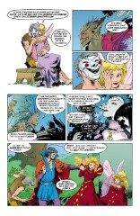
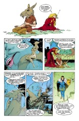

> [marginThumb] 

# Issue 19: "A Midsummer Night's Dream"

##### Neil Gaiman and Charles Vess

- Third story in anthology, _Dream Country_
- Third story reprinted in trade paperback _Dream Country_
- Audible Act I Chapter 20

Winner of 1991 World Fantasy Award in the short story category

**Note**: Charles Vess illustrated the text of the original play in a Starblaze edition that may still be available.

**History**: At least one source claims that the play was probably written between 1595 and 1598 (which contradicts the date given for the story). During this same period Shakespeare was also working on the following: _The Merchant of Venice_, 1 and 2 _Henry IV_ and _The Merry Wives of Windsor_.

### Page 1

> [marginThumb] 

- #### Panel 1

  William Shakespeare was baptized on April 26, 1564, into a successful middle class family. Shakespeare and Anne Hathaway were married November 28, 1582. Their daughter Susanna was born in May, 1583. The twins Hamnet and Judith were born in February 1585.

- #### Panel 3

  Will Kemp and Bob Armin are presumably historical members of the acting troupe.

### Page 2

> [marginThumb] 

- #### Panel 1

  Condell is Henry Condell, another member of the company, and one of the two compilers of the First Folio edition of Shakespeare's plays, published in 1623, seven years after Shakespeare's death. His co-editor is John Heminge, who does not appear in this issue.

- #### Panel 3

  Elizabethan spelling was not particularly fixed; Shakespeare rarely spelled his name twice the same way.

- #### Panel 5

  "The Long Man of Wilmington" and "Wendell's Mound" are the same thing, a geographic feature somewhere in England.

- #### Panel 6

  The Normans were invaders from France (and, further back, Scandinavia) who conquered England in 1066, defeating the no more native Anglo-Saxons, who themselves had come to England in about the fifth century, displacing the Celtic people, and so forth, and so on.

### Page 3

> [marginThumb] 

- #### Panel 1

  Ferdinando Stanley, Lord Strange (pronounced so as to rhyme with sang) was the patron for the acting troupe which bore his title. Shakespeare may have been employed by Strange in his early years. Strange's began as a troupe of acrobats and tumblers in London in the early 1580s, but in 1588 the company was reorganized, emphasizing acting. By 1590, Strange's was allied with Admiral's Men, performing at The Theatre (owned by James Burbage, whose son Richard we see here; he became the troupe's leading tragedian). In 1593, Lord Strange became Earl Derby [Note for Americans: pronounced like `Darby'], changing the company's name to Derby's Men. In 1594, he died. At this time George Bryan, Thomas Pope, Richard Cowley and Richard Burbage formed Chamberlain's Men. Scholars believe that Shakespeare was involved with Strange's as both actor and playwright. The troupe produced _Titus Andronicus_ and _Henry vj_ (probably _1 Henry VI_), the combined Strange's-Admiral's probably staged both the second and third parts of _Henry VI_. In 1603, Shakespeare's troupe received a patent from James I allowing them to style themselves the King's Men.

- #### Panel 3

  It is uncertain in what exact order Shakespeare wrote his plays. One listing gives:

  - A Midsummer Night's Dream
  - Richard II
  - Love's Labour Lost
  - Romeo and Juliet

  While another speculates:

  - Romeo and Julie
  - Richard II
  - A Midsummer Night's Dream
  - King John
  - Merchant of Venice
  - 1 Henry IV
  - 2 Henry IV

  Based on these, it seems likely enough that Gaiman was thinking of _Romeo and Juliet_ when Burbage asks for a lover most tragic. Since this performance of _Dream_ occurred earlier than any historical performance, it might well have preceded _Romeo and Juliet_ in any ordering.

- #### Panel 4

  Notice Wendel's outline to the left.

- #### Panel 5

  Sussex is a district (from "South Saxony") in England.

### Page 4

> [marginThumb] 

- #### Panel 1

  The Black Plague was still a great concern in this era. The boy in the red dress is, I believe, Henry Condell, as mentioned above. He is playing Titania, queen of the Fairies. Hamnet is playing a young Indian boy, her servitor, and the boy in the green dress is playing Helena, one of the young lovers of the play.
  The Curtain Theatre was the 2nd London playhouse. It was probably built in 1577 in the Curtain Close neighborhood of Shoreditch. Strange's Men often played there in 1590-1592 and Chamberlain's Men in 1597-1598. The Cross Keys Inn was an inn in London. Its courtyard was used for theatrical performances throughout the 16th century. Chamberlain's Men played winters there from their formation in 1594 until 1596 when the City banned all performances within City limits.

- #### Panel 2

  Actors and theatres were considered low class and disreputable, and were often hassled by self-righteous governments; this would be one such incident. Theatres such as the Globe, where many of Shakespeare's plays were run, were mostly on the south side of the Thames, since this put them outside London proper, in a more friendly jurisdiction.

- #### Panel 3

  The strawberry line reads oddly. Am I missing some slang meaning?

- #### Panel 4

  Jesu is an alternate spelling for Jesus. On the right, it would appear that someone is practicing lines from Act II scene 1.

### Page 4

> [marginThumb] 

- #### Panel 6; page 5 panel 1-3

  Who is Wendel, and why is he an outline on an earthen mound?

  <toth@puli.bke.hu> says:

  > "Wendel is a Celtic god and smith related to Wayland. There is an actual mound in England called "Wendel's Mound". I believe there may also be story about him in one of Rudyard Kipling's "Puck" books, which would be appropriate given the context."

  The true location is the Long Man of Wilmington. (Neil Gaiman notes in the Sandman Companion that this may have originated as "Wendel's Mound Town")

> [flex cols-2]  

### Page 6

> [marginThumb] 

- #### Panel 1

  Auberon and Titania are also characters in the play; Dream is showing the rulers of Faerie a play about the rulers of the fairies. In The Sword and the Stone by T. H. White Dom-Daniel is a college under the sea where both Merlin and Morgana learned magic. Shaper is a literal translation of Dream's Latin title Morpheus.

- #### Panel 2

  This is Puck, who also has a representation in the play. Robin Goodfellow is another of his names. King of the Riddle-Realms is an appellation of Dream, probably referring to the puzzling nature of dream imagery.

- #### Panel 5

  In the theater, it is considered bad luck to wish actors good luck; "Break a leg" is that phrase that is used instead.

### Page 7

> [marginThumb] 

- The play opens with Theseus, Duke of Athens, anxiously awaiting his wedding to Hippolyta, Queen of the Amazons. Philostrate is his Master of Revels.

- #### Panel 8

  The opening lines to the play. Act I Scene 1 line 1. Theseus.

- #### Panel 9

  Act I Scene 1 line 14, Theseus instructing Philostrate to prepare diversions to make the time pass more quickly. Pale Companion refers to melancholy, not to Dream, despite the juxtaposition of his features.

### Page 8

> [marginThumb] 

- #### Panel 1

  Act I Scene 1 line 142 Lysander; these are Lysander and Hermia, two young lovers whose marriage is opposed by Hermia's father, who wants her to marry Demetrius.

- #### Panel 4

  The fairy's explanation would appear to be accurate.

- #### Panel 6

  Act I Scene 1 lines 197-201; Helena and Hermia are best friends; Helena was wooed and abandoned by Demetrius, whom she still desires.

### Page 9

> [marginThumb] 

- #### Panel 1

  Act I Scene 2 lines 11-21. A group of comic-relief craftsmen are preparing a play for the post-wedding revels. Part of the humor is in the play they chose; it would hardly seem to be an obvious comedy. Each of the craftsmen's names refers to their profession: Quince is from "quoins" or wedges, and is a carpenter, while the bottom in Nick Bottom refers to the reel on which thread is wound. Bottom is a major character in the play; he is played by Will Kemp whom we saw earlier trying to enhance his role. That's irony for you; Kemp is acting as Bottom would.

  "Pyramus and Thisbe" is the Italian poem which Romeo and Juliet is based on.

- #### Panel 4

  Act I Scene 2 lines 47-50. Flute, the bellows-maker, will play the heroine. Although it was conventional that men and boys play female roles, it was still a subject of some jest, enough so that we can understand Flute's reluctance.

- #### Panel 6

  Act I Scene 2 lines 72-75. Bottom is convinced that he can play any role. Here, he is demonstrating that he could play a lion if required. Immediately previously, though not shown, a character had expressed doubt that he could learn the lion's lines (simple roaring only).

### Page 10

> [marginThumb] 

- #### Panel 1

  Act II Scene 1 lines 32-36. Puck and one of Titania's retinue.

- #### Panel 3

  Act II Scene 1 lines 42-43.

- #### Panel 4

  Peaseblossom is also a character in the play.

- #### Panel 5

  The boy with a lyre is probably Orpheus, who we have learned is Dream's son. Shakespeare is known to have used many sources in the writing of his plays (much like Neil Gaiman!); the most prominent of Shakespeare's sources was _The Golden Ass_ by Apuleius, also the "Knight's Tale" by Chaucer. In addition, the following were useful: Ovid's _Metamorphoses_, _Huon of Bordeaux_ (which has a similar characterization of Oberon), Reginald Scot's _The Discoverie of Witchcraft_ (had tales of fairy lore, especially stories of Robin Goodfellow), Spenser's _Shepheardes Calender_ (which is not a misspelling), Jorge de Montemayor's _Diana Enamorada_, several plays by Seneca and several by John Lyly (plus his novels, _Euphues_ and _Euphues and His England_), and Plutarch's "Life of Theseus."

- #### Panel 6

  Act II Scene 1 lines 60-64. Note the different spelling of Oberon. Oberon and Titania are quarreling over the possession of the young boy to the right (played by Hamnet).

### Page 11

> [marginThumb] 

- #### Panel 1

  Act II Scene 1 lines 135-137. Titania is explaining that the boy is the child of a former retainer who died in childbirth, and she has promised to rear him.

- #### Panel 3

  Is the faerie queen as desirous of the boy actor as she was of the child whose role he plays?

- #### Panel 4

  This arrangement was, of course, hinted at in [Sandman #13](sandman.13.md).

- #### Panel 5

  Titania has summarized the action of the play thus far accurately.
  Note "consort" rather than "king" or "husband". I am uncertain if Titania was supposed to be _married_ to Oberon, but Oberon _was_ supposed to have had affairs outside the union. "Consort", then, would be the more accurate description.

- #### Panel 6

  Act II Scene 1 lines 179-182.

### Page 12

> [marginThumb] 

- #### Panel 1

  Act II Scene 2 line 84-87. Demetrius and Helena.

- #### Panel 4

  Act II Scene 2 lines 113-114. The love potion has been used (accidentally) to cause Lysander to forsake Hermia for Helena.

- #### Panel 6

  Act II Scene 2 lines 147-151. Hermia is confused that Lysander is not by her side.

### Page 13

> [marginThumb] 

- #### Panel 3

  One of Will's most famous plays is, of course, _Hamlet_.
  It is rumored that the Ghost of Hamlet's Father is one of the roles actually played by Shakespeare. There are theories that the plot of _Hamlet_ was influenced by Anne Hathaway's supposed infidelity with Will's brother. That, and the similarity of "Hamlet" with his son "Hamnet" may very well have impelled Shakespeare to write the play.

- #### Panel 7-8

  Act III Scene 1 lines 109-112 (panel 7); 115-116 (panel 8).

  Puck has changed Bottom's head for an ass (appropriate to the character, who is a foolish and vain man). Bottom has frightened away the other players.

### Page 14

> [marginThumb] 

- #### Panel 1

  Act III Scene 1 line 132. Titania has been afflicted by the love potion.

- #### Panel 3

  Act III Scene 1 line 144.

- #### Panel 5

  Peaseblossom's scene is occuring now.

### Page 15

> [marginThumb] 

- #### Panel 1

  Note that Auberon is well over 200 cm. The traditions of Shakespeare's time, and our own, are that fairies, and Oberon, are tiny. A good example of this is Tinkerbell, in the JM Barrie _Peter Pan_ mythic cycle. This is a result of Christian meddling in pre-Christian myths. In particular, the direct source for Oberon comes from Celtic legends, where the Sidhe (faerie) were tall and noble. This doubles as the source that JRR Tolkien used for his elves in _The Lord of the Rings_.

  An alternate explanation is that the "fair folk" were bizarre and ugly, but if they heard you call them that, you'd get dry-gulched on the way home from the pub some Saturday night.

  Those interested in the folklore of European fairies are advised to find _A Field Guide to the Little People_, by Nancy Arrowsmith with George Moorse, 1977. This is an extensively researched general reference work on fairies in traditional folklore.

- #### Panel 2

  Act III Scene 2 lines 120-121.

- #### Panel 4

  Fay is another word for fairy. Fairy gold invariably turns into cornmeal or dust or some such.

### Page 16

> [marginThumb] 

- #### Panel 1

  Note Titania with Hamnet.

- #### Panel 5

  The other play would be _The Tempest_. This is one of Shakespeare's last plays, and the lead role, Prospero, an illusionist and shaper, is often seen as autobiographical; his farewell to the arts of magic doubles as Shakespeare's farewell to his own arts. Prospero as shaper should resonate with Lord Morpheus; the play also contains the line "We are such stuff as dreams are made on" [Note: modern usage would have "made of", but the prepositional adjunct had not stabilized by Shakespeare's time].

- #### Panel 3-4

  Christopher Marlowe was charged with blasphemy in 1593 with Thomas Kyd, but he was stabbed to death (reportedly in a dispute over a tavern bill) before they were brought to trial. His killer, a fellow spy, was immediately pardoned, leading some historians to speculate that Marlowe was silenced by the Government (for whom he was spying).

- #### Panel 5-6

  Titania is giving Hamnet an apple; as seen in _The Books of Magic_ #3, this means that Hamnet becomes hers to do with as she will. As also seen in that text, when Tim Hunter visits Faerie in the present day, Titania has a page named Hamnet, whom we assume is the same child.

### Page 17

> [marginThumb] 

- #### Panel 1

  Act III Scene 2 lines 5-7. Puck is reporting his antics with Bottom and the love potion to Oberon.

- #### Panel 2

  Gaia is a name for the Earth goddess.

- #### Panel 4

  Richard "Dick" Cowley is known to have started a career in acting with Lord Strange's Men, and helped form Lord Chamberlain's Men. He is one of the 26 men listed as the Principall Actors in the First Folio. It is documented that he played Verges in _Much Ado about Nothing_ and Quince in this play.

- #### Panel 6

  Act III Scene 2 line 115. Perhaps the most famous line from the play.

### Page 18

> [marginThumb] 

- #### Panel 1

  Act IV Scene 1 lines 1-4.

- #### Panel 2

  Act IV Scene 1 lines 5-7.

- #### Panel 3

  Act IV Scene 1 lines 65-68. Titania has agreed to give up the boy; Oberon directs Puck to undo his merry deeds.

### Page 19

> [marginThumb] 

- #### Panel 1

  Act IV Scene 1 lines 109-113.

- #### Panel 6

  Act IV Scene 1 lines 116-119.

### Page 20

> [marginThumb] 

- #### Panel 1

  Act V Scene 1 line 1-4 (we have skipped Act IV scene 2).

  Theseus is expressing doubt at the mad tale Lysander and Hermia (who have been reunited) and Demetrius (who's been doctored with the love potion) and Helena tell.

- #### Panel 2-5

  Act V Scene 1 lines 7-17.

- #### Panel 6

  Act V Scene 1 lines 48-51. Note that Philostrate's two lines here are given as being spoken by Theseus, not Philostrate, in at least one text of the play. This is a description of the death of Orpheus, who was slain by drunk women worshipping Bacchus with their bloodlust. Orpheus is Dream's son.

### Page 21

> [marginThumb] 

- #### Panel 1

  Act V Scene 1 lines 202-203. The craftsmen are putting on _Pyramus and Thisbe_. (Note: one source has "Thisby" as the spelling, but this has "Thisbe", which is also the more traditional mythological spelling.)

- #### Panel 5

  All stories are true, as we have seen before.

- #### Panel 6

  Act V Scene 1 lines 212-215. The craftsmen's ineptitude provides rare amusement to the royal onlookers, and Theseus has wisdom about players.

### Page 22

> [marginThumb] 

- #### Panel 1

  Act V Scene 1 lines 370-372.

- #### Panel 2

  Act V Scene 1 lines 390-394. Note that the triple Hecate is the same as the Three Witches whom we have seen before.

- #### Panel 4

  Puck has opted to stay in the world, rather than to go to Faerie with his master. Neil Gaiman has long intended to write the Puck's tale, to be entitled "Sex and Violets".

### Page 23

> [marginThumb] 

- Act V Scene 1. Puck's speech here is also the final speech in the play.

### Page 24

> [marginThumb] 

- The standard ending to fairy stories has those who ventured into the fairy world waking on a hill, their gold changed to something worthless.

- #### Panel 5 and final caption

  These two add credence to the virtual certitude that it was Will Shakespeare's son Hamnet in _Books of Magic_ #3. Hamnet died in 1596 in Stratford-on-Avon. This seems to be the only hard information. One author speculates that once Shakespeare established himself in London he sent for his wife and children, Hamnet became ill in London and was returned to Stratford to die.

## Credits

- Originally collated and edited by Greg Morrow.
- Rick Jones <albert@crick.ssctr.bcm.tmc.edu>, Jim W Lai <jwtlai@watcgl.waterloo.edu>, David Goldfarb (goldfarb@ocf.berkeley.edu), Michael G McKeller (mgq@inel.gov), and Doug Atkinson (douga@yang.earlham.edu) all referenced _Books of Magic_ #3.
- Jim also confirmed the existence of Wendell's Mound.
- oug also contributed to the _Tempest_ discussion.
- William Sherman (sherman@oak.math.ucla.edu) offered some editing suggestions, offered up the legend of Anne Hathaway's infidelity, and led the discussion on _The Tempest_. He also guessed at Lord Strange's Men, but got it wrong.
- Henry Spencer (henry@zoo.toronto.edu) opined on actors and aldermen.
- Max Rible (rible@vorpal.ucsb.edu), Col G. L. Sicherman (gls@windmill.att.com), and David Henry <UD137927@NDSUVM1.BITNET> held forth upon the historical and mythological nature of fairies, with David adding some bibliographical information.
- Mark MacBear <mamcconnell@uccs.edu> undertook the herculean task of referencing every line from the play used in the story, and also supplied some information on Kit Marlowe.
- Michael Bowman <mbowman@andromeda.rutgers.edu>, combat librarian, provided lots of background information on Shakespeare's world, from M.M. Reese, _Shakespeare: His World and Work_ (London: E. Arnold, 1953) and Charles Boyce, _Shakespeare A to Z_ (New York: Facts on File, 1990).
- Ian Lance Taylor (ian@airs.com) did some research into the order of Shakespeare's early plays.
- <toth@puli.bke.hu> provided more info on Wendel
- Ralf Hildebrandt added more details.
- Richard Munn added another note about the true real-world location of Wendel's Mound.
