> [marginThumb] 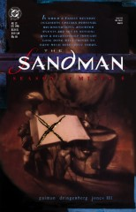

## Issue 21: "Season of Mists: a prologue"

##### Neil Gaiman, Mike Dringenberg, and Malcolm Jones III

> In which a Family reunion
> occasions certain personal recriminations;
> assorted events are set in motion;
> and a relationship thought long done
> proves to have much relevance today.

### Page 1

> [marginThumb] 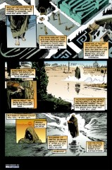

- #### Panel 1

  Destiny is the eldest of the Endless.

- #### Panel 2

  Also note the labyrinthine structure and signs of ancient decay in Destiny's garden.

  It may be that Destiny's garden is a reference to the short story "The Garden of Forking Paths" by Jorge Luis Borges, an Argentine writer known in literary circles and often mentioned in the same breath as Gabriel Garcia Marques, Italo Calvino and Umberto Eco. This story is a meditation on time, destiny, and death. It will be found in the collection _Ficciones_.

  The title "The Garden of Forking Paths" refers to a labyrinth which is in fact a book. Ts'ui Pên, the ancestor of one of the characters, was a Chinese bureaucrat who retired to write a book and to construct a maze in which anyone could lose themselves. The book and the maze were the same thing. It is concerned with the bifurcation of reality into possible futures and the simultaneous existence of possible realities and lives, using the metaphor of paths in a maze.

  One of the characters says

  > "_The Garden of Forking Paths_ is a picture, incomplete yet not false, of the universe such as Ts'ui Pên conceived it to be. Differing from Newton and Schopenhauer, [he] did not think of time as absolute and uniform. He believed in an infinite series of times, in a dizzily growing, ever spreading network of diverging, converging and parallel times. This web of time -- the strands of which approach one another, bifurcate, intersect or ignore each other through the centuries -- embraces every possibility."

  The possible connection to Destiny's book and garden is easy to see; the garden seems as important to him as the book, and both are symbols of his power and of destiny in general. It is also speculated that, to some degree, Borges was talking about James Joyce's final novel _Finnegans Wake_, because of the description of it as a confusing, contradictory, circular dream, a model of the world in which virtually any situation or story can be mirrored.

  His role as owner of The book that contains everything (a favourite theme of JLB e.g. in _The Book of Sand_, _Library of Babel_ and elsewhere), then we have Destiny's blindness. In fact, it's not clear whether Destiny is blind; anyway, Borges was.

- #### Panel 3

  Note the crosstalk between Dream and Destiny's spheres...

- #### Panel 6

  ...although there is no real crosstalk between Death's and Destiny's spheres.

### Page 2

> [marginThumb] 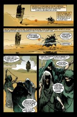

- #### Panel 2f

  These are the Three Witches, of course. As the Fates, they spin, measure, and end the lives of mortals, but Destiny is Endless. Note the thread; they are measuring, not weaving or cutting.

- #### Panel 3

  Grey Ladies is another appellation for the Three.

- #### Panel 4

  This is a prophecy. Pay attention.

### Page 3

> [marginThumb] 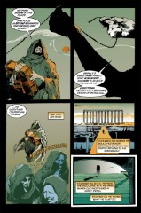

- #### Panel 2-3

  The Endless are not; as we have seen elsewhere, they have both starts and finishes. It has been stated that Destiny is the first of the Endless, while Death will be the last. Note that the thread comes to an end in panel 2 to parallel the statement about things beginning and ending. Also note in panel 3 that only one eye is visible among the Grey Ladies. This incarnation of the Triple Goddess, the Graeae, are represented as having only one eye and one tooth to share among them. Perseus stole their eye and held it hostage in return for the knowledge of the location of the sea god Proteus. Further note that the Grey Ladies appear to each have a full set of teeth.

### Page 4

> [marginThumb] 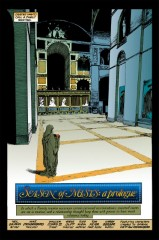

- Destiny's hall would appear to be drawn from reference. Can anyone ID it?

### Page 5

> [marginThumb] 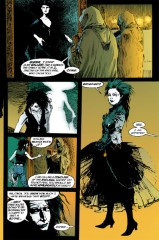

- #### Panel 1

  I suspect the specific form of the painting of Death has some reference.

- #### Panel 4

  Death in Western culture is often represented as a robed skeleton carrying a scythe.

- #### Panel 5

  See far, far below why is this appropriate attire.

### Page 6

> [marginThumb] 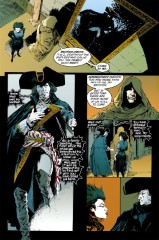

- #### Panel 1

  Again, the form of Dream's portrait may be significant.

- #### Panel 2

  Note that Dream appears exactly as Destiny expects him to; this a property of Dream we have seen before. Note that this property does not extend to Death. Also, note the small clue about the Prodigal (the missing Endless).

### Page 7

> [marginThumb] 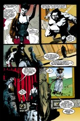

- #### Panel 1-2

  Desire and Despair have been characterized as twins before; note that Destiny appears to summon them nearly simultaneously. Note also Desire's gendering and the "formal attire" of both.

- #### Panel 4f

  Death and Despair miss the missing Endless (another clue) and Desire does not. Naively, we would expect Desire to want _everything_.

- #### Panel 5; page 8 panel 1

  This is, I believe, the first appearance of Delirium, the youngest of the Endless, whom we will learn more about shortly. Note that the picture is of Delirium's former incarnation as Delight. R.A.C. reader Tanaqui C. Weaver claims to be the initial inspiration for Delirium, though she also says that Tori Amos and Kathy Acker are additional inspirations. Delirium's red hair is probably modeled after Tori Amos. It has been speculated that Delirium's mismatched eyes also stem from that source, although several readers have reported that her eyes appear to be the same color in her videos.

  Tori Amos is from North Carolina, the daughter of a Methodist priest. She went to LA, formed a band, and recorded _Y Kant Tory Read_, which was not a commercial success. She was led by her record company to perform in London, where it was believed that people would be more receptive to her music. Her second album _Little Earthquakes_ has been out on both sides of the pond for a while now, and has had at least one video receive airplay on MTV, as well as a 1 hour special on the same network.

  Her music has been compared to Kate Bush; it is quite good, low impact acoustic music with hard-edged lyrics.

  Neil Gaiman is mentioned in her song "Tear in Your Hand" on the second album. He had not actually met Tori by the time this issue was produced, but later appearances of Delirium (and, I'm told, upcoming reminiscences about Delight) show her influence strongly.

  Kathy Acker is the author of _Empire of the Senseless_ (as seen in [Sandman #16](sandman.16.md)) as well as other works. A color picture of her can be found in issue #4 of Mondo 2000 magazine. Her hair is blonde and she apparently has a propensity for wearing black.

  As for the relation with Delirium, she was quoted as saying Burroughs had been a major influence on her work, though Foucault, Deleuze, and Guattari became more important. She is kown as a postmodernist and a feminist writer. She has spent time in London, though she is now back in the US, in San Francisco. (Delirium has a fondness for that place.) She was born in New York.

  Thus writes "Kai'Ckul" <oshinsky@webspan.net>:

  > Obviously, the Burroughs that Kathy Acker (better known for her book, _Portrait of an Eye_) is William Seward Burroughs (1914-1994) who wrote in a stream-of-consciousness style reminiscent of Delirium's voice. Burroughs was an influence also on Tori Amos, who has come out with many more songs with Gaiman references in them, including but not limited to _Horses_ " ... Maybe Neil'll make me a tree..."
  > _Space Dog_ " ... Seems I keep getting this story twisted, so where's Neil when you need him?"
  > and in her song _Hotel_ she makes a reference to Gaiman's TV miniseries/novel "Neverwhere" ("... hangin' out with the Velvets..."). Getting back to Acker, who recently died of breast cancer, she is a writer who written many stories using appropriated material, i.e. material that was taken from some other source and writer that she has used in her story, and therefore in a new context, to create something radically different than it's intended purpose. This again goes back to William S. Burroughs, who's famous "Cut-Up Technique" that he created with artist Bryon Gysin, used newspaper articles and other found sources of words to mince together to create something new and different. Just thought you'd like to know.
  >
  > Also, "Tear in Your Hand" isn't on Tori's second album, it is on her first album.
  >
  > Also also, speaking of Coleridge and butterflies and Psyche... Coleridge (who, like Burroughs, was a homosexual and a junkie; and I need not go into that whole Morpheus/Morphine thing) wrote many poems regarding Desire and Despair. He wrote, in particular, the lesbian homo-erotic gothic poem "Christabel," about a girl who gets seduced by a succubus, and a short piece entitled "Psyche," which, coincidentally enough, juxtaposes the Psyche to a butterfly.
  > hmmmmmmm...

### Page 8

> [marginThumb] 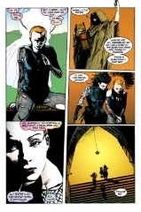

- #### Panel 4

  Note Delirium's mismatched eyes.

### Page 9

> [marginThumb] 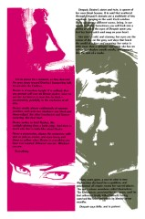

- #### Panel 1

  Desire has tawny eyes (which is reminiscent of the Paginarum Fulvarum from [Sandman #1](sandman.01.md)). However, her eyes were colored blue in her appearances in the _Doll's House_ storyline. Desire is often drawn in the style of Patrick Nagel, whose flatly colored portraits of women often have yellow eyes.

### Page 10

> [marginThumb] 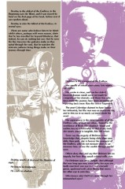

- #### Panel 2

  Coleridge was a heavy user of the psychoactive poppy derivative opium (also known as laudanum), under the influence of which he wrote many of his best-known works, the most famous being the incomplete poem "Kublai Khan".

  Opium contains 22 alkaloid compounds, including morphine, codeine, and papaverine; heroin is also derived from opium. These compounds act at central nervous receptor sites normally activated by natural compounds related to endorphins (natural pain-killers). Morphine's etymological relationship to Dream has been explicated elsewhere.

  Also, note that Delirium was once Delight, though we are not told explicitly the circumstances surrounding her change.

### Page 13

> [marginThumb] 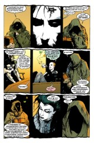

- #### Panel 3

  Trioditis as an appelation for the Three. The Graeae were three sisters of the Gorgons. Some tales represent them as being beautiful, but grey-haired from birth. Others say they were deformed, having but one eye and one tooth between them. Their shared name means "the grey ones" or "the crones".

- #### Panel 4

  Apparently, Destiny's Realm _is_ the Fates, at least in some sense. Note that Despair appears to equate the Fates with the Grey Women, although this is not precisely true. Destiny's "Choose?" is ambiguous.

### Page 14

> [marginThumb] 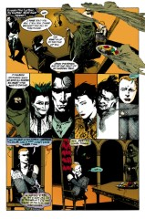

- #### Panel 1

  Note Destiny's evanescent servitors. We will see Dream's servitors in a later issue.

### Page 16

> [marginThumb] 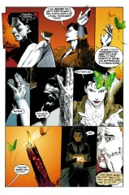

- #### Panel 3

  At least one source alleges that the Greeks believed that butterflies were attracted to flames. The word "Psyche" is the personification of the human soul, rendered as a female figure in art. The source claims that in time psyche also came to mean butterfly.

### Page 17

> [marginThumb] 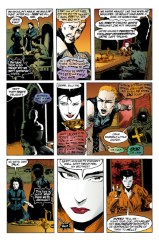

- #### Panel 6

  We may note that many shamanic religions believe the use of hallucinogens (delirium-inducers?) brings visions and knowledge.

- #### Panel 9

  Desire explains itself on the next page.

### Page 18

> [marginThumb] 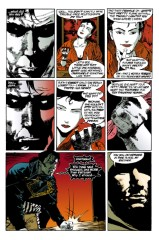

- #### Panel 2

  We saw hints of Dream's relationship with Calliope in [Sandman #17](sandman.17.md).

- #### Panel 3

  This is new, and will be more fully developed in a later storyline.

- #### Panel 3,5

  This is in reference to Nada's earlier appearances in [Sandman #4](sandman.04.md) and [#9](sandman.09.md).

### Page 19

> [marginThumb] 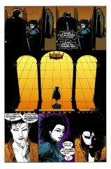

- #### Panel 6

  Does Desire actually feel regret at this moment?

### Page 23

> [marginThumb] 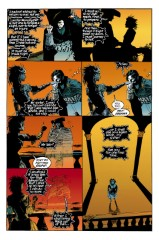

- #### Panel 1

  In reference to Lucifer's perceived humiliation in the loss of a demon to Dream in [Sandman #4](sandman.04.md).

## Credits

- Originally collated and edited by Greg Morrow.
- Jim W Lai <jwtlai@watcgl.waterloo.edu> noted Destiny's garden's structure and explicated the Grey Ladies. He also noted the use of hallucinogens to initiate visions and the Greek myth of butterflies.
- Dennis C Hwang <hwa5@midway.uchicago.edu> spoke at some length on opiates and Coleridge.
- Mighty Bill Sherman (sherman@oak.math.ucla.edu) orated on "The Garden of Forking Paths" and its similarity to Destiny's garden.
- Tanaqui C. Weaver (cen@vax.oxford.ac.uk) told us about the creation and influences of Delirium; Jim added some biographical information on Kathy Acker.
- Tanaqui also noted important thematic bits of the Grey Ladies, the picture of Delight, Destiny's servitors, and the changing paths of the Garden.
- Michael Bowman <mbowman@andromeda.rutgers.edu> gave biographical information on Tori Amos. He also forwarded a note from Graham
- <graham@itmel.bhp.bhpmel02.telememo.au> about Tori & Delirium & Neil Gaiman.
- Elisabeth Riba (lis@chaos.cs.brandeis.edu) notes Desire's eye color.
- "Kai'Ckul" <oshinsky@webspan.net> commented on 'Burroughs'
- Ralf Hildebrandt added more details.

- And finally, Doug Atkinson (douga@yang.earlham.edu) presents:

#### TOP 10 REASONS WHY DESTINY CONSIDERS DEATH'S CLOTHING APPROPRIATE:

10. Destiny's a traditionalist, and his idea of what fashion should be crystallized somewhere in the 16th century.
11. Destiny harbors a secret dislike for Death, and enjoys getting on her nerves in little ways wherever he can.
12. When Destruction left, Destiny drew up a charter of rules for family gatherings, and Death's outfit was in there.
13. Since the Endless embody concepts, they affect some sort of cosmic balance, and Death was violating the "equal geekiness" level of cosmic fashion balance. (Dream more than makes up for it in this issue, though, with the tricorner hat.)
14. Destiny acquired a truckload of those dresses a while ago, and needs to do _something_ with them.
15. Destiny was annoyed because Death was behind on her mail _again_ and missed the "black tie only" line in the announcement of this shindig.
16. Destiny likes to go to first causes. When the first race capable of perceiving Death arose, they perceived her in that outfit (as well as all the others in theirs) and, as far as Destiny's concerned, that clinched it. (Destiny's also smug because he got to choose his own outfit, by surreptitious application of Liquid Paper to his book.)
17. Destiny realized that he needed to comment on the outfit, so she'd change it, causing a note of this fact in the annotations, and a subsequent irreverent post postulating improbable reasons, in order to fulfill some ineffable cosmic balance.
18. One of the creative staff has a petticoat fetish.
    **AND THE NUMBER ONE REASON WHY DESTINY CONSIDERS DEATH'S CLOTHING APPROPRIATE**:
19. Destiny's afraid that seeing Death in the tank top would arouse those incestuous urges again, and he doesn't want a repeat of the "Delight Incident."
