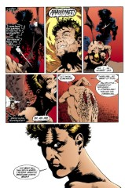

# The Annotated Sandman

## Issue 23

> [!THUMBNAIL] 

##### Neil Gaiman, Kelley Jones, and Malcolm Jones III

Season of Mists Chapter 2

> In which the Lord of Dreams returns to Hell;
> his confrontation with the Lord of that realm;
> in which a number of doors are closed for the last time;
> and of the strange disposition of a knife and a key.

Not yet reprinted in any other form

**Note**: Neil Gaiman has demonstrated a thorough familiarity with Milton, and _Sandman_ is rife with allusions to _Paradise Lost_ whenever Lucifer appears. We'll attempt to cover the explicit references, but the interested reader is directed to turn to the original.

**Title**: I have chosen to use the interior designation of the title. The cover version of the title reads "...returns to Hell, and his confrontation..."

### Page 1

> [!THUMBNAIL] 

- #### Panel 3

  Dream's helmet is designed to resemble a gas mask; here we see most clearly that it is not. Note that the trunk appears to be a spinal column; we know from an earlier issue that the helmet was made from the bones of a dead god. We see that that is literally true.

### Page 2-3

> [!THUMBNAIL] 

This is a double page splash panel. "I can open doors":
foreshadowing.

### Page 4

> [!THUMBNAIL] 

- #### Panel 3

  What is "Weep-Not"?

### Page 8

> [!THUMBNAIL] 

- #### Panel 7

  Note the beads of sweat on Dream's brow.

### Page 9

> [!THUMBNAIL] 

- #### Panel 5

  In Western tradition, rulers refer to themselves in the first person plural.

### Page 10

> [!THUMBNAIL] 

- #### Panel 1

  What is the "Starving Jubilee"?

- #### Panel 2

  The Silver City is where the angels dwell. Although it is later stated that the Silver City is not Heaven, it may be treated as a euphemism for Heaven. It appears in both [Sandman #24](sandman.24.md) and _Books of Magic_ #1. The Fields of Paradise probably harkens back to the Greek Elysian Fields, where only the finest dead go.

- #### Panel 3

  We may note that in Roger Zelazny's Amber series, Amber at first is believed to be the real world, and all other worlds merely shadows of it; later it is learned that the Courts of Chaos sit in polar opposite to Amber, and all worlds are shadows of both. This is reminiscent of Lucifer's description here. We may also note what appears to be a sea of blood; another such sea appeared in the realm of Faerie in _Books of Magic_ #3.

- #### Panel 5

  The torture of this person, identified on the next page, is reminiscent of the Clive Barker film _Hellraiser_, where evil Cenobites take away, to be tortured those who summon them.

### Page 11

> [!THUMBNAIL] 

- #### Panel 1-2

  Breschau of Livonia. No reference for Breschau, but Livonia is a Baltic land. The Livs (whence "Livonia") were known in Alexander the Great's time. Like the other Baltic regions, Livonia was fought over by Poland, Russia, and the other large powers of the region, as well as being involved in conflicts with other Baltic provinces. It lost the final vestiges of its individuality in 1918, with the formation of Latvia and Estonia. Livonia was divided between the two.

### Page 12

> [!THUMBNAIL] 

- #### Panel 1

  Breschau, obviously, held sway in Livonia c. 900 AD.

- #### Panel 2

  My source appears to indicate that Christianity was not brought to the Baltic regions before 1186 AD (although they would certainly have had contact with it by the German invasions in the 11th century). If this is so, Breschau could not have been Christian.

### Page 13

> [!THUMBNAIL] 

- #### Panel 1-2

  "Rimmon-my-petal" is a giant baby with a cobra for an umbilicus. "Ketele" has a wolf's head on an preying mantis's body. No identity given for the third figure. Rimmon (The Thunderer) was a Babylonian or Assyrian storm god, often called Adad, and known as Martu by Amorites, Kur-Ga (Great Mountain) by Canaanites, Hadad by Syrians, and Teshub by Hittites.

### Page 14

> [!THUMBNAIL] 

- #### Panel 4

  The best guess for the age of the solar system is around 8 billion years, with the entire universe perhaps 18 billion years old. The possible error in the age is ten billion years either way. We have seen in _Swamp Thing_ that aliens who die near Earth go to human afterlives, rather than to the place of their own creed, although _Sandman_ has hinted that the dead go where they think they should. We may note that on Dante's trip through _Inferno_, he met only Italians. We have also seen, with the Endless, at least, that appearance is mostly a question of expectations. At the least, we infer that Lucifer's hell is local to Earth, which also leads us to conclude that the Creator infested ten billion years preparing damnation for only about a quarter million years' worth of humanity's existence. Kind of gives you an exaggerated sense of importance.

### Page 15

> [!THUMBNAIL] 

- #### Panel 1

  Samael, as seen before, was Lucifer's angelic name.

- #### Panel 3

  The angel with the flaming sword is, I believe, Gabriel.

  Although Gabriel (God's messenger, who holds the flaming sword [although it has been inferred that the flaming sword spoken of is in fact another angel entirely, Azrael, who's name means, i believe "the lord's trumpet" also called by Salman Rushdie, in a pun "the lord's trump" who is not only the angel of death, but also the messenger {hence "trumpet" and "trump" and the connection with Gabriel} of the Apocalypse]) is said to have a flaming sword, it is thought only o be symbolic of his eventual role in the Apocalypse.

  Other angels known to have flaming swords, which Gaiman my very well be referring to, are the Seraphim, six-winged angels of God's Wrath, who are said to have six wings. These were the angels who stood (and supposedly still stand) guard at the gates of Eden, blocking the entrance for the sons of Adam (the reference to closing gates here should not be ignored). They are supposed to be in the upper ring of angels (I think the sixth, but as I do not have my copy of The Dictionary of Biblical, Classical and Literary Allusions with me, I can't be sure.) one level above the more famous Cherubim. Here:

  > 1. Seraphs stood in attendance on Him. Each of them had six wings: with two he covered his face, with two he covered his legs, and with two he would fly.
  > 2. And on would call to the other 
  >    "Holy, Holy, holy! 
  >    The LORD of Hosts! 
  >    His presence fills all the earth!" 
  > 3. The doorposts would shake at the sound of the one who called, and the House kept filling with smoke . . . . 
  >    -Isaiah, 6:1-3

  What the Seraph says is a well known prayer, known as the "Kadosh," but the rest is new to me. Hope it sheds some light on the subject.

- #### Panel 4

  Raguel (Friend of God) is one of the seven archangels listed in the Enoch writings. He is an angel of earth, a guard of the 2nd or 4th Heaven. He "takes vengeance on the world of luminaries", which is interpreted to mean that, for cause, he brings other angels to account. His name is also spelled Raguil, Rasuil, Rufael, Suryan, and Akrasiel. Sandalphon (co-brother) is the angel who stands on Earth with his head reaching to the door of Heaven, in Jewish folklore. The extremely late poet Henry Wadsworth Longfellow wrote a poem entitled "Sandalphon" in which the angel "gathers the prayers" of the faithful and turns them into flower "garlands of purple and red". He is the Angel of Glory and the Angel of Prayer.

- #### Panel 5-7

  This sequence is especially reminiscent of Milton's _Paradise Lost_.

### Page 16

> [!THUMBNAIL] 

- #### Panel 2

  Among the torture implements, note the swinging blade on the right; a similar blade was used in Edgar Allan Poe's "The Pit and the Pendulum."

### Page 17

> [!THUMBNAIL] 

- #### Panel 1-2

  This gate would appear to be made from flesh. The pillars resemble human intestines.

- #### Panel 3

  The Demon Etrigan, who is the star of his own series and who has been referenced before, is a rhyming demon.

### Page 18

> [!THUMBNAIL] 

- #### Panel 2-3

  Again, revisionists and apologists have often cast Lucifer as a long-suffering victim of sin's effects, rather than the agent of sinning. Lucifer need not be being truthful here, though he equally well might be, or possibly somewhere in between.

### Page 19

> [!THUMBNAIL] 

- #### Panel 2

  Limbo is generally assumed to be a realm of nothingness. The Far Realms would appear to be little more than mythical lexical wordplay.

### Page 19-20

> [!THUMBNAIL] 

- It is somewhat unclear what is occurring on these two pages. On 19, Lucifer and Dream appear to exit a gate (and note that it is entirely unclear whether Lucifer is the last out, as he predicted). On page 20, however, Lucifer locks a floating lump that does not seem to be attached to anything, and announces that the last of the gates is closed, even though page 19 panel 5 clearly shows the two well outside Hell's wall.

  Perhaps the most reasonable guess is that Dream and Lucifer exited Hell through the main gate, then proceeded to a lesser gate and locked it from the outside. This strikes me as a very odd sequence for a closing down of such mythic import.

### Page 21

> [!THUMBNAIL] 

- #### Panel 1

  We saw this creature in the previous issue, although she was not identified there.
  Thus spoke <emble@aol.com>:

  > Mazikeen, or Shedeem.
  > A species of beings in Jewish mythology resembling the Arabian Jinn said to be agents of magic and enchantment. When Adam fell, says the Talmud, he was excommunicated for 130 years, during which time he begat demons and spectres.
  >
  > There's a sub-entry:
  > Swells out like the Mazikeen ass.
  > The allusion is to a Jewish tradition that a servant, whose task it was to rouse the neighborhood to midnight prayer, one night mounted a stray ass and neglected his duty. As he rode along the ass grew bigger and bigger, till at last it towered as high as the tallest edifice, where it left the man, and there next morning he was found.
  >
  > Neither of these are terribly fitting or helpful, but at least it's a reference - and this is Brewer's, so it's very likely that this is where Neil got the name.

- #### Panel 2

  "No. You are still my Lord. I will not forsake you. I love you, master." Mazikeen is drawn with much more detail this issue; the musculature is clearly evident, where she appeared more skull-like in [#22](sandman.22.md).

- #### Panel 3

  Lilith is a demoness in tradition.

- #### Panel 4

  "Lucifer, where you go, I will follow. Let me go with you. Please. I must stay by your side for ever."

- #### Panel 5

  "Sire?"

### Page 22

> [!THUMBNAIL] 

- #### Panel 1

  Nice tongue-kiss there. Note Mazikeen's trachea.

- #### Panel 3

  Is Lucifer destroying Mazikeen here, or is he sending her on
  to where the other demons are?

- #### Panel 5

  Lucifer must lose his wings as the last vestige of his status. Though it is virtually certain that Lucifer could choose to look as if he did not have wings, he must actually have them cut off in order to effect lasting change.

### Page 23

> [!THUMBNAIL] 

- #### Panels 1,4,5

  Note that Dream is cutting Lucifer's wings off several inches above their root, although in panel 5, Lucifer's wounds are clearly at the skin's surface, with no remnant of the wings. Probably, Dream cut high and sloppy to remove the major portion of the wings--can't have them flopping about during surgery--then went back off-panel and excised more carefully.

## Credits

- Originally collated and edited by Greg Morrow.
- As always, Bill "Tank" Sherman (sherman@math.ucla.edu). Bill brings up Milton, Hellraiser, Etrigan and the flaming swordsangel.
- Jim W Lai <jwtlai@jeeves.waterloo.edu> refers to Amber, Poe, spots a typo, mentions Lilith, and philosophizes about shapechangers.
- Martin Terman (mfterman@phoenix.princeton.edu) opines about the Silver City, creation, Hell, sin, pinionectomies and Lucifer's state of mind.
- Michael Bowman <mbowman@andromeda.rutgers.edu> hit the library floor a-running to look up Weep-Not, Rimmon, Raguel, and Sandalphon. (Michael, the saying is "Waste not want not", not "Weep not...")
- <emble@aol.com> added more background on Mazikeen
- Ralf Hildebrandt added more details.
