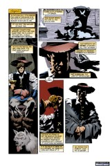

# The Annotated Sandman

## Issue 24

> [!THUMBNAIL] 

##### Neil Gaiman, Kelley Jones, and P. Craig Russell

Season of Mists Chapter 3

> In which Lucifer's parting gift attracts unwanted attention;
> and the Dream Lord receives unwelcome visitors.

Not yet reprinted in any other form

**Note**: I have a bootleg copy of the script for this issue; I'll be interpolating notes from it as I did for [Sandman #17](sandman.17.md).

### Page 1

> [!THUMBNAIL] 

This is characterized as "the ninth century Norwegian idea of what a great palace should be". Kelley is cautioned to "Forget all the Kirbyish SF stuff." Colorist Steve Oliff is also cautioned to "get as far from the brightly coloured Kirby Asgard as you can here: This is the Asgard of the old Norse, a bitter dangerous place." (Jack Kirby was the original artist on Marvel's _The Mighty Thor_, and his unique style was most certainly not traditionally Norse.)

Odin himself is described as a tall, pale Lee Van Cleef.

- #### Panel 1

  **Norse mythology in a bottle cap**: Odin is king of the gods, or Aesir. They all dwell in Asgard (city of Aesir, gard is a fence around something, and the word came to mean the thing enclosed by the fence, a city. (Gar\360ur is a modern Icelandic word meaning garden, a thing defined by it's fences ;-)). Odin's personal hall is named Gladsheim (-heim = home, pronounced with a long `a' sound in Icelandic). Odin is attended by two wolves. The script calls for the wolves' eyes to be green, though they were printed red. Odin traded one eye to Mimir for a drink from the Well of Wisdom.

- #### Panel 3

  He was also attended by Hugin and Munin, Thought and Memory, two ravens. The script appears to indicate that Odin absorbs Hugin and Munin; they're supposed to fade away over the next two panels.

- #### Panel 4

  **Kvasir**: Translates as "Spittle". He was the wisest of men, born from spittle when the Aesir and Vanir gods spit into a cauldron. He was killed by the dwarfs Fjalar and Galar, who wanted his magic powers. After Kvasir's death, his blood was distilled in the Odhrerir, the magic cauldron, and gave wisdom and the art of poetry to any who drank it. He personifies mead. All-Father is an appellation of Odin.

### Page 2

> [!THUMBNAIL] 

- #### Panel 2

  Sigyn, whose name translates as "Victory Giver", is the wife of Loki, whose torment as shown here is well-established in Norse myth. In fact, Gaiman's description is clearly inspired by _Bullfinch's Mythology_. Loki was imprisoned for his causative role in the death of Baldur.

### Page 4

> [!THUMBNAIL] 

- #### Panel 4

  Loki was the son of giants, but became allied with the Aesir when he swore blood-brotherhood with Odin. He is a trickster, always out for the main chance. He will be on the side of the giants in Ragnarok, the Twilight of the Gods. His children by Sigyn are Vali and Nari (alt. Narvi). When Loki was captured, his sons fled. Vali was changed into a wolf by the Aesir, and subsequently killed Nari and disemboweled him. Nari's entrails were then used to bind Loki. (This is as given in the _Prose Edda_; the _Lokasenna_ has the sons' roles reversed.) Loki's children by the giantess Angrboda are Jormungander, the world serpent; Fenris, the wolf; and Hel, the goddess of Death.

- #### Panel 5

  Note the scars around Loki's lips where they were sewn together with leather thongs, by a dwarf using an awl. Ymir was the first being; all of creation was formed from his body.

### Page 5

> [!THUMBNAIL] 

- #### Panel 1-2

  This is probably a passage from the Elder Edda, a long saga in Old Icelandic that is the source for most Norse myths. The ship of nails is named Naglfar.

- #### Panel 3

  All these places are from Norse myth.

### Page 6

> [!THUMBNAIL] 

- #### Panel 1

  These are Dream, Matthew, Lucien, and Cain. Lucien "sits like someone who doesn't sit very often and isn't very good at it." Cain is supposed to look much more like Berni Wrightson's 1972 model; [Sandman #22](sandman.22.md) is described as the "total destruction of everything [Cain] felt he was"; I disagree with that description for reasons given in that annotation. Note the eyes in the background shadow; this is a "grotesque thingie", looking at Dream in surprise. His return was supposed to be extremely unexpected, though I get no sense of this from the published work.

### Page 8

> [!THUMBNAIL] 

- #### Panel 1

  This is Thor, the son of Odin and the Earth Goddess. Thor is the thunder god, and incredibly strong. His hatred of Loki is longstanding.

- #### Panel 2

  Thor's weapon is the hammer Mjolnir. When Mjolnir was constructed by the dwarfs, a trick by Loki caused its handle to be too short to use properly. Now, Norse war hammers were two handed weapons, so Mjolnir's short handle simply means that it was too short to allow the hands to grip far enough apart to get good leverage. Thor was able to use the hammer without the "necessary" leverage because of his great strength. Some references, including _Bullfinch's_, make the mistake of assuming that Thor had small hands to fit the small handle, which leads to such amusing depictions as that given here. In fact, Mjolnir probably resembled Marvel Comic's depiction more closely (normal-sized, but clearly only usable one-handed) than this depiction.

- #### Panel 5

  Thor's chariot was drawn by two goats named Tanngnost and Tangrisni. At night, Thor's party could slaughter and eat the goats, and in the morning the skin and bones would become living again. In one of Loki's exploits, he tricks a human into cracking one of the goats' bones for the marrow, causing the goat ever after to be lame, and incurring Thor's not inconsiderable enmity. The script mentions Odin's horse, Sleipnir, who had eight legs.

### Page 9

> [!THUMBNAIL] 

This is described in the script as Dream's private quarters, which we've never seen before.

### Page 11

> [!THUMBNAIL] 

Chaos and Order are two opposed sets of beings often seen before in DC comics. In one form or another, Dr. Fate is an agent or an actual Lord of Order, as is Amethyst. Hawk and Dove were the incarnations of Lords of Chaos and Order respectively. Generally, Order = Good and Chaos = Bad, though each writer writes Order and Chaos in different and incompatible ways. The major portion of the mythology of Order and Chaos was established by Martin Pasko in Dr. Fate, then completely abrogated by JM deMatteis. Barbara Kesel, Keith Giffen, Paul Kupperburg, William Messner-Loebs, and Grant Morrison have also contributed in comics.

DC's Lords of Order and Chaos go back to More Fun Comics#55 (first appearance of Doctor Fate).

The script suggests blurred photocopies of fractal images for panels representing Chaos, which I don't think Kelley used. We may note, however, that Chaos appears to be Order as seen through a funhouse mirror.

### Page 12

> [!THUMBNAIL] 

- #### Panel 1

  Dream is in his gallery. The sigils of the Endless are arrayed left to right in order of age. Destiny's book is first, then Death's ankh. Next we see Dream's face, as if in a mirror, then the missing sigil of the Prodigal, then the heart of Desire. Note: When we saw Desire's gallery, we saw her face for her sigil, and Dream's helmet for his. This suggests an obvious rule for such galleries.

### Page 14

> [!THUMBNAIL] 

The Silver City is new. It has also appeared in _The Books of Magic_ #1. My own personal feeling is that where the angels dwell is necessarily at least a part of Heaven, but this is not born out by the text. I doubt I need to explain what angels and Heaven are.... The scripts notes that all angels have the same face, and Gaiman suggests Jane Morris, who sat for many of the pre-Raphaelite painters; Barry Windsor-Smith's adaptation of _Red Nails_ used Morris as an inspiration for Valeria.

### Page 15

> [!THUMBNAIL] 

- #### Panel 1

  Remiel is one of the 7 archangels who attend the throne of god, as stated in Enoch 1:20. He is called Jeremiel or Uriel in various translations of IV Esdras, and described as "one of the holy angels whom God has set over those who rise [from the dead]."

  Duma, which may mean "silence", is an angel of death in Jewish folklore, to whom one has to give account. He is the angel of silence and the stillness of death. He is also the tutelary angel of Egypt and of vindication, and at least one source calls him a "Prince of Hell", ie, one of the Fallen angels. _The Zohar_ speaks of him as having "tens of thousands of angels of destruction" under him, and as being "chief of demons in Gehinnon [Hell; a more familiar spelling is "Gehenna"] with 12,000 myriads of attendants, all charged with the punishment of the souls of sinners." Dumah is also the name given to the guardian of the 14th gate, through which the goddess Ishtar passed on her journey to the underworld in Babylonian mythology. I am told that Neil did not know of the sources listing Duma as one of the fallen when he was writing this story!

### Page 16

> [!THUMBNAIL] 

- #### Panel 1

  This is Azazel, who once believed himself to be one of the three rules of Hell. We saw him earlier in [Sandman #4](sandman.04.md).

- #### Panel 4

  Daemon is just another word for demon. Gaiman suggests Joel Peter Witkin for the feel of the congregation of nasties.

### Page 17

> [!THUMBNAIL] 

- #### Panel 2

  Merkin, mother of spiders: Merkin \Mer"kin\, n. Originally, a wig; afterwards, a mop for cleaning cannon.

  According to several of my friends, independently, (although I've never found a dictionary that backs this up) a "merkin" is a specific type of wig applied to a part of the female anatomy that's usually not visible...

  Gaiman recommends Witkin's "Amour" as a source.

- #### Panel 3

  We saw Choronzon once before, in [Sandman #4](sandman.04.md). He held Dream's helmet, and was bested in a game of reality.

- #### Panel 5

  Nada was seen in [Sandman #4](sandman.04.md), 9; she is an erstwhile lover of Dream, whom he cruelly imprisoned in Hell.

### Page 18

> [!THUMBNAIL] 

- #### Panel 1

  In [Sandman #22, page 22](sandman.22.md#page-22), we saw Dream's castle in the sea; here's it's on a hill. This should surprise no one.

- #### Panel 2

  Gaiman characterized this mountain as a "Brian Froud" mountain.

- #### Panel 3

  The cave symbolizes the womb in Freudian dream analysis, and also echos the earth mother archetype.

- #### Panel 4

  This is Eve's cave, where Matthew dwells when Dream does not need him. Eve was referenced in the annotation to [Sandman #2](sandman.02.md). The cave is characterized as being on the border of dream and nightmare.

- #### Panel 5-7

  Notice Eve's youthing.

### Page 19

> [!THUMBNAIL] 

- #### Panel 2

  This is a statue of the griffon who guards the Dreaming's gates. Apparently, Gaiman was not satisfied with Kelley's rendition of the griffon in [Sandman #18](sandman.18.md), as he instructs him to check out a reference and get it right. Note that the script explicitly states this is a statue, from which the voice of the griffon at the gate comes. We may note that griffons classically have eagle's wings as well as eagle's heads.

### Page 21

> [!THUMBNAIL] 

- #### Panel 2

  The dragon, griffon, and winged horse are the usual guardians of the Dreaming gate. The script characterizes the dragon as a wyvern; the difference is negligible. It characterizes the winged horse as a hippogriff; this is wrong, as a hippogriff, the offspring of a griffon and a horse, traditionally has an eagle's head. Note the human headed beasts on the walls.

  They are the winged bulls which appeared on Assyrian palaces. They are made of the bearded head of a man, the body of a lian, the wings of an eagle, and the feet of a bull, although here they appear similar to sphinxes. Ezekiel's vision may have been associated with these figures carved into the sides of walls.

### Page 22

> [!THUMBNAIL] 

- #### Panel 2

  Anubis, Bast, and Bes are deities of Egyptian origin. Their spheres of influence are accurately given here, although Bes was also a god of luck and fertility.

- #### Panel 3

  This god is a figure in Japanese Shinto mythology.

  Izanagi (the male who invites) and his younger sister Izanami (the female who invites) were born soon after the separation of Heaven and Earth, and are the primeval creator gods of the cycle. They are the ancestors of many Shinto gods as well as of the principal islands of Japan. Izanami is also called the Great Spirit of the Land of Night. The two gods parted on poor terms, with Izanami threatening to strangle a thousand people a day, and Izanagi threatening to have a thousand and five hundred women giving birth per day if she followed through.

  After visiting the underworld one time, Izanagi washed himself. The sun goddess, Amaterasu Omikami (Great-Sky-Shiner, or the Great Shining Heaven) resulted from his washing his left eye, the moon god (Moon-Darkness-Possessor) from the right eye, and Susano-o-No-Mikato (Brave-Swift-Impetuous-Male) from his nose.

  Susano-O-No-Mikoto is the god of thunderstorms, who always shouts. He is both good and evil, often displaying the traits of a trickster. He was annoyed by some small thing, and destroyed Amaterasu's fields. His excesses caused her to hide in a cave, plunging the entire world into darkness, creating winter. She was eventually lured back with a sword, jewel, and mirror, that eventually became the Imperial Regalia.

  Gaiman's portrayal of the storm god, who would appear otherwise to have much in common with Thor, is noticeably affected by Westerners' myths of Japan. The affected speech pattern and characterization in later issues are respectively stereotypical views of the _Chinese_ Imperial Court, and of the modern Japanese economic expansion.

  Two good sources for this material are the Nihongi, the Chronicle of Japan, and Joseph Campbell's _The Masks of God: Oriental Mythology_.

### Page 23

> [!THUMBNAIL] 

- #### Panel 1

  The slave of Order is meant to look like a genie. The script reads "I have to do something with genies in Sandman one day." Kilderkin is not a previously known Lord of Order.

- #### Panel 2

  Shivering Jemmy of the Shallow Brigade is not a previously known Lord of Chaos.

## Credits

- Originally collated and edited by Greg Morrow.
- Lord Drizzan <STU_GLMCELHA@VAX1.ACS.JMU.EDU> points out references for Order and Chaos and the Silver City.
- Bill "Mr. Peabody's Boy" Sherman <sherman@math.ucla.edu> names the ship of nails and corrects Gaiman's spelling of Brian Froud.
- Scott Emery <emery@pioneer.arc.nasa.gov> explicated Susano-o-no-Mikoto, as did Jim W Lai <jwtlai@jeeves.waterloo.edu>, and Nathan D. Johnson (ndj20710@uxa.cso.uiuc.edu).
- Jim also looked at looked at order and chaos, womb-symbols, and fabulous Assyrian creatures.
- Andrew David Weiland (aw1s+@andrew.cmu.edu) gave some Norse references, mentioned Michael Moorcock, and looked at Remiel and Duma. Sasha (sasha.bbs@cybernet.cse.fau.edu) also corrected my list of Loki's enfants terribles.
- Michael Bowman <mbowman@andromeda.rutgers.edu> hit the reference works for reams of data on Norse figures, Judeo-Christian figures, Babylonian critters, and Shinto myth.
- Tanaqui C. Weaver (cen@vax.oxford.ac.uk) also confirmed some Norse and Shinto myths.
- Mike Chary (charyma@WKUVX1.BITNET) gave a detailed explanation of Thor's hammer.
- Ian Lance Taylor (ian@airs.com) also gave some Norse references and checked the Gates of Babylon for my ephemeral memory, which was incorrect:

  > The Gate of Babylon (the Ishtar Gate, or the Gate of Semiramis) had alternating rows of two animals. One was the aurochs (the aurochs was named the reem in the Hebrew bible; the Septuagint bible translated this to monokeros, thus leading to the belief that the unicorn was mentioned in the bible and hence must be a real animal). The other animal on the gate was a lizard like beast named the sirrush, or the Glamour Snake, or the Dragon of Babylon.

- Tom Galloway (tyg@Ileaf.hq.com) came up with some references about Order and Chaos, and a quote about Loki:

  > "In the Norse mythology Loki originally was on the side of the rest of the gods, helping them once or twice using a particularly nasty form of trickery. He was a cunning negotiator with a talent for technicalities. He was sort of the Norse equivalent of a lawyer, no doubt the reason they tied him down in a pit dripping acidic venom on him." --Martin Terman

- Kull29@aol.com for the bit about the Lords of Order and Chaos!
- Ralf Hildebrandt added more details.
