> [marginThumb] 

# Issue 25: "Season of Mists Chapter 4"

##### Neil Gaiman, Matt Wagner, and Malcolm Jones III

- Fourth part of storyline, _Season of Mists_
- Fifth story reprinted in trade paperback _Season of Mists_
- Audible Act II Chapter 5

> In which the dead return;
> and Charles Rowland concludes his education.

### Page 1

> [marginThumb] 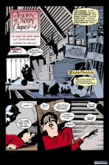

- #### Panel 1

  We are in the attic of a British boarding school. Visible are a deer head, a sporting team picture, a soccer ball [football], a cricket bat, golf clubs, and a bust. What Americans call soccer, the rest of the world calls football (Fussball in Germany); In Australia, soccer is soccer and "football" is Australian Rules Football. I think that in New Zealand "football" is rugby, but it may be wise to confirm with a New Zealander; cricket (according to Douglas Adams the most stupid game in the universe) is a British game with some superficial resemblance to American baseball game. We have not met Charles Rowland before.

- #### Panel 2

  Nor have we met Paine, whose name may be symbolic. "Paine" is his surname, by the way.

### Page 3

> [marginThumb] 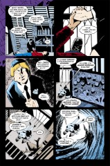

- #### Panel 3

  It should probably be noted that boarding school students are typically required to wear school uniforms, such as Paine's in this panel.

### Page 4

> [marginThumb] 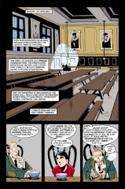

- #### Panel 1

  A headmaster is the rough equivalent of an American principal.

### Page 5

> [marginThumb] 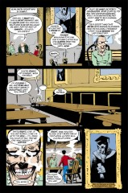

- #### Panel 1-3

  In August 1990, Iraq, led by Saddam Hussein, invaded Kuwait, taking the many foreign citizens there hostage, including Charles Rowland's father, apparently. However, by December, which is the date of this story, most of the hostages had been released, although I don't remember the exact time when the last healthy males were freed.

- #### Panel 5

  **San.**: Sanatorium.  Common terminology for the infirmary for sick students in British boarding schools.

  **Natter**: Chat.

### Page 6

> [marginThumb] 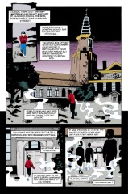

- #### Panel 1

  St. Hilarion was a follower of St. Antony, born in the 4th century in Tabatha, near Gaza and educated in Alexandria. After his conversion, he returned home (after his parents' death), gave away all his possessions, and became a hermit. He was very austere. He gained renown, and performed many acts of healing. He died in Cyprus at the age of 80. In the Roman Catholic Church, possibly the Church of England as well, his day is 21 October.

### Page 7

> [marginThumb] 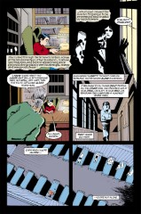

- #### Panel 1-2

  _The Scarlet Pimpernel_ (by Baroness Orczy) was an adventure tale featuring a masked hero, a master of disguise, who helped spirit French nobles to England during the French Revolution.

  The titular character was one of the earliest examples of a hero with a secret identity; as such, it is historically important to comic books. As the Pimpernel's secret identity was a foppish nobleman, the book almost certainly helped Bill Finger create the "playboy Bruce Wayne" image for Batman. A scarlet pimpernel is, incidentally, a small red flower.

- #### Panel 3

  **Lights-out**: mandatory bedtime for students and soldiers.

  **Spit-spot**: British interjection full of sound and rhythm, meaning nothing.

  Exemplified for Americans by the title character in the movie _Mary Poppins_.

### Page 9

> [marginThumb] 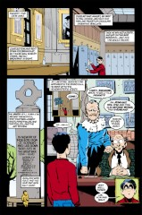

- #### Panel 2

  American cookies are British biscuits; the digestive biscuit is a thin, tan cracker resembling a Graham cracker. Some folks think they're excellent.

- #### Panel 3

  At least two of the names on the memorial will shortly become relevant. However, the others do not ring any bells.

### Page 10

> [marginThumb] 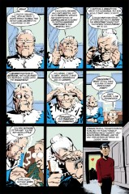

- #### Panel 2

  **Hunnish**: German. I could not say, however, exactly what allegedly deviant or barbarous acts Germans are wont to perform. The prejudice probably stems from anti-German propaganda or folklore during the World Wars, a period during which "Mother" is likely to have been alive, and young enough to be impressionable.

- #### Panel 4

  Wagner draws all dead persons with blank eyeballs; this does not necessarily indicate that "Mother" is blind from cataracts. See page 3 panel 3 for another example.

### Page 11

> [marginThumb] 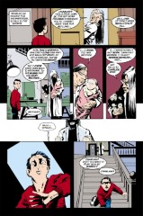

- #### Panel 4

  German measles, or rubella, will cause birth defects if contracted during pregnancy.

### Page 13

> [marginThumb] 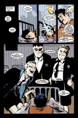

- #### Panel 1

  **Bug**: probably not significant slang.

- #### Panel 5

  The names of Cheeseman and Barrow were on the war memorial, page 9.

### Page 14

> [marginThumb] 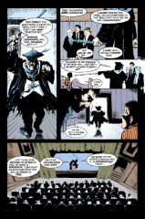

- #### Panel 2

  This is evidently the death of Paine, as recounted on page 12.

- #### Panel 5

  There is allegedly a Chinese curse, "May you live in interesting times": the curse being that interesting times are not safe times.

### Page 15

> [marginThumb] 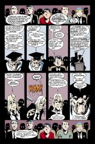

- #### Panel 1

  The headmaster is referring to a Latin proverb, "Mens sana in corpore sano": A sound mind in a sound body. Note the boy between Paine and Charles; he looks like a live boy, and he's not in uniform.

### Page 16

> [marginThumb] 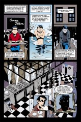

- #### Panel 1

  **Carpe diem**: Seize the day (also Latin). It may be noted that this aphorism is the main theme of _Dead Poets Society_, a film set in an American boarding school.

### Page 17

> [marginThumb] 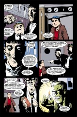

- #### Panel 3

  World War I (1914-1918) was the archetype of trench warfare. Opposing armies would dig themselves in across the battlefield from each other and shoot; occasionally one or the other would get up out of the trenches and rush toward the other army, who would shoot them down in vast quantities. Diphtheria, however, is just a nasty disease.

- #### Panel 4-5

  This hearkens back to [Sandman #23](sandman.23.md), where Lucifer disclaimed responsibility for sinners.

### Page 18

> [marginThumb] 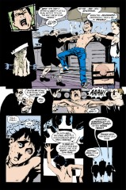

- #### Panel 2-4

  Skinner (I believe) is taking a meat fork and is apparently piercing or cutting off Charles' right nipple. Note that they are also burning his back against the grill.

### Page 19

> [marginThumb] 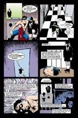

- #### Panel 5

  We learn Paine's full name.

- #### Panel 6

  Puss should be spelled pus. It's a yellow-white slime found in wounds that aren't healing well.

### Page 20

> [marginThumb] 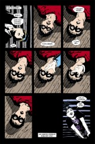

- #### Panel 9; page 21

  This is Death in easily her oddest outfit ever.

### Page 23

> [marginThumb] 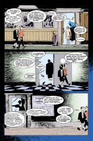

- #### Panel 1

  Mother's relationship with the headmaster is quite reminiscent of the background of many fictional serial killers.

- #### Panel 2

  British public schools have a tradition of "fagging" in which the elder boys, 16-18 or so, would select a younger boy to be his "fag" or personal servant. The fag would fetch and carry for the elder, and clean his room and uniform. The elder boy would often beat or otherwise treat the younger in a sadistic manner. This was supposed to be "character-building." (As Calvin the comic-strip star says, mimicking his father: "Calvin, go do something you hate. Being miserable builds character.")

  We may also note that standard British usage uses "fag" or "faggot" to mean cigarettes, breadsticks, lumber, and fireplace logs, as well as "homosexual". American usage of "fag" is derogatory and is exactly limited to "homosexual". British "faggot" formerly referred to a wretched old woman, whence "fag": to copulate with a whore, another obsolete usage. Much information on the world may be gathered from the British slang dictionary, _The Faber Dictionary of Euphemisms_.

- #### Panel 3

  **Cogito ergo sum**: I think, therefore I am (Latin), first stated by Descartes, a seventeenth century AD French philosopher and mathematician. Protagoras was a fifth century BC classical Greek philosopher.

  My source credits him as the first Sophist; Werner Jaeger's _Paideia_, however, denies him this, calling him only one of the most prominent.

  Note that Charles and Edwin's conversation on this page should probably be considered the theme of the issue.

## Credits

- Originally collated and edited by Greg Morrow.
- Rick Jones <albert@crick.ssctr.bcm.tmc.edu> added information about the- Scarlet Pimpernel and mentioned _Dead Poets Society_.
- Mark A Biggar (mab%wdl39@wdl1.wdl.loral.com), Michael Bowman <mbowman@andromeda.rutgers.edu>, and Jeffrey Klein (klein@kira.egr.msu.edu) explained the nature of digestive biscuits.
- Michael also researched St. Hilarion.
- Sarah Trombley <trombley-sarah@YALE.EDU> contributed bits on Descartes and Protagoras.
- Phil "Dreddhead" Birmingham (BIRMINGH@FNAL.FNAL.GOV) and Mike Collins, The One and Only Killans, (mcollins@isis.cs.du.edu) commented on Hunnish practices.
- David Goldfarb (goldfarb@ocf.berkeley.edu) corrected my Latin, and he and Mike, and Jim Cowling (jcowling@butterfly.UVic.CA) corrected my misapprehension of 'fagging'.
- Ralf Hildebrandt added more details.
- Richard Munn updated the notes on British slang on page 5.