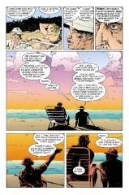

> [marginThumb] 

# Issue 28: "Season of Mists Epilogue"

##### Neil Gaiman, Mike Dringenberg, and George Pratt

- Epilogue to storyline, _Season of Mists_
- Eighth story reprinted in trade paperback _Season of Mists_
- Audible Act II Chapter 8

> In which we bid farewell to absent friends,
> lost loves, old gods, and the season of mists;
> and in which we give the devil his due.

**Cover**: Note the four characters in the lower right. They are Chinese and mean: 1. 新 "new" (xin) 2. 生 "life" (sheng) 3. 英 "baby" (ying) 4. 儿 "child" (er)

The third & fourth character are to be read together to mean "baby", all four characters together mean "newborn" (noun).

**Title**: The phrase "give the devil his due" is a cliche. It appears in Cervantes' _Don Quixote_ I.iii.3, but that may not be the original source.

### Page 1

> [marginThumb] 

- #### Panel 2

  The central figure, the most humanoid of the demons, is probably Choronzon. The fish have a number of symbolic meanings in Christianity. Jesus and his followers were known as "fishers of men" (see Matthew 4:19), symbolizing human souls as fish; the fish was also a symbol of the early Christian church, and, by extension, of Jesus himself.

- #### Panel 3

  We may have seen the big slug-like demon before.

### Page 2-3

> [marginThumb] 

- #### Panel 3 (left)

  Note that Duma has no genitals, though he does have nipples. Does he have a navel? See below. That's the key to Hell lying on his stomach.

- #### Panel 7 (right)

  Dream appears in his Kai'ckul guise for his dinner with Nada.

  Note also the amazing appearing/disappearing candelabra, which may be seen in page 4 panels 3 and 4 and page 5 panel 3, but which is missing in this panel, page 4 panel 5, page 5 panel 5, page 7 panel 5 and page 8 panel 5.

### Page 4

> [marginThumb] 

- #### Panel 5

  **The Chinese characters mean**:

  - lake (hu)
  - dragon (long) [albeit not very accurately written]
  - painting (hua)

  Of course, lakes figure quite largely in Chinese landscape paintings, and the dragon is a prominent symbol in Chinese culture, but they seem inconsonant with the painting of the birds.

  The other characters in the square block are the artist's signature, conventionally stamped with a Chinese seal, but I can't quite make them out.

  The birds are a crane and a raven, perhaps?

### Page 5

> [marginThumb] 

- #### Panel 5

  Hint, boys'n'girls. This is NOT how to apologize to anyone.

  Dream, as we have long recognized, ain't terribly bright. Jim Lai speculates:

  > Of course Dream isn't good at expressing himself in words. He belongs to the preliterate era, the subconscious, which is seldom direct (except perhaps in action), preferring symbolic meaning.

  We may also note that this panel has a different angle on the room; the room is not changing decor (except for the candelabra).

### Page 6

> [marginThumb] 

- #### Panel 2

  "Kissed it all better" sounds peculiarly modern, and idiomatic, for a queen of millennia-past Africa.

- #### Panel 3

  **Oubliette**: "Forgotten-small", from French, meaning a hidden prison such as found in certain old castles, accessible only from above. Note that this contradicts the image of Nada's cell as seen in both [Sandman #4](sandman.04.md) and [#23](sandman.24.md).

### Page 7

> [marginThumb] 

- #### Panel 5

  Another print, but of what? Probably a photostat. Is there a horse figure in the center?

### Page 8

> [marginThumb] 

- #### Panel 4

  This is the most definite statement that Dream could quit that I have seen, although we have seen strong indications that he could die or be removed. He would be replaced in any event by another incarnation of Dream.

### Page 9

> [marginThumb] 

- #### Panel 1-2

  > [floatright width-40pc] 

  These are drawn in the classical Japanese "Ukiyo-E" (or "Floating World") style. Westerners might be familiar with this style from the cover of the album _The Best of Emerson, Lake, and Palmer_.

- #### Panel 6

  **Floating Bridge of Heaven**: Probably the rainbow, which Izanagi and Izanami stood on when they created the island Onogoro.

### Page 10

> [marginThumb] 

- #### Panel 3

  The Floating Kingdom is probably the divine home on the island Onogoro.

- #### Panel 7

  Loki, of course, has a long enmity with storm god Thor. We may note that he is the "fire-bringer" archetype in Norse myth, which explains his unusual coiffure.

### Page 11

> [marginThumb] 

- #### Panel 4

  Dream has never explicitly carried out his stated intention here. May we assume that he did it off panel?

### Page 12

> [marginThumb] 

- #### Panel 2

  Cluracan is making reference to Egyptian hieroglyphics here, which are indeed pictographic in form.

- #### Panel 9

  **Unseely Court**: One of the courts of Faerie, based on Celtic myth, often written "Unseelie". This is the court of the dark fairies, with the Seelie Court being the court of the light fairies. There is some correspondence between dark and evil, and light and good, but it is not exact.

### Page 14

> [marginThumb] 

- #### Panel 1

  Why forbid the small glamour when it clearly provides relief to Nuala? All visitors to Dream's realm cloak themselves in small illusions of whatever sort, but those illusions are generally the product of their dreams. In any case, Dream has shown himself before to be autocratic in his own realm, and has put his dignity before the concerns of others. Nuala's glamour affords her control over her own image; Dream allows no one else control of any sort in his realm; compare the difficulty of "lucid dreaming". Additionally, the forbiddance will serve to remind Nuala that she is a servant, not a guest.

### Page 15

> [marginThumb] 

- #### Panel 1

  The first choice would probably be to go on to Heaven or the equivalent afterlife--that "undiscover'd country from whose bourne no traveler returns", ignorance of which makes that choice harder.

### Page 16-17

> [marginThumb] 

- Nada is being reincarnated (as a boy, as we see in page 16 panel 5). Is Dream promising the new him a lifetime of good dreams?

### Page 18

> [marginThumb] 

- #### Panel 1

  This is our old friend, Lucifer, ex-ruler of Hell, ticking off the first item on his [Bucket List](sandman.23.md#page-20).

- #### Panel 3

  **Crack a tube**: Open a can of beer. "Sheila" is fairly uncouth slang for girl, roughly equivalent to Americans' "chick" or "babe".

  **Never-you-minds**: rhyming slang for "behinds". Rhyming slang is a form of Australian (arising from Cockney) slang in which a word or phrase is replaced by a word or phrase which rhymes with it and whose literal meaning somehow resonates with the meaning of the replaced word or phrase. Thus, "trouble and strife" means "wife".

### Page 19

> [marginThumb] 

- #### Panel 3

  **Worse for wear**: Drunk.

- #### Panel 5

  **'Strewth**: Long-time _Hellblazer_ readers recognize this as "God's truth", a minor expletive. The shortening occurred because of a general reluctance to use the word "God". Similar examples include the obsolete " 'sblood"; "geez", from Jesus; and "zounds", from "Christ's wounds" via " 'swounds".

### Page 20

> [marginThumb] 

- #### Panel 1

  **Pom**: slang meaning British. Of uncertain origin, with many proposed acronymic histories, from "Prisoner of Mother England" (Australia's colonization was originally for the purposes of serving as a penal colony; English newcomers would therefore be "pommies"). It may also somehow arise from "pomegranate". Folk etymologies are notoriously unreliable, however. The short version of the OED labels the etymology unknown.

  Why, though, is Lucifer identifiably British? Probably he has a British accent, but why? (Note that his teeth in panel 4 seem to be quite white and straight, indications that he's not a victim of the British orthodontal industry (or lack thereof), although he might have a nasty overbite in panel 3. Smilies where appropriate :-) Obviously, Lucifer is a pog (Prisoner of God); Australia was Britain's Hell.

- #### Panel 3-5

  Lucifer's talking to the Creator, here. You can clearly see the "Young David Bowie" influence here.

### Page 21

> [marginThumb] 

- #### Panel 3

  Remiel refers to the perfection of the name of God. Note that Duma does appear to have a navel.

- #### Panel 4

  Remiel seems to be indicating an unexpected affection for Duma.

### Page 23

> [marginThumb] 

- One is tempted to say "the Road to Hell is paved with good intentions" in response to Remiel's musings.

- #### Panel 2

  This hearkens back to part one of the tale, where Hell is introduced as a place that couldn't get any worse. It's an ironic contrast.

- #### Panel 5

  "All is for the best, in this best of all possible worlds" is a theme made vicious and repeated fun of in Voltaire's magnificent and successful satire, _Candide_.

- #### Panel 6

  **Irony**: Nothing can end happily, in Hell. The demon shown here was also seen in the beginning of this tale, as hard at work then as now.

### Page 24

> [marginThumb] 

- This is Destiny, in his Garden of Forking Paths. See [Sandman #21](sandman.21.md) for more detail.

- #### Panel 2-3

  Is Destiny deliberately walking along a joint in the stone floor of his garden?

- #### Panel 4

  We saw this book shelved in Lucien's library in [Sandman #22](sandman.22.md). Others more familiar with Chesterton than I have said that the quote is typically Chestertonian, although it does not seem to be closer to the corresponding work, _The Man Who Was Thursday_, than it does to the rest of the Chesterton oeuvre.

  As seems to be a common theme, this arc ends back where it started, in [Destiny's Garden](sandman.21.md)

## Credits

- Originally collated and edited by Greg Morrow.
- Jim W Lai <jwtlai@jeeves.waterloo.edu> identified the kanji characters, then later helped with other elements of Japanese culture, speculated on Dream's treatment of Nuala, spotted Destiny's path, spoke on Christian myth and addressed Dream's nonverbal nature.
- Michael Bowman <mbowman@andromeda.rutgers.edu> checked out dead fish, aspects of Shinto, and the Unseely Court.
- "Bellicose" Bill Sherman <sherman@math.ucla.edu> gave lots of thematic content, thought he saw Choronzon, identified Japanese art styles, gave more background on Loki and was the first to correct me on "pom".
- Lance "Cogsworth" Smith <lsmith@cs.umn.edu> searched for "devil's due" quotes, also corrected me on "pom", and questioned other listed Australian usages.
- Dennis C Hwang <hwa5@midway.uchicago.edu> corrected me on "pom".
- Michael S. Schiffer (mss2@quads.uchicago.edu) corrected "pom" and contemplated the deeper meaning thereto, wrote about the faerie courts, and criticized Gaiman's pastiche of Chesterton.
- Martin Terman (mfterman@phoenix.Princeton.EDU) looked at dead fish, recalled the faerie courts, and mused about Nuala's enchantment.
- Jeffrey Klein (klein@kira.egr.msu.edu), Gerson V Koenig (gmkoenig@acsu.buffalo.edu), Ted Faber (faber@loon.cs.wisc.edu), Kevin Scott McGuire (metropol@leland.Stanford.EDU), John Bickers (a Kiwi) (jbickers@templar.actrix.gen.nz), and Zoz (an actual Aussie!) <agbrooks@teaching.cs.adelaide.edu.au> pontificated on pommies.
- David Goldfarb (goldfarb@ocf.berkeley.edu) recalled a previous poster's translation of the cover, and pointed out the circular ironic contrast with the first part of the story.
- Terry Dawson (terry@edsi.plexus.COM) identified the Cervantes quote.
- Col. G. L. Sicherman (gls@windmill.att.com) spoke on the vagaries of Australian slang.
- Mike "Killans" Collins (mcollins@isis.cs.du.edu) addressed the usage of 'strewth and pom. Nathan D. Johnson (ndj20710@uxa.cso.uiuc.edu), Zoz, Shaun (shaun@iris.mincom.oz.au), Aamod Sane (sane@cs.uiuc.ed), and Pete Hartman (pwh@bradley.bradley.edu) followed up with clarifications on 'strewth's use.
- Ralf Hildebrandt added more details on the Chinese writing
- Richard Munn noted how the arc begins and ends.
