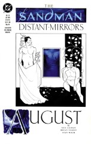

# The Annotated Sandman

## Issue 30 : "August"

> [!THUMBNAIL] 

##### Neil Gaiman, Brian Talbot, and Stan Woch

Second story in anthology _Distant Mirrors_

Not yet reprinted in any other form

**Sources**: A note in [Sandman #31](sandman.31.md) indicates that the title of this anthology came from Barbara Tuchman's text _A Distant Mirror: The Calamitous 14th Century_.

Gaiman drew this story based primarily upon the chapter on Augustus in Suetonius' _The Twelve Caesars_, trans. by Robert Graves, with additional help from _The Encyclopedia Britannica_, Ninth Ed., 1890 (!).

Elements of Graves' historical novel _I Claudius_ are also obvious, particularly in the art, where Livia and Augustus seem to be drawn to resemble the actors who portrayed them in the BBC dramatization.

**Note**: Pages 1-6 lack page numbers, while the rest of the book has the standard comic book page numbers. This suggests to me something technical in the production of the book; perhaps redrawn pages.

### Page 1

> [!THUMBNAIL] 

- #### Panels 1-3

  The participants and action of this scene will become clearer later in this issue.

- #### Panel 4

  Lycius is a real historical figure. See Suetonius, _Augustus_, 43.3. "Avgvst": In Roman writing, the letters "u" and "v" had not differentiated, and were written with the same symbol. The sounds themselves were not as distinct, /v/ being a bilabial liquid (semi-vowel) akin to /w/.

### Page 2

> [!THUMBNAIL] 

- #### Panel 1

  The Roman Senate could vote anyone the status of divinity, and did so for Julius and Augustus Caesar, Augustus' wife Livia, and others, although not for all emperors. Note the design on the guard's shield: an eagle on a field of broken arrows, I believe; is this the coat of arms of Imperial Rome?

- #### Panel 2

  This is indeed the full name of the Emperor Augustus (who was named after his famous uncle, Caius Julius Caesar). I cannot be definitive about the design on the medallion that allows Lycius into the palace; it appears to be some sort of mythical beast. It bears some resemblance to the wolf nursing Romulus and Remus (the mythical founders of Rome).

- #### Panel 4

  **Livia**: Augustus' second wife, and the mother of his stepson Tiberius, who would become emperor. Livia's influence upon the political life of Rome was significant.

### Page 3

> [!THUMBNAIL] 

- #### Panel 1

  This is the Emperor Augustus, born 63 BC, became emperor 27 BC, died 14 AD. The name (title, really) Augustus means something like "majestic" or "sacred", from a Latin word meaning "to increase". The English word "august" comes directly from the name, as does the month of August. Subsequent Roman emperors took the title Augustus upon their ascension to imperial rank.

- #### Panel 4

  Note that Augustus chooses a name that was probably his childhood name.

- #### Panel 5

  With the inclusion of bones, the soap is going to contain calcium hydroxide as well as sodium hydroxide. I think.

### Page 4

> [!THUMBNAIL] 

- #### Panel 3-4

  Balsamic and red wine vinegar are red. White wine and grain vinegars are clear; cider vinegar is amber. Distilled vinegars, like the majority of modern vinegars, is clear regardless of its fabric. Roman vinegar of that era was usually vinegar; cheap, weak, or off-vintage wine; or wine that had outlived its usefulness to the trained palate. Vinegar was reputed to possess certain medicinal properties. In Latin, vinegar is "acetum", whence our "acetic acid", the primary component of vinegar.

  **Quicker than boiled asparagus**: asparagus is a laxative. This phrase is used often by Claudius in Graves' historical works. Asparagus also cooks very quickly and is boiled for a few minutes at most, which may be a different interpretation of the saying.

### Page 5

> [!THUMBNAIL] 

- #### Panel 1

  Mars was the Roman war god, analogous to Greek Ares. The temple of Mars Ultor (Avenging Mars) has ruins still existing in the Roman forum of Augustus, and is pictured on coins, but the drawing does not appear to have been modeled after the historical data.

- #### Panel 2

  This dates the story at c. 5 AD, rather late in Augustus' career; the general policies of his reign (which stem from revelations later in this issue) would almost certainly have been formed by this time.

- #### Panel 3

  Augustus' line is taken from the adage "Augustus found Rome in brick and left is in marble", which may be found in both Suetonius and Graves' _I Claudius_.

- #### Panel 5

  **Vomitorium**: The word orgy comes from the Roman practice of having enormous parties where guests would eat delicacies until they were stuffed. They would go to the aptly named vomitorium and induce vomiting, then go back and continue eating. The sexual definition of "orgy" comes in later periods as the parties expand to include debauchery as well as gluttony.

### Page 6

> [!THUMBNAIL] 

- #### Panel 1

  This is an ancient trick still practiced today by street beggars, bartenders, and lounge musicians alike.

- #### Panel 2

  I do not know the history of Augustus' ban.

- #### Panel 3

  Lycius is of noble birth, an Equestrian rather than a Senator. He was reputedly only two feet tall, extremely light but with a Stentorian voice.

- #### Panel 4

  **Pylades**: a pantomime dancer, banished on one occasion by Augustus but later restored. Pylades was also the name of the cousin and proverbial loyal friend of Orestes (from Aeschylus).

### Page 7

> [!THUMBNAIL] 

- #### Panel 3

  We have seen the Gates of Horn and Ivory in [Sandman #2](sandman.02.md), et al., where they were described as Augustus gives here. They may be seen in Virgil's Aeneid Book 6.

- #### Panel 4

  Plutarch, _Brutus_, 36, speaks of a phantom who appeared and told Brutus they [sic--probably Brutus and Augustus] would meet at Philippi.

- #### Panel 5

  Plautus was a playwright of the second century B.C. _Menaechmus_ (also known as _Menaechmi_) is a comedy by Plautus about a mixed-up set of twins. This was one of the major inspirations for William Shakespeare's magnificent _The Comedy of Errors_ (OK, I saw the Flying Karamazov Brothers version, which wasn't pure Shakespeare, but it was still great). The musical _A Funny Thing Happened on the Way to the Forum_ (made into a movie with the incomparable Zero Mostel) is based on several other of Plautus' works. Lycius' dream is perfectly transparent wish-fulfillment.

- #### Panel 6

  Augustus' recounting of his ancestry is, unsurprisingly, correct.

### Page 8

> [!THUMBNAIL] 

- #### Panel 1-3

  It should now be clear that the boy of the grey flashbacks is Augustus; the uncle (really great uncle) is Julius Caesar, the warrior and dictator of Rome.

- #### Panel 6

  Livia, whom Augustus adored, sought to assure her children's future power, and engaged in deceitful machinations against Augustus' children, including Julia. For details, see the Appendix or Sue., _Aug._ 66.

### Page 9

> [!THUMBNAIL] 

- #### Panel 1

  Marcus was a common Roman name, so this may simply be an "everyman" character rather than someone we should recognize.

- #### Panel 3-4

  The mysteries of Eleusis were originally a Greek tradition, in nature somewhat between a religious coming-of-age ritual and initiation into a secret brotherhood like the Masons. It is believed by some that hallucinogens were used in the initiation rites.

- #### Panel 5

  Terminus is not normally reckoned more powerful than Jupiter, but his altar stone could not be moved, not for lack of trying, to build the temple of Jupiter Optimus Maximus, remaining in the temple, and in a sense forcing Jupiter to bow to Terminus. The festival of Terminalia, celebrated in February, is dedicated to Terminus.

- #### Panel 6

  Nor were the Seven (Endless) ever mentioned anywhere prior to [Sandman #1](sandman.01.md), of course. [Good heavens! A retcon! Shoot the sacrilegious cur who wrote this! :-]

- #### Panel 7

  The coin, I think, bears Augustus' likeness. Can anyone verifiy the legends of Augustus' divine origins? [Julius?] Caesar claimed descent from Venus, and built a temple to Venus Genetrix ("originatrix"). Augustus was divine Julius' adopted son, an additional route to divinity.

### Page 10

> [!THUMBNAIL] 

- #### Panel 1

  Mercury is the Roman god analogous to Hermes of the Greeks.
  He is the patron of thieves, medicine, and heralds. Apollo is equivalent to his Greek namesake, the god of the sun, poetry, and the arts.

- #### Panel 5

  **Gaul**: Pre-Carolingian name for France. The "stormy coasts" would be the coast along the North Sea (I think) and the English Channel. The Dead Sea, in the desert of Judea, is a salt lake with a strong and unpleasant odor. Also, the soldiers stationed in Judea hated it, thought the inhabitants were barbarians and stunk on top of that.

- #### Panel 6

  **Corn**: What Americans call "corn" is one specific grain, originally native to the Americas. In Pre-Columbian English, though, "corn" meant any grain, particularly the most important local grain, usually wheat, and retains some portion of that meaning in British English today. It is used in that sense here.

### Page 11

> [!THUMBNAIL] 

- #### Panel 3

  **Brass men**: The great bronze colossus Talos of Crete, created by Hephaestus (Daedalus in some accounts) and given by Zeus to Minos to guard Crete, with a cork in his ankle holding in his motive fluid. Dragon's teeth: Cadmus (and others) sowed dragon's teeth, from which arose armed soldiers. This is said to be a metaphor for alphabetic writing, invaluable in organizing large armies.

- #### Panel 5

  Julius Caesar invaded the British Islands, so the Britons were not unknown to the Romans. Julius invaded in three successive years in the fifty-somethings BC, failing each time. Tiberius also tried and Claudius eventually conquered England, but not Scotland or Wales, which retain some significant measure of their independence even today, despite the difficulties this causes the English Parliament. They just don't do what they're told....

The phrase "Mad dogs and Englishmen stay out in the midday sun", I had thought, had originated in much more recent times, particularly the colonial period of India. Noel Coward, a quintessential Englishman, wrote a song with the name "Mad dogs and Englishmen..." and once posed for _Life_ magazine in full evening dress at noon in the Mojave desert. It's probably just an anachronistic joke of Gaiman's.

- #### Panel 6

  **Copper As**: A coin, as is a sestercius (normally written sestertius) and a dupondius. "Clipping" in numismatics refers to the practice of shaving the edge of a coin to obtain some fraction of its precious metal in addition to its monetary value. The grooves on the edges of many modern coins (such as the American quarter) were originally used to prevent clipping, and are now merely obsolete ornamentation.

### Page 12

> [!THUMBNAIL] 

- #### Panel 2

  I do not know of the nature of Augustus' illness.

- #### Panel 5

  Julius Caesar was assassinated by Brutus, Cassius, and a group of conspirators on the steps of the Roman Senate in 44 BC. The conspirators believed he was amassing too much personal power, and would make himself king (a specific term in Roman culture, effectively differing from dictator only in being hereditary). The events were made archetype by William Shakespeare in his play _Julius Caesar_.

### Page 13

> [!THUMBNAIL] 

- #### Panel 1

  Cicero was a great speaker and writer, and a contemporary of Caesar. Note the slaves in the background.

- #### Panel 3

  "Augustus" and "augur" both eventually come from "augere", which originally meant "to increase", though little trace of this meaning lingers in its daughters.

- #### Panel 4

  Augustus indeed named the month after himself, much as Julius Caesar named July after himself. Sextilus (usually written "Sextilis") essentially means "sixth month"; the old Roman calendar began in March, about the time of the spring equinox. Tiberius was Augustus' stepson, and succeeded him as emperor. Augustus' statement is extremely ironic; August will change but the empire lives on. Tiberius and his successors did stick their own names in place of Augustus' but it didn't stick.

### Page 14

> [!THUMBNAIL] 

- #### Panel 2

  I believe western civilization has trained most of us to think that "Emperors" are higher ranking than "Kings" (viz., the British _Empire_ versus the King of England); however, the words had much more specific meanings when they were young. "Emperor" comes from "imperator", "commander", a military title of the Republic achieving royal status only with Augustus. Kings would have been higher, because the rank was hereditary. The Senate gave Augustus every possible incentive to remain in charge when he showed signs of wanted to revive the Republic.

### Page 15

> [!THUMBNAIL] 

- #### Panel 3

  Like their predecessors, the Greeks, the Romans had a plethora of deities for every occasion, Fortuna being the goddess of luck, eventually lending her name to the English word "fortune".

- #### Panel 4

  Marcus Lepidus was a member of the second triumvirate with Marc Antony and a young Octavian (Augustus). See Richard Weigel, _Lepidus: The Forgotten Triumvir_, Rutledge, October 1992.

- #### Panel 5-6

  The competing prophecies bit sounds like David Eddings' fantasy cycle _The Belgariad_. The first prophecy is the one that came true.

  I have no refs for Roman prophecies, although Tanaqui hints:

  > No? Not even for the famous story of the destruction of the Sybilline Books? Graves includes a prophecy about the "Hairy Men" (Caesars) of Rome.

- #### Panel 7

  Beyond the sunset would be to the west, suggested that the golden ziggurats lie within the Mayan, Aztec, and Incan empires. Additionally, the diamond fields in southern Africa are the richest in the world, and the only place where they can be picked up, instead of mined.

- #### Panel 9

  Augustus picked the first prophecy, by inference. I think he picked it because Julius would have picked the second....

### Page 18

> [!THUMBNAIL] 

- #### Panel 3

  This would seem to contradict what we saw in _The Season of Mists_, which was full of old gods who had not died. We may note, however, that there are still people who follow the Egyptian and Norse pantheons, albeit not in any great numbers. The Graeco-Roman Mysteries do appear to lack for adherents and were missing from _Season_.

### Page 19

> [!THUMBNAIL] 

- #### Panel 1

  **Aristeas of Marmora**: a dramatic poet and famous seer, the son of Pratinas. His named is usually spelled Aristias. He contended with Sophocles (the Greeks were big on theatrical competitions), writing two Satyric [sic] plays and three others, possibly tragedies, including one called _Orpheus_.

- #### Panel 3

  The Roman god of dreams was Morpheus, by which name Dream has often been known.

- #### Panel 6

  I know of no myths about Terminus, so I have no information to give you about his motivations here.

### Page 23

> [!THUMBNAIL] 

- #### Panel 4

  There is no historical evidence to support the assertion that Julius sodomized Augustus. A digression: The modern concept of homo/hetero sexuality is quite recent. Prior to this, in classical Greece and Rome for example, many individuals practiced intra-sex and inter-sex intercourse. The reasons they did this were cultural, as is the modern categorization of sexuality as having a preferred gender. Among males (who were culturally dominant), using another being of whatever gender as a receptacle for one's sperm was a symbol of power over that individual. Any pleasure derived from the act was almost incidental. Thus, Julius is in some sense exerting his dominance over Octavian even as he enjoys his orgasm. To digress further, among Spartans, a man was expected to take a young male lover, and to train him up in the ways of Spartan manhood, a sort of mentoring. So Julius may have been abusing Octavian, but he was not a pedophilic "sex fiend" as Americans think of such today.

  We may also note that Julius might have been guilty even by his own culture's prejudices in "keeping Octavian close" and thus attempting to possess him.

  **Historical note**: Julius received criticism during his lifetime for having allegedly "prostituted" himself to the king of Bithynia, in Asia. By "prostituted", I presume he submitted to sodomy. In Roman terms, the only way that was wrong was that it was in fact submission, that it gave political advantage to the other king, and that reflected badly on Rome.

### Page 24

> [!THUMBNAIL] 

- #### Panel 2

  This indicates that Lycius was writing (presumably near his death) at c. 62 AD.

- #### Panel 4

  Pictured in the background are Tiberius, Caligula, Claudius, and Nero. Tiberius, emperor, 14-37, was ruthless, but evil may be too strong a word; those interested are invited to read a book or something. Caligula, emperor, 37-41, was, or became, mad, though some scholars can support their claims that he was an effective ruler, and not necessarily guilty of many of the excesses attributed to him, and had only the quotient of megalomania one would expect to be caused by his having been raised as a favorite and indulged by all of Rome. He was slain by his guardsmen. Claudius, emperor, 41-54, had a speech defect and was the Jimmy Carter of the first century. Foolish is a harsh word indeed; Suetonius, in fact, characterizes him as an able administrator. Claudius's life (including the reigns of his predecessors) is chronicled in _I Claudius_, an historical novel by Robert Graves, made into a popular public television series (shown in America on "Masterpiece Theatre"), now available on videocassette. Under Graves' hand, Claudius is portrayed as an extremely intelligent man who emphasized his limp and stutter so as to appear harmless and be protected from the machinations of Livia. Nero, emperor, 54-68, was an emperor famed for his excesses, whose reign could be described as disastrous.

## Credits

- Originally collated and edited by Greg Morrow.
- Mike "I wish he'd explain what the heck 'Killans' means" Collins (mcollins@isis.cs.du.edu) corrected my oops about the conquest of Britain and wishes to recommend _I Claudius_.
- Adina Adler (aka Pho User) (pho@athena.mit.edu) corrected my spelling, my usage of corn, and some evidence about the Latin root "augere".
- The ineffable Soren F Petersen (speterse%peruvian.utah.edu@cs.utah.edu) made note of the laxative effects of asparagus, sought Plautus in the card catalog, recalled the origins of titles, and applied the cold light of historical fact to my poetical description of the Empire's fall.
- Bill "Surfin' " Sherman (sherman@oak.math.ucla.edu) clarified the Roman process of apotheosis, noted the artist's debt to the BBC, gave vent to an adage of construction, gave plot details from _I Claudius_, made Marcus unidentifiable, talked about the Senate and the Republic, was the first to note that the Dead Sea stunk, referenced Noel Coward in the midday sun,
- Phil Birmingham (birmingh@fnal.fnal.gov) gave an interpretation of Julius' prostitution.
- Mike Chary (charyma@wkuvx1.bitnet) explained about red vinegar.
- Mike also forwarded along his professor's comments on the issue, who brings a bit of establishment prestige to our little literary circle. Dr. Richard Weigel, History Dept., Western Kentucky University (Ph.D. Delaware) confirmed Lycius's existence, corrected a typo, added much fine historical detail, including the temple of Mars, another Pylades, the Gates of Horn and Ivory in the Aeneid, Brutus' phantom, _Manaechmi_, a reference for Julia's betrayal, Terminus, Julius' divinity, "corn", Talos (see Apollodorus or Apollonius Rhodius), Julius' British adventure, "augere", emperors, Aristias, and Julius' relationships with both foreign kings and Augustus.
- In reference to Marcus Lepidus, Dr. Weigel also plugs his forthcoming biography, _Lepidus: The Forgotten Triumvir_, to be published by Rutledge in October.
- Michael Bowman (who's moved to Oregon and has a new e-mail address which this isn't: mbowman@andromeda.rutgers.edu) identified Pylades and Aristias, and noted some irony.
- Ian Lance Taylor (ian@airs.com) identified the written antecedents of the television version of _I Claudius_.
- Jhemon Lee (jlee@nlm.nih.gov; NIH = National Institute of Health? Are you responsible for stopping epidemics 'n' fun stuff like that, Jhemon?) IDed Marcus Lepidus.
- William Kaufman (wkaufman@us.oracle.com) also explained about red wine vinegar and asparagus, referred me to Suetonius, spoke about Noel Coward, and corrected a typo.
- Alexx S Kay (Alexx@world.std.com) IDed _Menaechmi_.
- Tanaqui C Weaver (cen@vax.oxford.ac.uk) appended Graves to Neil's sources, IDed Marcus Lepidus, made a curious reference to the Roman prophecies, mentioned modern worshippers of ancient deities, spoke about Julius' sexual dominion over Augustus, and defended Caligula.
  Michael Kelly (mkelly@lazy.helios.nd.edu) also explained about red vinegar.
- Rick Pim (rick@qucdnee.ee.queensu.ca) offers a different explanation of the asparagus saying.
- Jim W Lai <jwtlai@jeeves.waterloo.edu> recalled the Greek for the Gates, speculated about the empire's prophesied extent, and found Talos, the bronze man.
- Michael S. Schiffer (mss2@quads.uchicago.edu) offers a footnote to Bill's appendix.
- Col. G.L. Sicherman (gls@windmill.att.com) offered some insight into Roman phonetics, Lycius' medallion, Augustus' name, vinegar, Plautus, Cadmus, and calendars.
- Glenn Alan Carnagey Jr <lf7z@midway.uchicago.edu> explained further about the Dead Sea, as did Mike Chary.
- James Drew (jrd@lynx.frame.com) explained vinegar, offered a Biblical quote, mentioned the fetid Dead Sea, and IDed Marcus Lepidus.
- C.J. Kruger (kruger@moebius.math.okstate.edu), posting indirectly, added some tantalizing details of Roman history. Michael G. McKellar (mgq@inel.gov) confirms that salt lakes stink, possibly due to the brine shrimp dwelling therein.

## Appendix: Sordid Details

The following was provided by Bill Sherman and consists of plot details

from Robert Graves' _I Claudius_:

Augustus and Livia both had children by previous marriages, and had no children together. So Livia embarked on a program to ensure that her children would be Augustus' heirs.

**Livia had two sons**: Drusus (who died at war) and Tiberius.

**Augustus had one daughter**: Julia.

Julia was married to Agrippa ^1, who was killed; before he died they had five children: Agrippina, Julilla, Gaius, Lucius and Postumus.

**Note**: Julilla's real name was Julia, and that's the Julia named by Augustus in panel 6. Everybody named their kids after themselves or their close relatives, so everybody ended up using nicknames, like "Julilla" or "Postumus" ^2. Augustus couldn't bring himself to refer to his daughter Julia by name after her banishment.

Julia and Tiberius were married, and Tiberius was made Augustus' adopted son. Tiberius hated Julia, and so Julia went to Livia for a love-potion. Livia gave her a _lust_-potion, to which Julia became addicted, and began to be very promiscuous, with anybody she could get. Eventually Gaius and Lucius told Augustus about it, and he banished her. It broke his heart. Julia and her mother Scribonia were sent to a tiny little island.

As for the granddaughter, that's Julilla. Livia eventually got rid of all five of Julia's children, and got rid of Julilla in particular when Julilla bore her husband Aemilius a child -- a child who would be an heir to Augustus and therefore a rival to her bloodline. Livia framed Julilla with adultery, the child was killed, and that was that.

As for Julia's other children: Agrippina was married to Livia's grandson Germanicus (the brother of the famous Claudius), and the three sons were all killed.

^1 [from CJ Kruger] Julia was married three times, first to Marcellus, who was murdered by Livia or died of natural causes -- take your pick. The second was to Marcus Agrippa, to whom she bore 5 children. (I think 5, maybe only 4.) The third was to Tiberius Nero, Livia's son who later would become Emperor. She _was_ unfaithful, according to Suetonius and Tacitus, but would not have been found out if Livia had not forced Julia's son to confront Augustus with it.

^2 [from Michael Schiffer] Actually, the situation was more confusing than that in the case of daughters. You see, all of a man's daughters were given the _same_ name, the feminine form of, I believe, the name of the _gens_ (roughly "clan") to which she belonged. Hence, all of Augustus daughters would be named Julia, since he was of the Julian gens. If his daughter Julia married another man of the Julian gens, all of her daughters would be Julia as well. Nicknames were usually on the creative level of the aforementioned "Julilla" (little Julia) or "Julia Secunda" (the second Julia, called "Secunda" for short). Gives a real sense of the level of worth and individuality granted to women by the early republic. (To be fair, by Imperial times Roman women of the patrician class had made some significant gains, but the naming conventions remained traditional in much the same way we generally retain patrilineal surnames despite largely having legal equality.)
