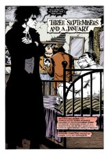
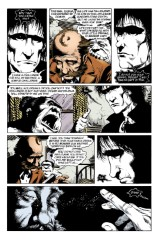

# The Annotated Sandman

## Issue 31 : "Three Septembers and a January"

> [!THUMBNAIL] 

##### Neil Gaiman and Shawn McManus

Third story in anthology _Distant Mirrors_

Not yet reprinted in any other form

**Sources**: A note in [Sandman #31](sandman.31.md) indicates that the title of this anthology came from Barbara Tuchman's text _A Distant Mirror: The Calamitous 14th Century_.

Historical fact in this story comes from Herbert Asbury's _The Barbary Coast_ and William Drury's _Norton I, Emperor of the United States_. It was inspired by Catherine Caufield's _The Emperor of the United States of America and Other Magnificent British Eccentrics_.

**Themes**: "Thermidor" takes place at least partly in what we would call July, while "August" and this story have their time frames clearly noted. As Gaiman says in this issue, there is another story in _Distant Mirrors_ not yet told; its title is "Ramadan", and it will eventually see the light of day, probably in a trade paperback publication of _Distant Mirrors_. Ramadan is a month in the Moslem calendar of particular religious significance (Not sure what; either the birth, death, or hegira of Mohammed, I think). "Ramadan" evaded publication with the other Distant Mirrors due to delays in the art/production stage.

We may comment on the roles various nations have played:

"Thermidor" was played out against the backdrop of the French Revolution; "August" determined whither the Roman Empire would go. In this story, the United States of itself is not a featured character, but we follow a man who was its Emperor, at least in his own mind, an interesting contrast.

We may further note the preponderance of Emperors in the anthology.

"August" and this story have obvious emperors, and the chaos seen in "Thermidor" would not be tamed until the rise of another Emperor--Napoleon.

"Thermidor" was not about government, but it touched on government and those who govern. "August" was fundamentally about government and the choices of the governors. This story is just as fundamentally _not_ about government, and its protagonist is governor of himself and no more, and _that_ is the tale's point.

Other important themes touched on in this trilogy include responsibility in many forms, and the role of destiny.

### Page 1

> [!THUMBNAIL] 

- #### Panel 1

  This is Joshua Norton, of whom we will learn more shortly.

- #### Panel 3

  The bloated female figure on the bed is Despair, one of the seven Endless and the younger sister to Dream.

- #### Panel 4

  The formal means by which the Endless make contact with each other is by the caller's standing in a gallery in its domain and using a symbol (sigil) of the one to be called. The ring with a hook is Despair's sigil. Dream's sigil has been seen in the past to be his helmet.

### Page 2

> [!THUMBNAIL] 

This is a splash panel. Note Dream's period attire; Dream is the only Endless who seems to care about the appropriateness of his appearance. Except for Destruction, who we see in plate armor in the Orpheus special, and in a "swashbuckler's" outfit in Brief Lives (amongst other places; don't have the exact reference)

Death is the only other Endless with any sense of costume, save, perhaps, Destiny.

In the credit box, Gaiman takes the title PJF, probably meaning Pre-Joycean Fellowship. This is a group whose membership primarily overlaps with that of the Scribblies, an sf/fantasy writers group located in Minneapolis, Minnesota, containing such notables as Steven Karl Zoltan Brust, Pamela Dean, Emma Bull, and Will Shetterley (who is known in comics for his _Captain Confederacy_). The Pre-Joycean Fellowship believes that literature can be both accessible and meaningful. They identify James Joyce as the first proponent of the idea that literature must be inaccessible to be meaningful. The term Pre-Joycean was coined in analogy to the Pre-Raphaelite Brotherhood (a turn of the century British artist's group, but I'm probably wrong).

### Page 3

> [!THUMBNAIL] 

- #### Panel 4

  It is perhaps noteworthy that Despair is so certain that Desire and Delirium will cooperate with her.

- #### Panel 5

  The "brother" is the missing Endless, whose identity will be made clear in the [_Sandman_ Special #1](sandman-special1.md). An upcoming storyline will feature the search for the missing brother.

### Page 4

> [!THUMBNAIL] 

Norton's background as given here seems to be correct.

- #### Panel 2

  Norton and other wealthy businessman cornered the market on rice in San Francisco, expecting to make a huge profit through their monopoly. Their fortunes and hopes were dashed when a Japanese ship sailed into port, loaded with rice, shortly before they were to sell.

### Page 5

> [!THUMBNAIL] 

- #### Panel 5

  The "oldest sister" is Death, of course. The map has some remarkable flaws. The modern map has borders between Nevada and Arizona, Missouri and Arkansas, Michigan's Upper Peninsula and Wisconsin, and Ohio and Kentucky. The missing border between Nevada and Arizona may be an accurate representations of the period's pre-statehood territorial boundaries, but borders had long since been set for the other cases, particularly Kentucky and Ohio, which dates back at least to 1792, and probably back to the earliest colonial days.

### Page 6

> [!THUMBNAIL] 

- #### Panel 5

  The [San Francisco] Daily Evening Bulletin was published between 8 Oct 1855 and 18 May 1895, becoming The Bulletin on 20 May 1895, continuing through to 19 Sept 1928, when it ceased publication. It was published every day except Sunday.

### Page 7

> [!THUMBNAIL] 

- #### Panel 2-4

  This is presumably the correct text of Norton's original proclamation. Note the further information that he was from the British colony in South Africa (The Cape of Good Hope is the southern tip of Africa).

  In panel two, note the lettering correction mark in "preemptory". My dictionary lists "preemptive" and not "preemptory"; both would be incorrect. The probable original and correct word is "peremptory", meaning "dictatorial; with authority; not to be denied".

  From the [Emperor Norton Webpage](http://www.zpub.com/sf/history/nort.html):

  > At the pre-emptory request of a large majority of the citizens of these United States, I Joshua Norton, formerly of Algoa Bay, Cape of Good Hope, and now for the last nine years and ten months past of San Fransisco, California, declare and proclaim myself the Emperor of These United States.
  > -- September 17, 1859

- #### Panel 6

  In the mid-1800's, newspapers did not have to compete with television, and had also not undergone the homogenization that modern culture has seen. (This, of course, is demeaning to and not representative of the many fine alternative papers existing today; the point is that all newspapers were alternative, in some sense, long ago.) Accordingly, it is not surprising that a newspaper would publicize something as daft as Norton's proclamation; it was bound to get people's attention.

Incidentally, the figure shadowed against the wall in this panel is Norton himself, as made evident on the next page.

### Page 8

> [!THUMBNAIL] 

- #### Panel 3

  Grown-up: An unusual concept to apply to the Endless.

  (BUT! : Death tells Dream that Delirium is "just a kid" in Brief Lives. Of course, this flies in the face of earlier descriptions of the Endless, most notably in The Season of Mists, where it is said "the Endless to not measure time like we do".)

### Page 9

> [!THUMBNAIL] 

- #### Panel 1

  The second September. This is Samuel Langhorne Clemens (Nov 1835-1910, making him 28 at this time), who would one day become the foremost writer and humorist of his day under the pen name of Mark Twain. It has been verified that Twain was indeed working for a San Francisco newspaper during this period, having left Virginia City and arrived in San Francisco earlier in 1864; there is a book of collected essays from his work on this paper. He did not apparently write about the Emperor, however, nor is there any confirmation that he knew him.

  My source has "Langhorn" as the proper spelling for Clemens' second name; however, common usage prefers the '-e' ending.

- #### Panel 4

  Note the sign on the building; The Morning Call was the newspaper Clemens was working for.

### Page 10

> [!THUMBNAIL] 

- #### Panel 5-6

  The Golden Gate Bridge, between San Francisco and Sausalito, is the most famous bridge in the Bay area. It was constructed during the period 1933-1937. It does _not_ go to Oakland. Norton is foreshadowing the Bay Bridge, opened in 1936, which does cross the Bay to Oakland. Chris Claremont has referred to the bridge as the "Emperor Norton" bridge, in X-Men c. #200, though this usage is otherwise unfamiliar to a native of the city.

### Page 11

> [!THUMBNAIL] 

- #### Panel 1

  This is Delirium, the youngest Endless. Her multicolored hair and partially shaved scalp are significant anachronisms.

- #### Panel 2-3

  San Francisco had, and has, a large Chinese population; its "Chinatown" is another landmark of the city. Though the Chinese had emigrated voluntarily, they were treated as badly, or worse, than the black slaves and former slaves; this theme appeared in some of Twain's stories.

- #### Panel 5

  Clemens is recounting what will become one of his most famous stories, "The Celebrated Jumping Frog of Calaveras County". This is an anachronism, as Twain had not yet heard the story.

  In early editions, Delirium's word balloon was uncolored, but this was corrected in later issues.

- #### Panel 6

  Note Delirium's uneasy relationship with Dream, to be expanded upon in later issues.

### Page 12

> [!THUMBNAIL] 

- #### Panel 4

  Delirium has expressed the dislike of being laughed at before, in [Sandman #21](sandman.21.md) page 17 panel 5, and does so again in a later issue.

- #### Panel 5

  Note Delirium's creation.

### Page 13

> [!THUMBNAIL] 

- #### Panel 2

  I cannot confirm this Imperial decree. However, judging by his later character, Clemens would have been delighted with the appointment, and in any case, it was most apt in its description of the role Twain would play in American literature.

- #### Panel 4

  The frog is Delirium's creature.

### Page 14

> [!THUMBNAIL] 

- #### Panel 1

  The third September.

- #### Panel 2

  **Wuz**: of course, "was" and "wuz" are pronounced exactly alike. Believe it or not, there is actually a word in the language that describes the practice of using non-standard spelling to suggest dialect, even though the pronunciation suggested by the non-standard spelling is in fact the standard pronunciation, such as using "-in' " for "-ing". Unfortunately :-( I can't remember the word.... The practice works because the mental ear has been trained to "hear" non-standard spellings with non-standard pronunciation.

- #### Panel 3-4

  **'Frisco**: The nickname of the city of San Francisco, which is itself Spanish, meaning "Saint Francis". "SF" also sees extensive use in written language. Natives of San Francisco tend to dislike the abbreviation 'Frisco.

- #### Panel 4-5

  The Emperor issued his own money, and exchanged it for US currency. Most people regarded the Emperor's money as a souvenir (Again, "soo-ven-ear" is exactly how the word is usually pronounced) and were glad to pay its face value in exchange. As noted further along, a number of establishments accepted the Emperor's money as well as US currency. By such means did the Emperor survive.

### Page 15

> [!THUMBNAIL] 

- #### Panel 1

  It would appear that Norton has a chamberlain, a Chinese named Ah How. His speech pattern is completely cliched: here he excessively praises Norton and denigrates himself; in the very next panel, he utters a paraphrasing of a proverb, possibly Confucian. Part of the training as an official of the Imperial Court was the study of Chinese literature and poetry. Phrasing advice in terms of metaphor and allegory was not uncommon. Here, the analogy was stated in an unusually direct manner, possibly for the benefit of Western-trained thinkers, who are not so used to dissecting oblique statements.

  In a [2023 blog post](http://emperornortontrust.org/blog/2023/3/20/the-eyes-of-the-emperor-in-1879), the Emperor Norton Trust note that there is evidence of Ah How existing, although his role of "chamberlain" may have just been the news outlet being disrespectful towards Norton:

  > [I]n January 1867, the Daily Alta California concluded its story of the false arrest of Emperor Norton by reporting that, when the Emperor signed for his belongings, he "caused Ah How, his Grand Chamberlain, to witness his Royal signature."
  >
  > The Daily Alta and its editor, Albert Evans, made quite a career in the 1860s of publishing fake proclamations and other fake stories about Emperor Norton. The fact that a Chinese man named Ah How was a noted petty criminal in San Francisco during this period makes it worth asking whether the Alta’s "Grand Chamberlain" bit was just a gag to make Emperor look silly.

- #### Panel 2

  **Tong wars**: Chinese crime organizations are known as tongs.

  There is a legend about an incident in Chinatown where two opposing Tongs were verging on open violence, when Norton walked along and simply told the people to leave in peace. And they did so, perhaps defeated by his presence.

- #### Panel 3

  Note Ah How's queue, the long ponytail. The custom of wearing the hair this way originated among the Manchu people. When the Manchu conquered the rest of China, ending the Han (or Ming--conflicting accounts) dynasty and beginning the Ching dynasty, the last imperial dynasty, they forced the conquered people to adopt the queue as a sign of submission. The order was by Dorgan, uncle of and regent for the first Ch'ing emperor Shun-Chih. Later, the queue became a symbol of Chinese culture.

  Opium is a narcotic derived from the poppy; heroin and morphine are both derived from opium. Opium was a vice brought from the Orient, and opium dens were a feature in many "Chinatowns" until about the turn of the century. The vice was forced upon the Chinese, as a result of the Opium Wars, with Britain, of 1840-1842. The vice persisted until 1907, as a means of balancing trade between the British Empire and China, as China did not particularly want foreign goods. Perhaps ironically, the Tongs today have ties with the opium trade; the Tongs originally were formed for the purpose of being pro-Imperial China.

- #### Panel 4

  Ah How's speech in this panel reflects how ignorant white men thought all Chinese immigrants spoke, another cliche.

- #### Panel 5

  As we shall see, the Cobweb Palace (for which I have seen no hard refs) is a place where reality and unreality touch. Neil Gaiman confirms that the Cobweb Palace is a real place; the most complete description is in Asbury's _Barbary Coast_.

  The Cobweb Palace is not a "Soft Place", as originally speculated, despite its fantastic elements. "Soft places" are large and indeterminate in location; the Cobweb Palace is neither.

  A Cobweb Palace is featured in Akira Kurosawa's _Throne of Blood_, an adaptation of Shakespeare's _Macbeth_. The castle obtained by the Macbeth-analog after slaying his lord is called the Cobweb Palace, and is surrounded by the Cobweb Forest.

### Page 16

> [!THUMBNAIL] 

- #### Panel 1

  The parrot is at least semi-intelligent.

- #### Panel 3

  The Palace is full of cages. Is this symbolic of the trap laid for Norton? See also page 19 panel 2-3. The picture directly above the bar-keeper's head is similar to "Olympia" (Manet). It is, however, not an exact copy: the original "Olympia" has a negro maid standing behind her, whereas this one doesn't. I have know idea whether this is an anachronism.

- #### Panel 4

  A hock is any white Rhine wine, from a variety called Hochheimer. California's wine industry had not yet become important, although this could still be a local vintage; the Californian wine industry has evinced considerable disinterest in the geographical significance of wine names.

### Page 17

> [!THUMBNAIL] 

- #### Panel 1

  Gaiman says the King of Pain was a real person; I have no refs for him, save perhaps for the song "King of Pain" from the Police's album _Synchronicity_. Wolfsbane and aconite, as well as monkshood, are all names for the same plant. Aconite is an analgesic in small doses, and a poison in larger ones.

  In a [blog post in 2011](https://journal.neilgaiman.com/2011/02/king-of-pain-explained-absence-of.html), Neil Gaiman gave this reference for the King of Pain:

  [Herbert Asbury's The Barbary Coast](https://archive.org/details/barbarycoastinfo0000asbu) p230:

  > Another habitue of Martin and Horton’s, and an occasional visitor at the Cobweb Palace, was an itinerant healer who called himself the King of Pain. He was probably the most ornate personage in the San Francisco of his time — his customary attire was scarlet underwear, a heavy velour robe, a high hat bedecked with ostrich feathers, and a heavy sword. When he went abroad, he rode in a coal- black coach drawn by six snow-white horses. The King of Pain made a fortune selling aconite liniment from a pitch at Third and Mission streets, but he lost all his money at the gaming tables and finally committed suicide.

### Page 19

> [!THUMBNAIL] 

Pain seems to be a regular character in the Vertigo universe. In the recent series "Mythos: The Final Tour" (I think?) He and his aide, Tacky Leatherette, are indeed main characters, and mention "not using the D-word," after Desire's name is mentioned, not wanting to inspire her wrath. Desire does indeed later show up, proving that the endless will... jump series. (Note that Cain and Able do the same, in the DC/Vertigo series, "The House of Secrets" or somesuch.

- #### Panel 2

  The King of Pain told those who bought the liniment he sold outside the Pacific Clinical Infirmary that if they covered their bodies with the ointment as he did, they would need no clothes. He himself wore a bright red union suit, a heavy velour robe, a ostrich-feathered plug hat, and a heavy sword; he was probably the most ornate personage in the San Francisco of his time.

### Page 19

> [!THUMBNAIL] 

- #### Panel 2

  Another painting that is reminiscent of a real-life painting.

  Unfortunately, I can't remember which painting it is reminiscent of... (Again, I am uncertain whether the painting existed at this point in time.)

- #### Panel 8:

  A wonderful bit of wisdom.

### Page 21

> [!THUMBNAIL] 

- #### Panel 5

  The Kindly Ones are the Eumenides, or the Furies, an aspect of the three-in-one goddess, dedicated to revenge and punishment. This is aftershadowing; Desire's, ahem, _desire_ for revenge will later result in the storyline of _The Doll's House_.

  **"Get down and lick, Pain.**: Probably a reference to bootlicking; may also refer to the licking of wounds.

### Page 22

> [!THUMBNAIL] 

- #### Panel 1

  The January of the title.

- #### Panel 6

  Tom O'Bedlam: From "Bethelem", referring to a notorious insane asylum for men in England. The name means a madman. Mad Maudlin or Mary Maudlin is the female counterpart, from the asylum of "Mary Magdalene". There may be a character by this name in William Shakespeare's works.

  The modern usage of "bedlam" arises from Tom O'Bedlam. Tom O'Bedlam is also an old folk song, probably of English origin. Robert Silverberg, a noted SF author, recently wrong a novel of the same name, using lines from the song as chapter titles. "Filk" versions of the song are also known to exist.

  One sampling of the song:

  > "For to find my Tom O'Bedlam,
  > "Ten thousand miles I'll travel;
  > "Mad Maudlin goes on dirty toes
  > "For to save her shoes from gravel..."

  Another, the chorus:

  > "While I do sing: Any food,
  > "Any feeding, drink, or clothing?
  > "Come, dame or maid, be not afraid,
  > "Poor Tom will injure nothing."

### Page 23

> [!THUMBNAIL] 

- #### Panel 4

  The lesson is (see page 5 panel 3) is at least partly that dreams are not "nothing", and also partly that Dream is of a different class of being than Despair, the elder Endless instead of the younger. The younger are more fragile. Despair's slowness to learn may be due to the self-absorption of those in despair, isolating her from external reality.

### Page 24

> [!THUMBNAIL] 

- #### Panel 1

  This is Death, again. The Hastings Society held a monthly debate at the Academy of Natural Science.

- #### Panel 2-3

  The legend of the Tzaddikim appears to be accurate.

  Webster's Ninth Collegiate (1991) defines 'tzaddik' as a variation of 'zaddik', and 'zaddik' as "1) a righteous and saintly person by Jewish religious standards; 2) the spiritual leader of a modern Hasidic community." One other fictional reference has been found, a novel titled _The Last of the Just_, author unknown. This source postulates fifty Tzaddikim, instead of thirty-six. The fifty's sufferings and burdens redeem the entire Jewish people, and possibly all of humanity. If there are less than fifty at any time, the world is tossed into chaotic times. The novel is set during World War II, where many of the Tzaddikim die in the Nazi death camps. Chaos begets chaos.

  A linguistic note: In Hebrew, [-im] is the plural ending. Thus, one Tzaddik, but thirty-six Tzaddikim. The root TzDK (Semitic languages use vowel changes to mark part of speech and conjugations and declensions, and so are generally meaningless in talking about the language's vocabulary) means "justice" or "righteousness".

  There may be a corresponding group of those who do only evil.

- #### Panel 7

  See the appendix for obituaries of Joshua Norton.

## Credits

- Originally collated and edited by Greg Morrow.
- Dascoser (dascoser.bbs@cybernet.cse.fau.edu) came up with Norton's obit from the Times, and gunthar@vax1.mankato.msus.edu did the same for the San Francisco Chronicle.
- Mark Lippert <grendel@csd4.csd.uwm.edu> sent me an excellent research paper on Norton, which indirectly confirmed most of the historical details reported above.
- Tom White (twhite@mozart.amd.com) referenced the Tzaddikim.
- Several people, including Michael Suzio (msuzio@ais.org), Michael S. Schiffer (mss2@quads.uchicago.edu), and Ian Lance Taylor (ian@airs.com), corrected me about the origin of the Chinese queue. Michael also commented on certain aspects of linguistics and the Hebrew roots of Tzaddikim.
- Eric Akawie (eja@acpub.duke.edu) gives a possible source for the Cobweb Palace.
- Lance "Cogsworth" Smith <lsmith@cs.umn.edu> identified the missing Distant Mirror, as did Bill Sherman <sherman@math.ucla.edu>. Bill also corrected my abuse of Despair's gender, noticed the screwy US map, corrected my source's spelling of "Langhorne", and referred to the Police's song "King of Pain".
- Ed Bailey (bailey@zonker.ph.utexas.edu) divined meanings for 'prodigal' and 'tzaddik', and speculated about the themes of _Distant Mirrors_.
- Alexx@world.std.com cleared up some of the confusion regarding the source of Norton's despair and helped confirm Twain's presence in San Francisco.
- Michael Bowman <mbowman@andromeda.rutgers.edu> identified PJF, found references for the Bulletin and the Golden Gate, and defined hock.- Jim W Lai <jwtlai@jeeves.waterloo.edu> confirmed Norton's ill-fortune with rice ("Rice-a-roni, the San Francisco treat"), commented on Ah How and opium, the symbolism of cages, and bootlicking. Later, he noticed a miscolored balloon, Delirium's fear of Dream and of being laughed at, and Despair's inability to learn.
- He also made the cryptic comment: "With regard to Delirium, the first of the Erisian Cabals, formed in 1969, was called the Joshua Norton Cabal."
  Make of that what you will.
- Colonel George Sicherman (gls@windmill.att.com) corrected my misapprehension of the Bay Bridge and misspelling of Clemens' second name. He also noted a probably typo in Norton's proclamation, corrected Clemens' age, and added details of Clemens' life and stories. The Colonel was also among those who corrected my "Manchu mistake", and explained the Opium Wars.
- Further, he knew what Hock was, as well as wolfsbane, Tom O'Bedlam, and the Tzaddikim.
- Jennifer Hawthorne (jen@athena.mit.edu) explicated Tom O'Bedlam.
- Tanaqui C. Weaver (cen@vax.oxford.ac.uk) knew about Ramadan, corrected my Ah How typo, argued with me about the nature of Soft Places, identified hock, and Tom O'Bedlam.
- Sue Clark <sue_clark@maillink.berkeley.edu> identified the Bay Bridge.
- Neil Gaiman confirmed the existence of the Cobweb Palace.
- Pat Dorsey (PDORSEY@EAGLE.WESLEYAN.EDU) danced all around the origin of Tom O'Bedlam without quite getting it right, and pointed in the direction of Shakespeare.
- Ralf Hildebrandt added more details.
- Richard Munn added the King of Pain reference from Neil Gaiman's blog entry, and the _Ah How_ reference from the Emperor Norton Trust

## Appendix

Herewith are appended some of the obituaries for Joshua Norton, well-beloved,
first and only emperor of the United States of America [I have taken the
liberty of cleaning up the spelling and punctuation, which may be from the
original or from the transcriber]:

**From the New York Times**: January 10, 1880 pg 5

> DEATH OF AN ECCENTRIC CALIFORNIAN.
> A dispatch from San Francisco says that Joshua A. Norton dropped dead at the corner of California and Dupont streets, in that city, Thursday night. Norton was an Englishman, well-educated, and presumably of respectable antecedents. Drifting to California in the early flush times, nobody knows when he gradually sunk into vagrancy and lunacy. His dementia was of a mild and harmless type, his ruling idea being that he was Emperor of the world [sic]. Clad in semi-military toggery, much the worse for wear, and bedizened with tarnished goldlace, "Emperor Norton" was one of the noted characters of San Francisco. He subsisted wholly on the bounty of the prodigal [in its sense of "extravagant"] citizens of the place, and levied tribute with the humility and pertinacity of a citizen-Emperor. Among the old Californians there were not a few who humored the old vagrant's fancy, and gave him a quarter of a dollar when pressing needs compelled him to remind his subjects that "The Imperial Treasury was in pressing need of funds" as the old man usually put the case in some such manner as this. In seasons of popular commotion, he was accustomed to fulminate proclamations, duly signed "Norton I" and good-natured newspapermen would print these for the sake of the joke. Strangers invariably encountered his strange figure, tall, portly [not as portrayed in the story], arrayed in striking garb, and usually crowned with a plumed chapeau, and they were not long ignorant of his history. For 25 or 30 years this eccentric man has wandered the streets of San Francisco given "a square meal" almost whenever he asked for it, endowed with a certain income from easy-going citizens and tolerated because he was a public character of whose antecedents almost nothing was known and whose harmless delusion it pleased the popular whim to tolerate and encourage.

From _The San Francisco Chronicle Reader_ (1962), which reprints a selection of articles from the newspaper's past:

> The characters San Francisco has always loved best are those it invented. Once born of the popular imagination they were savored and exaggerated. In death they burrowed even deeper into the folklore of the city. The prototype for all such San Francisco characters was Norton I, an eccentric who assumed the role of Emperor of the United States, Protector of Mexico and a number of lesser honors. He was accepted with great toleration. Currently, impersonators of Emperor Norton still appear at civic functions. A downtown tavern employees its version of the Emperor as a greeter. And in recent years Norton's grandiose proclamations have appeared in _The Chronicle_, heralding springtime with a hunt for treasure he has caused to be buried within his capital city.
> In the case of Norton, San Francisco has kept its tongue in cheek for nearly a century. This report demonstrates some of the legend's original flavor. the Headline stated simply:
>
>            Le Roi
>           Est Mort
>
>        January 11, 1880
>
> Imperial Norton is dead and turned to clay.
> His funeral took place yesterday afternoon from the undertaking establishment at No. 16 O'Farrell street. All the afternoon the remains lay in state in the rear room of the Morgue. Thousands flocked thither for a last look at the man whose peculiarities of mind, garb and person had rendered him familiar to all.
> The man of imaginary majesty, Emperor of the United States, Protector of Mexico and prospective consort of the Queen of Great Britain and Ireland and Empress of India, narrowly escaped burial in a plain redwood box. Some people, noting the odd manner of life of the old man, have unkindly surmised that his hallucination was simulated, and that he had adopted his strange life as a cover of a miserly hoard of unaccountably-acquired wealth. When his effects were searched it was found, as his best friends knew, that he had no means.
> On his person was found five or six dollars in small change, which was all his store. He has no personal effects of any value, and but for the kindly remembrance of people of means who knew Norton and had business relations with him many years ago when he was a citizen of substance and standing, he would have had a pauper's funeral at the city's expense. A subscription paper to procure a funeral fund was drawn up and taken to the Pacific Club where the sponsors soon had all the money they deemed necessary. The subscription list still lies on the table of the clubroom.
> After the autopsy Friday the body was prepared for burial. It was clothed in black robe with a white shirt and black tie, and placed in a neat rosewood casket, trimmed handsomely but without elaboration. The general interest felt in the deceased was soon manifest. Early in the afternoon of Friday people who remembered the singular old man kindly, many of them gratefully and affectionately, began to call and ask to be allowed a last glance at the familiar face. Among them were several ladies whose dress betokened prosperity. Some of them brought bouquets to be placed on the coffin. One, the daughter of a former well-known citizen and officer of the city government, in addition to her bouquet brought a delicate boutonniere, consisting of a tuberose and sprig of maiden's hair, and pinned it to the lapel of the burial robe.
> This lady appeared in deep mourning and betrayed the deepest feeling of any who gathered about the bier. She stated that she had known the deceased from her childhood and when he was prosperous had received many and great kindnesses at his hands. When she was a little girl he used daily to present her with flowers, which at that time were very costly.
> Early yesterday morning the stream of visitors to the bier began. By 7 o'clock quite a number had dropped in, some of them laborers who had got off the car on their way to the shops, to take a last look at the remains of one whom none remembered save with kindly feelings; others were business men who stopped on their way downtown for a similar purpose. Soon the number began to increase and there was a steady stream of people pressing through the office to the little back room where the remains lay in state taking a last glance at the features and filing out at the side exit to make room for the constantly-increasing throng of visitors. By noon there were hundreds of people gathered on the sidewalk waiting their turn. Policemen were called in to regulate the entrance.
> The visitors included all classes from capitalists to the pauper, the clergyman to the pickpocket, well-dressed ladies and those whose garb and bearing hinted of the social outcast, however, the garb of the laboring man predominated.
> The coffin lid was partially removed, exposing the features in view. They were placid and composed as in life, bearing no sign of suffering in the supreme moment. It was remarked by some of the visitors that the outline of features and habitual trimming of the beard, which were observed in dressing for the grave, presented a remarkable likeness to the last Emperor of the French, whereupon the reporter of a morning contemporary pricked up his ears and made note of it, and went off to enlarge upon the details of the resemblance with much display of learning, concluding with the statement that the dead man claimed to be an illegitimate son of Louis Napoleon, and going on to show that probably the name on the coffin plate was wrong, which, of course, is highly absurd.
> The coffin plate, following the best information obtainable, states that Norton was 65 years old. Louis Napoleon, who was born at the palace of the Tuilleries April 20, 1808, if still living would be his senior by only six years. Norton never claimed to be his son.
> The floral tributes, wreaths and bouquets were so numerous as to completely cover the coffin lid, the only exception being the silver plate, which bore this inscription neatly engraved:

>            Joshua A. Norton
>          Died January 8, 1880
>             Aged About 65

Additional story of Emperor Norton I (<davisb@erol.com>)

> San Francisco in the 1880s had a fondness of lynch mobs. At one point, a rather large mob was moving towards Chinatown, with the goal of burning it to the ground.
>
> Norton stood alone in the middle of the street, blocking the mob's path.
> He recited the Lord's Prayer.
>
> The mob broke up, without killing a single Chinese, or burning a single house.
