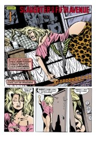

> [marginThumb] 

## Issue 32 : "Slaughter on Fifth Avenue"

##### Neil Gaiman and Shawn McManus

First part of storyline _A Game of You_

**Title**: _A Game of You_ clearly refers to the question of identity. Who and what the characters in this story are is a question either to the readers or to the character him, her, or itself, and that is the most important theme the reader should keep in mind when reading this story.

Many of the chapters of this storyline have titles taken from songs. Can anyone identify "Slaughter on Fifth Avenue"?

**Influences**: Jonathon Carroll's _Bones of the Moon_ has a great many points of similarity with _A Game of You_; enough so that Gaiman deliberately changed elements in his story when he discovered the correspondence. The two works have similar styles and themes, and even points of plot in common; the _Sandman_ fan would very probably enjoy _Bones_.

### Page 1-3

- This is the same Land that formed the setting for Barbie's dreams in _The Doll's House_. Of the four characters speaking in this sequence, we have met one, Martin Tenbones, a giant dog-like being; and we will meet the other three. Martin speaks in purple captions. Luz speaks in green; Prinado, who has an lower-class-British accent which may be supposed to be Cockney, speaks in orange; and Wilkinson speaks in red. Note the ornate lettering style of all those associated with the Land.

### Page 1

> [marginThumb] 

- #### Panel 1

  The Cuckoo and its Disciples were first mentioned in _The Doll's House_. Luz was the name of the place where Jacob had his dream of wrestling with an angel. In keeping with _A Game of You_'s name motif, note that upon waking up, Jacob renamed the place Bethel (which means "house of God").

- #### Panel 3

  The parallel between the captions and the scene indicates that this still form is the Tantoblin; more will be explained in later issues. The Black Guard is another unknown group. Tantoblin: A tart or round pastry, or a lump of excrement.

### Page 2

> [marginThumb] 

- #### Panel 1

  Colonel Knowledge may be equivalent to "carnal knowledge".

- #### Panel 3

  Murphy is someone whose identity you may be able to figure out before it's revealed. We haven't heard of "Murphy" before. Note that it seems to be a god-like being to those of the Land.

### Page 3

> [marginThumb] 

- #### Panel 1

  The Hierogram and the Porpentine were mentioned in _The Doll's House_. Hierogram comes from words meaning "holy writing", and itself means "sacred symbol" or is equated with "hieroglyph" (which also means "holy writing", making the definition nicely circular). Porpentine is the old and obsolete name of a certain [unspecified] fixed star. The OED has a citation for this use from 1503. Porpentine can also be used to mean "porcupine".

- #### Panel 3

  The eyes are Martin Tenbones', presumably.

### Page 4

> [marginThumb] 

- #### Panel 1

  This is Barbie, who was once married to Ken, but whose marriage ended as a result of events in _The Doll's House_. Note the photos on the wall behind her, which includes photos of tattoos and a male breast with a nipple ring.

### Page 5

> [marginThumb] 

- #### Panel 1

  First appearance of Wanda. Note the condition of the hallway, obviously in a rundown tenement.

- #### Panel 2

  Barbie's statement jibes with the end of _The Doll's House_.

  Prior to Rose's becoming the vortex, Barbie had dreamt she was a princess in a fairytale Land. After Rose forced the dreamers in Hal's house into each other's dreams, Barbie stopped dreaming.

  The Game of Barbie is that she's two different people awake and sleeping.

  Note that Wanda uses alliterative pet names for Barbie.

- #### Panel 6

  **Put my face on**: apply makeup. This process is unusually complex for Barbie, as we shall see.

  Note the potential ambiguity in the discussion of cheeks, given the prominent appearance of Barbie's buttocks in this panel.

### Page 6

> [marginThumb] 

- #### Panel 5

  Is Wanda wearing shorts or an oddly shaped skirt?

### Page 7

> [marginThumb] 

- #### Panel 2

  First appearance of Thessaly. Thessaly is also the name of a region in Greece. Note the moon-like size and shape of Thessaly's glasses; this possibly symbolism will be more apparent in [Sandman #34](sandman.34.md).

- #### Panel 7

  First appearance of Hazel.

### Page 8

> [marginThumb] 

- #### Panel 1

  The structure dominating Hazel and Foxglove's room is a loft, well known to students everywhere. It is essentially a wooden structure which raises a bed frame five or more feet off the floor, creating additional floor space beneath for desks, dressers, or the like. It is much like a bunkbed without a lower bunk. Note the computer setup. Of the posters in the background, one appears to be Jimi Hendrix, a late rock star, and another may be a Patrick Nagel print; the Endless Desire is usually drawn to resemble a Nagel illustration.

- #### Panel 4

  Thessaly's "soy-milk" is a nondairy milk substitute for strict vegetarians. It is, as Wanda indicates, obtained from soy beans.

- #### Panel 5

  First appearance of Foxglove. She is describing, of course, how one milks a cow. Since we later find out that Fox is a writer, perhaps "eighty" could refer to the number of pages Fox has written in her current novel. Foxglove is a common ornamental flower (Digitalis purpurea). The drug Digitalis is extracted from Foxglove and is used to slow the heart.

### Page 9

> [marginThumb] 

- #### Panel 3

  First appearance of George. Also note that page numbers have disappeared. Since the story runs 25 pages instead of the usual 24, I suspect that the script was being revised while McManus was doing the art, causing a some confusion.

### Page 10

> [marginThumb] 

- #### Panel 2

  Chess, of course, is a board game, echoing the overall title of this issue.

- #### Panel 3

  Tiffany's is a high class, New York department store, which is well-known for it's expensive jewelry & perfumes (Breakfast at Tiffany's); hence Wanda's comment (in panel 4) that they "can't afford it".

- #### Panel 6

  **Princess Barbara**: irony. Wanda doesn't know that that is how Barbie is known in the Land.

### Page 11

> [marginThumb] 

- #### Panel 1

  This may be the same place where Johanna Constantine met Dream in [issue #29](sandman.29.md), _Thermidor_.

- #### Panel 2

  The link between dreams and time is an old one, so to speak. Dreams are often seen to be prophetic (oneiromancy), and the interpretation of dreams is one of the charges of a society's shaman (whatever his title, be it witch doctor or psychiatrist).

- #### Panel 5

  **Skerry**: a rugged, insulated sea-rock or stretch of rocks, covered by the sea at high water and in stormy weather; a rocky islet (from the OED). It is also a small boat.

### Page 12

> [marginThumb] 

- #### Panel 7

  According to what Dream says here, and since the Land is a skerry, the skerries are semi-stable, the private dream reserves for those who dream in series of dreams.

### Page 13

> [marginThumb] 

- #### Panel 1

  More evidence of script revision, with lettering revision marks in the first caption.

- #### Panel 2

  Note the hook nose and pointed ears of the man in the foreground. This is probably just artistic noodling on McManus's part.

- #### Panel 5

  "Rowley" is a reference to an old Mother Goose rhyme:

  > With a Rowley, Powley, Gammon, and Spinach 
  > Heigh-Ho for Anthony Rowley.

### Page 14

> [marginThumb] 

- #### Panel 3

  **Barbie-Bubullah**: Bubullah is one of the spellings for a Yiddish term of endearment, roughly meaning "baby" or "child". For an annotation for Yiddish see [issue #8](sandman.08.md).

- #### Panel 5

  Wanda is referring to two television shows, _The Twilight Zone_ and _The Outer Limits_, both of which were anthology shows featuring science fiction and general weirdness. "We control the vertical" is from the title sequence of _The Outer Limits_.

### Page 15

> [marginThumb] 

- #### Panel 2

  Martin Tenbones has indeed found his way to the real world,
  through the unexplained magic of the Plot Device (or perhaps the Porpentine).

- #### Panel 4 & 5

  Note the yellow liquid on the ground & dripping off the lady's skirt; apparently, she wet herself.

### Page 16

> [marginThumb] 

- #### Panel 1

  _Breakfast at Tiffany's_ is a novel by Truman Capote, later made into a movie starring Audrey Hepburn.

  _Breakfast at Tiffany's_ was about a woman (Hepburn's character, in the movie), who would always go window shopping at Tiffany's (a high-class department story in New York. See my annotation on page 10, panel 3).

  This is what Barbie is referring to when she says "Breakfast first. Window shopping later".

- #### Panel 2

  Wanda is correct. Sleep deprivation studies have shown conclusively that people who are prevented from entering REM sleep, the dreaming phase, become psychotic in a matter of weeks.

  Note Wanda's wording: "You go koo-koo." Or Cuckoo.

- #### Panel 7

  There's something unusual about Wanda, since only boys get the classical "wet dreams"--ejaculations while sleeping, common in adolescents.

- #### Panel 8-9

  What Wanda is _really_ referring to here are the Bizarros, a group of imperfect duplicates of Superman and his supporting cast, including Lois Lane. The Bizarros, particularly "Bizarro Superman #1" and "Bizarro Lois #1" appeared in quite a few Superman stories, mostly in the 1960s, before being made "never-was" by the events of _Crisis on Infinite Earths_ in 1985.

  See below for how the Bizarros became "Weirdzos".

  See also page 17 panel 8.

### Page 17

> [marginThumb] 

- #### Panel 1

  Wanda's description of the "Wierdzos" is apparently an accurate description of the Bizarros.

  "Hyperman" is obviously an analog of Superman. Similarly, "Lila Lake" is an analog of "Lois Lane". (Note the initials of both names.)

- #### Panel 4

  **Mister Boney**: Boney was a common nickname for Napoleon Bonaparte, but this is probably irrelevant given Martin Tenbones' correct name.

- #### Panel 6

  Sindie was alluded to in _The Doll's House_, but not named explicitly. Note the spelling of her name: "Sindie" = "sin". There was a line of "Sindie" dolls in the 1970s (or British "Cindy" dolls still being made) designed to compete directly with Barbie dolls. In effect, she was a "younger version of Barbie", as mentioned in the epilog to _Doll's House_. I'm not sure whether the Sindy/Cindy dolls are still being produced, but I _do_ remember seeing them in a toy-store catalog a few years back.

- #### Panel 7

  We do not meet Scarlett, who might be the landlord. There may very well be a connection between Scarlett and the character Scarlett O'Hara of _Gone with the Wind_ (book and film), particularly considering later events of the story.

- #### Panel 8

  A "Weirdzo" correction of an original Bizarro reference fell off the page before reproduction. See below. Note that Wanda was evidently born male, named Alvin, but now considers herself female. The Game of Wanda is her gender orientation.

### Page 18

> [marginThumb] 

- #### Panel 1

  Martin Tenbones' right eye has apparently been hit. The result of another encounter after scaring the black beggar lady, perhaps?

- #### Panel 3

  Note the people's reactions to Martin and the smoke coming from the car on the right.

### Page 19

> [marginThumb] 

- #### Panel 2

  Barbie doesn't recognize herself: Part of the Game of Barbara.

- #### Panel 4

  Wanda and Barbie mentions toys, just as Barbie becomes aware of Martin Tenbones' presence. This is foreshadowing later revelations.

- #### Panel 6

  Barbie's makeup is starting to run, perhaps from sweat?

### Page 20

> [marginThumb] 

- Martin Tenbones has grown since the Doll's House, where he was no more than chest-high to Barbara.

### Page 21

> [marginThumb] 

- #### Panel 2

  Barbie's makeup is really running now.

- #### Panel 9

  Note that now Barbie is crying, not before, so her makeup wasn't running from tears.

### Page 22

> [marginThumb] 

- #### Panel 1

  Luz, as we see, is a dodo, Prinado a monkey in a bellboy suit, and Wilkinson a rat in a trenchcoat and press hat. Wilkinson's attire and manner of talking suggest John Constantine, the main character of DC's _Hellblazer_, who also appeared in [Sandman #3](sandman.03.md).

### Page 23

> [marginThumb] 

- #### Panel 2

  Note what appear to be many keyholes on Barbie's door; New York residents have multiple deadbolts and police locks to help keep thieves out.

  Note also the man standing in the background. Is he merely loitering, or is he interested in what happens to Barbie?

### Page 24

> [marginThumb] 

- #### Panel 2

  The Porpentine has changed its appearance from _The Doll's House_.

- #### Panel 4-5

  The birds of the apparitions are probably supposed to be cuckoos.

### Page 25

> [marginThumb] 

- #### Panel 4 & 5

  Note that the bird is apparently unafraid of George.

  Does he own it? And why is he eating it?

- #### Panel 8

  The Game of George is simply "What are the Children of the Cuckoo?"

## Credits

- Originally collated and edited by Greg Morrow.
- Aamod Sane (sane@cs.uiuc.edu) hit the OED for some references for _A Game of You_'s unusual words.
- dennis c hwang <hwa5@midway.uchicago.edu> recalled the earliest appearance of the Cuckoo, and talked about Sindie dolls.
- Bill Sherman <sherman@math.ucla.edu> identified some Yiddish; thoroughly referenced _Breakfast at Tiffany's_; noted some significant phrasing by Wanda; spotted a ref to Napoleon, or not; and recalled Scarlett O'Hara.
- Michael Manley (manley@iies.ecn.purdue.edu) and Tanaqui Weaver both discussed the influence of Carroll's book on this story.
- Jim W Lai <jwtlai@jeeves.uwaterloo.ca> noted ambiguous cheeks, visual symbology in Thessaly's appearance, Foxglove's decorations and profession, oneiromancy, an unusual man, Martin Tenbones' means of transportation, and pointed out a line about mirrors.
- Andy Lewis <A.J.Lewis@ecs.southampton.ac.uk> spoke about Cindy dolls and noted Martin Tenbones' change.
- Colonel G.L. Sicherman (gls@windmill.att.com) contemplated Foxglove's output, referenced Anthony Rowley, and identified some Yiddish.
- Terry Dawson (terry@edsi.plexus.com) spots the coincidence between toys and the appearance of Martin Tenbones.
- Jim W Lai also relays, from GEnie, W.TERVAYJR.'s excerpt from Pat O'Neill's Wizard interview with Neil Gaiman (and that makes it what, sixth hand or so?):

  > Gaiman: "As far as I'm concerned, the Sandman definitely runs the dreams of all the people in the Universe..but I don't tend to view it as the DC Universe unless I want to go in and do something like kill the Element Girl or my recent failed attempt to drag in the Bizarros."
  >
  > The Bizarros? Those imperfect, white faced duplicates of Superman? Were they in SANDMAN? Yes, they were -- or at least Gaiman _wanted_ them to be. "The production error on that was the funniest thing about it," he says. "I wrote it as the Bizarros, because I thought nobody would mind, what with them being out of continuity; they vanished off in CRISIS, so I thought nobody would mind my having them as comic characters. And some people at DC did. And so, after it was already lettered, somebody went in and stuck 'Weirdzo' over all the places where it said 'Bizarro'...except one fell off and confused everybody. I've heard wonderful conspiracy theories about that, but one simply fell off. By the time Shawn McManus drew the second issue, he knew it had to be different, so the character has a big 'H' for 'Hyperman' on his chest, instead of a big 'S'."
  >
  > "The way I try to do stuff like that in SANDMAN, anyway, is that anyone who recognized the comic book history will get the joke," Gaiman notes, "and anybody who doesn't, it's not important. They don't feel like they're being excluded".

- Ralf Hildebrandt added more details.
