# The Annotated Sandman

## Issue 33: "Lullabies of Broadway"

> [!THUMBNAIL] 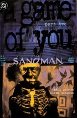

##### Neil Gaiman and Shawn McManus

Second part of storyline _A Game of You_

Not yet reprinted in any other form

**Title**: _A Game of You_ clearly refers to the question of identity. Who and what the characters in this story are is a question either to the readers or to the character him, her, or itself, and that is the most important theme the reader should keep in mind when reading this story.

The title of this chapter refers to the song "Lullaby of Broadway" the big production Number in Busby Berkeley's "Gold Diggers of 1935", it was written by Harry Warren and Al Dubin.

**The lyrics are**:

> Come on alomg and listen to 
> The Lullaby of Broadway. 
> The hip Hooray and Ballyhoo 
> The Lullaby of Broadway 
> The rumble of a subway train, 
> The rattle of the taxis 
> The daffidyls, who entertain 
> At Angelo's and Maxie's. 
> When a Broadway Baby sais Good Night, 
> It's early in the morning. 
> Manhatten Babies don't sleep thight 
> Until the Dawn. 
> Good night, Baby Good night, 
> Milkman's on his way 
> Sleep thight, Baby, Sleep thight, 
> Let's call it a day 

The plot of that number is: At first we see a black screen, with a small white point.  The camera zooms on it, it developes to the face of the singer Winnie Shaw, when her faces fills the whole screen, it becomes shot of Manhattan at Night, in the Middle the Broadway. A clock shows us the time it's a bout 6:40 am, every body rushes to work, Winnie Shaw and Dick Powell (leading man of the picture) are coming to her home, they wear evening dress, he says good-bye, she's going to her flat feeds her cat with milk and goes to bed at 6.45 am. The wakes up at 6.45 pm, dresses and joins Dick Powell in a gigantic nightclub, where about 150 dancers (could be more, I counted them only on a still that does not show the whole set) entertain them with their tap-dancing. After that Powell and Shaw are dancing, then Shaw fells accidentally out of the window, at 6.45 am nobody's there to feed the cat.

We see Manhattan, it turns back to Shaws face, and she finishes the song, while her faces becomes a white point on the screen again.

### Page 1

> [!THUMBNAIL] 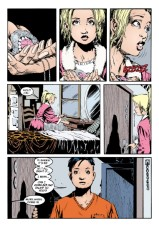

- #### Panel 6

  Note that Hazel's appearance has "softened" greatly since the previous issue.

### Page 2

> [!THUMBNAIL] 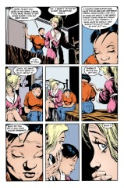

- #### Panel 1

  Note the checkerboard pattern along the top of Barbie's walls: yet another reference to a game/games.

### Page 3

> [!THUMBNAIL] 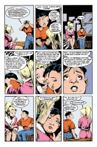

- #### Panel 4

  Hazel works in a restaurant or something; we find out later that she's "a chef", which suggests something on a higher plane than McDonald's.

- #### Panel 9

  **Note for people who really should know better**: Hazel is wrong, and having sex while standing up is not an effective method of birth control. Odd that a lesbian, who lives in the bad parts of New York, doesn't know about proper contraception.

### Page 4

> [!THUMBNAIL] 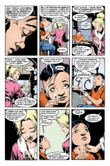

- #### Panel 2

  Women who live together, or close to each other, often have synchronal menstrual periods, due to pheromones.

- #### Panel 5-7

  Long ago, in the olden days, as Barbie says, a pregnancy test involves injecting some of the mother's blood (possibly urine) into a female rabbit. After 24 hours, the rabbit was killed (or died on its own), and the ovaries were examined visually. If the ovaries displayed signs of hyper-ovulation, this indicated the presence of particular hormones in the woman's blood, and thus that she was pregnant.

  Note that using "the rabbit died" as a synonym for pregnancy is something of a sick joke: The rabbit always died when the test was performed. Nowadays, fairly reliable tests have been developed that check for certain hormones in the prospective mother's urine (usually recommending the first urine of the morning, so the urine has collected for a longer period of time and is richer in hormones and protein content.)

- #### Panel 8-9

  [Sandman #37](sandman.37.md) has a short section in the letter column about this sequence; one reader wrote in saying that Barbie was wrong about the use of anesthesia in and the pain of abortions. Assistant Editor Alisa Kwitney, whom I've plagiarized before, checked with Planned Parenthood, and confirmed that individuals' responses to abortion vary considerably, but that Barbie's was a common reaction.

### Page 5

> [!THUMBNAIL] 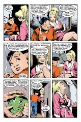

- #### Panel 2

  It looks to me like "dicks" got changed to "dorks", which is a pretty sad editorial change in a "mature readers" title. There is a lettering correction mark between the d and the o. Note that "dork" is, however, English slang for "penis", at about the same social level as "dick", so Gaiman may have slipped one past Karen again. (He replaced "shit" with "felching" in Books of Magic; "felching" is far more obscene than "shit", albeit more obscure.)

### Page 6

> [!THUMBNAIL] 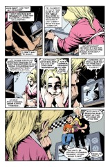

- #### Panel 4

  Cotton wool in unspun cotton, roughly the same form as cotton balls, without being formed into balls. The "wool" does not refer to sheep's wool, but instead to the state of the fibers, much as in "steel wool". Note that "Wundawool" makes a reappearance in [Sandman #36](sandman.36.md), an additional clue to the parallel structure of chapters in the story. Why would anyone want to use "wool" that came in different flavours??? It's not like anyone would want to taste it, or anything. Perhaps Barbie's mind is wandering?

- #### Panel 6

  Barbie is slipping into the Dreaming for the first time in two years.

### Page 7

> [!THUMBNAIL] 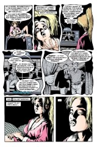

- #### Panel 1

  Nuala was introduced in _Season of Mists_. She is an elf-maid given Dream by the rulers of Faerie.

- #### Panel 2-5

  Note the borders of these panels.

- #### Panel 3-5

  The talk show host is David Letterman, who is noted for having a gap between his front teeth (and really bad hair).

- #### Panel 5

  Another facet of the Game of Barbie.

### Page 8

> [!THUMBNAIL] 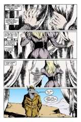

This sequence is said to be reminiscent of the wardrobe which transports the children to Narnia in _The Lion, the Witch, and the Wardrobe_.

### Page 9

> [!THUMBNAIL] 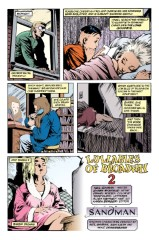

- #### Panel 2

  Raymond Chandler was a pioneer in the hard-boiled detective style, and _The Long Goodbye_ is one of his greater works. The maguffin is a question of identity, and the novel reflects on how identity affects relationships. One of the featured characters disguises himself, and encounters the protagonist, Philip Marlowe, in both guises. At one point, he says "An act is all there is. There isn't anything else. In here--[taps chest with lighter]--there isn't anything." Now compare this will George's actions on the next page.

  The title of _The Long Goodbye_ may also be echoed in the end of this storyline.

- #### Panel 3

  Claudia, the "young girl" vampire in Anne Rice's "Interview with a Vampire", also used to brush her hair 100 times.

  **iphigenia notices**:

  > Interview With the Vampire was first published in 1976, long before Game of You. The 100-strokes thing is not unusual at all; it's a time honored beauty technique for improving the condition of one's hair. Note, however, that it's now considered detrimental as it causes quite a bit of stress to the hair and overstimulates oil production in the scalp.

### Page 10-11

We still don't know what George is, but he's weird for sure.

George apparently doesn't have any nipples; is this a drawing oversight, or is George really not human?

This sequence, particularly the use of the utility knife in stripping away the surface disguise, is reminiscent of scenes in the movies _Terminator_ and _Terminator 2_, where the eponymous androids reveal their metallic endoskeletons beneath fleshy exteriors.

### Page 12

> [!THUMBNAIL] 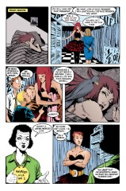

- #### Panel 2-4

  Wanda's dream starts off without contractions, but picks them up again in panel 6. "Nice dresses" is probably Wanda's internal code for being a women. The exact significance of the boys is unknown, but they were probably fellow members of the "weird group" at Alvin's school, and because Wanda identified with them when she was Alvin, she projects her own transsexual intents onto them in her dream. Or not. It's open to interpretation.

- #### Panel 5-6

  Recall that Alvin had wet dreams about making out with "Weirdzo Lila Lake" (really Bizarro Lois Lane). Note that Alvin's hair has gotten short.

### Page 13

> [!THUMBNAIL] 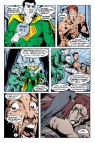

- #### Panel 1

  This is "Weirdzo Hyperman #1" (really Bizarro Superman #1). Note that the Bizarros never had a comic book of their own, although they have had a series or two in various anthology comics. Bizarros talk in a sort of meaning-reversed and inverted manner.

- #### Panel 2

  Alvin is a man again. Part of the Game of Wanda and Alvin is that Alvin is afraid to go through the final stage of becoming Wanda.

- #### Panel 3

  The remark about innocence is most likely a misphrasing of the old saw "Ignorance of the law is no excuse."

### Page 14-15

Possible interpretation of Hazel's dream: Hazel wants her baby to also be Fox's "baby" - she wants Fox to accept the baby as her own & help look after it with Hazel. But Hazel is scared that her baby will really drive Fox away from her ("devour" her), ruining their friendship.

### Page 16

> [!THUMBNAIL] 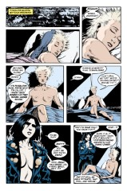

- #### Panel 1

  **Foxglove sleeps without dreaming**: But immediately starts dreaming. This is obviously due to the influence of the cuckoo, but is still a jarring transition.

- #### Panel 3-6

  Foxglove's real name is Donna Cavanagh, whose ex-lover was Judy, who was killed in [Sandman #6](sandman.06.md). Donna was mentioned in that issue, but not seen. Judy also knew Rose, who was at the center of _The Doll's House_, where we met Barbie.

  Note that Foxglove is sitting in what amounts to a spotlight, possibly explaining the bright color of her nipples.

- #### Panel 5

  Judy died in this outfit.

- #### Panel 6

  Note that Judy blinded herself in [Sandman #6](sandman.06.md), thus appearing here without visible eyes.

### Page 17

> [!THUMBNAIL] 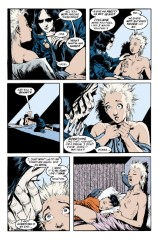

- #### Panel 2

  Judy was in the diner when John Dee walked in because she had had a fight with Donna, in which she had hit Donna. There isn't much to the Game of Foxglove, just some trauma left over from Judy's death, but Fox has mostly worked through that, and knows who she is more than most of the other characters in the story, as we shall see. In fact, while Wanda's change of name is fundamental to her question of identity, Foxglove's change of name indicates that she's answered her question of identity.

- #### Panel 5

  Note the irony in Judy's final remark.

### Page 18

> [!THUMBNAIL] 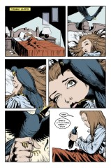

The Game of Thessaly is really limited to the question of "who is Thessaly", since we now know that there is at least as much unknown about her as there is about George.

- #### Panel 1

  Note that "Thessaly sleeps", not "Thessaly dreams".

### Page 19

> [!THUMBNAIL] 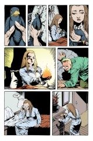

- #### Panel 5

  Note the light from the fire in her hands casts shadows and changes the coloring of Thessaly's fire. It is unlikely, IMHO, that the blond hair and blackened hands reveal anything in particular about her.

- #### Panel 6

  Apparently, George has been hurt by the death of one of "his" birds.

### Page 21

> [!THUMBNAIL] 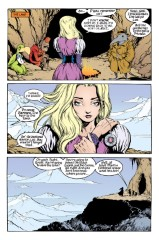

- #### Panel 1

  Note Luz's gender. "Luz" is Spanish for light, and is grammatically feminine. Also note that Princess Barbara talks in the same style as the other inhabitants of the Land.

### Page 23

> [!THUMBNAIL] 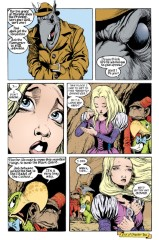

- #### Panel 1

  Wilkinson sounds just like Martin Tenbones did on page 3 of the previous issue, doesn't he? Note that the issue is only 23 pages, probably because the previous one ran a page over.

## Credits

- Originally collated and edited by Greg Morrow.
- Mark Biggar (mab%wdl39@wdl1.wdl.loral.com) explained the Rabbit Test, using an episode of M\*A\*S\*H for reference!
- Jeffrey Hitchin (jhitch@crash.cts.com) also explained the rabbit test.
- Bill Sherman <sherman@math.ucla.edu> spotted Narnia references, identified the title song, and contemplated innocence.
- Mike Chary (charyma@wkuvx1.bitnet) noted the English meaning of dork.
- Carol Osterbrock <carolo@cse.ucsc.edu> explained cotton wool, as did Mike "Killans" Collins (mcollins@nyx.cs.du.edu).
- Ian Lance Taylor (ian@airs.com) helped interpret the cuckoo/dreamers segment, particularly the parts involving Foxglove, and recalled pertinent details of Judy's death.
- Jim W Lai <jwtlai@jeeves.uwaterloo.ca> identified cotton wool, referenced _The Long Goodbye_, spotted a visual reference to the Terminator, wondered about the color of Foxglove's nipples, noted Judy's clothing,
- The Colonel, G.L. Sicherman, (gls@windmill.att.com) also identified cotton wool, referenced _The Long Goodbye_, explained the innocence remark, and speculated about the origin of Luz's gender.
- Ralf Hildebrandt added more details.
