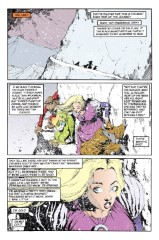
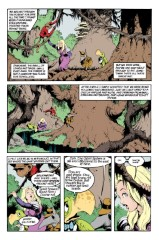

> [marginThumb] 

# Issue 35: "Beginning to See the Light"

##### Neil Gaiman and Shawn McManus

- Fourth part of storyline _A Game of You_
- Fourth story reprinted in trade paperback _A Game of You_
- Audible Act II Chapter 15

**Title**: _A Game of You_ clearly refers to the question of identity. Who and what the characters in this story are is a question either to the readers or to the character him, her, or itself, and that is the most important theme the reader should keep in mind when reading this story. This issue has a number of parallels with #32, suggesting an overall structure for the storyline, similar to what was done with _The Doll's House_.

The title of this chapter is taken from the Velvet Underground song of the same name, from their third self-titled album. Two lines from this song are evocative of this series, and may have been in the back of Neil's mind when he created the Cuckoo:

> "Met myself in a dream.
>
> Let me tell you it was all right"

### Page 1

> [marginThumb] 

- #### Panel 2-3

  The Land is full of fantastic elements, such as the Trees and the Tweeners, which verge on being archetypes of the genre; that is their point. The Land takes much of its form from principles abstracted from Barbie's earliest books, as seen later. The Trees may be a direct reference to J.R.R. Tolkien's Ents, from _The Lord of the Rings_.

- #### Panel 3

  **Pretty party dress**: In fact, this is the same dress Barbie was wearing when we saw her in the Land in _The Doll's House_.

### Page 2

> [marginThumb] 

- #### Panel 1

  Wilkinson is singing an old folk song. Tipperary is a location in Ireland.

### Page 3

> [marginThumb] 

- #### Panel 3

  Barbie's remarks about the Hieromancer are a clue to the nature of the Land's inhabitants.

### Page 4

> [marginThumb] 

- #### Panel 1

  This was foreshadowed in [Sandman #32, page 1](sandman.32.md#page-1).

### Page 5

> [marginThumb] 

- #### Panel 1

  The dinosaur-like beings carrying the house may be a visual quotation from a short animated film of recent vintage.

- #### Panel 2

  Because the Tantoblin made breakfast, I suspect that his name comes from the pastry and not the scatological sense of the word.

- #### Panel 3

  The name "Room Patrol" is reminiscent of DC's comic book _Doom Patrol_, another title from the "Mature Readers" line with a British author and a similar editorial feel to _Sandman_.

- #### Panel 6

  Wilkinson's speech here is quite reminiscent of John Constantine; Wilkinson is probably meant to be an analog to Constantine, given the similarity in costume and language. I have not identified "Swamp Thing" or "Shade" analogs in the Land; that would complete the DC Mature Readers homages in _A Game of You_.

### Page 6

> [marginThumb] 

- #### Panel 5

  Barbie's face painting was prominently seen in [Sandman #32](sandman.32.md).
  Her remark about not wanting anything permanent should not be overlooked.

### Page 7

> [marginThumb] 

- The Sandman Companion states that the text on the scroll is from a 1920s reference book titled _The Birds of the British Isles and Migrations_. Neil mentions the same book was used again in [#40](sandman.40.md)'s The Parliament of Rooks, and was also leant to Alan Moore for material on owls for Watchmen.

  The same book, within its entry on the cuckoo also mentions:

  > The Welsh name of the Meadow-Pipit is "Gwas-y-Gog," the Cuckoo's servant.

  Which is presumably where Neil came up with that name from.

- #### Panel 3

  These are evidently the Black Guard alluded to before.

- #### Panel 5

  There is irony here.

### Page 9

> [marginThumb] 

- #### Panel 1-4

  This will be explained more fully later.

### Page 11

> [marginThumb] 

- #### Panel 2

  No refs for Gniedrig. Probably a German or Polish myth.

- #### Panel 7

  The Land has the surface appearance of a children's fantasy land, like Oz or (particularly) Narnia. Wilkinson's remark about "necessaries" points out, even more than the Tantoblin's grisly form, the entirely different style of the Land now that Barbie is full grown.

### Page 12

> [marginThumb] 

- #### Panel 3

  This hearkens back to page 9.

### Page 13

> [marginThumb] 

- #### Panel 2

  Note the clawed hand. Possibly a Tweener?

- #### Panel 5

  **Nobbled**: From context, "torn to little bloody gobbets." Origin unknown.

### Page 14

> [marginThumb] 

- #### Panel 3

  Barbie refers to J.R.R. Tolkien's _The Hobbit_, a highly regarded novel. It is that most rare of beasts, a bridge between juvenile and adult fantasy, done with extraordinary skill and mythic sense, style, and scope.

### Page 18

> [marginThumb] 

- #### Panel 2

  "Follow the yellow brick road" were the instructions given to Dorothy in _The Wizard of Oz_, the first in a long and excellent series of juvenile fantasy novels (and later made into a execrable movie that inexplicably became a "classic"). References to the tale have shown up many times in _Sandman_, notably in Hal's dream in _The Doll's House_. Dorothy, like Barbie, had three traveling companions, and traversed a forest of dark and malicious demeanor.

### Page 19

> [marginThumb] 

- George attempts to play Wanda in the Game of You, but Wanda refuses.

- #### Panel 8

  The consequences of bringing the moon closer to the Earth are pretty severe. Tides would be higher; weather probably wilder. Earthquakes would also be more common.

### Page 21

> [marginThumb] 

- #### Panel 6

  'Nana: probably banana.

### Page 24

> [marginThumb] 

- #### Panel 3

  This is a big clue to the nature of the inhabitants of the Land (but somewhat misleading about the nature of the Cuckoo).

## Credits

- Originally collated and edited by Greg Morrow.
- John Ptacek (ptacek@nucst13.neep.wisc.edu) identified the common thread in _Game of You_'s chapter titles, and identified this issue's title in particular.
- "Boffo" Bill Sherman (sherman@math.ucla.edu) speculated on the antecedents of cartoon dinosaurs, and noted certain parallels with _The Wizard of Oz_.
- Mike "Killans" Collins (mcollins@nyx.cs.du.edu) recalled Tolkien's Ents, and pointed out my omission of Shade.
- Mike Kelly (mkelly@ovid.helios.nd.edu) and Glenn Carnagey (lf7z@ellis.uchicago.edu) have theories about the antecedents of Gniedrigs and Tantoblins (Dringenberg and Totleben; Gnome + Niedrig and Tanto + Goblin, meaning "lowly gnome" and "too much goblin"), neither of which I agree with.
- Glenn also thinks the parallels between Tolkien and the Land are extreme and deliberate. I submit that this is because the Land is built on the same principles that Tolkien used in his work. In other words, they're similar because they're similar to the same thing, not because they're similar to each other.
- Richard Munn added the bird book reference from Sandman Companion, and noticed the probably source of Gwas-y-Gog.
