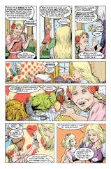
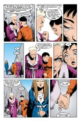

> [marginThumb] 

## Issue 36: "Over the Sea to Sky"

##### Neil Gaiman, Shawn McManus, Bryan Talbot, and Stan Woch

Fifth part of storyline _A Game of You_

**Title**: _A Game of You_ clearly refers to the question of identity. Who and what the characters in this story are is a question either to the readers or to the character him, her, or itself, and that is the most important theme the reader should keep in mind when reading this story.

Many of the chapters of this storyline have titles taken from songs. "Over the Sea to Skye", also known as "The Skyeboat Song", is an old Jacobite rebellion song, referring to the flight of Bonnie Prince Charlie to the Isle of Skye, following his loss at Culloden. The Jacobites were a group, mostly Scotsmen, who supported Bonnie Prince Charlie's claim to the English throne. The first verse to "Over the Sea to Skye" goes:

> "Speed, bonny boat, like a bird on the wing,
> Onward! the sailors cry.
> Carry the laddy born to be king
> Over the sea, to Skye."

**Art credits**: Talbot/Woch did pp 1-8, 15-17, 24, 28, 38, 39, as near as I can tell. McManus did all the other art.

### Page 1

> [marginThumb] 

- Many of the dominant elements of the Land are revealed as elements from Barbara's childhood.

### Page 2

> [marginThumb] 

- #### Panel 1

  First full appearance of the Cuckoo, whose origin is explained in this issue.

### Page 4

> [marginThumb] 

- #### Panel 2

  I will admit that -I- fully expected the "abused child" ending. As it stands, I'm dissatisfied with what the Cuckoo really is; it's an inchoate thing, neither inner pain nor parasitical interloper.

- #### Panel 7

  This is a "bande dessine'e `a clef"; a comic book where real references are concealed behind pseudonyms. Perry Porter, the Amazing Spider is really Peter Parker, the Amazing Spider-Man; and Clint Clarke, Hyperman, is really Clark Kent, Superman.

### Page 5

> [marginThumb] 

- #### Panel 4

  Note the doll's house on the right. The toy on the dresser to the left is a bobbing bird; ideally, it should have its nose in a glass of water. A trick of evaporation causes the bird to bob up and down in perpetuity.

- #### Panel 5

  "Oh, look, a stuffed rat! Barbie will just -love- this one, don't you think, honey?" As implausible as it might seem for, say, Kenner to manufacture stuffed rats, I am reliably informed that merchants at SCA events have been selling stuffed "plague rats" for years, which are, among other things, popular as cat toys.

- #### Panel 7

  Say, this looks like a theme rearing its ugly head.

### Page 6

> [marginThumb] 

- #### Panel 1

  The books are:

  - [The Wizard of Oz](http://www.amazon.de/exec/obidos/ASIN/0812523350), by L. Frank Baum.
    Audiences are probably more familiar with the wretched film, but there was a series of children's books of infinitely more scope and imagination.
  - Then there are [The Magician's Nephew](http://www.amazon.de/exec/obidos/ASIN/0064471101), by C.S. Lewis, and something called _Narnia_. Lewis wrote a series of books, including _Nephew_, set in a magical land called Narnia. _Nephew_ is the next-to-last book in the series, but chronicles the creation of Narnia.
    There was no book in the series entitled _Narnia_, and there has never been an omnibus volume with that title, although there has been at least one two-volume edition with the title _The Chronicles of Narnia_. Narnia is full of Christian religious imagery, including a messianic lion named Aslan.
  - Next is J.R.R. Tolkien's [The Lord of the Rings](http://www.amazon.de/exec/obidos/ASIN/0345340426); this was originally published as a long trilogy, against Tolkien's wishes, but has since been available in several different editions of a single bound volume. _Lord of the Rings_ is perhaps the most classic work of modern fantasy; certainly, it's the most scholarly, as Tolkien was a philologist who made his world by drawing heavily upon his knowledge of languages and myth.
  - Finally, there is a work entitled [Witches](http://www.amazon.de/exec/obidos/ASIN/0141301104), a Roald Dahl novel later made into a movie by Jim Henson.

- #### Panel 3

  "Imaginary fiend"? A typo, or deliberate?

### Page 8

> [marginThumb] 

- #### Panel 1

  They Might Be Giants is an alternative rock duo made up of John Linnell and John Flansburgh. They take their name from a 1970s George C. Scott film, in which Scott's character becomes convinced that he is Sherlock Holmes. The title of that film is from Cervantes' [Don Quixote](http://www.amazon.de/exec/obidos/ASIN/0192834835); when questioned about his delusions, Scott's character cites Quixote's statement, "I don't fight windmills because they _are_ giants, I fight them because they _might_ be giants." In other words, his "delusion" is the result of a conscious choice. The entire movie, obviously, is about a question of identity, and hence reflects on this storyline.

  "The Nightgown of the Sullen Moon" was originally released on the 4-song EP _They'll Need a Crane_ (Restless/Bar None 72611-2), and is also on the collection [Miscellaneous T](http://www.amazon.com/exec/obidos/ASIN/B000003BIU) (Restless/Bar None 72646-2).

- #### Panel 2

  Q-tips are a brand name of cotton-tipped stick, used for a variety of delicate tasks. Wundabuds (and Wundawool) don't exist. As established before, "wool" in this sense is not sheep's wool, but unspun cotton.

**Note the rat**: visual reference to Wilkinson? Or just a rat?

- #### Panel 3

  Jim Morrison, the famous dead one, was the lead singer of the Doors, and is a shining testament to the wonders of hard core drug abuse.

  Note the radio station call letters.

### Page 9

> [marginThumb] 

- Note that the three women walk in step and perform the same actions.

- #### Panel 2

  First revelation of Hazel's last name. Foxglove's birth name was Donna Cavanagh, as seen earlier.

- #### Panel 3

  In Greece, Thessaly was infamous for its witches. The 2nd century Latin writer Apuleius wrote, in "The Golden Ass", about Thessalian witches would would gnaw off the faces of the dead to use in necromantic spells. These witches' rites were methods of commanding higher powers, as reflected in Thessaly's attitude, where modern Wiccans (neo-witches), and Christian prayer, petition the aid of higher powers. It is implied that Thessaly is the last of those witches.
  Judy died in [Sandman #6](sandman.06.md), after a fight with Donna (Foxglove).

### Page 10

> [marginThumb] 

- #### Panel 1

  I suppose one could play games with the interpretations of each woman's remark after leaving the trail of the moon. Panel 1, 3: Note the sun's changing position.

- #### Panel 3

  Thessaly's remarks about the nature of the Land will be explored more thoroughly later.

- #### Panel 6

  Thessaly recognizes the illogical predictability of coincidence inherent to stories.

### Page 13

> [marginThumb] 

- #### Panel 2, 4

  Note the parallel between cuckoos and Hazel's pregnancy.

### Page 14

> [marginThumb] 

- #### Panel 7-8

  Aww, cute.

### Page 15

> [marginThumb] 

- #### Panel 1

  Rutger Hauer is a fairly decent actor typecast into appearing in mostly B-class action films.
  With regards to the third (self-titled) Velvet Underground LP, it has been said:

  > "The Velvet Underground never sold many records, but every person who bought one of their albums started their own band."

  They were originally a band put together by Andy Warhol, part of his exploration/manipulation of popular culture in the 1960s, although his exact influence on the band is debatable.

- #### Panel 2

  There is irony in calling Barbie "Sleeping Beauty". Both are the central figures in fairy tales.

- #### Panel 5

  Queen is a slang term for certain types of transvestites and homosexual men.

### Page 17

> [marginThumb] 

- #### Panel 5

  The Good Samaritan is a character from the Christian Bible, a heretic who showed that he was nonetheless more truly good than the most pious religious person by helping a stranger. Someone who helps strangers is therefore called a "good Samaritan".

### Page 18

> [marginThumb] 

- #### Panel 5

  The Cuckoo explains her power over Luz and Barbie. Her remark about Barbie trying to tell herself the truth is probably a reference to the Tantoblin's message with the cuckoo text.

### Page 19

> [marginThumb] 

- #### Panel 1

  The Hierogram (Holy-Writing) is marked with Japanese katakana (one of the Japanese alphabets). The characters spell out "do-rii-mi-n-gu", or "Dreaming". The leftmost side of the first character should have a vertical stroke, not slanted, and the last character should have only two tickmarks on the side, not three.

  There is a Cuckoo Stone in England, which may have influenced this denouement. There is a legend about a cuckoo landing on the Cuckoo Stone at a certain time of year.

  The name of the Isle of Thorns may be a reference to the "thorn" character of Old English, a relic of runic alphabets such as Icelandic.

  A thorn looks like a combination of 'p' and 'b', and represents a voiceless 'th' sound. Thorns would thus be connected with the katakana letters.

### Page 23

> [marginThumb] 

- #### Panel 3

  Finally, George is explained, and we learn that more than one dreamer can share a skerry.

### Page 27

> [marginThumb] 

- #### Panel 1

  "Lally, lally" sounds familiar.

### Page 28

> [marginThumb] 

- #### Panel 4

  Lou Reed was the lead singer of the Velvet Underground.

Specifying Hurricane Lisa-with-a-'S' may be a reference to Liza Minelli, a prominent member of the New York social scene. Pictured are the Statue of Liberty and the World Trade Center.

- #### Panel 5

  The "dust storm" was when Thessaly called down the moon to enter the Dreaming. Pictured are the Chrysler building and what is probably the Empire State Building.

### Page 30-32

> [marginThumb] 

- IMHO, this is just about the best artistic representation of Dream in the series.

### Page 31

> [marginThumb] 

- #### Panel 4

  "Murphy" was the being by whom the inhabitants of the Land swore, as if by "God". The OED has the definition "Illiterate perversion of Morpheus", with an 18th century citation.

One is also drawn to consider "Murphy's Law" -- "If anything can go wrong, it will"; the storyline features a number of accidents and failures, including Martin Tenbones's death, Hazel's pregnancy, George's failure to anticipate Thessaly's presence, and developments in the final chapter.

### Page 34

> [marginThumb] 

- This sequence is reminiscent of a similar one in the last Narnia book, _The Last Battle_, in which Narnia ends, and all its creatures stream away. The fundamental difference is that the Narnia inhabitants were judged, and passed on to Shadow or Paradise, depending on their morality. In both cases, too, a party of outsiders watched the finale.

### Page 35

> [marginThumb] 

- #### Panel 1

  Alianora, a variant spelling of Eleanor, is a creation of James Branch Cabell, and appeared in his Poictesme stories, in part as the mother of one of the branches of Manuel the Redeemer's family. Her character is most prominent in _Figures of Earth_. Can one of my Cabell sources give me a brief description of her thematic role?

  Cabell is one of Gaiman's strongest influences.

- #### Panel 2

  Note Alianora's scar; was this a characteristic of the Cabell Alianora?

### Page 37

> [marginThumb] 

- #### Panel 2

  The connection between Dream and the witch-women of Thessaly has not been revealed.

### Page 39

> [marginThumb] 

- Recall that the apparent landlady of the building is named Scarlett, and now the building is "Gone with the Wind", so to speak.

## Credits

- Originally collated and edited by Greg Morrow.
- Gerson Koenig (gmkoenig@acsu.buffalo.edu) passed along useful TMBG information.
- Aamod Sane (sand@cs.uiuc.edu) passed along an OED definition.
- Jim W Lai <jwtlai@jeeves.waterloo.edu> and Michael K. Ellis (ellis@snowy.qal.berkeley.edu) identified the katakana on the Hierogram.
- Jim also referenced the Cuckoo Stone.
- Jim passed along a lengthy transcript of GEnie discussion:
  - Thom (THE.FOOL) recalled _The Last Battle_.
  - Dawn Friedman (D.FRIEDMAN11) helped interpret the _Last Battle_ parallels and identified Alianora.
  - Laura Osgood (L.OSGOOD) referenced Thessalian witches.
  - J.REA1 identified _The Magician's Nephew_, and added more about witches.
  - Andrew Sigel (A.SIGEL1) also referenced Narnia.
  - Chet Jasinski (C.JASINSKI) also identified the katakana writing.
  - Nathan (EVPA) also identified Alianora.
- Michael S. Schiffer <mss2@midway.uchicago.edu>, Rick Jones
  <albert@crick.ssctr.bcm.tmc.edu>, and Shadowknight <RMAPLE@ucs.indiana.edu> all pointed out the availability of Tolkien in single editions.
- Crystal Hagel (hagel@stsci.edu) identified "Over the Sea to Skye" and corrected an error of mine about TMBG.
- John B. Woodford (jbw@stovall.slh.wisc.edu) filled in many details about the title song.
- Michael J Montoure ("John Drake") <number6@u.washington.edu> and Andrew C. Plotkin <ap1i+@andrew.cmu.edu> also recalled the title song.
- David Goldfarb (goldfarb@ocf.berkeley.edu) recalled the title song, corrected my French (blush), corrected a TMBG flub, added TMBG information, and suggested an interpretation for one of the Cuckoo's remarks.
- pho@Athena.MIT.EDU identified the title song and pointed out the availability of _Lord of the Rings_ in a single volume.
- Alexx@world.std.com pointed out the availability of stuffed rats at SCA events.
- David Henry <dhenry@plains.NoDak.edu> is so bereft of culture in North Dakota that he wants to "state my life-long admiration and inspiration from Marvin Mouse," a rat-like character from a Manitoba children's show.
  This is only tangentially related to the issue of stuffed rats, but I like making fun of David.
  In his defense, though, David identified _Witches_ and tried to explain the Velvet Underground.
- gu@castle.edinburgh.ac.uk also identified _Witches_ and made a pun: "Colonel Knowledge--I just assumed it was General Knowledge before he was promoted." Gah.
- Michael Bowman (bvmi@odin.cc.pdx.edu) corrected a typo, had some information on Narnia editions, and eagel-eyed the New York skyline.
- Edward Liu <el24+@andrew.cmu.edu> brought up Murphy's Law.
- Chris Jarocha-Ernst (cje@gandalf.rutgers.edu) gave the original source for TMBG's name.
- Timothy M Wright (tim@theory.lcs.mit.edu) passed on TMBG information and speculated about the Isle of Thorns.
- michael@psych.toronto.edu discoursed on the movie _They Might Be Giants_.
- William "Gotta Love Me" Sherman <sherman@math.ucla.edu> ID'ed the TMBG movie, quibbled with my use of "causality", recalled the source of "Good Samaritan", ID'ed the Empire State Building, and whined for a footnote (about GWTW).
- Ralf Hildebrandt added more details.
