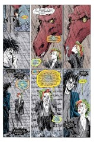

> [marginThumb] 

# Issue 42: Brief Lives: Chapter Two

##### Neil Gaiman, Jill Thompson, and Vince Locke

- Second part of storyline, _Brief Lives_
- Second story reprinted in trade paperback _Brief Lives_
- Audible Act III Chapter 5

**Notes**: See [#41](sandman.41.md).

## 1: _It Always Rains on the Unloved_

- From "Peanuts", the comic strip written by Charles Schulz, as said by Charlie Brown, a karmically oppressed child.

### Page 1

> [marginThumb] 

- #### Panel 6

  We have not yet been told the identity of Dream's lover.

  We know that she has appeared before, that she is not one of his former lovers, that the relationship lasted a "handful of months", and that she is in the "waking world". I lean toward Thessaly, given the above and that Neil asked his GEnie forum if they were interested in seeing her again, about the time he was planning _Convergence_.

## 2: _Wet Dreams_

- **Wet dreams** is a pun here; it actually refers to dreams that result in orgasm. There is a demented song by Kip Adotta called "Wet Dream", consisting mostly of fish puns.

### Page 4

> [marginThumb] 

- #### Panel 5

  Nuala's stone is probably not very significant, although it might be one of the twelve Dreamstones (others including Dream's Ruby and the Porpentine).

### Page 5

> [marginThumb] 

- #### Panel 2

  Mervyn has been seen in [#5](sandman.05.md), as a bus driver, and in _Season of Mists_. He is probably derived from Jack Pumpkinhead, a character in L. Frank Baum's Oz books. His name is probably a reference to Mervyn Peake, a British author/illustrator, known for the "Titus" books: _Titus Groan_, _Gormenghast_, and _Titus Alone_. These books are gothic fantasies, set in a large castle.

- #### Panel 3

  **Flick it**: A curious euphemism for a supposedly mature book. Obviously meant to be "fuck it"; note that all-caps comic book lettering causes "flick it" and "fuck it" to look very similar. This one must've been intentional, as it wasn't changed back in later editions, unlike other "language" edits (see [#33:5](sandman.33.md#page-5))

### Page 7

> [marginThumb] 

- #### Panel 4

  **Eleanora**: An alternate spelling for Alianora, who was seen in _A Game of You_. It has been speculated that "Eleanora" is really Eleanor of Aquitaine.

- #### Panel 6

  **Dead balloon**: The more usual phrase is "went over like a lead balloon".

## 3: _A Fishing Expedition_

- **A Fishing expedition** is the term used when detectives in detective fiction cause trouble because they don't have any questions to ask, i.e., they're fishing for clues.

### Page 8

> [marginThumb] 

- #### Panel 1

  Sub-basement? Did Something Nasty in the Basement get demoted? Promoted?

- #### Panel 2

  Note the "hunny" pot, a reference to A.A.Milne's Winnie the Pooh books. Jill Thompson has said that she drew this sequence after Ernest Shepard's illustrations in Milne's books.

- #### Panel 3

  The bottle imp may be a reference to the Grimm fairy tale "The Imp in the Bottle" (see also _Doom Patrol_ #54).

- #### Panel 4

  Abel's song is a popular WW I shanty. Drop the stutter and the "mm hm er" bits and he's got the chorus correct.

## 4: _She Kisses Wyverns (The Disneyland Analogy)_

### Page 11

> [marginThumb] 

- #### Panel 2

  The wyvern says _"She said she was your sister"_.

### Page 12

> [marginThumb] 

- #### Panel 3

  Note the wyvern's delirious eyes.

- #### Panel 5

  Note that Delirium's clothing has changed. Her clothing changes at least once an issue.

## 5: _Dinner Etiquette and Chocolate Lovers_

### Page 13

> [marginThumb] 

- #### Panel 4

  > [oops] Early editions had an error, naming the servitor as _"Tamaris"_ rather than _"Taramis"_. As with other errors, this was later corrected.

  Lance Smith writes:

  > Taramis? Not Taranis? Or maybe Tarani? (Taranis is a Gaulish deity that the Romans likened to Jupiter, though it may have been a death goddess.
  >
  > Tarani is Sanskrit for savior and is a title for the sun.)

### Page 14

> [marginThumb] 

- #### Panel 4

  > [audible] The female servitor with an eyepatch here is described in the Audible version as _"A bare breasted Egyptian Queen with an eyepatch"_, so it isn't The Fashion Thing, as previously suspected.

### Page 15

> [marginThumb] 

- #### Panel 2

  Del is altering a common playground taunt:

  > "\<X\> and \<Y\> sittin' in a tree, K-I-S-S-I-N-G
  > First comes love, then comes marriage, then comes baby in a baby carriage."

- #### Panel 4

  **Squidging**: Childish slang for squeezing.

  > [oops] Another balloon that was miscolored in early editions - it is multicolored in later ones.

- #### Panel 9

  Note the "brief lives" reference, an example of a common motif. The phrase "copulating desperately" was also used in [5:18](sandman.05.md#page-18).3, in a scene with Mervyn Pumpkinhead.

## 6: _Desire Swears by the First Circle_

### Page 19

> [marginThumb] 

- #### Panel 4

  Desire's sigil is, of course, its heart.

- #### Panel 5

  First Circle? Other Side of the Sky? Sword and the \<something\>? Note that the Other Side of the Sky might refer to the Faerie realms, or it might refer to Destruction's eventual destination. The First Circle may be the circle of angels seen in _Books of Magic_ #1, while the Sword may be Michael's (or Aziraphale's) fiery sword. Alternately, the First Circle may be a reference to Dante's Inferno, where Hell was a series of concentric rings, which was itself derived from older Fertile Crescent myths, including one where Ishtar passed through a city of circles in the underworld. The oaths may also revere to the Endless themselves: The First Circle is Death, the beginning and the end, and the Sword is Destruction's sigil; the Other Side of the Sky may be Despair's realm on the backs of mirrors.

- #### Panel 8

  **Gleet**: Inflammation of a bodily orifice or the discharge therefrom, as from a venereal disease.

## 7: _"Things Are Changing"_

- Possibly a reference to a Bob Dylan song.

### Page 20

> [marginThumb] 

- #### Panel 2

  We know from [Sp1:5](sandman-special1.md#page-5).4 that Delight had become Delirium by at least Greece's Heroic Age.

## 8: _What Can Possibly Go Wrong?_

- A common statement by main characters, inevitably disastrously wrong.

### Page 21

> [marginThumb] 

- #### Panel 1

  Note the effect Delirium has had on the Dreaming (see also [41:13](sandman.41.md#page-13).2).

### Page 23

> [marginThumb] 

- #### Panel 2

  **Pharamond**: No refs. Possibly an obscure Fertile Crescent figure?

### Page 24

> [marginThumb] 

- #### Panel 4

  > [oops] Early editions had interesting coloring on this rainbow. Later editions appear to get it correct!

## Credits

- Originally collated and edited by Greg Morrow.
- Brian Lintz (lintz@buster.cis.udel.edu) and Dani Zweig (dani@netcom.com) spotted Mervyn's earlier appearances.
- Lance Smith (lsmith@peca.cs.umn.edu) did some research on Taramis, inspired by Tanaqui Weaver's relay of Neil's hints.
- Tanaqui (tweaver@nyx.cs.du.edu) also noted the effect of comic book lettering on "flick it".
- Greg McElhatton <STU_GLMCELHA@VAX1.ACS.JMU.EDU> speculated on Eleanora.
- Nicole Lenard <crow@camelot.bradley.edu> commented on section 8's title.
- Alexx S Kay (Alexx@world.std.com) noted a possible use of Christian imagery.
- David James (vnend%nudity@Princeton.EDU) clarified "wet dreams".
- Bill Sherman <sherman@math.ucla.edu> demonstrated knowledge of Kid Adotta, referenced Mervyn, spotted an adage and a song and a bottle imp, and noted a playground chant and a effect of Delirium.
- Jim Kinney <james.m.kinney.3@nd.edu> thought about the First Circle.
- Si Rowe <sirowe@pop.cis.yale.edu> noted Nuala's stone, the flood, and a previous occurence of "copulating desperately". Lance Smith (lsmith@peca.cs.umn.edu) passed along Jill Thompson information.
  Mark Lippert (grendel@csd4.csd.uwm.edu) noted the possible Fashion Thing.
  Andrew Farrell (afarrell@maths.tcd.ie) noted the possible Bob Dylan reference.
- Andy D <adu@compsci.stirling.ac.uk> noted the frequency of Del's clothing changes, defined "squidging", and speculated about Desire's oaths.
- Kenneth Jennings (kiii@carson.u.washington.edu) defined "gleet".
- Richard Munn updated some notes on earlier coloring errors.
