> [marginThumb] 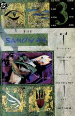

## Issue 43: Brief Lives Three

##### Neil Gaiman, Jill Thompson, and Vince Locke

**Notes**: See [#41](sandman.41.md). The first two chapters in this issue are strongly demonstrative of the primary theme of "Brief Lives". Chapter titles in this issue seem to be mostly descriptive. Note that the fourth chapter, which is "Bored, She Makes Little Frogs" (pg 10 panel 3--pg 12) if we believe the title page, follows the fifth chapter, "Truth or Consequences, and Other Places" (pg 9--pg 10 panel 2). This break is also unusual for not coinciding with a page break.

### 1: _The People Who Remember Atlantis_

### Page 1

> [marginThumb] 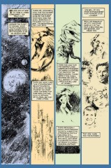

- #### Panel 2

  The saber-toothed tiger (genus Smilodon) is not, taxonomically speaking, a tiger, or even a feline.

  "Echo-Atlantises" may be intended to refer to the Atlantises of Aquaman and Arion, two other DC comics. In the former, set in the present day, Atlantis comprises two sunken cities inhabited by amphibious humans.

  In the latter, the title character rules as the last mage-king of a dying Atlantis, set 45,000 years ago. (There is an Arion mini-series set in the present day which does not concern Atlantis.) _Books of Magic_ #1 also refers to the several Atlantises.

- #### Panel 3

  The "great lizards" are dinosaurs; "dinosaur" comes from Greek roots meaning "terrible lizard". Pictured is a dinosaur with a collar.

  The dinosaur used could be any one of a large lineage of carnivorous, bipedal dinosaurs, including the famed Tyrannosaurus rex.

### 2: _Concerning Mammoths, and Falling Walls_

### Page 2

> [marginThumb] 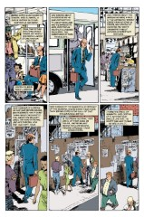

- #### Panel 1

  **Capax**: From Latin, meaning "capable; able to take or receive; able to understanding; able to deal with or endure".

- #### Panel 2

  **Marquis de Sade**: Donatien Alphonse Francois, Comte de Sade (1740-1814), a French soldier turned novelist, infamous for the unusual sex acts described within his works. De Sade is eponymous for the psychological term "sadism".

- #### Panel 3

  Note the ads on the newsstand. "Post no bills" is an old phrase, meaning, roughly, "this ain't no damn bulletin board so put your fuckin' yard sale notice someplace else, asshole" (the New York translation).

- #### Panel 4

  **Freud**: Sigmund Freud (1856-1939), founder of modern psychoanalysis.

  Note another "Post no bills" notice, and the "lost cat" poster.

  "Miss Kitty" was a character on the long-running television drama "Gunsmoke". This is not a coincidence!

- #### Panel 5

  **Mammoths**: Large elephantine creatures that thrived during the last Ice Age ("that interminable winter"). Now extinct.

  Note the "Sweeney Todd" poster: "Sweeney Todd" is a project Gaiman is doing with Michael Zulli. Note also the "Cats" poster, with the legend "still here". "Cats" is a long-running Broadway musical. The poster below and to the left of the "Cats" poster may be for "Jesus Christ Superstar", another long-running Broadway musical. The inclusion of these two plays is also not coincidental.

### Page 3

> [marginThumb] 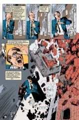

- #### Panel 1-3

  Note that the "still here" legend on the "Cats" poster is still visible.

### Page 4

> [marginThumb] 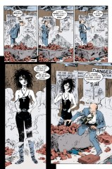

- #### Panel 1

  Note that the "still here" legend is now obscured.

### Page 5

> [marginThumb] 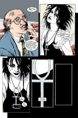

- #### Panel 2

  Look, a theme!

### 3: _Who Controls Transportation?_

### Page 8

> [marginThumb] 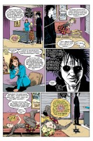

- #### Panel 2

  **Aisleen**: related to Aileen (Irish "Helen", "light") or Aisling (pronounced "Ashling", the Irish word for "dream", also a class of poetry featuring a dream vision representing Ireland).

- #### Panel 5

  Delirium is reading NATIONAL GEOGRAPHIC upside-down.

### 5: _Truth or Consequences, and Other Places_

"Truth or Consequences" is a town in New Mexico.

### Page 9

> [marginThumb] 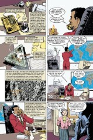

- #### Panel 8

  **Body and Blood**: An oath referring to the Christian mass, an unusual choice for someone who was in ancient Babylon, but he keeps up with the times.

### 4: _Bored, She Makes Little Frogs_

### Page 12

> [marginThumb] 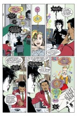

- #### Panel 6

  Note that Del has changed clothes and hair, as she often does between issues. "The lawyer" was Capax; the others will soon appear.

### 6: _Ancestral Voices Prophesying_

From Coleridge's "Xanadu".

### Page 13

> [marginThumb] 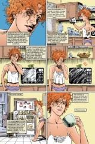

- #### Panel 1

  **Etain of the Second Look**: Possibly the wife of Cuchulain, a figure of Irish myth. Her name translates as "Shining One", and in Celtic myth, she is roughly analogous to Persephone. In her somewhat strange and inconsistent legends, she is a summer maid and a moon goddess. One character central to her legends is Mirdir, a lord of the underworld who has a castle on the Isle of Man, where he is protected by three anti-social cranes. Etain would be welcome to seek refuge there. The "second look" may be the Second Sight, an ability to foresee the future. Etain is a self-portrait of Jill Thompson; her apartment is also Jill's.

### Page 14

> [marginThumb] 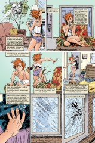

- #### Panel 2

  **Coleridge**: A reference to the origin of the poem "Xanadu", explained elsewhere.

- #### Panel 3

  Quotes from the poem.

### 7: _The Dogs of Art_

A transformation of the poetic image "the dogs of war", from William Shakespeare's _Julius Caesar_, Act Three, Scene 1, line 274 or 276 (count varies), as spoken by Antony: "Cry `Havoc!' and let slip the dogs of war." See the Appendix for the full text. "Dogs" in this case are fastening devices, although the word probably derives from a metaphorical use of the canine.

### Page 17

> [marginThumb] 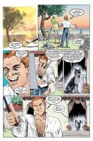

- #### Panel 2

  This is the missing Endless, Destruction, as should be obvious from several of his remarks.

- #### Panel 4

  **Barnabas**: An early Christian who abandoned his property to join the Apostles, journeying with Paul on some of his missionary work.

  Clement of Alexandria attributed an anti-Jewish tract to him that was actually written much later. Barnabas is from Hebrew "son of exhortation".

### Page 19

> [marginThumb] 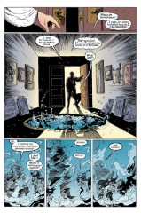

- #### Panel 2

  Note the sword in Destruction's gallery. Its presence here explains why it is not seen in any other gallery.

### 8: _"When I Dream, Sometimes I Remember How to Fly" See also the Vertigo Preview._

### Page 20

> [marginThumb] 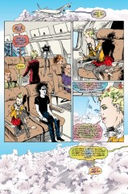

- #### Panel 2

  **Aeroplane**: an archaic or British spelling of "airplane".

### Page 21

> [marginThumb] 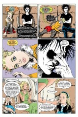

- #### Panel 5

  The little girl is deliberately drawn to resemble John Tenniel's original illustrations of the title character of _Alice's Adventures in Wonderland_.

### Page 23

> [marginThumb] 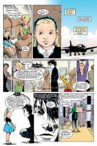

- #### Panel 3

  Dream is his office, and he collects titles, but perhaps he does not have a name as such.

### Page 24

> [marginThumb] 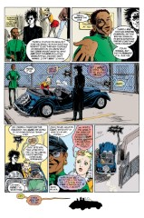

- #### Panel 3

  The car is identifiably a Morgan, a classy old British car. Note that a certain number of Morgans were manufactured for export to countries with normal driving laws, thus the left-side steering wheels.

- #### Panel 6

  Change is also an important theme of Brief Lives; we see that Del and Dream are changing. Change is an aspect of Destruction's realm.

## Credits

- Originally collated and edited by Greg Morrow.
- Lance Smith (lsmith@peca.cs.umn.edu) defined "capax", after Tanaqui Weaver (cen@vax.oxford.ac.uk) channeled Neil to give him a clue. He also researched Etain and identified the Morgan.
- Sascha Segan (sascha@MINERVA.CIS.YALE.EDU) pointed out the significance of the "Cats" poster, Del's unusual reading habits and changing appearance, and Pharamond's unusual swearing habits.
- Sascha also passed along the words of Micole Sudberg (sudmici@yalevm.ycc.yale.edu), who identified Etain.
- Lady Johanna Constantine <tara@uxa.cso.uiuc.edu> identified Aisleen.
- Ron Dippold (rdippold@qualcom.qualcomm.com) and Lance Smith identified Barnabas.
- Marx (cmarx@aal.itd.umich.edu), Colonel G.L. Sicherman (gls@windmill.att.com), David Goldfarb (goldfarb@ocf.berkeley.edu), D.W. James (vnend@Princeton.EDU), Dave McQueen (mcqueen@acf4.NYU.EDU), Andrew Ducker <adu@compsci.stirling.ac.uk>, Subrata Sircar (ssircar@canon.com), and Bill Sherman (sherman@math.ucla.edu) and his lovely young tankgirl identified the Shakespeare quote. Lance Smith defined "dogs".
- Andrew Ducker also found Atlantis references in BoM and noted the origin of sadism and the British spelling of "airplane". R.J.Johnston (R.J.Johnston@newcastle.ac.uk) also noted spelling intricacies.

## Appendix: Antony's soliloquy, from Act Three Scene 1 of _Julius Caesar_, by William Shakespeare:

> ANTONY O, pardon me, thou bleeding piece of earth,
> That I am meek and gentle with these butchers!
> Thou art the ruins of the noblest man
> That ever lived in the tide of times.
> Woe to the hand that shed this costly blood!
> Over thy wounds now do I prophesy,--
> Which, like dumb mouths, do ope their ruby lips,
> To beg the voice and utterance of my tongue--
> A curse shall light upon the limbs of men;
> Domestic fury and fierce civil strife
> Shall cumber all the parts of Italy;
> Blood and destruction shall be so in use
> And dreadful objects so familiar
> That mothers shall but smile when they behold
> Their infants quarter'd with the hands of war;
> All pity choked with custom of fell deeds:
> And Caesar's spirit, ranging for revenge,
> With Ate by his side come hot from hell,
> Shall in these confines with a monarch's voice
> Cry 'Havoc,' and let slip the dogs of war;
> That this foul deed shall smell above the earth
> With carrion men, groaning for burial.
