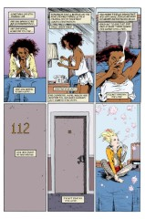

> [marginThumb] 

# Issue 44: Brief Lives: Chapter Four

##### Neil Gaiman, Jill Thompson, and Vince Locke

- Fourth part of storyline, _Brief Lives_
- Fourth story reprinted in trade paperback _Brief Lives_
- Audible Act III Chapter 7

**Notes**: See [#41](sandman.41.md). The subtheme of the issue is color. Note that Del has not changed clothing since the middle of last issue.

## 1: _The Other Side of the Sky_

### Page 1

> [marginThumb] 

- #### Panel 1

  **Midnight sun**: Above the Arctic Circle, the lengthening of days that occurs during the summer is so pronounced that there are days in which the sun never sets. The North Pole is the most extreme example of this, receiving six months of sunlight followed by six months of darkness every year.

- #### Panel 2

  **Borealis**: The Aurora Borealis, or Northern Lights, a glowing atmospheric display visible in the highest northern latitudes caused by charged particles in the solar wind interacting with Earth's magnetic field. There is an Aurora Australis in the highest latitudes of the Southern Hemisphere as well.

  **Retinal purple**: rhodopsin, the eye pigment which is sensitive to light and dark, found in the rods of the eye.

  **Firework yellow**: Possibly achieved by including sodium, which burns with a bright yellow flame. (There are two, closely-spaced, yellow lines in the sodium spectrum.)

  **VDU green**: the color of old Video Display Units - CRT computer display screens; possibly specifically the Amstrad PCW 8256/8512, a word processor popular with British writers in the 80s and 90s.

  > [audible] The Audible narration replaces this with "Electric Green", presumably because an increasing number of listeners will never have encountered a green-on-black VDU screen, yet alone a CRT computer display in general!

- #### Panel 3

  The strength of Earth's magnetic field fluctuates seasonally, growing stronger during the summer and thus reducing the aurora.

- #### Panel 4

  **Lapps**: The inhabitants of Lapland, a region of northern Scandinavia. Lapps speak a language closely akin to Finnish which is, therefore, unrelated to English.

### Page 2

> [marginThumb] 

- #### Panel 1

  **Cerulean**: A deep sky blue. From the Latin caelum, "sky". In other words, the sky turns sky blue, a tautology.

## 2: _A Bear and His Shadow_

### Page 3

> [marginThumb] 

- #### Panel 5

  **Leib-Olmai**: Lapp for "Alder Man". A mythical bear-man or bear-god. He protected the bear, a holy animal, and provided good luck to hunters that honored him. If hunters did snub Lieb, they would often lose their prey and occasionally Lieb might help a bear if it were to attack the hunters. He is a bit of a male chauvinist. Lapp women were not allowed to walk around a tent where hunting equipment is kept.

## 3: _Departed Secrets_

### Page 7

> [marginThumb] 

- #### Panel 4

  **Kruggerrand**: A South African gold coin weighing exactly one ounce of 24 karat gold.

- #### Panel 5

  **Smack**: slang for heroin. Raw heroin is brown; when processed, it becomes white.

## 4: _"Twinkle's a Nice Word. So's Viridian."_

### Page 9

> [marginThumb] 

- #### Panel 3

  > [oops] Del's balloon was miscolored in early editions.

## 5: _Three Keys_

### Page 10

> [marginThumb] 

- #### Panel 5

  Del refers to _A Season of Mists_.

### Page 11

> [marginThumb] 

- #### Panel 4

  Note the various bubble-shapes Del makes. The owl-like creature with the umbrella in the upper left is "Totoro", from the film _My Neighbor Totoro_. Totoro is a magical being who ruled the forest; only children and animals could see him. Below and to the right of the alarm clock is a bubble which is probably Max, the rabbit from Purcell's "Sam and Max" series. Note the cat-shaped bubble and the "c", "a", and "t" bubbles.

### Page 13

> [marginThumb] 

- #### Panel 3

  **Foreshadowing**: Your guide to quality literature.

### Page 15

> [marginThumb] 

- #### Panel 5

  **Ishtar**: A Babylonian goddess. See the Appendix to the annotation for [#45](sandman.45.md). Note that the manager's list does not say "Ishtar" in the appropriate place, but rather "Ca" plus obscured letters. Significance?

## 6: _A Treatise on Optics_

### Page 17

> [marginThumb] 

- #### Panel 3

  > [oops] Another coloring error - The Corinthian is wrongly colored white in early editions.

- #### Panel 6

  **Pillory**: A wooden device holding the head and hands fast, used to display prisoners for public scorn. Akin to the stocks, which more often held ankles fast.

- #### Panel 7

  **Ninny-hammer**: Probably just an extension of "ninny".

### Page 18

> [marginThumb] 

- #### Panel 1

  **Transportation**: The practice of deporting English criminals to penal colonies. While the most well-known of these is Australia, the first penal colony there was Port Jackson, founded in 1788, which is evidently significantly after this scene.

- #### Panel 2

  **Tyburn Tree** was the site of the London gallows. Not a literal tree, but the [name for the gallows themselves](https://marble-arch.london/culture-blog/history-of-tyburn-tree/). (_"Tyburn's Tree"_)

  It is now known as Speaker's Corner, at the northeast corner of Hyde Park.

- #### Panel 4

  The stone is Dream's ruby, of course.

  **wight**:

  1. a living being, CREATURE, MAN
  2. [archaic]: a preternatural being (as a fairy or witch)
  3. courage in warfare

  It evidently also has the unlisted meaning "monster; undead creature; creature of darkness"; this usage derives its modern presence from J.R.R.Tolkien's use of "barrow wights" in _The Lord of the Rings_.

  It seemed strange to me that Tolkien should have given the word a new meaning, and indeed it seems as he has used the archaic sense of the word.

  In the Norwegian translation of L.O.T.R., this word is translated as "vette", which still means a preternatural (and usually sinister or dangerous) being. The word vaettr (old Norse for vette) is mentioned in the etymology of "wight" in Webster's.

- #### Panel 5

  Yet more early edition coloring errors - Dream was wrongly colored human, and the Corinthian's forehead white.

### Page 19

> [marginThumb] 

- #### Panel 1

  The view here matches almost exactly a picture of **Arundel House** from [Haunted London by Walter Thornbury](https://www.gutenberg.org/cache/epub/41580/pg41580-images.html#Page_40) dated 1646:

  

  **Invisible College**: A phrase dating back to at least 1646, possibly coined by Robert Boyle. Thomas Birch notes in reference to Boyle's Works that "the Invisible College probably refer[s] to that assembly of learned and curious gentlemen, who...at length gave birth to the Royal Society." Dream and the others are therefore standing in front of the Royal Society.

  Note that an "Invisible College" appears in Mary Gentle's works, and an "Unseen University" in Terry Pratchett's; both of these writers are close associates of Gaiman's. Alfred Bester also made use of an "Unknown University".

- #### Panel 3

  The ballad "Diddle Diddle, or the Country Lovers", from 1680. Also known as "Lavender Blue", a cover version by Dinah Shore from the Disney movie _So Dear to my Heart_ (1948). The version presented in Peter Blood-Patterson's _Rise Up Singing_ goes:

  > Lavender's blue, dilly dilly, lavender's green,
  > When I am king, dilly dilly, you shall be queen.
  > Who told you so, dilly dilly, who told you so?
  > 'Twas my own heart, dilly dilly, that told me so.
  >
  > Call up your men, dilly dilly, set them to work,
  > Some with a rake, dilly dilly, some with a fork,
  > Some to make hay, dilly dilly, some to thresh corn,
  > While you and I, dilly dilly, keep ourselves warm.

- #### Panel 4

  **Homo sylvestris**: An obsolete classification of the orangutan, meaning "man of the woods", which is also the literal translation of the Malay phrase which became the common name. Note that taxonomy did not begin to standardize until the 1732 publication of Carl von Linne's great botanical treatise on the subject.

  The earliest known citation of "**orangutan**" in English dates from 1691.

  In 1699, Edward Tyson published a treatise on the anatomy of what he called an Orang-Outang (which was actually a baby chimpanzee), based on a dissection he performed in June and July 1698. The chimp had come from Angola and had died on the ship two months earlier in April. The skeleton was displayed for many years at the British Museum, and may still be visible there. The body pictured here is clearly an adult orangutan. ObPratchett: Ook!

  Tyson's dissection is thought to be one of the earliest in England, and may be used to fix the earliest possible date of the scene. Note that Despair met Destruction (in [#41](sandman.41.md)) in 1665, and remarks at that time that the last time she saw him would be "thirty years on". Allowing some slop in her figure, we can place the family meeting at which Destruction announced his departure around 1700, of which more in the appendix.

- #### Panel 5

  **Guinea**: An English unit of money equivalent to one pound and one shilling.

### Page 20

> [marginThumb] 

- #### Panel 3-6

  See Appendix. Note that Destruction's quote in panel 5 dates from a 1706 edition of _Opticks_, which suggests that the date of the family meeting should be pushed even further back. Destruction's concern over the intraconvertibility of matter and light is probably related to Einstein's famous equation governing the conversion of matter into energy, a reaction which powers atomic weapons. Thus, Destruction sees the asking of Newton's question as the precursor to the inevitable creation of weapons of mass destruction.

- #### Panel 7

  The Corinthian, of course, likes to eat eyes with his eyeteeth.

## 7: _The Perils of Smoking in Bed?_

> [marginThumb] 

- #### Panel 3

  > [audible] The Audible narration notes that on seeing the burned remains of Ruby, it reminds him of _something he saw long ago_.

## Credits

- Originally collated and edited by Greg Morrow.
- lsmith@deci.cs.umn.edu (Lance "Squiddie" Smith) researched the Alder Man. Lance and Enrique Conty (conty@cbnewsl.cb.att.com) spotted Totoro. Lance spotted Max, provided exhaustive details on the orangutan and _Optics_, cited a use of "wight", spotted the color of the Corinthian, and identified the "Invisible College".
- Lance, Gavin Steyn (steyn@cs.rochester.edu), and Peter Trei (ptrei@bistromath.mitre.org) identified Tyburn Tree.
- Colonel G.L. Sicherman (gls@windmill.att.com) identified retinal purple and "Diddle Diddle". Mark Lippert <grendel@csd4.csd.uwm.edu> quoted "Diddle Diddle".
- Tanaqui Weaver (tweaver@nyx.cs.du.edu) noted Mary Gentle's use of "Invisible College" and M.Ellis (cs9h2mme@swan.pyr), Maurice Beyke (mabeyke@infonode.ingr.com) and Andrew Ducker <adu@compsci.stirling.ac.uk> noted Terry Pratchett's use of "Unseen University". Steve Simmons (scs@lokkur.dexter.mi.us) notes Alfred Bester's "Unknown University".
- Andrew Ducker also cited Tolkien's wights.
- R.J.Johnston (R.J.Johnston@newcastle.ac.uk) identified VDU green.
- Damon B. Crumpler (dbc3@po.CWRU.Edu) noted some of Delirium's bubbles and explained "Totoro".
- Ralf Hildebrandt added more details.
- Richard Munn corrected the "Tyburn Tree" reference, and added the reference to Arundel House, and some notes from the Audible narration.

## Appendix: On Newton's Opticks (by Lance Smith)

[This was compiled from several notes and may read in a jumpy fashion. Apologies--ed.]

Newton's first paper was on the refractive index of different colors. This was published in the Philosophical Transaction of the Royal Society in 1672. (This was the same year he had been elected as a member.) He had started experimenting with light about 10 years earlier. Since the paper received harsh criticism from some of the Society members, Newton was reluctant to publish additional papers on the subject. This may help to fix the time of Dream's remembrance.

Newton's _Opticks_ was published in 1704. In the front of the book he included the following statement:

"Part of the ensuing Discourse about Light was written at the _Desire_ of some Gentlemen of the Royal-Society, in the Year 1675, and then sent to their Secretary, and read at their Meetings, and the rest was added about twelve Years after to complete the Theory; except the third Book, and last Proposition of the Second, which were since put together out of scatter'd Papers." [Emphasis added; all capitalization Newton's]

A Latin translation was published in 1706. (Latin was the lingua franca of the scientific community.) Samuel Clarke did the translation at Newton's request.

With the new edition came an additional 7 queries. (Queries were Newton's observations and often served as areas for further research. All ended with a question mark.) In the 1706 edition these were queries 17-23. They were eventually bumped to spots 25-31 of the second English edition published in 1717. There was also a third English edition published in 1721.

The query we're probably most interested in is number 30 in the 1717 edition. The query begins, "Are not gross bodies and light convertible into one another, and may not bodies receive much of their activity from the particles of light which enter their composition?" This is something like what we hear on page 20 of issue #44. The query continues on about ways in which bodies may change into light and light may change into bodies. I'm not sure that this query and the thoughts behind it are as significant as the Prodigal seems to think.

As mentioned above, material for _Opticks_ dates back to 1672 with additional material added in 1687. The third book, that includes the queries, was only 5 pages long and was "put together out of scatter'd Papers." There is also some connection between Newton's queries and his lectures on optics as the Lucasian Professor of Mathematics. However, I couldn't find any connection in an annotated copy of his lecture notes.

So I'm afraid this doesn't do much to place the period of the events at the end of issue #44. Despair's remembrance in [#41](sandman.41.md) would put the abdication at about 1695. (My impression was that it was about 30 years from 1665 and not precisely that long.) The dissection of the orangutan is unlikely to be before 1698. Query 30 comes after 1706, though this may only be the first time Newton put it into print.

Further, Newton is referred to as "young." (Young by Endless standards, standards of the time or our standards?) Newton was born in 1642. He started experimenting with light in 1662. When he first decomposed light is hard to say. We could place it between 1662 and 1672 (when he published his first paper on it). That would give us a range of 20-30 years old. Certainly youngish.

(BTW, there's one theory that states that ROYGBIV came from Newton trying to match colors to available paint pigments. Thus we're stuck with indigo.)

**OBInterestingFact**: Newton's opening statement in _Opticks_ is dated April 1st.
