# The Annotated Sandman

## Issue 45: Brief Lives Five

> [!THUMBNAIL] 

##### Neil Gaiman, Jill Thompson, and Vince Locke

**Notes**: See [#41](sandman.41.md). For references on Ishtar and Ancient Near Eastern rites, consult the appendix. This issue, the middle one of the arc, has many points in common with [#41](sandman.41.md), the first one of the arc.

### 1: _The Things We Do to Be Loved_

### Page 1

> [!THUMBNAIL] 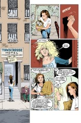

- #### Panel 4

  **Roxy Blue**: In the opinion of at least one reviewer, the lamest, saddest attempt ever made to create a generic megahit MTV glam-metal band.

### Page 2

> [!THUMBNAIL] 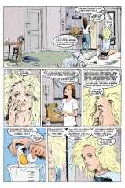

- #### Panel 3

  This is foreshadowing. See also page 3 panel 5 and in [#44](sandman.44.md).

- #### Panel 4

  **Shooting up**: Taking heroin, which is administered via syringe.

### 2: _Her Hands Do Not Go to the Moon_

### Page 5

> [!THUMBNAIL] 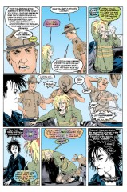

- #### Panel 1

  **Sam Hill**: Euphemism for "hell", deriving from "Salomon", an oath. Ass is green and growing: A variation of the rhyming slang "ass is grass".

- #### Panel 2

  "I'm a very good driver" is an oft-quoted line of dialog from the movie _Rain Man_, spoken by Dustin Hoffman's autistic character.

- #### Panel 3-5

  Del's actions here are reminiscent of Dream's punishment of Alex Burgess in [#1](sandman.01.md). It is evident that the Endless have the ability to cloud people's minds (as in [#41](sandman.41.md) and [#44](sandman.44.md), as well as on page 16, for example).

### 3: _The Driving Instructor_

### Page 6

> [!THUMBNAIL] 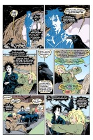

- #### Panel 5

  See Lance Smith's Sandman Concordance for an accounting of Dream's ravens.

- #### Panel 6

  Matthew is referring to the incident in Swamp Thing #27, where he was possessed by the spirit of his wife's uncle, the evil sorceror-scientist-supervillain Anton Arcane.

### 4: _Tiffany Watches I_

### Page 7

> [!THUMBNAIL] 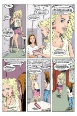

- #### Panel 1-5

  Tiffany's activities here make it clear that she's doing cocaine. The >snf< noise in panel 1: coke is usually snorted through the nose. In panel 2, Tiffany is collecting coke residue left on the mirror (mirrors are used to prepare lines for sniffing because they are flat and untextured). In panel 4, she's rubbing the residue into her gums where it will be absorbed.

- #### Panel 2

  **Lousy movie**: The movie _Ishtar_, a putative comedy, went enormously over-budget, in part because of the cost of its impressive cast, and was roundly panned by the critics.

- #### Panel 3

  Tiffany is a chain of jewelry stores known for making fine watches.

- #### Panel 5

  Note the similarity between Tiffany, born Alma, and Wanda, born Alvin, of _A Game of You_. Besides the coincidence of names, both left home under unhappy circumstances. This being Gaiman, there's probably a connection.

### Page 8

> [!THUMBNAIL] 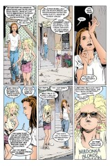

- #### Panel 2

  **Like a Virgin**: A song by Madonna (note Tiffany's shirt).

- #### Panel 6

  There's a parallel here, since Madonna was married to a "Sean"--Sean Penn--for a short time.

### 5: _White Knights and/or Pond-Scum_

Note that "pond-scum" is usually not hyphenated. However, "pond scum" is recognized as a compound noun. There are three stages in the life of an English compound noun. In the first, two words become associated with a single meaning, as in "pond scum". After a while, the written form becomes hyphenated, as it is here. Finally, the two original words are jammed together as a single word: "pondscum".

### Page 9

> [!THUMBNAIL] 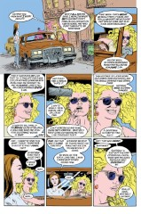

- #### Panel 1

  Note that "pond scum" is not hyphenated.

- #### Panel 3

  Interested parties are invited to check out the alt.tasteless FAQ, as the denizens of that group have coined a word for the act of screwing a hole drilled in someone's head.

- #### Panel 4

  **Blow**: cocaine.

### 6: _Are Dalmations Flowers?_

### Page 10

> [!THUMBNAIL] 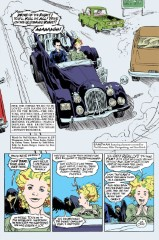

- #### Panel 1

  Note the driver is making a rude gesture toward Delirium.
  In America, the raised middle finger displayed with the back of the hand toward the target translates as "fuck you". In recent years, this gesture has been adopted in both Britain and England, partially displacing older gestures of similar intent.

- #### Panel 2

  Del's sister here is almost certainly Death.

- #### Panel 3

  **101 Dalmatians**: A full-length cartoon by Walt Disney Studios. There are, in fact, 101 Dalmatians, mostly puppies, in the film. "Dalmatiums" are a type of flower. Dalmatia is a region in Yugoslavia along the Adriatic.

### 7: _Nancy Displays Her Erudition_

### Page 11

> [!THUMBNAIL] 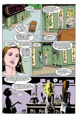

- #### Panel 1

  **Suffragette City**: A song by David Bowie. "Suffragette" was the term applied to women who sought to obtain the ability to vote.
  ("Suffrage" = "vote", from the Latin for "voting tablet".)

### Page 12

> [!THUMBNAIL] 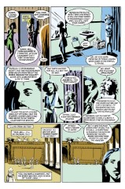

- #### Panel 5-6

  **Oprah" and "Donahue**: American talk shows, often devoted to the latest sensationalistic book, scam, or fad. The "Donahue" topic given in 13.5 is a good parody of a typical show. The hosts' full names are Oprah Winfrey and Phil Donahue.

### Page 13

> [!THUMBNAIL] 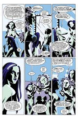

- #### Panel 6

  **Mai Lai**: Possibly an amalgam of "mai tai", a kind of rum drink (to which Tiffany refers), and "My Lai", a village in South Vietnam where American military forces engaged in a massacre of civilians.

### 8: _Wham Bam Thank You Ma'am_

Slang for something quickly and abruptly started and accomplished; originally referring to the legendary speed of men during the sex act. Notable as a shouted lyric near the end of David Bowie's "Suffragette City".

### Page 14

> [!THUMBNAIL] 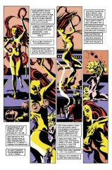

- #### Panel 1

  **I Heard It Through the Grapevine**: a song originally popularized by Gladys Knight and the Pips, later taken to the top of the charts by Marvin Gaye. Lyrics are quoted in the third caption of panel 1, the third caption of panel 2, and the caption of page 15 panel 1.

### Page 15

> [!THUMBNAIL] 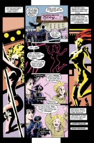

- #### Panel 6

  **Under Pressure**: A song written and performed by David Bowie and Queen. (Recall the mention of Queen frontsman Freddie Mercury in [#41](sandman.41.md).) The song is about closeted homosexuals.

### Page 16

> [!THUMBNAIL] 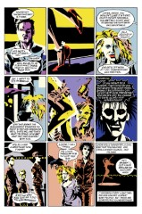

- #### Panel 6

  Recall that Del pulled the same trick in [#41](sandman.41.md).

### 9: _Tiffany Watches II_

Note the ironic change in meaning of "watches" from section 4.

### Page 21

> [!THUMBNAIL] 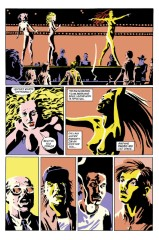

- #### Panel 3

  **Sister Midnight**: a song from Iggy Pop's album _The Idiot_. Note that David Bowie has partial writing credit for the song, giving him three song references in one issue.

### Page 22

> [!THUMBNAIL] 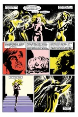

- #### Panel 4

  **Coming**: Slang for ejaculating; often written "cum".

### Page 24

> [!THUMBNAIL] 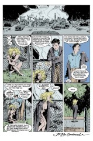

- #### Panel 2

  Desire's quote is from Job 1:15, 16, 17, 19, where four messengers report disasters to Job, each ending their message with this line. Job lost all his children and property to these disasters, the result of a bet between God and Satan. Note that in both cases, Suffragette City and Job, the bystanders were simply unfortunate enough to get caught up in the struggles of more powerful beings, and were otherwise innocent.

- #### Panel 4

  Contrast this ">snf<" with page 7.

## Credits

- Originally collated and edited by Greg Morrow.
- Lance Smith (lsmith@mega.cs.umn.edu) spotted a rude gesture and Tiffany's coke use, pointed out the congruence of Del's and Dream's interactions with mortals and identified songs.
- Resident Assyriologist Glenn Carnagey (lf7z@ellis.uchicago.edu) and Lance Smith put together the Appendices on Ishtar.
- Andrew Solovay (solovay@netcom.com) identified the quote from Job. Katie Schwarz (katie@physics.Berkeley.EDU) corrected the My Lai reference.
- Stephen White <sfwhite@sciborg.uwaterloo.ca> identified a Bowie reference, as did Andrew Moran <andrew@cs.chalmers.se>. Andrew also noted offensive Australian gestures.
- Mike Collins (mcollins@nyx.cs.du.edu), Michael Gemar (michael@psych.toronto.edu), and sonof@merle.acns.nwu.edu also identified the Bowie lyrics.
- Lore Christian Sjoberg (lore@ucscb.UCSC.EDU) identified Roxy Blue.
- Hannu Pajunen <hannu@utu.fi> noted Sean Penn and asked about American talk shows.
- "Bombastic" Bill Sherman <sherman@math.ucla.edu> noted _Rain Man_ and the Wanda connection.
  Andrew Sigel (sigel@vsscad.enet.dec.com) corrected the "Grapevine" reference.

## Appendix: Ishtar (by Lance Smith)

[Compiled from several notes, so may read unevenly. Apologies--ed.]

Ishtar is the main goddess in Assyrian/Babylonian mythology. Note that this contradicts the assumption that Pharamond is Babylonian, which arises from the fact that he and Dream drank wine together in Babylon.

Her role seems unclear. At least one legend has her involved in a seasonal cycle like Etain. In one of her roles, she appears as a lustful goddess of sex and war, often dressing in red. As Quadishtu, Babylonian for 'harlot', she was patroness of the temple prostitutes. So we have a connection to the Prodigal and also her current career choice.

Ishtar would be her Babylonian or Assyrian name. The other names that Dream uses, Belili and Astarte, are her Sumerian and Phoenician names respectively. (The Sumerians may also have called her Inanna or Nina. The myths conflict.) As mentioned earlier, Ishtar is the great goddess of the Babylonian pantheon. Over the years she acquired the attributes of other goddesses, but she is usually seen as either a compassionate mother goddess or a goddess of sex and war or both.

The temple prostitution that the dancers discuss is associated with an Adonis/Tammzu cult in the Phoenician city of Byblus. Women were to shave their heads in annual mourning for the passage of Adonis [the Greek Adonis?--ed.] into the underworld. Those who did not wish to give up their beauty served as prostitutes at the temple. Children born through such prostitution were thought to be sacred and virgin born. Money taken in by the prostitutes was given to the temple.

Temples to Ishtar at Uruk, Akkad, Nineveh, Arbela and Sippar may also have had this sort of temple prostitution. (Certainly Uruk, which was the oldest temple.) I'm not really clear on the details of how widespread this custom was.

The dance she does I'm not really sure about. One rite associated with Ishtar was the choice of a husband or king for the goddess. His reign would last a year. At the end he would be sacrificed and a new husband picked. The man chosen was allowed sex with Ishtar/Astarte, or her earthly form which was that of the temple's high priestess. The sex and the sacrifice were to insure good crops and productive livestock. This is all tied in with Ishtar's descent into the underworld to rescue her husband/brother and the changing of the seasons.

One name associated with Ishtar/Belili/Astarte that Dream does not use is Belit or Beltis. This name was given to the consort of Bel (just a word for lord) who is the sender of the great deluge, among other things. For what it's worth, Bel is usually pictured with a beard and bow and arrow. So did the Prodigal dabble at being a god for awhile? (The connection between Belit and Ishtar is fuzzy, some say that there is none. I just like trying to plug Destruction into all of this.)

That Ishtar dancing to "Like a Virgin" is only appropriate. Despite being the goddess of love and sex, she was still considered a virgin by the faithful.

I'm a little over my head in Babylonian/Assyrian/Phoenician/Sumerian mythology so feel free to point out mistakes.

### Appendix: Ishtar (by Glenn Carnagey)

[Compiled from several notes, so may read unevenly. Apologies--ed.]

First off, the temple prostitute bit comes from Herodotus (book 1, I think around line 180), not the Babylonian sources. Though he's known as the "father of history", his history is more historical fiction, and not too picky about sources or details, and he loved conflicting gossip. He's mostly a good spinner of tales, a bit like our beloved Neil. Most scholars agree that he fibbed about going to Babylon, there are just too many geographical and historical inaccuracies. For the record, he did visit the Egyptian Delta, and that portion is fairly reliable, except when the priests were putting him on, which was apparently a good bit of the time. But when he heads south (particularly Nubia, the topic of my dissertation), well, he tells a good tale.

My Mesopotamian archaeology professor, who has the concession at Nippur, the religious capital of Mesopotamia, froths at the mouth when Bible types bring up the dreaded "temple prostitute" parallel in Babylonia. He's convinced it's a fundamentalist plot to keep this alive in the literature. Before we could read Akkadian and had dug up their temples and tombs (i.e. prior to the late 19th century) Herodotus was an important historical source for the Ancient Near East, but he sounds pretty silly today. To be fair, there are a few Old Testament passages from the divided kingdom period that certainly seem to be talking about temple prostitution, and it was common in Greek Asia Minor (Herodotus was from Halicarnassus [an ancient city in what became modern-day Turkey; during the period in question, Asia Minor was colonized by Greece].) There was a symbolic union of the Babylonian king and the high priestess during the New Year's festival called the "heiros gamos" (holy marriage), and this is the rite that Lance was referring to. His information about the Dimuzi myth and the general character of Inanna is also good stuff. Except that it should be obvious how dangerous it is to equate Adonis and Tammuz/Dimuzi, there are some similarities of theme, and perhaps even Mesopotamian influence, but they are not the same story. However there's no Babylonian evidence of temple prostitution, the Byblos reference must be from classical times. The coin story was certainly an invention of Herodotus, but it's a good tale, eh?

The name of the deity is Inanna in Sumerian and Ishtar in Akkadian (Assyria and Babylonia). Because of the Amorite interaction, the Canaanite deity Astarte became identified with Ishtar as a West Semitic equivalent, they may in origin be the same, as their roles in the pantheon are functionally equivalent--except Astarte has a warlike aspect that Ishtar does not--and the names share the same triliteral root [Semitic languages have no vowels in written form. Nouns have three consonants and their case is determined by the vowels used in-between the consonants. "Ishtar" and "Astarte" are both approximately /sh/t/r/ in written form.]. That would be the Phoenicians, Ugarites, Byblites, Amorites, Canaanites, and all the other -ites down in Israel. Bel-ili is a very common Babylonian name that means 'the lord is my god', and is also a common epithet of all Semitic deities after the Aramaeans came into Mesopotamia late in the 2nd millennium BC and Marduk [the chief Babylonian god] was supplanted by Bel. Belat means 'goddess' or 'Lady', the feminine of Bel, and Beltis is a Greek misspelling of the latter.

Pharamond will have to be explained by someone else, he has nothing to do with the Ancient Near East, as far as I know. It looks European, doesn't it?

Lance refers to "Temples to Ishtar at Uruk, Akkad, Nineveh, Arbela and Sippar" These temples did not exist at the same time; Uruk, Akkad, and Sippar date from Sumerian times, Ninevah and Arbela from Assyrian times. Ishtar's temple at Uruk is also her oldest and it predates the advent of writing. In Babylonia, the Tammuz ritual was celebrated only at the capital. In Sumerian times this was the religious center at Nippur, then at Akkad during the Akkadian period, then variously at Ashur, Ninevah or Babylon under the Assyrians and Babylonians. But the ritual was a blood and grain sacrifice in Mesopotamia, I don't know what was involved in the Greek Adonis ritual.

Lance refers to a rite of Ishtar involving the choice of a husband for the goddess. This sounds like a reference to the 'heiros gamos' ritual I mentioned above, except that no one got killed or laid, and it was the king involved. There was a purely practical reason the king didn't sleep with the high priestess, in the earliest days they were generally siblings, and it was those disgusting Egyptians that practiced incest. The only human sacrifice we know about ocurred briefly at Ur, where the kings were buried with a retinue, and we think this was due to Egyptian influence, who also did this early on.

Asherah was goddess of love and fertility, the Ancient Near Eastern cultures didn't have deities strictly for sex. Put another way, Eros and Aphrodite were not distinguished. In case of impotence or whatever, you petitioned the love deity. (Astarte is the Canaanite spelling for Asherah at Byblos and Ugarit et.al., after about 1500 BC, whom they've combined with Anat and given warlike capabilities). My opinion is that the reference is to Asherah (the older Sumero- Babylonian deity) and that he's just using the wrong name. I say this because the Temple Prostitute 'myth' is taken straight from Herodotus Book 1, and he incorrectly calls Asherah Astarte, as that would be the only name he knew her by, and he never actually made it to Babylon.

I will say that one worshipped both Hathor _and_ Asherah by watching their priestesses perform, and they were dancers, singers and musicians. They didn't strip, but it was as racy as they got, so that criticism I can't buy.
