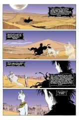

> [marginThumb] 

# Issue 46: Brief Lives: Chapter Six

##### Neil Gaiman, Jill Thompson, and Vince Locke

- Sixth part of storyline, _Brief Lives_
- Sixth story reprinted in trade paperback _Brief Lives_
- Audible Act III Chapter 9

**Notes**: See [#41](sandman.41.md). This issue is structurally similar to [#42](sandman.42.md).

**Insert**: This issue contains a special insert, "Death Talks about Life", by Gaiman, art by Dave McKean. I have no particular notes, save that the information presented is accurate within the limitations of the medium. And it can save your life.

## 1: _Life Isn't Pleasant, Petrified_

### Page 1

> [marginThumb] 

- #### Panel 4

  Do not overlook the "eye" reference.

### Page 2

> [marginThumb] 

- #### Panel 1-6

  The poem is in some ways reminiscent of Lewis Carroll, particularly of _Sylvie and Bruno_, two verses of which are reproduced here:

  > He thought he saw an Elephant 
  > That practised on a fife: 
  > He looked again and found it was 
  > A letter from his wife. 
  > "At length I realize," he said, 
  > "The bitterness of life!" 
  >
  > He thought he saw a Buffalo 
  > Upon the chimney-piece 
  > He look again and found it was 
  > His sister's husband's niece. 
  > "Unless you leave this house," he said, 
  > "I'll send for the Police!"

  While there may not be exact parallels, there is a certain similarity in rhythm and sense that may be apparent. The poem is written in iambic tetrameter, although the rhythm is strained to breaking in several places (the misplaced stress in line eight, for example). (English lends itself to iambic form; I am told, for example, that Greek is a "three beat" language.) Note that it has nine lines, which may be a parallel with the nine parts of _Brief Lives_; Spenser's _Faerie Queene_ was written in nine-line stanzas. Basilisk: A mythical reptile with poisonous breath and a petrifying gaze.

  **Cockatrice**: The offspring of an egg laid by a rooster and hatched by a toad, resulting in a creature which is partly rooster, partly reptile.

  Its touch is petrifying.

### Page 3

> [marginThumb] 

- #### Panel 3

  **Doggerel**: a pun. Note Barnabas's coiled tail, indicating that he's probably a Spitz breed, akin to huskies, corgis, and other working dogs. Spitz are characterized by "foxy" heads, such as Barnabas's large, triangular ears and long, narrow muzzle.

## 2: _The Parting of the Ways_

## 3: _The Trouble with Mortals_

### Page 8

> [marginThumb] 

- #### Panel 1

  > [oops] Pharamond's name was spelt **Faramond** in early editions - this was apparently fixed in later versions.

- #### Panel 5

  Pharamond's "trouble with mortals" is ironic considering the theme of _Brief Lives_.

## 4: _Dreamings of Meeting or Meetings of Dreaming?_

### Page 9

> [marginThumb] 

- #### Panel 1

  It has been seen before (#22, for example) that the castle is the center of the Dreaming; the throne room is entirely consistent, but more explicit.

- #### Panel 2

  **Many doors**: I am reminded of the several hidden paths to the Jeweled Forest in _Tik-Tok of Oz_, by L. Frank Baum, but this is probably not significant.

### Page 10

> [marginThumb] 

- #### Panel 3

  **Bubastis**: See Appendix.

- #### Panel 4

  **Bast**: See Appendix.

### Page 11

> [marginThumb] 

- #### Panel 3

  Note Dream's pupils.

- #### Panel 5

  The ancient Egyptians revered cats, and mummified cats have been found in Egyptian tombs.

## 5: _The Trouble with Gods_

- Compare with Section 3.

### Page 15

> [marginThumb] 

- #### Panel 5-6

  The cat being euthanized is probably Chloe Russell's cat ([#43](sandman.43.md), [#49](sandman.49.md)).

## 6: _Mervyn Sets Him Straight_

### Page 16

> [marginThumb] 

- #### Panel 1

  Note the cigarette-smoking cartoon bats.

- #### Panel 4

  More books from Lucien's library:

  - _The Death of Kai Lung_ by Ernest Bramah: See the Appendix.
  - _Chanticleer's Dance_ by Hope Mirrlees: Mirrlees is a favorite author of Gaiman. See annotation [#22](sandman.22.md) for more details.
  - _The Last Voyage of Lemuel Gulliver_ by [Jonathan] Swift: Swift, a late-17th, early-18th century, Irish satirist, is perhaps best-remembered for his _Gulliver's Travels_, a work about a shipwrecked doctor whose encounters with various unusual societies effectively satirized Swift's own society.
  - _The Emperor Over the Sea_ by C.S. Lewis: Lewis has been referenced before (notably [#36](sandman.36.md)). He is an early fantasist and Christian writer, noted for his _Chronicles of Narnia_, of which this book is a continuance. The Emperor over the Sea is the one who sent Aslan to free Narnia, by allegory, therefore, the Christian God. King Caspian turns his ship back at the border of the Emperor's kingdom in _Voyage of the Dawn Treader_, the third book. The Emperor's story might very well be about life in the Narnian analog to the kingdom of heaven, since the final Narnia story, _The Last Battle_, chronicles the end of Narnia and the judgment and departure of its inhabitants.
  - _Ian and Ann's Book of Days_: No refs.
  - A partial title ending in "Phoenix", written by an author whose name ends in "bit": British children's author Edith Nesbit wrote _The Phoenix and the Carpet_, among others; this book may be _The Sand-Fairy and the Phoenix_, a second encounter between two of her fantastic beasts.

### Page 17

> [marginThumb] 

- #### Panel 3

  Mervyn appeared in [#5](sandman.05.md) driving a bus.

### Page 18

> [marginThumb] 

- #### Panel 5

  Note the mirror in the place of Dream's sigil.

## 7: _"Have You Got Anything with a Happy Ending?"_

### Page 19

> [marginThumb] 

- #### Panel 6

  Note the use of cartoon iconography: the wavy lines indicating that a character is "steamed", thus angry; the question mark indicating puzzlement. Visual shorthand like this is generally restricted to more "cartoony" works than _Sandman_. (Compare to Scott McCloud's triangle of iconography in _Understanding Comics_.) Shorthand is necessarily more superficial than more explicit characterization. Panel 6 is duplicated in Death's words in panel 5 and her expression in panel 7, and Dream's words in panels 4 and 7.

  Needless to say, it would be interesting to see the script to this issue to see how (if) Gaiman described this panel.

### Page 20

> [marginThumb] 

- #### Panel 3-4

  **Only a kid**: And Death is drawn as, what, a ten year-old?

  [15 or 16 is the usual age given as a guide to the artists.]

## 8: _Tempus Frangit._

- Latin for "time breaks" or "time shatters"; the inscription on Delirium's unusual sundial. Formed by parallel with "tempus fugit", or "time flies", a common saying.

### Page 21

> [marginThumb] 

- #### Panel 4

  Whose head is on the upper butterfly?

  **Saline drip**: Commonly-administered intravenous fluid-replacement, with roughly the same salt content as blood. The IV tube has a device in it through which the fluid can be made to drip at different rates to control the speed at which it is fed into the patient.

### Page 22

> [marginThumb] 

- Delirium, referring to the sundial says "It's stopped", which makes sense when considering the definition of _Tempus Frangit_. "Tempus Frangit" could also refer to Delirium's realm.

### Page 23-24

> [marginThumb] 

- > [oops] Again early editions miscolored Del's eyes. The grey tone of her balloons remained.

## Credits

- Originally collated and edited by Greg Morrow.
- Jacob Solomon Weinstein (jacobw@phoenix.Princeton.EDU) noted Carroll's _Sylvie and Bruno_.
- Lance Smith (lsmith@myria.cs.umn.edu) and David Goldfarb (goldfarb@ocf.berkeley.edu) spotted Mervyn's earlier appearance (see also #42 for other eagle-eyed spotters).
- Lance and Glenn Carnagey (lf7z@ellis.uchicago.edu) collaborated again on the Appendix.
- Lance also noted the change in Faramond's name and identified a couple of books. David Goldfarb also did the latter.
- "Buxom" Bill Sherman <sherman@math.ucla.edu>, Kenneth Jennings <kiii@u.washington.edu>, and Mike Collins (mcollins@nyx.cs.du.edu) noted the aphorism "tempus fugit". Kenneth and Mike also identified the Lewis book, as did Andrew David Weiland <aw1s+@andrew.cmu.edu>.
- Abhijit Khale (Abhijit_Khale@transarc.com) confirmed the Kai Lung identification. Lance Smith provided most of the information in the Appendix.
- Jonathan Coxhead (JCoxhead@acorn.co.uk) confirmed the Nesbit identification, as did Alexx Kay (Alexx@world.std.com) who also noted an example of nine-line poetry.
- Charles Hope (chope@Athena.MIT.EDU) and Steve Ward-Smith (pcxsws@unicorn.ccc.nottingham.ac.uk) confirmed the Nesbit ID. Dawn
- Friedman (friedman@husc10.harvard.edu) also chimed in with some speculation about the unwritten book.
- Andrew Solovay (solovay@netcom.com) and Damon B. Crumpler (dbc3@po.CWRU.Edu) recalled Chloe's cat.
- Timothy Tan aka TiTan <_> -M2001- <_> 083285@bud.cc.swin.edu.au
- Ralf Hildebrandt added more details.
- Richard Munn updated some notes on earlier coloring errors.

## Appendix: Bast and Bubastis (by Lance Smith)

- A bit about Bubastis. This was the center for the worship of Bast. She was the protector of the city among other things. The city also was known for its immense cat cemetary. The 22nd dynasty, which brought Bast to greater prominence, was known as The Bubastites. The city was located near the modern Zagazig [an Egyptian city on the delta of the River Nile].

- The Goddess Bast evolved quite a bit. Originally she had the head of a lion and may have been a goddess of war. Later, she was viewed with the cat's head (and called Pasht) and was the protector of pregnant women, the warmth of a fire and to some extent, music and dance. Her actions in the tent seem more true to her sex kitten role. By Herodotus' account, the festivals of Bast were quite unruly affairs with a great deal of wine consumed. Sorta like Mardi Gras with an emphasis on barges and cats.

## Appendix: Bast and Bubastis (by Glenn Carnagey)

In fact Tell Basta [Bubastis--ed.] is in the SE corner of Zagazig, in the eastern Delta, on (believe it or not) the Bubastite branch of the branch, which dried up on a long time ago. It's what's known as a gezirah (Arabic for island) or 'turtleback', meaning that back before UNESCO killed the inundation, it would be surrounded by water for a third of the year. Among lots of other nifty things found there were some really fine black granite sphinxes currently in the Cairo Museum. For the curious, sphinx is the Greek rendition of "seshep ankh", or "living image". Originally, in the Book of the Dead and the Pyramid Texts, it referred to the setting sun god Atum, but mostly it just means a statue with the god's anima. The one at Giza belongs to Chephren (Cheops). Today we use it for any of the multitudinous animal statues with the king's head on them. These almost invariably line the lane leading into Temple, and it's generally the builder's head on them. The one at Giza is controversial, as you well know, because a) it's so damn big and b) the public refuses to believe its origin could possibly be as boring as the evidence suggests. When we worked there, Stryper [a Christian heavy metal band] and Nova [a US public TV science show] both came to visit, they were proponents of the Atlantis theory (Striper I mean). And the Nova reporter had a fiery fling with one of my professors -- the source of innumerable great jokes to this day.

Basta is one of the few sites I haven't gotten to yet, because in a curious reversal of history, the Delta is really difficult to get around in today -- not for tourists or the faint of heart. But I'm planning to visit when I go back in the Fall, because I did an article on its "next-door neighbor", Tel Adaba (the Biblical "Pi Ramesses"). Anyway it's been excavated (or plundered, depending on your perspective) at various times since 1887, so today it's in pretty bad shape, though the remains of the main temple are still to be seen, and the remains stretch from about 2800 BC to 200 AD. Just beyond this are two rows of pillars that mark an 3rd millennium BC temple that's totalled, and beyond that are catacombs where Eduard Naville [the first internationally known field Egyptologist] found the cat mummies. We have two of these at the museum I work at, and we're going to x-ray them Real Soon Now. It was briefly a capital of Egypt during what's called the Third Intermediate Period when Lybian kings ran Egypt; as Lance said, the 22nd Dynasty ruled from here (ca. 945-715 BC). They were run out of town by Piay, a Nubian who's coincidentally the star of my dissertation, or one of them at any rate. A good book on the place is Labib Habachi, "Tell Basta", 1952. Actually it's the only one in English that's not really ancient, obsolete and/or inaccessible, but it's still a good book. It's quite likely that the Shishak who sacked Solomon's Temple [see Larry Gonick's _Cartoon History of the Universe_ for a popular history of this region--ed.] is one of the King Shoshenqs who lived in Bubastis, probably the first one, who also founded the dynasty.

Herodotus almost certainly visited Bubastis. From Herod. ii:60:

> "When the people are on their way to Bubastis, they go by river, men and women together, a great number of each in every boat. Some of the women play sistrums [I doubt this is the correct plural, but it's late--gac] and others play flutes all the way, while the rest of the women, and the men, sing and clap their hands ... But when they have reached Bubastis, they make a festival with great (non-bloody) sacrifices, and more wine is drunk [gr?] than in the rest of the year put together."

The musicians (and unmentioned acrobatic dancers) would have been the priestesses of Bast; as far as I know there's no mention of a High Priest(ess), but there must have been one. The feast description could apply to the Inundation festival at any Egyptian city (filling in its appropriate deity) over a 4000 year period.

She was always a lioness goddess, with a close association with cats from about 1000 BC on. This reached its heighth in the Classical period when literally thousands of cats were mummified and buried in the catacombs, along with other sacred animals like the ibis and the Apis bull. Lance is right about her association with fertility and pregnancy, and music and dance, and she was prayed to in order to ward against evil spirits and disease (which were pretty much the same thing to an ancient Egyptian). There were no war associations with goddesses until the Semites exported theirs; Lance's source has confused Bastet with the goddess Sekhmet (also a lioness, but from Southern Egypt) who was a goddess of destruction and famine. Frankly, all Egyptian feasts were unruly affairs, but this was one of the larger ones after about 950 BC; Herodotus says 700,000 attended but his figures are exaggerated.

## Appendix: Ernest Bramah

Bramah (1869-1942) wrote a series of Kai Lung mysteries set in Imperial China, including at least the following:

- Kai Lung Beneath the Mulberry Tree
- Kai Lung Unrolls His Mat
- Kai Lung's Golden Hours
- Return of Kai Lung
- Wallet of Kai Lung

Also possibly including _The Moon of Much Gladness_. He also wrote a series of books about a blind detective named Max Carrados.

Bramah's real name was E.B. Smith.
