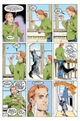

> [marginThumb] 

## Issue 47: Brief Lives Seven

##### Neil Gaiman, Jill Thompson, and Vince Locke

**Notes**: See [#41](sandman.41.md).

**Cover**: Maps on the cover: The map to the right seems to be a map of China. It is several centuries old, since the typography uses the `long s' form of the letter. The map behind the _Sandman_ logo is unidentified.

The object that Dream is holding is the M.C. Escher woodcut "Four-Faced Planetoid" from 1954.

### 1: _Cooking Considered as One of the Fine Arts_

### Page 1

> [marginThumb] 

- #### Panel 2

  Note the ecologically-correct webbed shopping bag.

- #### Panel 4

  As theorized in [#48, page 16](sandman.48.md#page-16), the Endless embody both their name and their opposite. Hence, Destruction includes creation, which explains his sculpture, painting, and cooking.

  Eleni Petrakou <tulpoeid@hotmail.com> tends to disagree:

  > I think the one with sculpture is a joke, since the work seems awful; it's rather like him trying to react to his own identity.

### Page 2

> [marginThumb] 

- #### Panel 6

  Is this meant to represent Ishtar?

### Page 3

> [marginThumb] 

- #### Panel 6

  Barnabas is a _real_ dog. Admittedly, he's a real _talking_ dog, but he's not a human in a dog's body the way Matthew is a human in a raven's body (the superficial characterization of [#40](sandman.40.md) aside, Matthew still _acts_ human). Incidentally, chocolate is not particularly healthy for dogs; they have trouble digesting it and they, like the rest of the Carnivora, overreact to stimulants.

### 2: _"My Envelope Isn't Any Good Anymore"_

### Page 5

> [marginThumb] 

- #### Panel 2

  Note the curlicues used for Del's eyes. The envelope is addressed to "Santa Claus/The North Pole".

  See Appendix for discussion on Santa Claus.

### 3: _Where All Mazes Meet_

### Page 6

> [marginThumb] 

- #### Panel 3-7

  This sequence is reminiscent of _The Chronicles of Amber_, by Roger Zelazny. In that book, the members of the royal family of the eternal city Amber are able to walk among the shadowy reflections of Amber, adding and subtracting bits of reality until they get to a reflection which matches their desired destination. Gaiman's description of Dream and Delirium's walk is very similar to Zelazny's description of shadow-manipulation.

  Note that the maze gradually changes from man-made to naturally grown.

### 4: _The Other Side of the Coin_

Note that throughout this sequence, Dream stays on the path, Destiny stays off the path, and Delirium charts her own course.

### Page 8

> [marginThumb] 

- #### Panel 3

  The statue of Destruction is facing in the opposite direction as the statues of the rest of the family. There is no obvious path leading to it.

### Page 10

> [marginThumb] 

- #### Panel 6

  Del may be imitating the posture of her statue.

### Page 11

> [marginThumb] 

- #### Panel 2-5

  Note the white core to Del's balloons. In panel 4, Del's eyes should be the same color, but this is missed in some early editions. (Del is repeating what she said in [#21](sandman.21.md).)

### Page 12

> [marginThumb] 

- #### Panel 2

  Del's eyes should be the same color again.

### 5: _Life as a Glass of Bitter Wine_

### Page 13

> [marginThumb] 

- #### Panel 2

  Delirium considers Destiny's "little flappy things" equivalent to Dream's ravens or Despair's rats (#41).

### Page 14

> [marginThumb] 

- #### Panel 1

  This event (as yet undetailed) occurs just before [#1](sandman.01.md) and is referred to in the "What Has Gone Before" introduction to _The Doll's House_.

- #### Panel 2

  See Dream's description in [#21](sandman.21.md), and the _Death: The High Cost of Living_ miniseries. According to Jill Thompson, the ox drover is no one particularly important, but was also mentioned in [issue #2](sandman.02.md), page 17, panel 4.

- #### Panel 3

  It seems probable that this is a depiction of a event; the color of Dream's clothing and hair is significant.

### 6: _Cherries Are Counted, and a Bargain Is Made_

### Page 15

> [marginThumb] 

- #### Panel 2

  Another coloring error in some editions - Dream's cloak pin is supposed to be colored silver. It is not Dream's ruby, which was destroyed in [#7](sandman.07.md).

- #### Panel 3

  Orpheus as "not very old": All lives are brief, from the perspective of the Endless.

- #### Panel 5

  Note that Del has given the flower wings.

### Page 19

> [marginThumb] 

- #### Panel 3

  Delirium is using an old counting rhyme which is supposed to reveal your occupation when you grow up. (Modern readers may be familiar with its use as a title for a couple of works: _Tinker, Tailor, Soldier, Spy_ by John LeCarre and _Rich Man, Poor Man_ and _Beggarman, Thief_, novels and television miniseries by Irwin Shaw.) Del omits "thief" in her rhyme; the continuation in panel 5 is her own invention.

### Page 20

> [marginThumb] 

- #### Panel 5

  See [#41](sandman.41.md) for the source of the epitaph.

### Page 21

> [marginThumb] 

- #### Panel 3

  This island, Destruction's refuge, was seen in [#41](sandman.41.md).

### 7: _An Unlikely Growth_

### Page 24

> [marginThumb] 

- #### Panel 1

  **Troth**: An archaic term for faithfulness or a promise, especially a promise to marry; extended by similarity to equal "truth".

- #### Panel 4

  **Dolmades**: a Greek dish, grape leaves stuffed with ground meat. /-es/ is a Greek plural ending.

## Credits

- Originally collated and edited by Greg Morrow.
- Enrique Conty (conty@cbnewsl.cb.att.com) pointed out the connection between Destruction and creation and confirmed the existence of Del's little song.
- Carl Fink (carlf@panix.com) passed along Neil Gaiman's report of yet another coloring error, this time in Dream's cloak pin.
- Lance Smith (lsmith@cs.umn.edu) extracted salient points from Jill Thompson's interview in _Musings_ #1, noted Del's envelope's address, the posture of statues, and the wings of flowers.
- Jeff Bulf (jbulf@balsa.Berkeley.EDU), Jeff White (pweent@cats.ucsc.edu), and Steve Ward-Smith (pcxsws@unicorn.ccc.nottingham.ac.uk) ID'ed "dolmades".
- Andrew Solovay (solovay@netcom.com) and Francis Uy (fuy@nyx.cs.du.edu) disagree with my assessment of Matthew's humanity.
- Francis also contributed an observation on how the Endless follow paths.
- Ian Taylor (ian@airs.com) notes the concluding word of Del's rhyme.
- "Bright-eyed" Bill Sherman <sherman@math.ucla.edu> identified the Escher woodcut and noted Destruction's statue.
- Jim Lai <jwtlai@jeeves.uwaterloo.ca> noted the degeneration of the maze and Destruction's statue.
- Byron Go (bgo@ucsee.Berkeley.EDU) IDed
- John Mc Donagh <Kull29@Aol.com> wrote about Santa Claus
- Ralf Hildebrandt added more details.
- Richard Munn updated some notes on earlier coloring errors.

## Appendix: All about Saint Nick

Santa Claus is actually a corruption of Saint Nicholas, a Christian bishop who lived in Myra (now in Turkey) from 280 to 340; the name itself "Santa Claus", is a child's slurred mispronunciation of Saint Nicholas . Nicholas is the patron saint of brides, children, Greece, Russia, and travelers. His feast day is December 6.

It was commonly believed that Saint Nicholas was imported to America by the Dutch of New Amsterdam (New York). Clement Moore believed this when he wrote his poem "A Visit From Saint Nicholas" (which starts with the immortal line "Twas the Night Before Christmas", which is often erroneously thought to be the poem's title. Also, the world "Santa Claus" is not used at any time in the poem; he is referred to as "Saint Nicolas" or "Saint Nick" throughout).

From Moore the idea of the Dutch having observed Saint Nicholas Day in New Amsterdam spread.

Moore got this idea from Washington Irving............ who wrote it in his History of New York From the Beginning of the World to the End of the Dutch Dynasty in the early 1800's.

As a joke.

Santa Claus was popular with Dutch Roman Catholics. However, in America, New York (New Amsterdam) was settled by Dutch Protestants, who were against the veneration of saints. Irving's account of the Dutch honoring Saint Nicholas in America was intended as a part of a historical parody.
Unfortunately Clement Moore took it as a literal history. (Irving was noted for his historical parodies; unfortunately, these farces are too often taken as literal history. Such a misunderstanding of one of Moore's books about Colombus lead to the misconception that Ferdinand and Isabella believed that the Earth was flat......when in actuality the fact of the Earth's rounder shape had been established since ancient Greek times.)

As Richard Shenkman pointed out in Legends, Lies, and Cherished Myths of World History, Saint Nicholas actually did not arrive in America until the War for Independence. As noted, Washington Irving wrote his book about twenty or thirty years later, Moore wrote his poem in turn, and finally cartoonist Thomas Nast polished off the contemporary view of Santa Claus to 90% of what it is today.

**Other useful references**:

- Saint Nicholas by Charles Jones
- The Dictionary of Misconceptions and More Misconceptions by Tom Burnam
- Process and Pattern in Culture
- The Santa Claus Book

Santa Claus teamed up with Superman at least once during the run of DC Comics Presents (#67). This was not the first appearance of Santa Claus (or Saint Nicholas, ofr that matter) in comic books by any means, or even the first appearance of Santa Claus in DC Comics, but the only one that I could think of off hand. It was reprinted in Christmas with the Super-Heroes. Santa Claus has probably made many other appearances in comic books. Most notoriously The Lobo Paramilitary Christmas Special#1, in which Lobo killed Santa Claus! (Referred to in flashback in Lobo#0.)

It was Thomas Nast, a cartoonist, who came up with the idea that Santa Claus lived at the North Pole.

Incidentally, a later writer had it that Santa Claus was the son of Odin and the brother of Thor.

All this was added by John Mc Donagh <Kull29@Aol.com> or <jmcdonag@assumption.edu>
