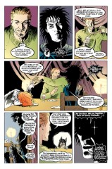
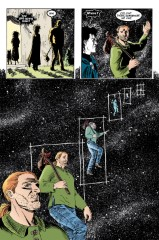

# The Annotated Sandman

## Issue 48: Brief Lives Eight

> [!THUMBNAIL] 

##### Neil Gaiman, Jill Thompson, and Vince Locke

**Notes**: See [#41](sandman.41.md). It's hard to break this one down into sections, but I think it goes: 1: 1-6; 2: 7; 3: 8-10; 4: 11; 5: 12-13; 6: 14-15; 7: 16; 8: 17-24. Trouble spots are the break between 3: and 4: and 7: and 8: and a number of breaks seem to fall in the middle of pages, which is inconsistent with what we've seen before.

### 1: _Journey's End_

### Page 1

> [!THUMBNAIL] 

- #### Panel 1

  Some recipes from Destruction's table are presented in the Appendix.

- #### Panel 2-3

  Note that in some editions the color separators got Dream's cloak pin correct, but screwed up Del's eyes again.

### Page 2

> [!THUMBNAIL] 

- #### Panel 1

  Destruction is referring to a cliche of detective fiction, when the detective has gathered all the subjects together to explain the crime and expose the criminal. In particular, this is a reference to Dashiell Hammett's _The Thin Man_ and its high-society detectives Nick and Nora Charles (played by William Powell and Myrna Loy in an excellent movie series).

- #### Panel 3

  **Retsina**: A weak Greek white wine, occasionally fortified with ouzo.

### Page 4-5

Del is retelling the story; her physical changes reflect her state at each point in the story.

### Page 5

> [!THUMBNAIL] 

- #### Panel 2

  **Something**: Delirium doesn't remember why Dream wanted to continue the journey, because Dream never told her, not as such.

- #### Panel 4

  The eyes are correct here.

### Page 6

> [!THUMBNAIL] 

- #### Panel 4

  **Despair**: This is the first we've heard that she's a replacement. See Lance Smith's Sandman FAQ.

### 2: _Brains, a Heart, a Ride in a Balloon_

### Page 7

> [!THUMBNAIL] 

- #### Panel 2

  A reference to _The [Wonderful] Wizard of Oz_, by L. Frank Baum. The Scarecrow was seeking a brain, the Tin Man a heart. A balloon ride figures prominently in Dorothy's quest to return home. (The book is thought by some to be allegory or satire of American politics.)

### 3: _Dinner_

### Page 8

> [!THUMBNAIL] 

- #### Panel 7

  Destruction's denial of responsibility can be argued, of course.

### Page 9

> [!THUMBNAIL] 

- #### Panel 2

  The cathedral may be the still-unfinished St. John the Divine. The "pavement artist in Paris" recalls Dick van Dyke's character Bert in _Mary Poppins_; Bert was a jack-of-all-trades, like Destruction. The cave-painting site may be Altamira, Spain. From the _Academic American Encyclopedia_ by Grolier Electronic Publishing, Inc. copyright 1993:

  > prehistoric art--PALEOLITHIC ART--Types of Art
  >
  > [...]
  > The first report of cave art was in 1879, when the painted ceiling at Altamira was discovered. The claim that this represented Stone Age art, however, aroused general disbelief. Although cave paintings had been noticed before, it seemed impossible that art of such sophistication and excellence should have been the work of primitive people. After the Altamira finds had been dismissed as forgeries, new finds were made, some of them in caves that had been sealed since the Stone Age. These subsequent discoveries, like that at La Mouthe in the Dordogne region of France, slowly overcame opposition. Finally, at the beginning of this century, Paleolithic art was recognized as authentic. To date, about 230 caves containing cave art are known; the great majority are in France and Spain, although a number have also been found in Italy, Portugal, and the USSR. Anatolian sites are still under investigation. One of the reasons for the concentration of cave art in western Europe may be the presence there of many limestone cliffs containing caves and rockshelters.

- #### Panel 4

  A word balloon fell off the art. Dream says something like "How did you know we were coming?"

### Page 10

> [!THUMBNAIL] 

- #### Panel 1

  Greek coffee is very thick and strong.

### 4: _Something New_

### Page 11

> [!THUMBNAIL] 

- #### Panel 3

  Del drank the sludge.

- #### Panel 4

  Del's lucidity occurred in [#47](sandman.47.md) in a section called "The Other Side of the Coin". Desire swears by the "Other Side of the Sky" in [#41](sandman.41.md), and "The Other Side of the Sky" was a section in [#44](sandman.44.md).

- #### Panel 5

  Destruction's denial of _anyone's_ responsibility can be argued, of course.

### 5: _The Illusion of Permanence_

Page 12-13 (A double page spread): Hmm. Gaiman is speaking in "thematic voice" again.
Compare Destruction's perception of time passing quickly with Dream's complaint in [#1](sandman.01.md) that time passed as slowly for him in his seventy-year imprisonment as it did for everyone else.

### 6: _A Wreath of Bright Stars_

### Page 14-15

According to Jill Thompson, this sequence takes place on Krypton (the now-exploded birthplace of Superman). See Appendix.

### Page 15

> [!THUMBNAIL] 

- #### Panel 1-5

  More thematic voice. Has Destruction fooled himself into ignorance of the consequences of his choice?

- #### Panel 5

  Delirium's creation, seen clearly here, is a winged Cerebus. Cerebus is an anthropomorphic aardvark, the central character of Dave Sim's _Cerebus_ epic. Sim and Gaiman are friends; Sim has parodied Gaiman's characters as the "Clueless".

### 7: _Echoes of Darkness_

### Page 16

> [!THUMBNAIL] 

- #### Panel 1

  This recalls Dream's lecture to Desire at the end of _The Doll's House_ ([16:22](sandman.16.md#page-22)-23).

- #### Panel 2

  This doesn't make a lot of sense, since we know Death does not predate _this_ universe.

- #### Panel 5

  IMHO, Hatred is not the opposite of Desire. Indifference is the opposite of Desire. Hatred is merely Desire of a different quality.

### 8: _Up. Out._

### Page 17

> [!THUMBNAIL] 

- #### Panel 4

  This change has been hinted at elsewhere.

### Page 19

> [!THUMBNAIL] 

- #### Panel 2

  Note that Del can see her own reflection instead of her sigil. (Compare to 18.2, where her sigil is seen.)

- #### Panel 6

  **Baklava**: a Greek/Turkish sweet pastry.
  **Taramasalata**: a fish pate made from roe. From the OED:

  > taramosalata (,tr&schwa.m&schwa.s&schwa.'la:t&schwa.). Also taramasa- lata. [a. mod.Gr., f. ~\(p\(u preserved roe (ad. Turk. tarama soft roe, red caviare) + ~\(\\ ~\( SALAD.] A Greek fish pate made (traditionally) from the roe of the grey mullet or from smoked cod's roe, mixed with garlic, lemon juice, olive oil, etc.
  >
  > Also ellipt. as tarama.
  >
  > 1910 Z. D. FERRIMAN Home Life in Hellas iv. 181 Red caviar..is pounded with garlic and lemon juice into what is called tarama salata. 1958 R. LIDDELL Morea II. iii. 70 A vinegary taramosalata, a preparation of salted fish eggs and oil, which is always Lenten food in Greece. 1964 Spectator 8 May 645/1 A Greek fish pate, taramasalata. 1972 Harper's & Queen Apr. 92/1, I quite often add tarama to go with the avocado. 1978 Chicago June 233/1 Dinnertime favorites include saganaki,..taramosalata, red caviar, etc.

### Page 21

> [!THUMBNAIL] 

- #### Panel 2

  Hoboes, tramps, and bums are often portrayed carrying their possessions in a spotted handkerchief tied to the end of a stick. (The ensemble is often called a "tuckerbag" or, in Australia, a "shiralee".) Destruction is merely conforming to cliche.

### Page 23

> [!THUMBNAIL] 

- #### Panel 2

  Destruction's remark resonates with many different sources. "UP AND OUT" was the destination of the Great Glass Elevator at the end of Roald Dahl's _Charlie and the Chocolate Factory_. At the end of C.S. Lewis' _The Last Battle_, characters at the destruction of Narnia go "further up and further in". Cordwainer Smith used "up and out" to refer to the navigation of space in his "Instrumentality of Mankind" series.

  We may also note the classic exchange between parent and child:

  > Parent: "Where did you go?" 
  > Child: "Out." 
  > Parent: "What did you do?" 
  > Child: "Nothing."

  Barbie recalls saying this herself in [#37](sandman.37.md).

  Robert P. Smith wrote a book of exactly this title.

  This is inverted in Alan Moore's Halo Jones series, which ends with

  "Where did she go? Out. What did she do? Everything!"

## Credits

- Originally collated and edited by Greg Morrow.
- Lance Smith (lsmith@cs.umn.edu) passed along some salient points from Jill Thompson's interview in _Musings_ #1.
- Alexx Kay (Alexx@world.std.com) pointed out the Dahl "Up, out" similarity and the Halo Jones conclusion.
- Si Rowe (ROWJOSP@YaleVM.YCC.Yale.Edu) pointed out the Lewis "Up, out" similarity.
- Steve Simmons (scs@lokkur.dexter.mi.us) pointed out the Smith "Up, out" similarity and the antecedent to the Halo Jones conclusion.
- Dani Zweig (dani@netcom.com) compared Destruction's perception of time passing with Dream's.
- Tom Galloway (tyg@hq.ileaf.com) passed along Neil Gaiman's copy for the missing word balloon on page 9.
- Kieran Mullan (kieran@cmatter.physics.indiana.edu) identified taramasalata.
- "Brilliant!" Bill Sherman (sherman@oak.math.ucla.edu) spotted the Barbie "up, out" similarity, speculated on Destruction's odd jobs, and IDed the cave site.
- Andrew Sigel (sigel@vsscad.enet.dec.com) identified the R. Smith book.
- Jim Lai <jwtlai@jeeves.uwaterloo.ca> noted Death and Del's theme of knowledge, recalled The Doll's House and spotted Del's face in the mirror.
- Ed Bailey (Bailey@utpapa.ph.utexas.edu) IDed the Hammett reference, noted some heretical Oz theories, and referenced the cave site.
- Michael Chary (mac7@po.CWRU.Edu) provided Greek recipes.

## Appendix: Some Remarks on Krypton

Before the Crisis, Krypton was a place of marvels. There were the Crimson Jungle and the Thoughtbeasts and the Fire Falls and the Jewel Mountains formed from the skeletons of extinct birds and a thousand other fantastic details. Its people were human; they struggled and fought and lived and loved and dreamt dreams petty and magnificent. Superman's exile from his home was a genuine loss.

After the Crisis, Krypton was a sterile world without wonder. Its people were soulless automatons; its destruction almost welcome. Superman's exile became a rescue from a fate worse than death.

The Krypton depicted on pp 14-15 is closer to pre-Crisis than post-Crisis. The jeweled waterfalls might be found in the Jewel Mountains.
Destruction's cape and headband are pre-Crisis Kryptonian fashion, although his other garments are more like those seen post-Crisis. Death's outfit, however, is not obviously Kryptonian; even her headband is inaccurate, since women did not wear them.

## Appendix: Some Recipes from Destruction's Table, by Michael Chary

### Stuffed grape leaves (Dolmades, dolmadaia, or sarma)

1# grape leaves (Check in either your grocer's import section or a deli. I found some in Bowling Green, KY which is not the most cosmopolitan place on earth. Don't pick your own. They have to be pickled, for one thing.)

1 1/2 ground lamb (For preference. Beef may be used, or poultry, although the cooking time would have have to be adjusted. Rice may also be substituted, and in fact is generally used in the cold versions.)

1 cup raw rice (This is important. The rice _MUST BE RAW_. Riceland rice is probably the best raw rice. THis going to stew for a while and instant rice wil turn into wallpaper paste. The rice will probably take longer to cook than the meat.)

1 small onion minced (Chopped up fine, not pulverized. Also, small does not mean tiny, it just means don't use a ton of onion. Easy on the onion or it will overpower everything else in the dish.)

2 tsp oregano

1/2 tsp cinnamon

1 tsp salt

1/2 tsp black pepper

1/2 cup water

4 tsp olive oil (extra virgin is what I use)

4 cups chicken stock (you can use bouillon if you want, about 6 cups to 4 cups water should do her.)

2 tblspns butter (it has to be butter)

4 eggs

6 tablespoons lemon juice.

2 tblspns pine nuts (if desired)

Rinse leaves and cover with cold water.

Combine meat, rice, onion, spices, water and _2 tsps_ of olive oil.

Form meat in oblong mound and roll in leaves. Roll them like burritos (fold bottom up, sides in, roll up.)

You should be able to make about 50 leaves.

Put the rest of the olive oil in a large sauce pan. Put the leaves in. Pour 2 1/2 cups of boullion over the leaves, cover sarma directly with a plate, heat over low flame for 45 min to an hour.

**Lemon Sauce**: beat eggs and lemon juice, add 1/2 cup hot stock, beat some more, pour into rest of stock, stir until blended, serve with dolmades.
Don't try to reheat the sauce.

---

### Meatballs (Kuftete)

1# ground lamb

3 beaten eggs

1 clove garlic minced (pulverized)

3 cups crushed bread crumbs

1/4 cup mint

1/2 tsp cinnamon

2 teaspoons flour

dash of salt

Combine everything, cover for an hour and a half, make into 1 inch balls, fry in a skillet with oil.

---

### Red Caviar Dip (Taramosalata)

(I'm swiping this recipe from a friend of mine. Since he currently uses _MY_ Matzo ball soup in his restaurant I don't feel any guilt :-)

Combine juice from two lemons, 8 ounces of red caviar, 1 onion diced coarsely in blender. Blend 1 minute or until smooth.

Take 8 slices of bread, take off crusts, crumble, dip in cold water, squeeze dry, put in blender with the mixture. Blend 30 seconds on low. While it's blending, add a cup of olive oil and wait for it to disappear. Refrigerate. Serve with greek olives.
