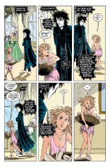
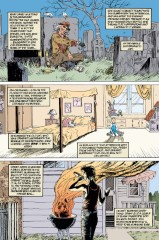

> [marginThumb] 

# Issue 49: Brief Lives: Chapter Nine

##### Neil Gaiman, Jill Thompson, and Vince Locke

- Ninth part of storyline, _Brief Lives_
- Ninth story reprinted in trade paperback _Brief Lives_
- Audible Act III Chapter 12

**Notes**: See [#41](sandman.41.md). This issue is the coda for the arc, reprising all that we've seen before and reiterating "change" as the theme. The briefness of life reinforces the change embodied by Destruction. The emphasis upon change is meant to point out the change in Dream since his imprisonment, as remarked by Orpheus in [49](sandman.49.md):3.3 and by Destruction in [47:24](sandman.47.md#page-24).2 and [48:17](sandman.48.md#page-17).5. It is perhaps worth noting that the epilog does not strictly begin until 3: or 4:. 1: and 2: are necessarily a part of the central story and are themselves reprised in 7:. Despair's reappearance in 4: is a strict reprise of her role in [#41](sandman.41.md).

## 1: _Farewells_

### Page 1

> [marginThumb] 

- #### Panel 2

  The pictured woman is Eurydice, Orpheus' wife. This is a fantasy; see [Special #1](sandman-special1.md) for a detailed explanation.

- #### Panel 3

  **House across the bay**: Destruction's house, as made clear last issue.

## 2: _Answered Prayers_

## 3: _The Flowers of Romance_

- This is also the title of one of the [Winters Edge short stories](sandman-flowers-romance.md)

### Page 6

> [marginThumb] 

- #### Panel 1-6

  As remarked by Desire on 10.5, these are new flowers.

  The creation of a new flower (or similar thing) is a common element in many mythic cycles. There are several examples in the familiar Greek myths. Note the technique of narrow divided vertical panels with gutters.

  This is typically used in, for example, action shots to indicate very rapid passage of time. Each gutter is an instant of time, and the close spacing indicates rapidity. Here, perhaps, the shear number of gutters is meant to indicate a long pause as the blood drops and the flowers grow.

  In any case, it doesn't work, as the continuity from panel to panel indicates that the whole set of panels is a single instant.

- #### Panel 9

  Again, see [Special #1](sandman-special1.md) or Graves or another classical Greek myth text for details.

## 4: _Journey's End_

### Page 7

> [marginThumb] 

- #### Panel 2

  Note the blood marks on Despair's forehead; these are probably from self-mutilation inflicted while Dream met with Destruction or slew Orpheus.

- #### Panel 6

  **Messire**: Probably from Late or Vulgar Latin or Old French, the equivalent of Modern French "monsieur", lit. my lord, my sire (male).

### Page 9

> [marginThumb] 

- #### Panel 5

  Seen in Despair's mirrors, from right to left: Andros ([41:1](sandman.41.md#page-1)), unidentified child (Andros's grandchild?), graveyard (Mary Canby's graveyard ([21.1](sandman.21#page-1))?), a kitten (Chloe's kitten?), and Desire.

### Page 10

> [marginThumb] 

- #### Panel 1

  Baby Daniel ([#40](sandman.40.md)) is in the mirror to Desire's right.

- #### Panel 4

  Baby Daniel in a mirror again.

- #### Panel 5

  **Oath**: Sworn in [#31](sandman.31.md). Spilling family blood will bring down the wrath of the Kindly Ones, a punishing aspect of the Triple Goddess. See Aeschylus' trilogy of plays, the _Orestia_ (_Agamemnon_, _Orestes_, _Eumenides_) for details.

- #### Panel 6

  Is that Etain ([43:13](sandman.43#page-13)) in the mirror behind Despair?

## 5: _The Gates of Horn_

- **Note**: The gates' purpose is as given in classical mythology. See the annotation to [#2](sandman.02.md) for citations from Homer and Virgil.

### Page 11

> [marginThumb] 

- #### Panel 2

  Skull and...spine: As seen clearly in [23:1](sandman.23.md#page-1).3 and remarked in [4:14](sandman.04.md#page-14).2.

  Gertrude Jobes' _Dictionary of Mythology, Folklore, and Symbols_ mentions three attendants of Morpheus (a Roman name of Dream): Icelos (dreams that appear real), Phantasos (false or strange dreams), and Phobetor (alarming dreams).

  Other sources indicate that Morpheus, Icalus/Phobetor, and Phantasus were the children of Hypnos. [Lance Smith has accumulated some fairly exhaustive notes on the Greek sources of Dream and the other Endless.]

## 6: _Things Unlooked For_

### Page 14

> [marginThumb] 

- #### Panel 3

  **Faerie gifts**: The unreliability of the Faerie folk is a traditional feature of folktales. (Refs?)

### Page 17

> [marginThumb] 

- #### Panel 1-2

  The Cryptogeographica (lit. "hidden earth writing", meaning "maps of imagined places"):

  - **Ousland City from Top to Bottom**: No refs.
  - **Poictesme**: From James Branch Cabell's fantasy.
  - **Kadath**: From H.P. Lovecraft's _Dream-quest of Unknown Kadath_.
  - **Puddleby**: From Hugh Lofting's Doctor Doolittle tales.
  - **Sardathrion**: From a short story (title uncertain, either "Sardathrion" or "Time and the Gods") by Lord Dunsany, the gods' summer home, destroyed by Time.
  - **Saffron Park**: The starting and ending points for G K Chesterton's _The Man Who Was Thursday_.
  - **Hobbiton**: From J.R.R. Tolkien's Middle-Earth stories.
  - **The Land**: Despite the generic name, probably from Stephen Donaldson's two fantasy trilogies.
  - **Flora of Neverland**: From J.M. Barrie's Peter Pan stories.
  - **The Night Land**: From fantasy works by William Hope Hodgson (1875-1918), including an eponymous novel.
  - **One Night in Baghdad**: See [#50](sandman.50.md); probably from 1,001 Arabian Nights.

    The title may be a pun on Murray Head's song "One Night in Bangkok" from the musical _Chess_.

  - **Noumaria on 7 Livres a Day**: No refs. A "livre" is a pre-19th century French monetary unit. The title is taken from the original cheap traveling guidebook _Europe on Five Dollars a Day_.
  - **Hy-Brasil by Night**: Hy-Brasil (or Hy-Breasil) is the Summer Country from Celtic myth or an island in the Atlantic whose inhabitants were said to be so morally pure that the island cut its gross earthly connections and could only be seen by those free of worldly desires. Brazil gets its name from this legend. Hy-Brasil is used by James Branch Cabell and in the movie _Erik the Viking_, and is also referenced in the Peter S Beagle novel _The Folk of the Air_ and the R A Lafferty novel _The Fire is Green_.
  - **Los Angeles Underground Railway Map 1932**: No strong refs. LA is building a light rail system (which will include underground sections), and at one time had an extensive trolley network. In 1932, the Summer Olympics were held in Los Angeles, which would presumably have prompted an increase in tourism and a corresponding increase in guidebooks.
  - **[From]mer's [Guide to H]ell**: A popular travel guide produces an edition for Milton and Dante.
  - **[N]arnia**: From C.S. Lewis' fantasy.
  - **[Hitchhiker]'s Guide [to the] Galaxy**: From Douglas Adams' humorous SF. Neil has written a companion to the series.
  - **Road Trips to [the] Emerald City**: From L. Frank Baum's (and others) Oz fantasies (note that one such work was _The Road to Oz_ and one was _The Emerald City of Oz_.)
  - **Alleys and Bradstreets**: No strong refs. A "Bradstreet" is a particular brand of travel guide.
  - **Great Hotels on the Moon**: No refs, but an inhabitable moon was a common subject of proto-SF, particularly in the 18th and 19th centuries.

    Robert Heinlein, who wrote a number of works set on a colonized moon, often had characters staying in hotels there, particularly the Raffles (itself a reference to the fictional thief).

  - **Camp Cusack Guide**: No refs. Possibly a reference to any one of a number of slasher films, which always seemed to be set in summer camps.
  - **Ampersand**: No refs. An ampersand is the "and" sign, and once was considered a letter of the alphabet.
  - **Mu A to Z**: Mu is a lost continent in the vein of Atlantis, envisioned by the crackpot Colonel James Churchward, who wrote _The Lost Continent of Mu_, which was ostensibly the translation of ancient writings of the civilization of Mu. The title comes from _London A to Z_, the most reliable and most widely used London map publication. The title is a nice little pun, as "mu" is a letter of the Greek alphabet. "Mu" is also a word from Zen Buddhism, referring to a question that makes no sense or that cannot be answered sensibly. The classic example of this is "May a dog have Buddha nature?".
  - **Cloud Cu[ckoo-Land]**: A translation of "Nephelokokkugia", a name coined by the Greek comic playwright Aristophanes.

  See also _The Dictionary of Imaginary Places_ by Alberto Manguel and Gianni Guadalupi.

- #### Panel 3

  The cat recalls the folktale Puss in Boots, but in conjunction with the mouse is probably meant to be an archetype of the classic cat-mouse chase. This is probably most familiar to modern readers as exemplified in such cartoons as "Tom and Jerry" and "Itchy and Scratchy".

- #### Panel 5

  **"Little"** and **"sky is falling"** may be an oblique reference to the story of Chicken Little, who thought the sky was falling.

- #### Panel 6

  **Real life**: Mervyn's talent for putting his foot in his mouth shows through again, as Dream is probably "overreacting" to the knowledge that the Kindly Ones will demand his death for spilling family blood.

## 7: _Brief Lives_

### Page 19

> [marginThumb] 

- This is remembrance, not Dream conversing with Orpheus as he passes through the Dreaming on his way Beyond.

- #### Panel 4

  As this is long past, the red stone is probably meant to be Dream's ruby.

### Page 21

> [marginThumb] 

- #### Panel 1

  **Mary Canby**: See [41:6](sandman.41.md#page-6).

- #### Panel 2

  **Chloe Russell**: See [43](sandman.43.md):22. Chloe's pet is probably the cat Basht euthanized in [46:15](sandman.46.md#page-15). It has also been speculated that one or the other of Chloe's cats is the young cat of [#18](sandman.18.md).

- #### Panel 3

  **Danny Capax**: See [44](sandman.44.md):6.

### Page 22

> [marginThumb] 

- #### Panel 1

  **Tom Flaherty**: See [45:5](sandman.45.md#page-5).

- #### Panel 2

  **Tiffany**: See [45:1](sandman.45.md#page-1).

- #### Panel 3

  The eye is Desire's.

### Page 24

> [marginThumb] 

- #### Panel 6

  Again this arc finishes [where it began](sandman.41.md), back on Naxos.

## Credits

- Originally collated and edited by Greg Morrow.
- Dorothy Lindman (f132@untvax.bitnet) developed the "Biblical" reference coding (Issue:Page.panel).
- Lance Smith (lsmith@cs.umn.edu) read the Cryptogeographica titles.
- David Pautler (pautler@ils.nwu.edu) and Lance Smith did research on the three dead gods.
- Carl Fink (carlf@panix.com) spotted what may be seen in Despair's mirrors and speculated about Chloe's kitten.
- David Goldfarb (goldfarb@ocf.berkeley.edu) recognized the name Cloud Cuckoo-Land and Bruce Lyman Precourt (prec@ellis.uchicago.edu) corrected him on its origins.
- Tom Galloway (tyg@HQ.Ileaf.COM) orated on LA's subway.
- Rob Bakie <slinkie@u.washington.edu> ID Hy-Brasil.
- Joseph Brenner (doom@leland.Stanford.EDU) IDed the Night Land and the LA Underground system.
- Dan'l DanehyOakes (djdaneh@pbhyc.PacBell.COM) IDed the Night Land, Hy-Brasil, a partial Oz ref, Bradstreets, and lunar hotels.
- Andrew Solovay (solovay@netcom.com) IDed Chloe's former cat.
- Sascha Segan <ssegan@panix.com> IDed the LA underground and Camp Cusack.
- Steve Ward-Smith (pcxsws@unicorn.ccc.nottingham.ac.uk) provided references for Mu and Hy-Brasil.
- Peter Trei (ptrei@bistromath.mitre.org) IDed Saffron Park, guidebooks to cheap traveling, Hy-Brasil, and "A to Z" maps.
- David Goldfarb (goldfarb@ocf.berkeley.edu) IDed Sardathrion and Hy-Brasil (from his Books of Magic annotations).
- Kathy Li (The Rev. Mom) (kathyli@sdcrsi.cray.com) IDed "A to Z" maps.
- Geoff Steckel (gsteckel@harpoon.East.Sun.COM) ID'ed Saffron Park.
- Colonel G.L.Sicherman (gls@hrcms.ATT.COM) ID'ed Hy-Brasil.
- Jonathan Miller (jlmiller@hamp.hampshire.edu) noted _Eumenides_.
- Damon Crumpler (dbc3@po.CWRU.Edu) noted the zen meaning of "mu".
- Jon Aibel (aibel@opl.com) IDed LA mass transit.
- Alexx Kay (Alexx@world.std.com) noted the Mu pun.
- "Esther" William Sherman <sherman@math.ucla.edu> noted graves, misIDed the Night Land and IDed Hy-Brasil.
- Catherine LeCuyer <lecuyer@wam.umd.edu> IDed Hy-Brasil.
- Jim Henry (jim.henry@ehbbs.com) IDed Sardathrion.
- Richard Munn noted how the arc begins and ends.
