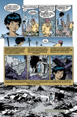

## Issue 50: "Ramadan"

> [!THUMBNAIL] 

##### Neil Gaiman and P. Craig Russell

Fourth story in anthology _Distant Mirrors_

**Note**: This story was written in prose by Neil Gaiman, then adapted to comics by Craig Russell. Most of Russell's work has been adaptations.

Arabic words (such as "Koran") were originally written in Arabic script. There is no exact way to render them in the Roman alphabet, but common transliterations have been used.

This story is designed to reflect the Thousand and One Arabian Nights, a traditional Arab anthology. The edition used for reference is Jack Zipes, Arabian Nights (Adapted from Richard F. Burton's unexpurgated translation), New York: Signet Classics, 1991. ISBN# 0-451-52542-6.

### Page 1

> [!THUMBNAIL] 

- An abridged version of the opening of the Arabian Nights, akin to the invocation of the Muses in classical literature. "There is no god but Allah, and Mohammed is his Prophet" is the profession of faith for Muslims, and all good Muslim books are supposed to begin with it. Mohammed (c. 567- 7 June 632) founded the religion of Islam and wrote the Koran.

### Page 2

> [!THUMBNAIL] 

- #### Panel 1

  **Baghdad**: Located on the Tigris River, the capital of modern Iraq. Haroun Al Raschid: 763-809, ascended as the fourth Caliph of Baghdad in 785. He had two grand viziers: Yahya ben Khalid the Barmecide, followed by Fadl ben Rabi`. Al-Raschid was renowned as a warrior, a scholar, a poet, an able administrator, and a patron of the arts, although some modern historians take a dimmer view of his reign. He is a protagonist in the Arabian Nights, and represents the ideal ruler in Arab stories.

- #### Panel 2

  **Geomancer**: "Earth-sorceror". Jurists, grammarians, cadis, and scribes: The 1949 edition of the Encyclopedia Britannica uses (in part) exactly those words to describe Al-Raschid's court. Gaiman is known to use an 1890 edition of the same work. Q'uran: Another transliteration of "Koran".

### Page 4

> [!THUMBNAIL] 

- #### Panel 4

  The calligraphy in the word balloon, although similar in style to Arabic writing, is not actually anything in that language.

### Page 6

> [!THUMBNAIL] 

- #### Panel 6

  Jafar, Masrur: Both characters are seen in the Arabian Nights. Masrur is referred to as a eunuch, which is not inconsistent with his role here of executioner.

### Page 7

> [!THUMBNAIL] 

- #### Panel 1

  Many of the Arabian Nights feature royalty disguised as commoners.

- #### Panel 2

  "Poor boy makes good" is found in the Arabian Nights, but
  no specific reference has been identified.

- #### Panel 3

  From the Arabian Nights, "The Hunchback's Tale" takes place in China (as do many of the other tales, although there is no significant Moslem population in China). The hunchback was the court jester for the king of China, and was invited by a tailor and his wife to dinner. The wife challenged the hunchback to swallow a fish in one gulp, bones and all. The hunchback tried, choked on the bone, and fell down dead. The tailor panicked and took the body to a Jewish doctor, leaving it in the waiting room. The doctor came out only to find a dead body, and thought that he was too slow in coming out and that he had killed his patient. So, he took the body and dumped it in his neighbor's yard, who thought that the body was a thief, and so on. In the end, the body passes through seven people, all of whom think they killed the hunchback. In the end, a talkative barber comes by, sees that the hunchback is only unconscious, and pulls out the fishbone, bringing the hunchback back to life.

- #### Panel 4

  No exact reference for the horse, although there is a tale about a mechanical flying ebony horse in the Arabian Nights.

### Page 8

> [!THUMBNAIL] 

- #### Panel 1

  **Muezzin**: Muslims are required to pray at certain times of day; the Muezzin is the one who gives the call to prayer. Note that, although he hears the call, Haroun does not pray.

- #### Panel 2

  **Ramadan**: The ninth month of the Moslem lunar calendar.

  **Zubaidah**: Haroun's senior wife.

### Page 9

> [!THUMBNAIL] 

- #### Panel 1

  **Jafar the Barmakid**: Jafar was the son of Yahya ben Khalid.

### Page 10

> [!THUMBNAIL] 

- #### Panel 1

  **Ishak**: The 549th of the Thousand and One Nights begins "Ishak's Winter Evening": "The musician, Ishak of Mosul, al-Rashid's favourite singer, tells the following tale."

### Page 11

> [!THUMBNAIL] 

- #### Panel 3

  **Place of women**: In Arab society, rulers keep harems full of female concubines. Of old, to insure their fidelity, the harems were guarded only by eunuchs.

- #### Panel 4

  **Oubliettes**: From the French "forgotten", a small and miserable hidden cell.

### Page 13

> [!THUMBNAIL] 

- #### Panel 5

  I flashed on the Nome King's jeweled forest from _Tik-Tok of Oz_.

### Page 14

> [!THUMBNAIL] 

- #### Panel 1

  **Rukh**: More familiarly rendered as the Roc of Madagascar. From "The Second Voyage of Sinbad the Sailor".

- #### Panel 3

  **Phoenix**: A mythical bird which lives one thousand years, then dies in flame and is reborn from its own ashes. There are no eggs in the traditional version of the story, nor is there a phoenix in my source for the Arabian Nights.

  Sorcha <sorcha_obrien@esatclear.ie> found this the Encyclopaedia Britannica under the entry on the phoenix:

  > In ancient Egypt and in classical antiquity, a fabulous bird associated with the worship of the sun. The Egyptian phoenix was said to be as large as an eagle, with brilliant scarlet and gold plumage and a melodious cry. Only one phoenix existed at any time, and it was very long-lived--no ancient authority gave it a life span of less than 500 years. As its end approached, the phoenix fashioned a nest of aromatic boughs and spices, set it on fire, and was consumed in the flames. From the pyre miraculously sprang a new phoenix, which, after embalming its father's ashes in an egg of myrrh, flew with the ashes to Heliopolis ("City of the Sun") in Egypt, where it deposited them on the altar in the temple of the Egyptian god of the sun, Re. A variant of the story made the dying phoenix fly to Heliopolis and immolate itself in the altar fire, from which the young phoenix then rose.

### Page 15

> [!THUMBNAIL] 

- #### Panel 3

  The Seal of Solomon has power over spirits. See below.

- #### Panel 5

  The arches and columns seem to be taken from a photo of a famous gallery in the mosque in Cordoba, Spain.

### Page 16

> [!THUMBNAIL] 

- #### Panel 3

  **Ibn**: "son of" in Arabic.

- #### Panel 6

  **Sulaiman ben Daoud**: Solomon, son of David. From the
  _Goetia_, the Lesser Key of Solomon:

  > These be the 72 Mighty Kings and Princes in which King Solomon Commanded into a Vessel of Brass, together with their Legions. Of whom Belial, Bileth, Asmoday, and Gaap, were Chief. And it is to be noted that Solomon did this because of their pride, for he never declared other reason why he thus bound them. And when he had bound them up and sealed the Vessel, he by Divine Power did chase them all into a deep Lake or Hole in Babylon. And they of Babylon, wondering to see such a thing, they did then go wholly into the Lake, to break the Vessel open, expecting to find great store of Treasure therein. But when they had broken it open, out flew the Chief Spirits immediately, with their Legions following them; and they were all restored to their places expect Belial, who entered into a certain Image, and thence gave answers unto those who did offer Sacrifices unto him, and did worship the Image as their God, etc.

  The globe is probably a reference to this story. Imprisonment of ifrits is common in the Arabian Nights, most familiarly in the story of "Aladdin and the Lamp".

### Page 21

> [!THUMBNAIL] 

- #### Panel 1

  The story is "The Fisherman and the Jinnee". Naturally Dream knows it. Dream calls himself neither foolish nor boastful nor lonely.

  _Distant Mirrors_ is meant to reflect Dream as he once was.

- #### Panel 6

  Flying carpets are a staple of the Arabian Nights.

  Master Arabian weavers were apparently so talented that they purposefully wove a single flaw into each carpet, feeling that it would be disrespectful to Allah to create something perfect.

### Page 22

> [!THUMBNAIL] 

- #### Panel 5

  This writing, like that of 4:6, is not real Arabic.

### Page 25

> [!THUMBNAIL] 

- #### Panel 2

  **Merchant**: Possibly a Sinbad story, but no exact ref.

- #### Panel 4

  The story of the beautiful woman-turned-donkey resembles "The Tale of the Merchant and the Jinnee."

- #### Panel 6

  **Dirham**: A (fairly small) unit of currency.

### Page 26

> [!THUMBNAIL] 

- #### Panel 1

  Bargaining of this histrionic, exaggerated fashion is commonly portrayed in stories of the Mideast.

- #### Panel 5

  Of course there's a story. This is the Arabian Nights.

  Note that all of Haroun and Dream's encounters in the marketplace involve stories as well as material goods.

### Page 27

> [!THUMBNAIL] 

- #### Panel 7

  Reminiscent of Shelley's "Ozymandias".

### Page 31

> [!THUMBNAIL] 

- #### Panel 1

  The city in the bottle was seen in [27:20](sandman.27.md#page-20).1.

### Page 32

> [!THUMBNAIL] 

- Baghdad was bombed repeatedly during the Gulf War, and on at least two occasions since. The storyteller has been interpreted as the Caliph himself, made as undying as his city. However, the replacement of the mythical Baghdad with its mundane, historical counterpart suggests that Haroun himself also underwent the same transformation, which would tend to preclude his identification as the storyteller.

- #### Panel 8

  **Cities of Brass**: The homes of the ifriti. Or, perhaps, a reference to one of the stories in the Nights concerning an uninhabited treasure house.

## Credits

- Originally collated and edited by Greg Morrow and David Goldfarb.
- Torsten Wesley Adair <torsten@cwis.unomaha.edu> passed along information about the adaptation of the story.
- August Paul Yang (wntrmute@jhunix5.hcf.jhu.edu) identified the Seal of Solomon.
- Edward Liu <el24+@andrew.cmu.edu> identified Arabian Night references, using the Zipes edition.
- Steven Caplan (killraven@aol.com) identified many borrowings from the Arabian Nights and was otherwise useful in elucidating Arab culture.
- Alexx (alexx@world.std.com) identified Zubaidah and made a number of other comments on Arab culture in general and the historical Haroun in particular.
- Ian Taylor (ian@airs.com) identified Ishak.
- Bill Sherman (sherman@math.ucla.edu) identified the mosque at
- Cordoba and commented on the city of brass.
- Sorcha <sorcha_obrien@esatclear.ie> found a reference about the Phoenix
