> [marginThumb] 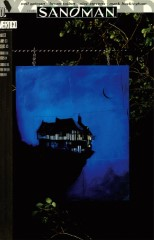

# Issue 51: "A Tale of Two Cities"

##### Neil Gaiman, Bryan Talbot, Alec Stevens, Mark Buckingham

- First story in anthology, _Worlds' End_
- First story reprinted in trade paperback _Worlds' End_
- Audible Act III Chapter 14

### Page 3

> [marginThumb] 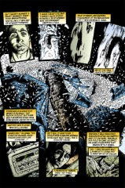

- #### Panel 8

  Not Kansas? Awww... It's worth noting that Buddy Holly (whose music is playing) died in an Iowa field in a snowstorm. In a plane crash rather than a car crash, to be sure.

### Page 5

> [marginThumb] 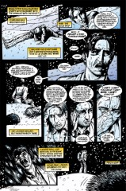

- #### Panel 4

  A hedgehog with very similar speech patterns, named Redlaw, appeared in volume 3 of "The Books of Magic" miniseries. This isn't necessarily the same one, of course.

### Page 6

> [marginThumb] 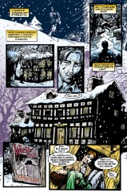

- #### Panel 5

  A "free house" is a pub or inn with no ties to a brewery, as opposed to a "tied house", where the land or pub is owned by the brewery and the publicans are merely tenants. The main difference is that a free house canserve any beer they wish, while a tied house will usually only sell beers produced by the brewery the pub is tied to. In the context of the story, the inn is a free house in that it's tied to no one world or reality stream.

- #### Panel 6

  **Abdera**: according to Brewer's _Dictionary of Phrase and Fable_, a Thracian seaport, proverbial for stupid inhabitants although it produced several noted philosophers. No refs on the particular story.

  The name Menton may be a reference to Minneapolis-area guitarist and vocalist Todd Menton, who certainly either knows Gaiman or knows friends of his.

### Page 7

> [marginThumb] 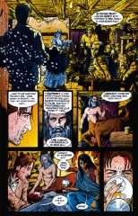

- #### Panel 3

  Webster's dictionary defines "chirurgeon" simply as an archaic synonym of "surgeon".

### Page 8

> [marginThumb] 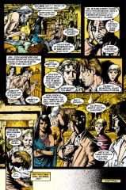

- #### Panel 1

  As we will learn, the travelers in this inn tell stories.

  This is Brant's, although not one that follows traditional narrative style.

- #### Panel 5

  In Greek myth, the centaur Chiron taught medicine to Asklepios, who went on to become the patron demigod of doctors. His credentials as a physician are thus fairly impressive. He also served as Herakles' childhood tutor.

### Page 9

> [marginThumb] 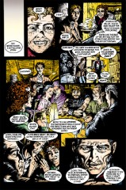

- #### Panel 4

  The man with the beer stein at left foreground is wearing a distinctive hat, the same worn by noted fantasy writer (and friend of Gaiman's) Steven Brust. Neil Gaiman confirms that it's meant as a cameo.

  > [flex cols-2] 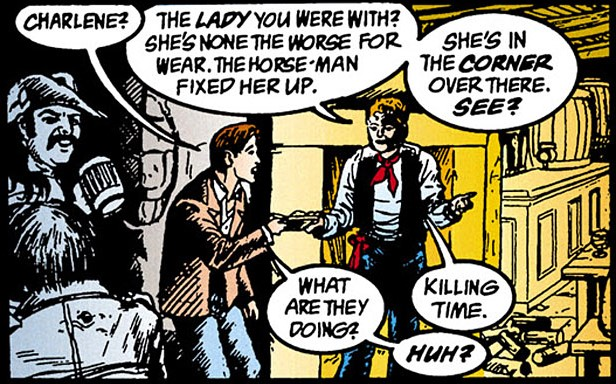 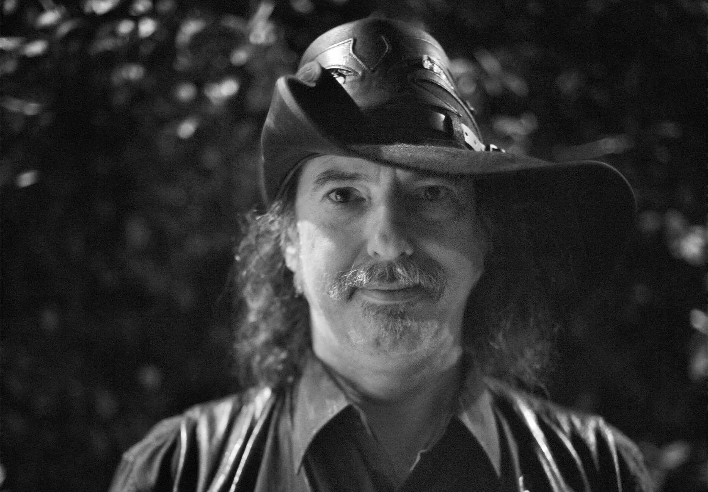

- #### Panel 6

  There was a knight of the Round Table named Gaheris, brother to Gawaine.

- #### Panel 7

  By Charles Dickens, of course.

### Page 10

> [marginThumb] 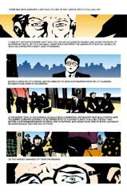

- #### Panels 1 & 5

  Note the close-ups on the eyes. This recurs through-out the rest of this issue.

### Page 11

> [marginThumb] 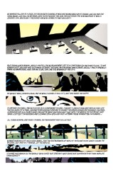

- #### Panel 3

  Another pair of eyes close-up.

- #### Panel 6

  Compare [36:23](sandman.36.md#page-23):4 and [37:19](sandman.37.md#page-19):2-4.

### Page 13

> [marginThumb] 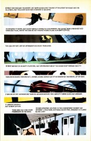

- #### Panel 3

  The lights behind the seats resemble eyes. Also, note the color of the lights... (See also note on [page 17](#page-17) panel 5 below.)

### Page 14

> [marginThumb] 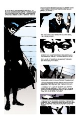

- #### Panel 3

  Yet more eyes...

### Page 16

> [marginThumb] 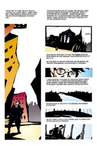

- #### Panel 3

  Even more eyes... [etc.]

### Page 17

> [marginThumb] 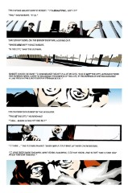

- #### Panel 5

  C.f. page 11 panel 3, and page 21 panel 3. All three of them have blue eyes.

### Page 18

> [marginThumb] 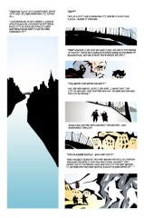

- #### Panel 1

  At this point in the story, I was getting the eerie feeling that the city would actually turn out to be a small part of a person's face. Here, the bridge reminded me of the middle section of the man's glasses. Maybe it's just me, though...

### Page 19

> [marginThumb] 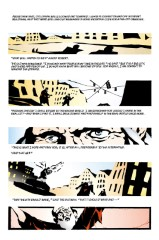

- #### Panel 1

  from Gaiman's introduction to Lovecraft, H. P. _The Dream Cycle of H. P. Lovecraft: Dreams of Terror and Death_: Del Rey, 1995, page x.

  > "There's something about Lovecraft's fiction, about his worlds, that is oddly alluring for a writer of fantasy and horror. I've written three Lovecraftian stories: one obliquely, in _Sandman_—a quiet, dreamlike story (it's the first story in the _World's End_ collection. You can tell it's Lovecraftian, because I use the word "cyclopean" in it) . . . "

### Page 20

> [marginThumb] 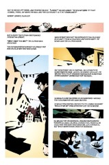

- #### Panel 7

  Given that the restaurants are always closed, I can't help wondering what Robert is finding to eat. His beard is growing, so he's not somehow exempted from normal bodily functions.

### Page 22

> [marginThumb] 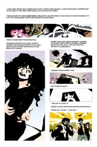

- Odd that whenever two real people meet, one of them immediately returns to the real city. Coincidence, perhaps.

### Page 23

> [marginThumb] 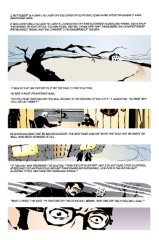

- Another inn, in which other tales are told; Gaheris' story turns out to be a story-within-a-story.

### Page 24

> [marginThumb] 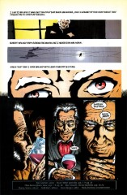

- #### Panel 6

  The last panel in this story again focusses on the eyes. This time, though, they're Gaheris', and the picture is of his whole face, not just his eyes. Note, also, how his eyes are the same color as his cravat and the wine he's drinking (although that could just be a coincidence).

## Credits

- Greg "elmo" Morrow (morrow@physics.rice.edu) created the Sandman annotations, forwarded much useful commentary on "World's End", and helped reference Chiron the centaur.
- Originally collated and edited by David Goldfarb.
- D. W. James (vnend@princeton.edu) suggested that Todd Menton somehow found his way to the inn of World's End, and noted Steven Brust.
- Lance "Squiddie" Smith (lsmith@cs.umn.edu) noted the Buddy Holly connection, and corrected "Worlds'" vs. "World's". He also explicated the term "free house" and noted Steven Brust's appearance.
- Timothy Hock Seng Tan for numerous corrections and other stuff.
- Ralf Hildebrandt added more details.
- Richard Munn added the Steven Brust reference image
