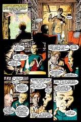
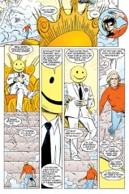

# The Annotated Sandman

## Issue 54: "The Golden Boy"

> [!THUMBNAIL] 

##### Neil Gaiman, Michael Allred, Bryan Talbot, Mark Buckingham

Fourth story in anthology, "Worlds' End"

### Page 2

> [!THUMBNAIL] 

- #### Panel 1

  These are the Emperor, the Empress, and their Fool, from issue four of the "Books of Magic" miniseries. Based on cards in the Tarot deck, they were archetypes, composites of many souls. They lived in a castle so far in the future that time itself had nearly ended. Sort of appropriate that they would turn up at the Inn of the Worlds' End.

### Page 3

> [!THUMBNAIL] 

- #### Panel 1

  Note the bright star visible through the window, reminiscent of the Star of Bethlehem. I haven't had the opportunity to read _Prez_ #1; I've been told that the many parallels between Prez and Jesus were present in the original comic, rather than being Gaiman's invention.

  Perhaps here is the place to note that in Joe Simon and Jerry Grandenetti's original _Prez_ series, Prez was a fool who managed to be simultaneously naive and paranoid. The series was a savage parody of the '60s youth movements, quite unlike Gaiman's portrayal of the character.

- #### Panel 3

  "With all his heart and mind and soul..." This is reminiscent of Jesus' description of the greatest commandment: "Love the Lord with all your heart, and all your mind, and all your strength." (Mark 12:30, Luke 10:27, Matthew @22:37).

This continues the religious theme in this issue.

- #### Panel 4

  The quote is from Kennedy's inaugural speech, given on January 20, 1961. Prez's birth would then be in 1954.

### Page 4

> [!THUMBNAIL] 

- #### Panel 3

  This parallels a traditional story of Jesus' boyhood, which had him discussing the Torah with the rabbis of Nazareth.

- #### Panel 6

  "Prince of This World" is a medieval title for Satan -- as opposed to Jesus, the prince of the next.

### Page 5

> [!THUMBNAIL] 

- #### Panel 4

### Page 6

> [!THUMBNAIL] 

- #### Panel 5:

  This parallels a story in which Satan tempts Jesus, found in chapter 4 of Matthew and Luke.

### Page 7

> [!THUMBNAIL] 

- #### Panel 2

  The posters on the wall are rock star David Bowie and Lon Chaney Jr. (in "The Wolf Man"). On the bookcase is a "Magic 8 Ball", which would give ambiguous answers to questions, and several Aurora brand horror model kits, including "The Creature From the Black Lagoon" and "The Forgotten Prisoner". Aurora was a frequent advertiser in DC comics during the late '60s and early '70s.

- #### Panel 7

  Warren Harding's administration was rocked by scandal; it was perhaps the most corrupt until, well, Nixon's.

### Page 8

> [!THUMBNAIL] 

- #### Panel 3

  When Nixon's tape recordings of office conversations were transcribed for the Watergate hearings, the frequently-used swear words were all replaced with "[expletive deleted]".

> [!FLOATRIGHT_40PC] 

### Page 9

> [!THUMBNAIL] 

- #### Panel 5

  This panel is essentially the cover of _Prez_ #1. This would seem to be the 1972 election. The caption here is inconsistent with the one on 3:4; either this one should read "nineteenth" or that one should read "seven".

  I think this panel is actually a reference to the various miracles performed by Jesus during His time on Earth. (E.g. giving sight to the blind, giving hearing to the deaf, curing disease, etc.)

### Page 10

> [!THUMBNAIL] 

- #### Panel 2

  At this time in the real world, of course, the price of gasoline, the federal deficit, and the national debt all skyrocketed.

- #### Panel 3

  "Samurai Deli" was a real sketch on "Saturday Night Live"; in our world, Buck Henry was the host of that show.

- #### Panel 4

  In our world John Belushi died young of a drug overdose.

- #### Panel 7

  The robot on the floor seems to be the same one on Prez' bookshelf on page 7.

### Page 13

> [!THUMBNAIL] 

- #### Panel 3

  Reportedly, President WIlliam McKinley, on being shot, said of his assassin, "Let no one hurt him."

- #### Panel 4

  John Hinckley, who tried to kill President Ronald Reagan in 1981, did so in order to impress actress Jodie Foster. This is a clear parallel. In the DC Universe proper, Ted Grant is a member of the Justice Society of America, with the superhero name "Wildcat", as seen on the assassin's t-shirt. Reportedly, Gaiman simply wanted to use someone famous; he chose Wildcat because Michael Allred liked Wildcat's costume.

### Page 14

> [!THUMBNAIL] 

- #### Panel 1

  The woman is the Vice President. There's some disagreement about whether or not she is Prez's mother. In the original series she had a penchant for speaking in rhyme.

- #### Panel 6

  These "wafflestomper" hiking boots were popular in the mid-'70s. (I had a pair myself.)

### Page 15

> [!THUMBNAIL] 

- #### Panel 3

  A Constitutional Amendment limits Presidents to two terms of office.

- #### Panel 6

  When Satan tempted Jesus in the high place, Jesus replied:
  "It is written, Thou shalt worship the Lord thy God, and only him shalt thou serve." (Luke 4:8)

### Page 16

> [!THUMBNAIL] 

- #### Panel 1

  No, no, that's Prez Rickard, not Norton.

### Page 17

> [!THUMBNAIL] 

- #### Panels 1-3:

  This seems to be adapted from a Taoist story.

  From _CHUANG TZU: Basic writings_ (Columbia Press, 1964, Trans:Burton Watson):

  > Once, when Chuang Tzu was fishing in the P'u River, the king of Ch'u sent two officials to go and announce to him: "I would like to trouble you with the administration of my realm."
  >
  > Chuang Tzu held on to the fishing pole and, without turning his head,
  > said, "I have heard that there is a sacred tortoise in Ch'u that has
  > been dead for three thousand years. The king keeps it wrapped in cloth
  > and boxed, and stores it in the ancestral temple. Now would this tortoise
  > rather be dead and have its bones left behind and honored? Or would it
  > rather be alive and dragging its tail in the mud?"
  >
  > "It would rather be alive and dragging its tail in the mud," said the
  > two officials.
  >
  > Chuang Tzu said, "Go away! I'll drag my tail in the mud!"

- #### Panel 8

  I seem to remember seeing a picture of Jesus standing on a mountain-top, in a similar pose. That this panel might be a reference to that picture is confirmed by Prez' beard & hair, which is very similar to Roman Catholic pictures of Jesus.

### Page 18

> [!THUMBNAIL] 

- #### Panel 3

  Given all the smiley faces, this visual reference to _Watchmen_ was surely inevitable.

- #### Panel 4

  The assassin looks like Abraham Lincoln (or is wearing an Abe mask). Lincoln was also shot & killed, but that was in a theatre, not outside. Also, the blood coming out of Prez' body resembles the red & white stripes on the US flag.

### Page 19

> [!THUMBNAIL] 

- #### Panel 5

  As was mentioned in the "Orpheus" special, we all meet Death when we are born.

### Page 20

> [!THUMBNAIL] 

- #### Panel 4

  A reference to the "Blind Watchmaker" theory: just as the existence of a watch implies the existence of a watchmaker, so does the existence of complex human beings imply the existence of a divine Creator.

  Again, continuing the religious overtones of this story.

- #### Panel 9

  Note the smiley face over the gate.

### Page 21

> [!THUMBNAIL] 

- #### Panel 2

  A reference to the parable of the talents; specifically Matthew 25:21.

### Page 24

> [!THUMBNAIL] 

- #### Panel 1

  Among the contents of the chest in [27:20](sandman.27.md#page-20):1 was a pocket watch. Perhaps the same one?

  This raises an interesting question about the multiverse within the Sandman Universe - _our_ Dream was imprisoned at this point in time, but evidentially the dream of Prez's universe wasn't. Yet somehow the chest is linked across universes...

- #### Panel 5

  "...and that this time he will not come to just one America, but to all of them." An allusion to Jesus, perhaps, who was to become a saviour to the _world_, and not just of _Israel_, as the Jews once thought. "Others say that he waits to be born once more..." (A little more uncertain, this one.) King Arthur is said to be waiting on the Isle of Avalon, to come again when Britain most needs him. Considering that Arthur lived in _Camelot_, might this be a tangential reference to the Kennedys (who are often referred to as living in Camelot)?

## Credits

- Greg "elmo" Morrow (morrow@physics.rice.edu) created the Sandman Annotations and forwarded much useful information about "Worlds' End".
- Originally collated and edited by David Goldfarb.
- Lance "Squiddie" Smith (lsmith@cs.umn.edu) identified the posters, the Magic 8-Ball, the Aurora kits, the cover to _Prez_ #1, the "Samurai Deli" sketch, the hiking boots, and noted the pocket watch in Morpheus' chest.
- D. W. "Vnend" James (vnend@princeton.edu) referenced William McKinley's assassination.
- Curt Monash (fencer@panix.com) reported on the choice of Wildcat.
- David Silberstein (DASBC@CUNYVM.BITNET) provided the excerpt from the writings of Chuang Tzu.
- Timothy Hock Seng Tan <083285@bud.cc.swin.edu.au> really knows his way around the Bible.
- Ralf Hildebrandt added more details.
- Richard Munn pondered about the multiverse.
