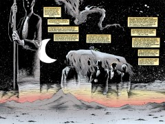

# The Annotated Sandman

## Issue 56: "Worlds' End"

> [!THUMBNAIL] 

##### Neil Gaiman, Bryan Talbot, Mark Buckingham, Gary Amaro, Dick Giordano,

Tony Harris, Steve Leialoha

Sixth and last story in anthology "Worlds' End"

**Cover**: Note that the sign is a mirror-reversed negative image of the sign from the cover of [issue #51](sandman.51.md).

### Page 3

> [!THUMBNAIL] 

- #### Panel 5

  Such as the death of an Endless?

### Page 4

> [!THUMBNAIL] 

- #### Panel 4

  Gangster story? The only story we've seen that isn't identifiable from this list would be "A Tale of Two Cities", from #51, but that one hardly seems describable as a gangster story. Perhaps she's referring to the man who won November 1937 in a poker game, or perhaps a story told downstairs while Brant was hearing about Prez.

  Lord Vetinari <vetinari@fuse.net> thoughts about that:

  > I think she means the one told by the comrade of Petrefax about the fall of the last Necropolis. It is reminiscent of when the MOB came to town as a group of a few overwhelming strangers and demanded things or caused much Destruction. Given that the woman has no idea about the Endless and what is really happening this is quite plausible to be what it is from her point of view.
  > About the fall of Necropolis story, i originally thought that when they said their sister was dead they meant Death, because it would be like a metaphor for the endless, stop caring and believing, and they die. But in the picture of the six strangers it definitely seems as if their is Death in their, but not Despair, who we know has died.

- #### Panel 5

  Horatio Alger (1832-1899) was known for stories of poor but honest boys making good through hard work.

### Page 8

> [!THUMBNAIL] 

- #### Panel 7

  Given that the Endless embody aspects of reality, if a storm is caused by the death and replacement of one of them, then both theories are equally true. There has been only one before, and as we were reminded last issue, an Endless has died and been replaced once before.

### Page 9

> [!THUMBNAIL] 

- #### Panel 4

  The return of Steven Brust, seen once before in [51:9](sandman.51.md#page-9).4.

### Page 10-11

> [!THUMBNAIL] 

The song is part of the Gaiman-written "Generic Folk Song".

### Page 12-13

> [!THUMBNAIL] 

OK, time to play "name the characters". This one is Destiny, of course.

### Pages 14-15:

> [!THUMBNAIL] 

The man with the flag, judging by his coat and vest, is Lucien. Some netters have speculated that the first pallbearer is Desire (who otherwise is noticeably absent from the proceedings), and the second (with red hair) is Loki. The big question is who is in the coffin. Opinions vary, but the most popular guess is Dream, with Orpheus a distant second.

### Pages 16-17

> [!THUMBNAIL] 

Going roughly from left to right: Nuala, Abel, Mervyn Pumpkinhead, Cain, Luz, Wilkinson, Queen Titania, Matthew the raven, Bast, Despair, an angel (perhaps Remiel), Odin, Thor, Emperor Norton, probably Gregory the Gargoyle, Gilbert/Fiddler's Green, and Martin Tenbones.

### Page 18-19

> [!THUMBNAIL] 

Finally, Delirium and Death. In the introduction to the "Death Gallery", Gaiman relates a story from the Kabala, that the Angel of Death collects souls through love: when you see it(/him/her) you fall in love so quickly that your soul is drawn out through your eyes.

### Page 22

> [!THUMBNAIL] 

- #### Panel 4

  There are numerous Hindu gods and goddesses represented with multiple arms. We can infer that the landlady was one such who lost all her worshippers, and took refuge at the inn before returning to the Dreaming.

### Page 23

> [!THUMBNAIL] 

- #### Panel 7

  The lady behind the bar seems to be wearing a similar crystal to the one given to Nuala in Brief Lives [Sandman #42](sandman.42.md#page-5) page 5. It was also seen in The Kindly Ones [Sandman #58](sandman.58.md).

## Credits

- Greg "elmo" Morrow (morrow@physics.rice.edu) created the Sandman Annotations and forwarded much useful information about "Worlds' End".
- Originally collated and edited by David Goldfarb.
- Lance "Squiddie" Smith (lsmith@cs.umn.edu) referenced the song, and nagged me into confirming with Gaiman that the man on page 9 was meant to be Steven Brust.
- Ron Dippold (rdippold@qualcomm.com) gave lots of information on Hindu goddesses.
- Lord Vetinari <vetinari@fuse.net> added thoughts about page 4.
- Ralf Hildebrandt added more details.
