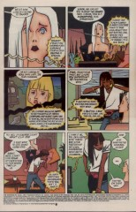
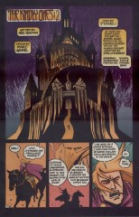
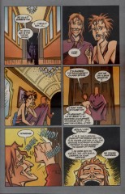
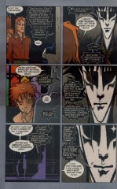

> [marginThumb] 

# Issue 58: "The Kindly Ones: 2"

##### Neil Gaiman, Marc Hempel, D'Israeli

**Cover**: Benjamin Disraeli (1804-1881) was Earl of Beaconsfield and Prime Minister of England. The inker's pen name is probably derived from him, although he did not spell his name with an apostrophe.

### Page 1

> [marginThumb] 

- #### Panel 4

  Evidently he was rocking the boat...

### Page 2

> [marginThumb] 

- #### Panel 7

  Lyta calles Lieutenant Pinkerton "Lieutenant Pinkwater" -- tip of the hat to Daniel Manus Pinkwater, National Public Radio commentator and author of the classic young adult books _Lizard Music_, _The Last Guru_ and _Young Adult Novel_, as well as several books for younger readers.

  Gaiman and Pinkwater have been known to hang out on each other's discussion fora on GEnie. (This was back in '93-'94; not sure if it's still the case)

### Page 5

> [marginThumb] 

- #### Panel 3

  Cluracan was of course last seen in [issue 56](sandman.56.md); his sister Nuala in [issue 52](sandman.52.md).

### Page 7

> [marginThumb] 

- #### Panels 3-5

  In [47:14](sandman.47.md#page-14).4 we see (in a panel from Destiny's book, whose location in time is uncertain) a white-haired, white-clad Dream that looks somewhat like this figure. It's unclear as yet whether this is a plot point or just an echo.

### Page 9

> [marginThumb] 

- #### Panel 4

  In an interview in "Comics Buyers Guide" Gaiman states that the story of Cluracan's nemesis isn't going to be resolved before the title ends. Sigh...

### Page 11

> [marginThumb] 

- #### Panel 7

  "La Belle Dame sans Merci" (French: "The Beautiful Merciless Lady"): a poem, written in 1819 by John Keats, about a young man pining away for love of an elf-maiden.

### Page 14-16

In Jungian psychology, if you have a dream in which you go down to a basement, it means that you are confronting something from your subconscious. Here, Lyta is confronting the fact that her son may be dead. (C.f. Rose's dream in #65, 5, 7.)

### Page 14

> [marginThumb] 

- #### Panel 6

  The recipe is from _Macbeth_ act IV scene 1:

  > **First Witch** Round about the cauldron go; 
  > In the poison'd entrails throw. 
  > Toad, that under cold stone 
  > Days and nights has thirty-one 
  > Swelter'd venom sleeping got, 
  > Boil thou first i' the charmed pot. 
  >
  > **ALL** Double, double toil and trouble; 
  > Fire burn, and cauldron bubble. 
  >
  > **Second Witch** Fillet of a fenny snake, 
  > In the cauldron boil and bake; 
  > Eye of newt and toe of frog, 
  > Wool of bat and tongue of dog, 
  > Adder's fork and blind-worm's sting, 
  > Lizard's leg and owlet's wing, 
  > For a charm of powerful trouble, 
  > Like a hell-broth boil and bubble. 
  >
  > **ALL** Double, double toil and trouble; 
  > Fire burn and cauldron bubble. 
  >
  > **Third Witch** Scale of dragon, tooth of wolf, 
  > Witches' mummy, maw and gulf 
  > Of the ravin'd salt-sea shark, 
  > Root of hemlock digg'd i' the dark, 
  > Liver of blaspheming Jew, 
  > Gall of goat, and slips of yew 
  > Silver'd in the moon's eclipse, 
  > Nose of Turk and Tartar's lips, 
  > Finger of birth-strangled babe 
  > Ditch-deliver'd by a drab, 
  > Make the gruel thick and slab: 
  > Add thereto a tiger's chaudron, 
  > For the ingredients of our cauldron. 
  >
  > **ALL** Double, double toil and trouble; 
  > Fire burn and cauldron bubble. 
  >
  > **Second Witch** Cool it with a baboon's blood, 
  > Then the charm is firm and good.

### Page 15

> [marginThumb] 

- #### Panel 1

  Granddaughter on the mother's side, most likely...

- #### Panel 3

  **An echo**: twice before the three witches have appeared to answer three questions. Once when summoned by Dream in [issue 2](sandman.02.md), and once to Rose Walker in [issue 10](sandman.10.md).

### Page 17

> [marginThumb] 

- #### Panel 3

  **Dragnet**: A radio show, then a television show, purporting to dramatize actual cases of the LA police department.

### Page 18

> [marginThumb] 

- #### Panel 3

  No refs on these figures or the name "Ruthven", other than that Gaiman used the name for a minor character in [issue 1](sandman.01.md).

### Page 19

> [marginThumb] 

- #### Panel 6

  No refs on any of Cluracan's titles...

### Page 21

> [marginThumb] 

- #### Panel 3

  Morpheus and Nuala seem oddly ignorant of the events recounted in [issue 52](sandman.52.md). We can speculate that the reality storm sent Cluracan back in time, but things aren't that simple: Queen Titania would likely have noticed her ambassador arriving before he left. Further, there is no evidence in that story of the events shown in this.

### Page 23

> [marginThumb] 

- #### Panel 7

  Nuala's crystal in was given her by the last Dream's lover as seen in [issue #42, page 4](sandman.42.md#page-4), panel 5.

- #### Panel 9

  An echo of "A Game of You". That story also concerned a crystal that could be used to summon Dream for a boon.

## Credits

- Greg "elmo" Morrow (morrow@physics.rice.edu) created the Sandman Annotations.
- Originally collated and edited by David Goldfarb.
- Timothy Tan aka TiTan <_> -M2001- <_> 083285@bud.cc.swin.edu.au
- Ralf Hildebrandt added more details.
