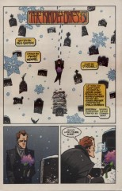

## Issue 59: "The Kindly Ones: 3"

> [!THUMBNAIL] 

##### Neil Gaiman, Marc Hempel, D'Israeli

### Page 1

> [!THUMBNAIL] 

- #### Panel 1

  Each Hempel-drawn issue of "The Kindly Ones" has a cord or string of some kind in the first panel.

- #### Panel 2

  The return of Loki, last seen at the end of "The Season of Mists" ([issue #28](sandman.28.md)), and of Robin Goodfellow, aka Puck, last seen in "A Midsummer Night's Dream" ([issue #19](sandman.19.md)).

- #### Panel 3

  **silver cord**: a reference to Ecclesiastes 12:6:

  > Or ever the silver cord be loosed, or the golden bowl be broken, or the pitcher be broken at the fountain, or the wheel broken at the cistern.

  The most common interpretation is that "silver cord" here is the spinal cord. Some traditions have posited a "silver cord" as a mystical link between body and soul. Puck's quote is also an echo: the verse from Ecclesiastes was used in the funeral service at the end of "A Game of You" -- [37:17](sandman.37.md#page-17).4.

- #### Panel 5

  A true story from a trickster god of lies? Well, maybe.

### Page 3

> [!THUMBNAIL] 

- #### Panel 6

  The phoenix, of course, was a magical bird. At the end of its life it would build a pyre for itself and die in the flames to be reborn from the ashes.

### Page 4

> [!THUMBNAIL] 

- #### Panel 3

  This is reminiscent of some Greek myths in which a mother tried to make her child immortal by dipping him in water from the river Styx (the river that flows through the land of the dead) and then putting him on a fire to burn away his mortality.

### Page 5

> [!THUMBNAIL] 

- #### Panel 1

  As we learn a few pages from now, this is the return of Dream's immortal friend Hob Gadling. His most recent appearance was in [issue 53](sandman.53.md), although his cameo in [issue 22](sandman.22.md) is chronologically later.

### Page 8

> [!THUMBNAIL] 

- #### Panel 1

  The narrator of [issue 53](sandman.53.md) was named Margaret. "Peggy" can be a nickname for Margaret, and the dates involved are close enough that the two might be the same person.

### Page 9

> [!THUMBNAIL] 

- #### Panel 4

  Another trio of women...

### Page 12

> [!THUMBNAIL] 

- #### Panel 1

  Note Hob Gadling in the background from page 8 panel 4. This is a bit odd, as the pictures in Despair's realm are supposedly all the backs of mirrors; there certainly was no mirror there in the cemetery.

### Page 13

> [!THUMBNAIL] 

- #### Panel 1

  According to [21:10](sandman.21.md#page-10).2, the green one. Just thought you'd like to know.

- #### Panel 2

  Delirium of course acquired Destruction's dog Barnabas (or, equally true, the other way around) in issue [48](sandman.48.md).

### Page 14

> [!THUMBNAIL] 

- #### Panel 1

  This settles a minor controversy about "The Season of Mists" part 1. Dream is holding a miniature version of the skull of The Corinthian, one of the escaped dreams from "The Doll's House".

- #### Panel 4

  Note, not _can_ not...

### Page 17

> [!THUMBNAIL] 

- Note the multiples of 3: 9 cents in the sign in panel 2; 9 cents in panel 3; 6 cents in panel 4; and the Triple Goddess on the cover of "People":

  Madonna, Roseanne Arnold, and Queen Elizabeth.

- #### Panel 6

  The verse is part of a rhyme called "Who Killed Cock Robin?".

### Page 18

> [!THUMBNAIL] 

- #### Panel 1

  An echo of Daniel's appearance in the story, "The Parliament of Rooks"?

### Page 23

> [!THUMBNAIL] 

- #### Panel 5

  Hempel is redrawing [12](sandman.12.md):23.5 -- just coincidence of numbering, I wonder?

### Page 24

> [!THUMBNAIL] 

- #### Panel 2

  Redrawing [21:13](sandman.21.md#page-13).6, although from a different perspective.

  Note Morpheus' different appearance when he's being drawn by Kelley Jones as opposed to Mike Dringenberg.

- #### Panel 4

  [12](sandman.12.md):23.7. Dialogue in these three panels is verbatim.

- #### Panel 6

  "Oh that I were a man..." is from Shakespeare's Much Ado About Nothing (Act IV, sc. i) : Beatrice says "Oh God, that I were a man! I would eat his heart in the market place!"

## Credits

- Greg "elmo" Morrow (morrow@physics.rice.edu) created the Sandman Annotations.
- Originally collated and edited by David Goldfarb.
- Ralf Hildebrandt added more details.
