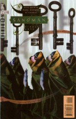
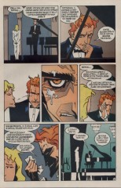

# The Annotated Sandman

## Issue 60: "The Kindly Ones: 4"

> [!THUMBNAIL] 

##### Neil Gaiman, Marc Hempel, Disraeli

### Page 1

> [!THUMBNAIL] 

- #### Panel 1

  Every Hempel-drawn issue has a string or cord in this panel.

**This issue**: an electrical cord going into a manhole. The man is the angel Remiel, who was last seen at the end of "The Season of Mists", [issue #28](sandman.28.md). **Note the shadow**: his feet do not quite touch the ground.

### Page 2

> [!THUMBNAIL] 

- #### Panel 3

  A reference to [Bible quote].

- #### Panel 4

  See the annotations for [issue #24](sandman.24.md) for more information on Remiel and Duma.

### Page 5

> [!THUMBNAIL] 

- #### Panel 6

  Reportedly this speech is paraphrased from Sir Walter Raleigh. Raleigh, however, said "regrets" rather than "consequences".

### Page 6

> [!THUMBNAIL] 

- #### Panel 5

  "I thought it wiser simply to walk away." Possibly a lie, depending on how you interpret page 6, panels 1 & 2.

- #### Panel 6

  And now Remiel is starting to swear, too. Maybe it's the result of having just visited Lucifer?

## Pages 8-9

> [!THUMBNAIL] 

- I don't recognize either of these characters.

### Page 10

> [!THUMBNAIL] 

- This is "Puss in Boots". I don't have on me a specific reference to her story.

### Page 12

> [!THUMBNAIL] 

- #### Panel 3

  Note the Tori Amos poster on the wall. The other poster is most likely Iggy Pop, but could conceivably be for the comic strip "Ziggy". Another possibility is that it is for 'Ziggy Stardust', a fictional rock star sung about by David Bowie, on his album ['The Rise and Fall of Ziggy Stardust and the Spiders from Mars'](http://www.amazon.com/exec/obidos/ASIN/B00000IXLB). The CD booklet open on the top of the couch is Tori Amos' album ["Under The Pink"](http://www.amazon.com/exec/obidos/ASIN/B000002IXU), the title and artwork of which are detailed on page 13, panel 7 (noted by eddietomb@yahoo.com).

- #### Panel 4

  The poster is the character "The Man", from the series _Breathtaker_, written by Mark Wheatley and drawn by Marc Hempel.

### Page 13

> [!THUMBNAIL] 

- #### Panel 9

  This is the first of a number of references to Rose's looking younger than her true age. There's been speculation that she's stopped aging because of giving away her heart at the end of "The Doll's House"; in many tales a being who takes out their heart and hides it gains immortality. Gaiman's own character Mad Hettie (see [issue #3](sandman.03.md), and the "Death" miniseries) has done so.

### Page 14

> [!THUMBNAIL] 

- #### Panel 3

  Those wishing to learn more about Rose's family tree are directed first to [issue #1](sandman.01.md), then to the "Doll's House" story.

- #### Panel 5

  Montel Williams is an LA-area talk show host. "Vixen LaBitch" is fictional, as far as I know. Her dialogue refers to accusations of child molestation leveled against pop star Michael Jackson: one of his hit songs from the mid-'80s, "Billie Jean", had a line, "The kid is not my son"; "Beat It" was another hit song from the same album, but LaBitch is using the phrase as a slang term for masturbation.

### Page 15

> [!THUMBNAIL] 

- #### Panel 2

  Carmilla Bristol seems to be fictional.

  On the TV set, there are books on the TV shows "The Golden Girls" and "Bewitched". Not too sure about the Bewitched reference, but weren't there three "Golden Girls"? (plus Estelle Getty, of course, who played the mother of one of the three).
  A quick note about why Rose Walker is studying the triple goddesses in the TV show "Bewitched":
  The main character, Sam, was a witch.

  Her mother, Endora, was also a witch.

  In later episodes, Darren and Sam had a daughter, and she also had witching powers.

  So, we have 3 witches.

### Page 16

> [!THUMBNAIL] 

- #### Panel 4

  **An echo**: these two women are dressed the same as Chantal and Zelda, two characters from "The Doll's House".

- #### Panel 7

  Stheno and Euryale were two of the three Gorgons, hags from Greek myth with snakes for hair and faces so terrifying that merely to look upon them was to be turned to stone. The third was Medusa, who was slain by the hero Perseus.

### Page 17

> [!THUMBNAIL] 

- #### Panel 5

  These three are the Hesperides, another trio of women from Greek myth. Retrieving apples from their garden was one of the labors of Hercules. In some tales the Gorgons did in fact live near this garden.

### Page 18

> [!THUMBNAIL] 

- #### Panel 2

  In most versions the guardian of the apples was called Ladon, and had as many as a hundred heads. The three-headed Geryon was slain by Hercules, but in a different one of his labors. No doubt Gaiman has brought Geryon in here so as to have yet another occurrence of the number three.

- #### Panel 5

  In Greek myth, the apples of the Hesperides did not confer immortality. Norse myth does feature golden apples in this role, though.

### Page 20

> [!THUMBNAIL] 

- #### Panel 4

  We've seen this chest before, in [27:20](sandman.27.md#page-20).1-2. The contents are the same: a pocket watch (perhaps Prez's?); Haroun al-Raschid's magical Baghdad; the demon Azazel, pent in a bottle; and the skull of the Corinthian.

### Page 21

> [!THUMBNAIL] 

- #### Panel 2

  According to Brewer's _Dictionary of Phrase and Fable_:

  > **Abudah**:
  >
  > Thackeray's allusion, "Like Abudah, he is always looking out for the Fury, and knows that the night will come with the inevitable hag with it," is to a merchant of Baghdad, haunted every night by an old hag described in Ridley's TALES OF THE GENII.

## Credits

- Greg "elmo" Morrow (morrow@physics.rice.edu) created the Sandman Annotations.
- Originally collated and edited by David Goldfarb.
- Andrew Farrell (afarrell@maths.tcd.ie) referenced Sir Walter Raleigh.
- Jeff Raglin (gt4724d@prism.gatech.edu) gave information about the Greek characters and identified Rose's posters.
- Mike Kelly (mkelly@doc.helios.nd.edu) made the connection between
- Rose's youth and her having lost her heart.
- eddietomb@yahoo.com made some more observations on Rose's posters
- Ralf Hildebrandt added more details.
