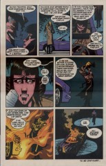

> [marginThumb] 

## Issue 61: "The Kindly Ones: 5"

##### Neil Gaiman, Marc Hempel, D'Israeli

### Page 1

> [marginThumb] 

- #### Panel 1

  Every Hempel-drawn issue of "The Kindly Ones" has had a string of some sort in the very first panel. Here, a strand of spider silk.

- #### Panel 4

  As mentioned previously, the hero Perseus.

### Page 4

> [marginThumb] 

- #### Panel 6

  Hollow? Empty? One might almost say heartless...

### Page 5

> [marginThumb] 

- #### Panel 1

  Zelda was last seen in [issue #15](sandman.15.md), "The Doll's House" part 6.

  She was blond in that issue, although her hair could have been bleached. "The Doll's House" featured a gay man named Hal, who moved west; before this, many people on the net thought that Rose's dying friend was him -- almost certainly an intentional bit of misdirection on Gaiman's part. Given the theme of gender that runs through "The Kindly Ones", Rose's friend would have to be a woman, though.

- #### Panel 4

  An echo of [15:2](sandman.15.md#page-2).4.

### Page 8

> [marginThumb] 

- #### Panel 7

  Note the water glass is identical to the one that the Gorgons gave to Lyta.

### Page 10

> [marginThumb] 

- #### Panel 1

  The raven Jessamy appears in [issue 29](sandman.29.md), "Thermidor". That story took place in the late eighteenth century.

### Page 11

> [marginThumb] 

- #### Panel 1

  Previous to the "Crisis on Infinite Earths", Superman's home planet of Krypton had a glass forest similar to this one.

### Page 12

> [marginThumb] 

- #### Panel 2

  Titania's was last seen in [issue #52](sandman.52.md). Her appearance here is identical to that of [issue #18](sandman.18.md), "A Midsummer Night's Dream". This is especially notable because in four Gaiman-written stories it is the first time she's had the same form.

### Page 14

> [marginThumb] 

- #### Panel 3

  I must confess I have no idea what this is supposed to mean...

- #### Panel 6

  Auberon, in [issue 18](sandman.18.md), is shown with ram's horns. A man whose wife is unfaithful is also traditionally referred to as "horned".

### Page 15

> [marginThumb] 

- #### Panel 1

  I'm sure Geryon is simply petrified at the prospect...

- #### Panel 2

  Scenes in the waking world have white gutters and page border; scenes in the Dreaming are in grey. Note what happens to the border here.

- #### Panel 4

  I don't know what significance claws of brass have. "Nimbic glimmering" is perhaps derived from "nimbus", a halo of light denoting power.

### Page 21

> [marginThumb] 

- #### Panel 4

  An echo, perhaps, of [page 9 of issue 12](sandman.12.md#page-9) ("The Doll's House" part 3).

### Page 22

> [marginThumb] 

- #### Panel 3

  In Norse myth, Ragnarok was brought on when the god Balder was killed. Seven years of constant winter (Finbulvinter) ensued, and then the end of the world.

  It was Loki that tricked a blind God, I don't remember which, into shooting an arrow of mistletoe at Balder.

  The story was that the Gods had heard that Ragnarok would be impossible as long as Balder was alive. So the Gods went out to all living and dead creatures, and asked them not to kill Balder. They all promised to do so.

  But the gods forgot the mistletoe.

  So Loki, being jealous of everyone more popular then him, took his revenge.

  The Gods were all playing about, shooting things at Balder, and having fun when he didn't die, when Loki shows up.

### Page 24

> [marginThumb] 

- #### Panel 6

  This echoes the death by fire of Ruby the driver in [#44](sandman.44.md) ("Brief Lives" part 4); and both of these echo the destruction of Nada's city seen in issue [#9](sandman.09.md).

## Credits

- Greg "elmo" Morrow (morrow@physics.rice.edu) created the Sandman Annotations.
- Originally collated and edited by David Goldfarb.
- David R. Henry (dhenry@plains.nodak.edu) mentioned cuckold's horns.
- Ralf Hildebrandt added more details.
