> [marginThumb] 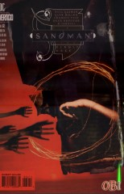

# Issue 62: "The Kindly Ones: 6"

##### Neil Gaiman, Glyn Dillon, Charles Vess, Dean Ormston, D'Israeli

- Sixth part of storyline, _The Kindly Ones_
- Seventh story reprinted in trade paperback _The Kindly Ones_

### Page 1

> [marginThumb] 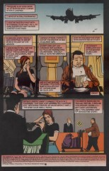

- #### Panel 1

  This is the only first panel in the story so far that has _not_ had a string or thread of some sort. This issue hearkens back to "Men of Good Fortune" ("The Doll's House" part 4) and "The Season of Mists" part 4: "interlude" issues, not done by the regular artist for the main arc, thematically related to it but not advancing the main plot. The lack of a string may emphasize that this issue is a sidebar.

  Note the black gutters; the page borders seem to switch between black and white somewhat at random. The borders in the main story are significant, but they don't seem to be here.

  This whole opening sequence, with Rose waking up uncomfortably on a plane to England and being met by a lawyer holding a sign, echoes Rose's first appearance in [issue #10](sandman.10.md).

### Page 2

> [marginThumb] 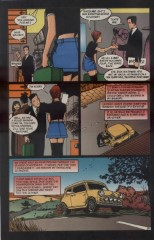

- #### Panel 4

  "Austin" was a real British car maker. The car pictured appears to be a 1960s Austin Mini Cooper 998.

  

- #### Panel 5

  One wonders where all the snow that we saw back in [#59](sandman.59.md) went.

### Page 3

> [marginThumb] 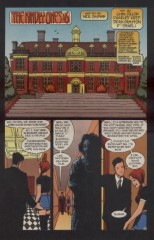

- #### Panel 3

  The 1989 film _Awakenings_, based on a book by neurologist Oliver Sacks. In the text page of issue [#4](sandman.04.md), Gaiman mentions the book as one of his influences in creating the series.

- #### Panel 4

  Wych Cross is of course the town where Lady Johanna Constantine resided, and where centuries later Dream was imprisoned. This is a minor retcon, as there was no previous indication that Unity Kinkaid's nursing home was anywhere near it. The inn called the "White Hart" may be a reference to a book by Arthur C. Clarke; then again it may just be a common name for an inn.

### Page 4

> [marginThumb] 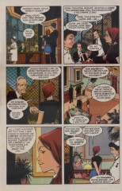

- #### Panel 1

  Paul McGuire was last seen all the way back in issue [#1](sandman.01.md).

- #### Panel 4

  Megan Schreiber found out about the '45 Rebellion:

  > The '45 Rebellion (courtesy the Encyclopedia Americana, 1998 edition)
  >
  > "In 1745, during the War of the Austrian Succession (1741-1748), when Britain was ranged with Austria against France and Prussia, there took place another Jacobite rising, known as "The Forty-five." What distinguished it from its predecessor was that The Fifteen had organization but no leader, while The Forty-five had no organization but a leader in Princes Charles Edward, the Bonnie Prince Charlie of history and romance.
  >
  > The pretender's early success was phenomenal. He landed in the west of Scotland on July 12 with seven followers, gathered Highland recruits as he marched south, captured Edinburgh on September 17, and defeated the forces of George II at Prestonpans on September 21. After a few weeks' stay in Edinburgh he invaded England with 6,000 men and got as far as Derby in his planned advance to London.
  >
  > At Derby, however, the Highland chiefs who formed his main support refused to advance further, although the evidence indicates that had they done so London would probably have fallen into their hands. Turning back, Charles Edward soon realized that a rebellion on the defensive has already failed. He was driven to the north of Scotland, where on April 16, 1746, at Colloden, near Inverness, his forces were decisively defeated by those of the Duke of Cumberland, a younger son of George II. Charles Edward escaped to France, but his party was severely punished."

### Page 5

> [marginThumb] 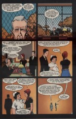

- #### Panel 4

  Of course, three. What other number could be chosen?

### Page 6

> [marginThumb] 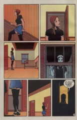

- #### Panel 7

  Of course, the last time Rose was in this broom closet she found the Hecateae inside.

### Page 7

> [marginThumb] 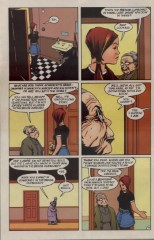

- #### Panel 2

  ...and here she finds somebody else.

### Page 8

> [marginThumb] 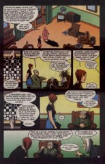

- #### Panel 2

  That checkers game must be a little dull; with the pieces on oppositely-colored squares it's impossible to make a jump...

- #### Panel 3

  Here we see that "Maiden" and "Crone" are relative terms. Note that Amelia and Magda have a strong visual resemblance to Mildred and Mordred of the Three Witches.

- #### Panel 4

  "[Blockbusters](<https://en.wikipedia.org/wiki/Blockbusters_(British_game_show)>)" was a long-running TV show in the 80s and 90s hosted by Bob Holness.

  They test whether 2 heads are better than one, by having a team of one play against a team of two. (NB. 3 contestants).

  It's essentially a quiz-board game. Teams "win" spaces (hexagons) on the board by answering questions, and win the round by creating a line from top to bottom (or left to right), blocking their opponent.

  All the squares have letters on and the questions are phrased like "Which P is the capital of France?".

  Hence the old joke "I'll have a P please, Bob" meaning to attempt the P square, but when the old ladies say it it means "pee" as in piss.

### Page 10

> [marginThumb] 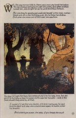

- For those who don't read letter columns (or who will read this story in book format): the story that follows is not Gaiman's invention, but can be found in somewhat different form in _The Penguin Book of English Folk Tales_.

### Page 19

> [marginThumb] 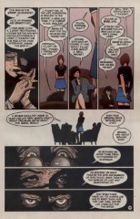

- #### Panel 1-2

  The Sandman Companion confirms that this "Helena" is Helena Kosmatos, the Golden Age Fury and (post-Crisis at least) Lyta Hall's lost mother, which explains the difficulty of saying her last name. Certainly the actions described here are those one would expect of a Fury. Also, there is some resemblance to the photo in [57:19](sandman.57.md#page-19).8.

  Note the women's names. The Greek writers who portrayed the Furies as a trio of women named them Tisiphone, Alecto, and Megaera. Amelia -- Alecto; Magda -- Megaera; and the Golden Age Fury was shown as receiving her powers specifically from Tisiphone.

- #### Panel 3

  The most effective method of lying, of course, is to tell the truth in such a way that you are not believed.

### Page 20

> [marginThumb] 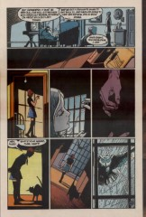

- #### Panel 4

  Unity Kinkaid gave Rose this ring in "The Doll's House" part 1 -- specifically [10:23](sandman.10.md#page-23).4.

- #### Panel 5

  This is [10:23](sandman.10.md#page-23).5 reproduced.

- #### Panel 7-8

  When Rose encounters the Hecateae we also see an owl and a pussycat; the owl here in particular echoes the one in [10:20](sandman.10.md#page-20):1.

### Page 21

> [marginThumb] 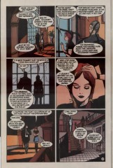

- #### Panel 2

  The owl was the familiar of Athena, Greek goddess of wisdom.

### Page 22

> [marginThumb] 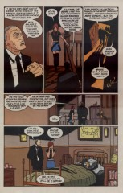

- #### Panel 1

  Quentin Crisp, English gay writer.

- #### Panel 3

  It's said that "More light, more light" were the final words of Goethe.

- #### Panel 4

  _The Tempest_, act IV scene 1.

- #### Panel 5

  Alex Burgess, too, was last seen at the end of issue [#1](sandman.01.md).

  Note the Piglet doll in bed with him. The picture by the bed is of Ethel Cripps, the mistress of Alex's father Roderick. The picture's been seen in [1:15](sandman.01.md#page-15).4 and [7:9](sandman.07.md#page-9).4. Of the books in the bookcase, "Good Omens" is of course the collaboration between Neil Gaiman and Terry Pratchett; "The Doll's House" is by Ibsen and echoes Rose's previous story; "To Kill" is probably "To Kill a Mockingbird", by Harper Lee; no refs on "Fish Paste" or "Timularo".

### Page 23

> [marginThumb] 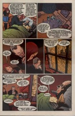

- #### Panel 3

  Those who've read issue [#1](sandman.01.md) know for certain that they are not.

## Credits

- Greg "elmo" Morrow (morrow@physics.rice.edu) created the Sandman Annotations.
- Originally collated and edited by David Goldfarb.
- Mean Mister Mustard (marcs@wam.umd.edu) speculated on Helena's identity, and noted the connection between the women's names and the Furies'.
- James Tze-Ming Hsiao (hsaio@beach.cis.ufl.edu) and Katie Schwarz (katie@physics.berkeley.edu) mentioned previous appearances of the picture, the owl, and the cat.
- Katie Schwarz also noted the echo of Rose's first appearance and the disappearing snow.
- Megan Schreiber found out about the '45 Rebellion
- Ralf Hildebrandt added more details.
- Richard Munn filled in the Austin car reference.
