## Issue 63: "The Kindly Ones: 7"

> [!THUMBNAIL] 

##### Neil Gaiman, Marc Hempel

### Page 1

> [!THUMBNAIL] 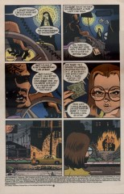

- #### Panel 1

  The first panel of every issue in the main arc contains a string or cord of some kind. Here, an electrical cord.

- #### Panel 2

  Note the spots visible on the dice sum to 9, a multiple of 3.

- #### Panel 4

  The return of a main character from "A Game of You": the witch who called herself Thessaly. She was last seen in the last part of that story, [issue #37](sandman.37.md).

### Page 3

> [!THUMBNAIL] 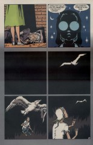

- #### Panel 2

  "Larissa" is the name of a city in Greece, in the region called Thessaly.

- #### Panel 4

  A white bird such as this is a traditional symbol of the Holy Ghost.

### Page 5

> [!THUMBNAIL] 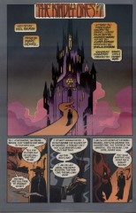

- #### Panel 1

  Odin was last seen in these pages in "The Season of Mists" chapter 6, [issue #27](sandman.27.md).

### Page 7

> [!THUMBNAIL] 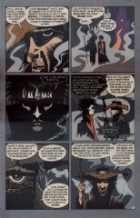

- #### Panel 4

  Or perhaps he merely felt pity for another who was pent...

### Page 10

> [!THUMBNAIL] 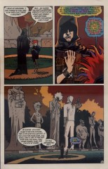

- #### Panel 3

  This whole scene, as Delirium has noticed, echoes the scene in "Brief Lives" when Dream and Delirium consult Destiny near these statues. (Specifically [47:8](sandman.47.md#page-8)-12.) Note the pathway there now resembles a backwards 6 or 9. The statues have also changed; apparently they reflect the current state of their originals.

### Page 11

> [!THUMBNAIL] 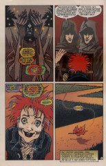

- #### Panel 4

  A pun of sorts.

### Page 13

> [!THUMBNAIL] 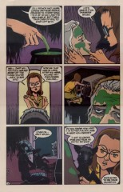

- #### Panel 1

  In issue [#2](sandman.02.md) honey is among Dream's ingredients for calling the Hecateae.

- #### Panel 6

  A black lamb is another.

### Page 15

> [!THUMBNAIL] 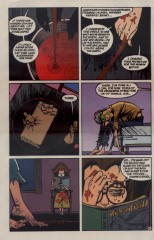

- #### Panel 2

  In Greek mythology at least, these would be Persephone, bride of Hades (and since this story takes place in winter, she would indeed be waiting beneath the earth); Demeter; and either Artemis or Hecate -- both moon goddesses. Given that this is also a maiden-mother-crone triad, Hecate seems more likely.

- #### Panel 4

  No refs on "Trivia of the Crossways" except that Dream called the Hecateae at a crossroads.

- #### Panel 6

  The book is "The Late Richard Dadd", by Patricia Allderidge. Richard Dadd was an English artist of the late nineteenth century, known for his fantastic subjects. He went mad.

### Page 17

> [!THUMBNAIL] 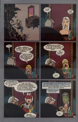

- This page echoes Lyta's similar reflections in "The Doll's House" part 3 ([12:9](sandman.12.md#page-9)). Compare also [61:21](sandman.61.md#page-21).4.

### Page 18

> [!THUMBNAIL] 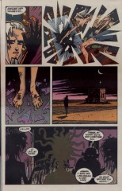

- The panel borders here are probably left white by mistake; logic suggests that they ought to be grey shading to black as they are on the next page.

- #### Panel 1

  Note the claws of brass.

### Page 21

> [!THUMBNAIL] 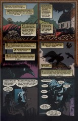

- The panel borders here are reminiscent of Celtic designs. As is probably clear, the Morrigan is an Irish war goddess, an aspect of the Three-in-One.

### Page 22

> [!THUMBNAIL] 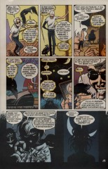

- #### Panels 2-4:

  The damaged door lock and the wall decorations (identical to the ones seen in "The Parliament of Rooks") suggest that Daniel and the Corinthian are in Lyta Hall's LA apartment.

### Page 23

> [!THUMBNAIL] 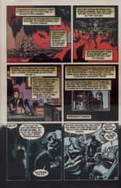

- #### Panel 4

  Well, it's clear that when the ravens leave the Tower of London, the kingdom of England is supposed to fall. No specific refs on this, however. Here it's a different kingdom that will be falling.

## Credits

- Greg "elmo" Morrow (morrow@physics.rice.edu) created the Sandman Annotations.
- Originally collated and edited by David Goldfarb.
- Lance "Squiddie" Smith (lsmith@cs.umn.edu) identified Larissa's book, and the name "Larissa".
- Adam Huby (ajh@crosfield.co.uk) gave some more biographical information on Richard Dadd.
- Greg McElhatton (stu_glmcelha@vax1.acs.jmu.edu) pointed out Lyta's claws of brass.
- Katie Schwarz (katie@physics.berkeley.edu) also noted the claws, pointed out Dream's ritual from issue [#2](sandman.02.md), and noticed the wall decorations.
