> [marginThumb] 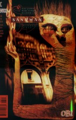

## Issue 65: "The Kindly Ones: 9"

##### Neil Gaiman, Marc Hempel, Richard Case

### Page 1

> [marginThumb] 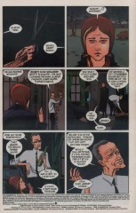

- #### Panel 1

  The recurring theme for this panel has been strings or cords; here its significance is made most explicit.

- #### Panel 2

  Rose is probably singing a Velvet Underground song called "Sunday Morning". It seems a bit odd that there is no snow on the ground, considering it was calf-deep only last Thursday.

### Page 2

> [marginThumb] 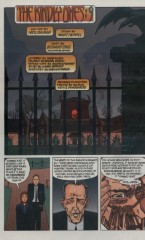

- #### Panel 1

  This panel continues the theme of showing a house of some sort on the title page. It's also a near-exact echo of [1:1](sandman.01.md#page-1).1.

- #### Panel 4

  "Keys." Perhaps an echo of "The Season of Mists".

### Page 3

> [marginThumb] 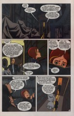

- #### Panel 2

  James Branch Cabell (1879-1958) was a great early fantasist.

  Gaiman has referred to him a few times before. The Storisende editions were a uniform hardcover collection of his works. (They are named for the capital of Cabell's fictional French county, Poictesme; the pun on "Story's End" is obvious.)

- #### Panel 3

  The University of California Library card catalog has never heard of it, either.

- #### Panel 4

  Library of Dreams? Where have we heard that before?

### Page 4

> [marginThumb] 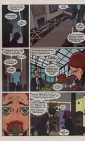

- #### Panel 6

  Mr. McGuire is having heart trouble, perhaps?

### Page 5

> [marginThumb] 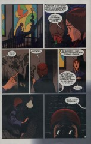

- #### Panel 1

  These paintings are reminiscent of the stained glass in Dream's throne room.

- #### Panel 2

  The window in the background was seen in [1:2](sandman.01.md#page-2).2.

- #### Panel 3

  This echoes Dream's gatekeepers. There seems to be a deliberate parallel between this mansion, Dream's prison for decades, and Dream's castle.

- #### Panel 7

  Note the panel border here. Rose has left the waking world.

  As mentioned in an earlier annotation, a dream in which you go down into a basement signifies a confrontation of something in your unconscious - usually a fear or something unpleasant. Here, Rose is probably confronting the fact that Jack Holdaway may not love her. (Naturally, Desire is there, since Rose is talking about love!)

### Page 6

> [marginThumb] 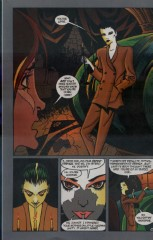

- #### Panel 1

  The copy of _It_ on the floor is no doubt the one that the guard was reading in [1](sandman.01.md):25.3 and again (six years later) during Dream's escape.

### Page 7

> [marginThumb] 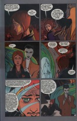

- #### Panel 3

  The lettering for Rose's words on this page and the next is identical to Destiny's in [issue #63](sandman.63.md).

### Page 8

> [marginThumb] 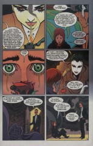

- #### Panel 1

  Jack Holdaway's line from [64:23](sandman.64.md#page-23).9: "Very perceptive."

  In "Brief Lives" part 1 ([41](sandman.41.md):12.5) and part 2 ([42:19](sandman.42.md#page-19).4) Desire lights a cigarette with its sigil, a heart. That heart was red, however, and did not have a flip-top.

- #### Panel 5

  **Sanctum sanctorum**: Latin for "Holy of holies"; i.e., the inner chamber of a temple (sometimes specifically the Jewish Temple that once stood in Jerusalem).

- #### Panel 6

  The smoke there resembles a heart. People paying attention to the panel borders won't have been surprised that Rose was dreaming.

### Page 9

> [marginThumb] 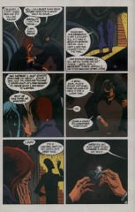

- #### Panel 2

  Note that Desire's candelabrum remains where it put it, on top of the crystal cage, and its cigarette lighter, where it dropped it.

### Page 10

> [marginThumb] 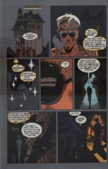

- #### Panel 1

  **Swartalfheim**: swart -- black; alf -- elf; heim -- home. "Land of dark elves". One of the nine worlds of Norse myth.

- #### Panel 4

  In "The Doll's House", the Corinthian's eye-sockets were filled with pointed canines; here they have normal human dentition.

### Page 12

> [marginThumb] 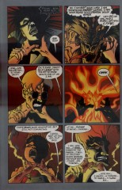

- #### Panels 1-5

  The traditional method of dealing with shape-changing is to keep an unwavering grip no matter what shape is taken, even a flame. See the ballad "Tam Lin", and Odysseus vs. Proteus in the _Odyssey_.

- #### Panel 6

  Most likely the celebrated Ring of the Nibelungs. The other items mentioned were also made by dwarfs: the hammer is likely Mjollnir, the magic tinder-box from the Hans Christian Andersen story; no refs on the sword or the eagle.

### Page 13

> [marginThumb] 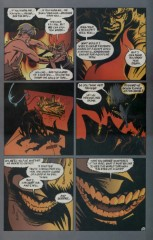

- #### Panel 1

  "They" meaning the Kindly Ones?

- #### Panel 3

  Note that the cord is tied to one of the logs in the fire. Perhaps this is Daniel's body, transformed?

### Page 14

> [marginThumb] 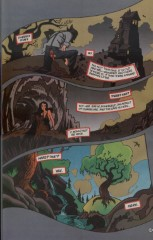

- #### Panel 1

  Cf. Genesis 4:15: "And the LORD said unto him, Therefore whosoever slayeth Cain, vengeance shall be taken on him sevenfold. And the LORD set a mark upon Cain, lest any finding him should kill him."

### Page 17

> [marginThumb] 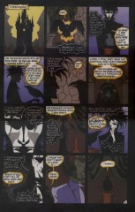

- Note the black panel borders. We've seen them only once before, when Lyta met the Furies for the first time.

### Page 20

> [marginThumb] 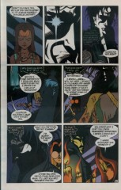

- #### Panel 3

  Destiny, in "Brief Lives" part 7. ([47](sandman.47.md):9.4) And so we have confirmation that Thessaly/Larissa was Dream's lover, and an end to the two-year mystery.

- #### Panel 5

  When Thessaly drew down the moon in "A Game of You" part 3, it seemed quite threatening towards her. She might be referring to other incidents, as well as that one.

### Page 22

> [marginThumb] 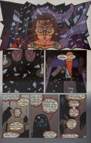

- #### Panel 1

  This seems to echo the destruction of the apartment house in "A Game of You" ([36:39](sandman.36.md#page-39)).

- #### Panel 4

  Genesis conflicts with itself on the matter of how many of each animal there were on Noah's ark. 6:19 says two of each; 7:2 says two of each unclean creature, and seven of each clean creature.

- #### Panel 5

  Utnapishtim was the hero of the Babylonian flood myth.

## Credits

- Greg "elmo" Morrow (morrow@physics.rice.edu) created the Sandman Annotations.
- Originally collated and edited by David Goldfarb.
- Carl Fink (carlf@panix.com) provided information on Utnapishtim and Noah.
- Joe Brenner (doom@kzsu.Stanford.EDU) noted the Velvet Underground song.
- Katie Schwarz (katie@physics.berkeley.edu) noted the weather and translated "Swartalfheim"; she and Bernard McAuley (bmca@ee.ed.ac.uk) noted the echoes of Dream's castle in the mansion.
- David Silberstein (dasbc@cunyvm.cuny.edu) noted the keys and the echoes of Dream's castle; translated "Swartalfheim"; and recalled Thessaly's deeds in "A Game of You".
- Timothy Tan aka TiTan <_> -M2001- <_> 083285@bud.cc.swin.edu.au
- Ralf Hildebrandt added the note about dreams going into basements.
